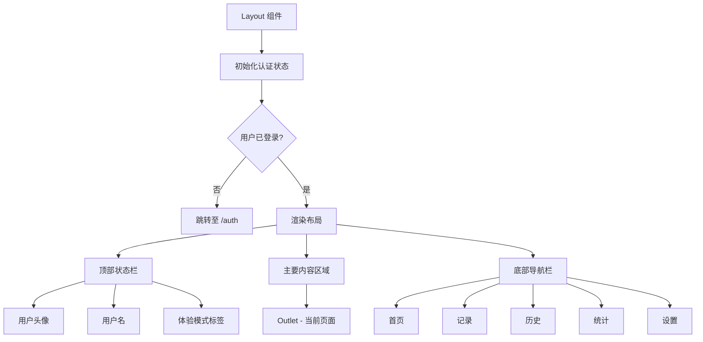
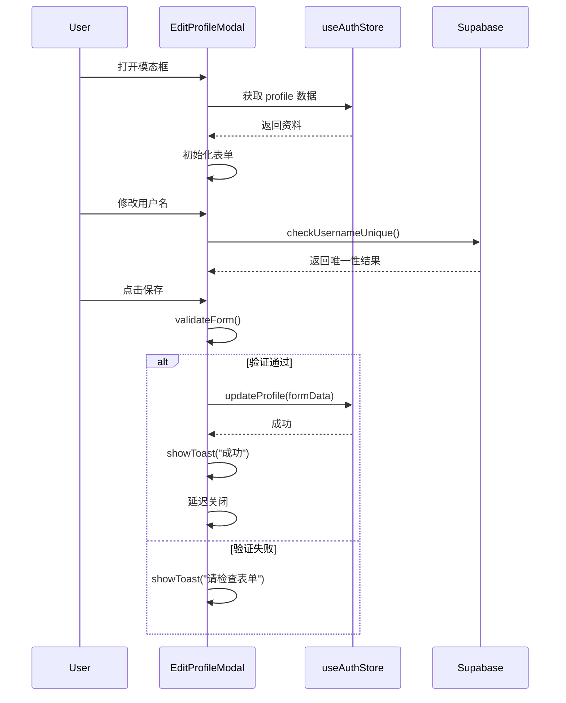
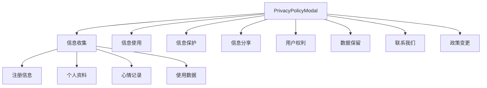
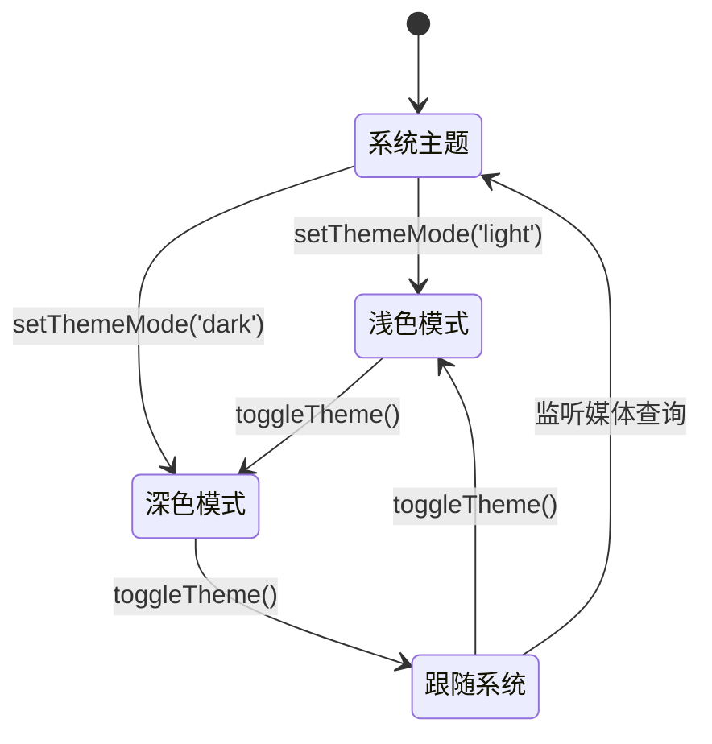

# UI组件库

<cite>
**本文档引用文件**  
- [Layout.tsx](file://src/components/Layout.tsx)
- [Toast.tsx](file://src/components/Toast.tsx)
- [Empty.tsx](file://src/components/Empty.tsx)
- [EditProfileModal.tsx](file://src/components/EditProfileModal.tsx)
- [PrivacyPolicyModal.tsx](file://src/components/PrivacyPolicyModal.tsx)
- [useTheme.ts](file://src/hooks/useTheme.ts)
- [utils.ts](file://src/lib/utils.ts)
- [App.tsx](file://src/App.tsx)
</cite>

## 目录
1. [简介](#简介)
2. [布局容器组件 (Layout)](#布局容器组件-layout)
3. [全局通知组件 (Toast)](#全局通知组件-toast)
4. [空状态占位组件 (Empty)](#空状态占位组件-empty)
5. [模态框组件](#模态框组件)
   - [编辑资料模态框 (EditProfileModal)](#编辑资料模态框-editprofilemodal)
   - [隐私政策模态框 (PrivacyPolicyModal)](#隐私政策模态框-privacypolicymodal)
6. [主题与样式支持](#主题与样式支持)
7. [无障碍与响应式设计](#无障碍与响应式设计)
8. [使用示例](#使用示例)

## 简介
本组件库为“心情日记”应用提供了一套可复用的UI组件，旨在确保界面风格统一、交互一致，并提升开发效率。组件基于React构建，使用Tailwind CSS进行样式化，支持深色/浅色主题切换，并遵循无障碍设计原则。每个组件均具备清晰的接口定义、事件回调机制和灵活的定制能力，便于在不同页面中复用。

## 布局容器组件 (Layout)

`Layout.tsx` 是应用的主布局容器，负责提供一致的页眉、底部导航和内容区域。它通过 `Outlet` 组件（来自 `react-router-dom`）渲染当前路由的页面内容，并集成用户认证状态管理。

该组件在加载时初始化认证状态，并根据用户登录情况自动跳转至认证页面。顶部状态栏显示当前用户名称及体验模式标识，底部导航栏提供五个主要功能入口：首页、记录、历史、统计和设置。导航项根据当前路径高亮显示，提升用户体验。



**图示来源**  
- [Layout.tsx](file://src/components/Layout.tsx#L1-L115)

**本节来源**  
- [Layout.tsx](file://src/components/Layout.tsx#L1-L115)

## 全局通知组件 (Toast)

`Toast.tsx` 组件封装了 `sonner` 库，实现全局通知提示功能。它支持成功、错误和警告三种类型，通过图标、颜色和动画提供直观的反馈。

组件接收 `message`、`type`、`isVisible` 和 `onClose` 等props，可控制通知的显示内容、类型、可见状态和关闭行为。`duration` 属性定义自动关闭时间，默认为3秒。通知从屏幕右上角滑入，具备关闭按钮，用户可手动关闭。

内部通过 `useEffect` 监听 `isVisible` 状态，在显示时启动定时器自动关闭。根据 `type` 动态返回对应的图标（绿色对勾、红色叉号、黄色感叹号）和背景/文本颜色，确保视觉一致性。

```mermaid
classDiagram
class Toast {
+message : string
+type : 'success' | 'error' | 'warning'
+isVisible : boolean
+onClose : () => void
+duration? : number
-getIcon() : JSX.Element
-getBgColor() : string
-getTextColor() : string
}
Toast --> "1" "0..1" CheckCircle : success
Toast --> "1" "0..1" XCircle : error
Toast --> "1" "0..1" AlertCircle : warning
Toast --> "1" "1" X : close button
```

**图示来源**  
- [Toast.tsx](file://src/components/Toast.tsx#L1-L81)
- [App.tsx](file://src/App.tsx#L1-L27)

**本节来源**  
- [Toast.tsx](file://src/components/Toast.tsx#L1-L81)
- [App.tsx](file://src/App.tsx#L1-L27)

## 空状态占位组件 (Empty)

`Empty.tsx` 组件用于在数据为空时提供视觉占位符。它是一个极简的函数式组件，使用 `cn` 工具函数（来自 `utils.ts`）合并Tailwind CSS类名，实现居中布局。

该组件渲染一个居中的“Empty”文本，可作为列表、表格或其他数据展示区域的默认空状态。其高度继承自父容器，确保在不同上下文中均能正确居中显示。

```mermaid
flowchart LR
A[Empty 组件] --> B[使用 cn() 合并类名]
B --> C[flex h-full items-center justify-center]
C --> D[渲染文本 "Empty"]
```

**图示来源**  
- [Empty.tsx](file://src/components/Empty.tsx#L1-L8)
- [utils.ts](file://src/lib/utils.ts#L1-L7)

**本节来源**  
- [Empty.tsx](file://src/components/Empty.tsx#L1-L8)

## 模态框组件

### 编辑资料模态框 (EditProfileModal)

`EditProfileModal.tsx` 是一个功能完整的表单模态框，用于编辑用户个人资料。它通过 `isOpen` 和 `onClose` 控制显示与关闭，集成表单验证、异步操作和实时反馈。

组件从 `useAuthStore` 获取当前用户和资料信息，初始化表单数据。支持头像上传（本地预览）、用户名唯一性检查（防抖）、生日和URL格式验证。提交时调用 `updateProfile` 方法更新资料，并通过内部 `toast` 状态显示操作结果。

表单字段包括姓名（必填）、用户名（3-20位，唯一性校验）、生日、性别和简介（500字限制）。错误信息实时显示，保存按钮在加载时显示旋转动画。



**图示来源**  
- [EditProfileModal.tsx](file://src/components/EditProfileModal.tsx#L1-L434)
- [useAuthStore](file://src/store/index.ts)

**本节来源**  
- [EditProfileModal.tsx](file://src/components/EditProfileModal.tsx#L1-L434)

### 隐私政策模态框 (PrivacyPolicyModal)

`PrivacyPolicyModal.tsx` 用于展示应用的隐私政策，内容结构化呈现，易于阅读。它同样通过 `isOpen` 和 `onClose` 控制显隐。

组件将隐私政策分为六个部分：信息收集、信息使用、信息保护、信息分享、用户权利和数据保留。每个部分配有Lucide图标，增强可读性。内容以列表形式展示，末尾提供联系信息和政策变更说明。

底部“我已阅读并理解”按钮用于确认，提升合规性。整体设计简洁，重点信息突出，确保用户能快速获取关键内容。



**图示来源**  
- [PrivacyPolicyModal.tsx](file://src/components/PrivacyPolicyModal.tsx#L1-L176)

**本节来源**  
- [PrivacyPolicyModal.tsx](file://src/components/PrivacyPolicyModal.tsx#L1-L176)

## 主题与样式支持

组件库通过 `useTheme.ts` 钩子实现主题切换功能，支持“浅色”、“深色”和“跟随系统”三种模式。主题状态存储在 `localStorage` 中，确保持久化。

`useTheme` 钩子返回 `theme`、`isDark`、`toggleTheme` 和 `setThemeMode` 等API。通过监听 `prefers-color-scheme` 媒体查询，实现系统主题同步。应用时通过操作 `document.documentElement` 的类名和CSS变量，动态更新界面样式。

所有组件均使用Tailwind CSS类名，结合 `dark:` 前缀实现深色模式适配。例如，文本颜色可定义为 `text-gray-800 dark:text-gray-200`，确保在不同主题下均有良好可读性。



**图示来源**  
- [useTheme.ts](file://src/hooks/useTheme.ts#L1-L111)

**本节来源**  
- [useTheme.ts](file://src/hooks/useTheme.ts#L1-L111)

## 无障碍与响应式设计

所有组件均遵循无障碍（a11y）最佳实践：
- 使用语义化HTML标签（如 `button`、`label`）
- 为图标提供 `aria-label` 或通过 `sr-only` 文本描述
- 确保键盘可访问性（Tab顺序、Enter/Space触发）
- 足够的对比度满足WCAG标准

响应式设计方面：
- 使用Flexbox和Grid布局，适应不同屏幕尺寸
- 移动端优先设计，底部导航栏固定定位
- 模态框在小屏幕上全宽显示，大屏幕上限制最大宽度
- 文字大小和间距在不同断点下优化

## 使用示例

### 在页面中使用 Layout
```tsx
import Layout from '@/components/Layout';

function HomePage() {
  return (
    <Layout>
      <div>页面内容</div>
    </Layout>
  );
}
```

### 显示成功通知
```tsx
import { useState } from 'react';
import Toast from '@/components/Toast';

function SomeComponent() {
  const [showToast, setShowToast] = useState(false);

  const handleAction = () => {
    // 执行操作...
    setShowToast(true);
  };

  return (
    <>
      <button onClick={handleAction}>执行</button>
      <Toast 
        message="操作成功！" 
        type="success" 
        isVisible={showToast} 
        onClose={() => setShowToast(false)} 
      />
    </>
  );
}
```

### 使用 EditProfileModal
```tsx
import { useState } from 'react';
import EditProfileModal from '@/components/EditProfileModal';

function SettingsPage() {
  const [isModalOpen, setIsModalOpen] = useState(false);

  return (
    <>
      <button onClick={() => setIsModalOpen(true)}>编辑资料</button>
      <EditProfileModal 
        isOpen={isModalOpen} 
        onClose={() => setIsModalOpen(false)} 
      />
    </>
  );
}
```

**本节来源**  
- [Layout.tsx](file://src/components/Layout.tsx#L1-L115)
- [Toast.tsx](file://src/components/Toast.tsx#L1-L81)
- [EditProfileModal.tsx](file://src/components/EditProfileModal.tsx#L1-L434)