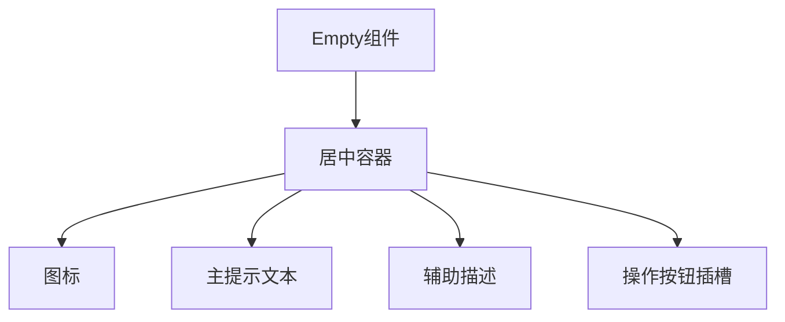
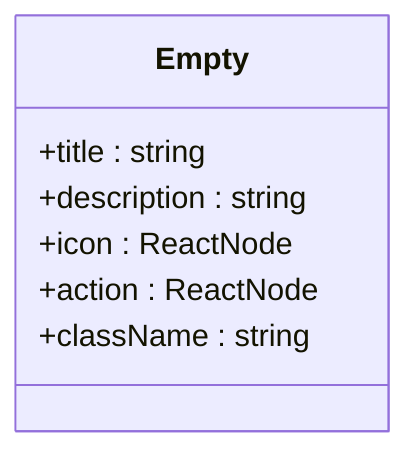
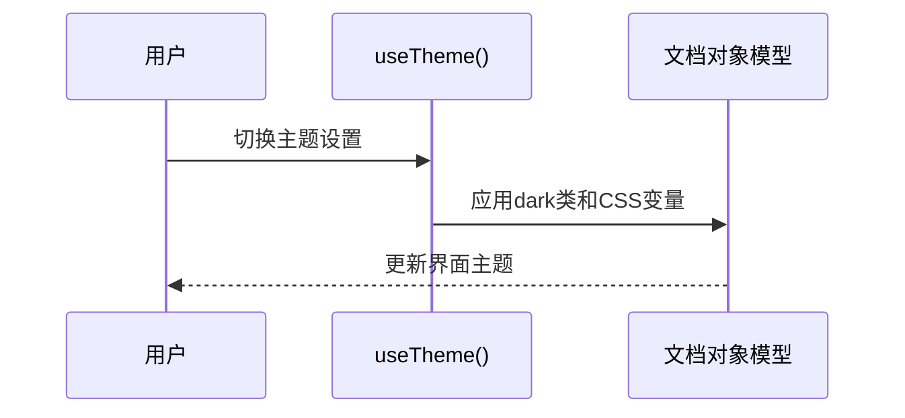

# Empty空状态组件

<cite>
**本文档引用文件**  
- [Empty.tsx](file://src/components/Empty.tsx)
- [Stats.tsx](file://src/pages/Stats.tsx)
- [History.tsx](file://src/pages/History.tsx)
- [useTheme.ts](file://src/hooks/useTheme.ts)
</cite>

## 目录
1. [简介](#简介)
2. [组件结构与设计](#组件结构与设计)
3. [属性自定义与多场景适配](#属性自定义与多场景适配)
4. [响应式与主题适配能力](#响应式与主题适配能力)
5. [实际使用示例](#实际使用示例)
6. [用户体验价值](#用户体验价值)
7. [总结](#总结)

## 简介
`Empty` 组件是应用中用于展示“无数据”状态的占位组件，广泛应用于如统计图表无记录、历史列表为空等场景。其主要作用是通过视觉提示避免界面出现“空白恐惧”，提升用户对系统状态的理解和交互体验。该组件设计简洁，具备高度可复用性，支持内容自定义与主题适配，是提升应用专业感的重要UI元素。

**Section sources**
- [Empty.tsx](file://src/components/Empty.tsx#L1-L7)

## 组件结构与设计
`Empty` 组件当前实现为一个居中对齐的容器，使用 `flex` 布局确保内容在全屏或容器内垂直水平居中。其核心结构包含：
- **默认图标**：可集成 `lucide-react` 中的图标（如 `FolderOff`）作为视觉引导
- **主提示文本**：明确告知用户当前无数据
- **辅助描述**：提供更详细的解释或建议
- **操作按钮插槽**：可选的“去记录”按钮，引导用户创建新条目

目前组件仅显示静态文本“Empty”，但其结构已为扩展上述元素做好准备，具备良好的可维护性和扩展性。



**Diagram sources**
- [Empty.tsx](file://src/components/Empty.tsx#L1-L7)

**Section sources**
- [Empty.tsx](file://src/components/Empty.tsx#L1-L7)

## 属性自定义与多场景适配
为适应不同页面的使用需求，`Empty` 组件可通过 `props` 接收自定义内容，实现差异化展示。例如：
- **Stats页面**：提示“暂无统计记录，请开始记录心情”
- **History页面**：提示“暂无历史记录”，并提供“去记录”按钮

通过传递 `title`、`description`、`icon` 和 `action` 等 `props`，开发者可灵活配置组件内容，满足多样化业务场景。



**Diagram sources**
- [Empty.tsx](file://src/components/Empty.tsx#L1-L7)

## 响应式与主题适配能力
`Empty` 组件具备良好的响应式设计，能够适配不同屏幕尺寸。同时，通过结合 `useTheme` 钩子，组件可自动适配深色/浅色模式，确保在不同主题下均具有良好的可读性和视觉一致性。

`useTheme` 钩子通过检测系统偏好和用户设置，动态切换 `dark` 类并更新CSS变量，实现主题无缝切换。`Empty` 组件继承全局样式，无需额外配置即可支持主题变化。



**Diagram sources**
- [useTheme.ts](file://src/hooks/useTheme.ts#L0-L111)

**Section sources**
- [useTheme.ts](file://src/hooks/useTheme.ts#L0-L111)

## 实际使用示例
在 `src/pages/Stats.tsx` 中，当用户尚未创建任何心情记录时，应条件渲染 `Empty` 组件。示例如下：

```tsx
{filteredRecords.length === 0 && <Empty title="暂无统计数据" description="开始记录你的心情，生成专属统计图表" action={<Button>去记录</Button>} />}
```

此用法可有效避免统计图表区域空白，引导用户进行下一步操作，提升功能闭环性。

**Section sources**
- [Stats.tsx](file://src/pages/Stats.tsx#L0-L386)
- [History.tsx](file://src/pages/History.tsx#L0-L217)

## 用户体验价值
`Empty` 组件在用户体验中扮演关键角色：
- **消除不确定性**：明确告知用户“无数据”是正常状态，而非系统错误
- **引导操作**：通过按钮插槽引导用户创建内容，促进用户活跃
- **提升专业感**：精心设计的空状态比空白界面更具亲和力和专业性
- **增强一致性**：统一的空状态处理方式提升整体应用体验一致性

## 总结
`Empty` 空状态组件虽小，却是提升应用用户体验的重要细节。其简洁的结构、灵活的自定义能力、良好的响应式与主题适配特性，使其成为应用中不可或缺的UI组件。建议在所有可能为空的数据展示区域统一使用该组件，避免界面出现“空白恐惧”，为用户提供更友好、更专业的使用体验。