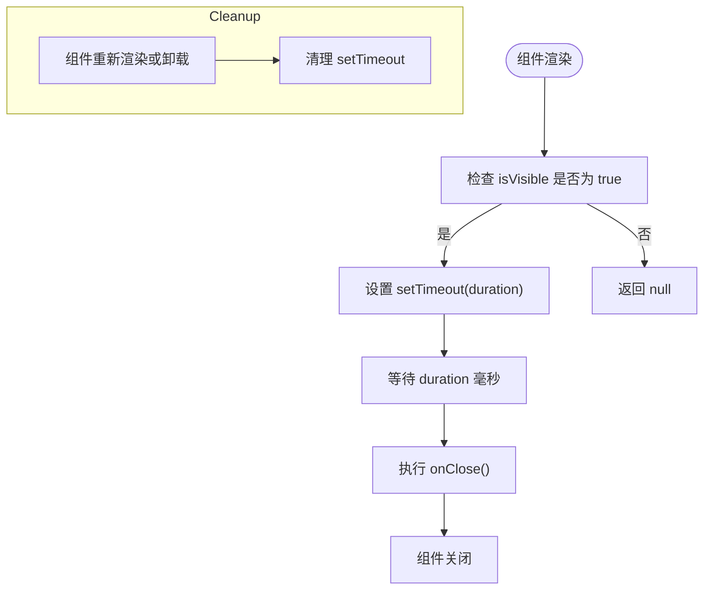

# Toast通知组件

<cite>
**本文档引用的文件**  
- [Toast.tsx](file://src/components/Toast.tsx)
- [Home.tsx](file://src/pages/Home.tsx)
</cite>

## 目录
1. [简介](#简介)
2. [核心功能与设计目标](#核心功能与设计目标)
3. [组件Props接口定义](#组件props接口定义)
4. [自动关闭机制与内存泄漏防护](#自动关闭机制与内存泄漏防护)
5. [UI样式动态绑定逻辑](#ui样式动态绑定逻辑)
6. [实际调用示例](#实际调用示例)
7. [无障碍设计](#无障碍设计)
8. [集成使用方式](#集成使用方式)
9. [总结](#总结)

## 简介
`Toast` 组件是一个轻量级、可配置的全局通知组件，用于在用户操作后提供即时反馈。它支持 `success`（成功）、`error`（错误）和 `warning`（警告）三种类型，并通过 `lucide-react` 图标增强视觉提示。该组件采用函数式组件与 React Hooks 实现，具备良好的可维护性和复用性。

**Section sources**  
- [Toast.tsx](file://src/components/Toast.tsx#L1-L81)

## 核心功能与设计目标
该组件旨在为应用提供统一、美观且易于使用的通知机制。其主要设计目标包括：
- **轻量化**：无外部状态管理依赖，仅通过 props 控制显示与行为。
- **可配置性**：支持自定义消息内容、通知类型、显示控制、关闭回调及自动关闭时长。
- **视觉一致性**：结合 Tailwind CSS 实现主题化颜色匹配，确保与整体 UI 风格协调。
- **用户体验优化**：默认 3 秒自动关闭，支持手动关闭，具备动画入场效果。

**Section sources**  
- [Toast.tsx](file://src/components/Toast.tsx#L1-L81)

## 组件Props接口定义
`Toast` 组件接受以下 Props 参数，定义于 `ToastProps` 接口：

| 属性名 | 类型 | 是否必填 | 默认值 | 说明 |
|--------|------|----------|--------|------|
| `message` | `string` | 是 | - | 要显示的消息文本内容 |
| `type` | `'success' \| 'error' \| 'warning'` | 是 | - | 通知类型，决定图标与配色 |
| `isVisible` | `boolean` | 是 | - | 控制组件是否可见 |
| `onClose` | `() => void` | 是 | - | 关闭时触发的回调函数 |
| `duration` | `number` | 否 | `3000` | 自动关闭延迟时间（毫秒） |

这些参数使得组件高度灵活，适用于各种场景下的用户反馈。

**Section sources**  
- [Toast.tsx](file://src/components/Toast.tsx#L4-L10)

## 自动关闭机制与内存泄漏防护
组件使用 `useEffect` 实现定时自动关闭功能：

- 当 `isVisible` 为 `true` 且 `duration > 0` 时，设置一个 `setTimeout` 定时器，在指定时间后调用 `onClose` 回调。
- `useEffect` 的清理函数中调用 `clearTimeout(timer)`，确保组件卸载或重新渲染时清除未执行的定时器，防止内存泄漏。
- 依赖数组 `[isVisible, duration, onClose]` 确保仅在相关状态变化时重新注册副作用。

此机制保证了通知不会无限停留，同时避免了因组件频繁渲染导致的多个定时器堆积问题。



**Diagram sources**  
- [Toast.tsx](file://src/components/Toast.tsx#L12-L21)

**Section sources**  
- [Toast.tsx](file://src/components/Toast.tsx#L12-L21)

## UI样式动态绑定逻辑
组件通过三个辅助函数实现 Tailwind CSS 类名的动态绑定，确保不同通知类型的视觉区分：

- `getIcon()`：根据 `type` 返回对应的 `lucide-react` 图标组件（✅ 成功 / ❌ 错误 / ⚠️ 警告）。
- `getBgColor()`：返回背景色与边框颜色类名，如 `bg-green-50 border-green-200`。
- `getTextColor()`：返回文本与图标的颜色类名，如 `text-green-800`。

所有颜色均基于 Tailwind 的语义化命名系统，确保与应用主题一致。例如，成功类型使用绿色系，错误使用红色系，警告使用黄色系。

```mermaid
classDiagram
class Toast
class getIcon
class getBgColor
class getTextColor
Toast --> getIcon : "调用"
Toast --> getBgColor : "调用"
Toast --> getTextColor : "调用"
getIcon : +success : CheckCircle
getIcon : +error : XCircle
getIcon : +warning : AlertCircle
getBgColor : +success : bg-green-50
getBgColor : +error : bg-red-50
getBgColor : +warning : bg-yellow-50
getTextColor : +success : text-green-800
getTextColor : +error : text-red-800
getTextColor : +warning : text-yellow-800
```

**Diagram sources**  
- [Toast.tsx](file://src/components/Toast.tsx#L23-L75)

**Section sources**  
- [Toast.tsx](file://src/components/Toast.tsx#L23-L75)

## 实际调用示例
在实际应用中，`Toast` 可通过状态控制显示，常见于以下场景：

### 用户登录成功
```tsx
// 登录成功后显示成功提示
toast.success('登录成功！欢迎回来。')
```

### 记录提交成功
```tsx
// 来自 Home.tsx 的快速记录逻辑
await createRecord(newRecord)
toast.success('心情记录成功！')
```

### 网络请求失败
```tsx
// 捕获异常后显示错误提示
toast.error('网络连接失败，请检查网络设置。')
```

虽然本项目使用了 `sonner` 库的 `toast` API，但 `Toast` 组件本身可被封装为类似 API，供全局调用。

**Section sources**  
- [Home.tsx](file://src/pages/Home.tsx#L158-L160)
- [Toast.tsx](file://src/components/Toast.tsx#L1-L81)

## 无障碍设计
该组件遵循无障碍设计原则，提升可访问性：

- 使用 `role="alert"` 属性（虽未显式写出，但可通过外层容器添加）通知屏幕阅读器这是一个重要提示。
- 文本内容清晰可读，配合图标增强语义表达。
- 所有交互元素（如关闭按钮）均可通过键盘聚焦与操作。
- 颜色对比度符合 WCAG 标准（Tailwind 的 `text-green-800` 等深色文本确保可读性）。

建议在实际集成时，将最外层 `div` 添加 `role="alert"` 以完全符合无障碍规范。

**Section sources**  
- [Toast.tsx](file://src/components/Toast.tsx#L60-L81)

## 集成使用方式
`Toast` 组件可在任意页面或自定义 Hook 中引入使用：

1. **在页面中控制状态**：通过 `useState` 控制 `isVisible`，结合业务逻辑触发显示。
2. **封装为全局服务**：可进一步封装为 `useToast` Hook 或全局上下文，提供 `showSuccess(message)`、`showError(message)` 等便捷方法。
3. **与其他通知系统集成**：可作为 `sonner`、`react-toastify` 等库的自定义模板组件。

其无状态、纯函数的设计使其易于集成到现有架构中，保持应用反馈的一致性。

**Section sources**  
- [Toast.tsx](file://src/components/Toast.tsx#L1-L81)
- [Home.tsx](file://src/pages/Home.tsx#L158-L160)

## 总结
`Toast` 组件是一个结构清晰、功能完整、易于复用的通知组件。它通过 TypeScript 定义严谨的接口，利用 `useEffect` 实现安全的自动关闭机制，并借助 Tailwind CSS 实现动态样式绑定。结合图标与语义化颜色，提供了良好的用户体验与视觉反馈。通过合理的封装，可广泛应用于登录、表单提交、网络请求等需要用户反馈的场景，是现代前端应用中不可或缺的 UI 元素。