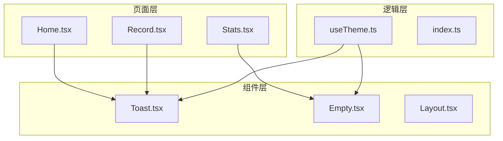
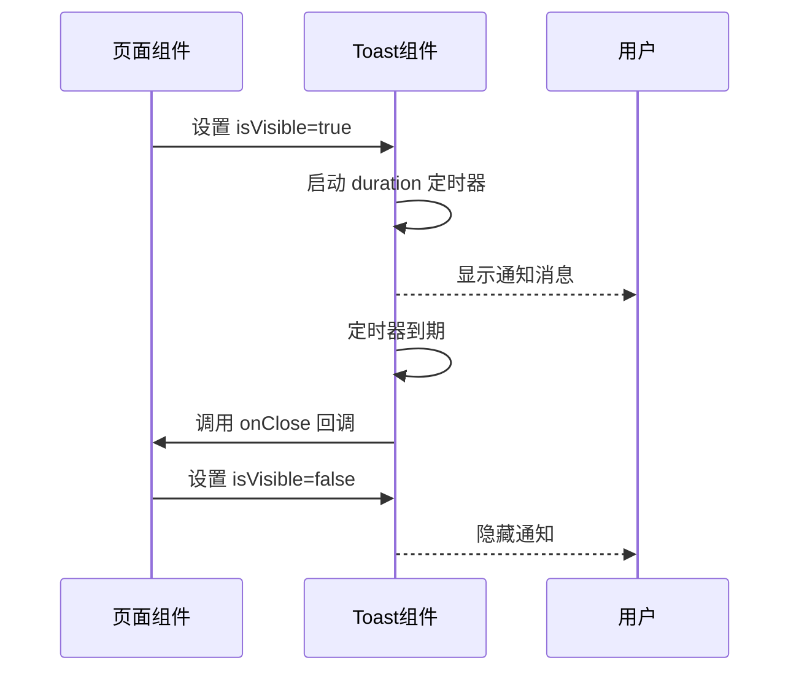
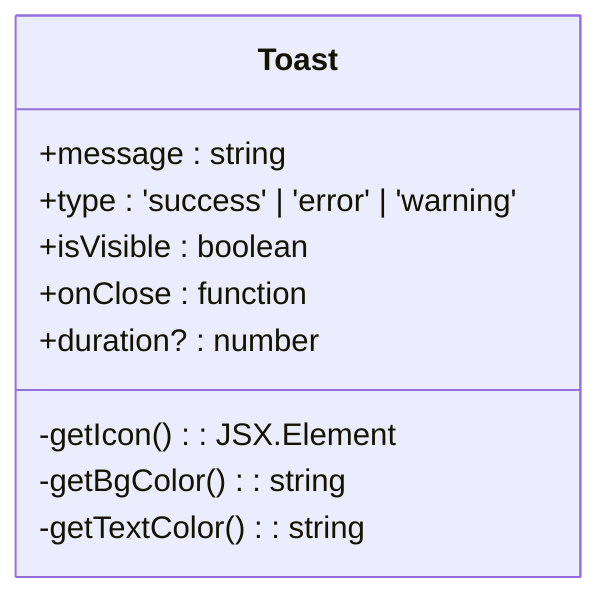
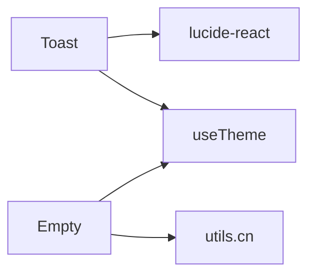

# 反馈组件

<cite>
**本文档中引用的文件**  
- [Toast.tsx](file://src/components/Toast.tsx)
- [Empty.tsx](file://src/components/Empty.tsx)
- [useTheme.ts](file://src/hooks/useTheme.ts)
- [Stats.tsx](file://src/pages/Stats.tsx)
</cite>

## 目录
1. [简介](#简介)
2. [项目结构](#项目结构)
3. [核心组件](#核心组件)
4. [架构概述](#架构概述)
5. [详细组件分析](#详细组件分析)
6. [依赖分析](#依赖分析)
7. [性能考虑](#性能考虑)
8. [故障排除指南](#故障排除指南)
9. [结论](#结论)

## 简介
本文档旨在全面说明 `Toast.tsx` 和 `Empty.tsx` 两个反馈类组件的设计与使用场景。`Toast` 组件用于实现轻量级全局通知系统，支持多种状态类型；`Empty` 组件则作为数据空状态占位符，提升用户体验。文档将详细阐述其可配置属性、调用方式、无障碍支持及主题适配能力，并提供实际应用案例。

## 项目结构
项目采用标准的 React + TypeScript 架构，组件集中存放于 `src/components` 目录下，页面逻辑位于 `src/pages`，状态管理通过 `src/store` 实现。`Toast` 与 `Empty` 均为无状态函数式 UI 组件，通过 Props 接收外部控制参数，符合现代前端模块化设计原则。

**Diagram sources **  
- [Toast.tsx](file://src/components/Toast.tsx)
- [Empty.tsx](file://src/components/Empty.tsx)
- [Stats.tsx](file://src/pages/Stats.tsx)
- [useTheme.ts](file://src/hooks/useTheme.ts)

**Section sources**
- [Toast.tsx](file://src/components/Toast.tsx)
- [Empty.tsx](file://src/components/Empty.tsx)

## 核心组件
`Toast` 组件基于原生 React 状态与副作用机制实现，无需依赖第三方通知库（如 sonner），通过 `isVisible` 控制显隐，`type` 区分成功、错误、警告等类型，自动在指定 `duration` 后关闭。`Empty` 组件目前为简单居中占位结构，具备扩展性。

**Section sources**
- [Toast.tsx](file://src/components/Toast.tsx#L1-L81)
- [Empty.tsx](file://src/components/Empty.tsx#L1-L8)

## 架构概述
反馈系统由 UI 组件与业务逻辑解耦构成。`Toast` 作为展示层，由上层逻辑（如表单提交、API 调用）控制其显示；`Empty` 作为数据驱动的视图占位符，在数据为空时渲染。两者均通过 `useTheme` 实现深色/浅色模式动态适配。

**Diagram sources **  
- [Toast.tsx](file://src/components/Toast.tsx#L10-L81)

## 详细组件分析

### Toast 组件分析
`Toast` 是一个轻量级通知组件，用于向用户展示短暂的操作反馈信息。

#### 可配置 Props
| 属性名 | 类型 | 默认值 | 说明 |
|--------|------|--------|------|
| message | string | 必填 | 通知显示的文本内容 |
| type | 'success' \| 'error' \| 'warning' | 必填 | 通知类型，决定图标与颜色 |
| isVisible | boolean | 必填 | 控制 Toast 是否可见 |
| onClose | () => void | 必填 | 关闭时的回调函数 |
| duration | number | 3000 | 自动关闭延迟时间（毫秒） |

#### 调用方式
可通过父组件状态控制 `isVisible` 实现函数式调用，例如在用户操作成功后设置 `isVisible=true`，并在 `onClose` 中重置状态。

#### 视觉与交互设计
- 成功：绿色背景 + 对勾图标
- 错误：红色背景 + 叉号图标
- 警告：黄色背景 + 感叹号图标
- 支持点击右上角 X 按钮手动关闭

#### 无障碍支持
组件使用语义化 HTML 结构，图标具有辅助文本（通过 ARIA 隐含），关闭按钮具备键盘焦点与点击事件，确保屏幕阅读器用户可感知通知内容与关闭操作。

**Diagram sources **  
- [Toast.tsx](file://src/components/Toast.tsx#L6-L81)

**Section sources**
- [Toast.tsx](file://src/components/Toast.tsx#L1-L81)

### Empty 组件分析
`Empty` 组件用于在无数据时提供视觉占位，当前实现较为基础。

#### 当前实现
目前仅包含一个居中显示“Empty”文本的容器，使用 `cn` 工具类处理样式合并，具备响应式高度填充能力。

#### 扩展建议
应扩展以下功能以满足文档目标：
- 插槽支持：允许传入自定义图标、提示文本、操作按钮（如“重新加载”或“去记录”）
- 更丰富的默认视觉元素（如插图）
- 支持加载状态与错误状态的差异化展示

#### 主题适配
通过 `useTheme` 钩子获取当前主题模式，可动态调整占位符文字颜色与背景色，确保在深色/浅色模式下均具备良好可读性。

**Section sources**
- [Empty.tsx](file://src/components/Empty.tsx#L1-L8)
- [useTheme.ts](file://src/hooks/useTheme.ts#L1-L111)

## 依赖分析
`Toast` 依赖 `lucide-react` 图标库实现视觉反馈，`Empty` 依赖 `@/lib/utils` 中的 `cn` 函数进行类名合并。两者均与 `useTheme` 协同工作，实现主题动态切换。

**Diagram sources **  
- [Toast.tsx](file://src/components/Toast.tsx#L2)
- [Empty.tsx](file://src/components/Empty.tsx#L1)
- [useTheme.ts](file://src/hooks/useTheme.ts)

**Section sources**
- [Toast.tsx](file://src/components/Toast.tsx)
- [Empty.tsx](file://src/components/Empty.tsx)
- [useTheme.ts](file://src/hooks/useTheme.ts)

## 性能考虑
- `Toast` 使用 `useEffect` 精确监听 `isVisible` 和 `duration`，避免不必要的重渲染。
- 动画通过 Tailwind CSS 的 `animate-in` 类实现，性能高效。
- `Empty` 组件极简，无复杂计算，渲染开销几乎为零。

## 故障排除指南
- **Toast 不显示**：检查 `isVisible` 是否正确设置为 `true`，确认父组件状态更新逻辑。
- **主题未生效**：确保 `useTheme` 已正确初始化并应用到根元素。
- **Empty 组件不居中**：检查父容器是否设置了 `height`，`h-full` 依赖父级高度。

**Section sources**
- [Toast.tsx](file://src/components/Toast.tsx)
- [useTheme.ts](file://src/hooks/useTheme.ts)

## 结论
`Toast` 和 `Empty` 组件构成了应用基础的反馈体系。`Toast` 提供了灵活、可配置的通知机制，适用于各类操作反馈场景；`Empty` 虽然当前功能简单，但具备良好的扩展潜力。建议增强 `Empty` 的插槽能力，并统一在 `Stats` 等页面中复用这些组件，以保持 UI 一致性与可维护性。