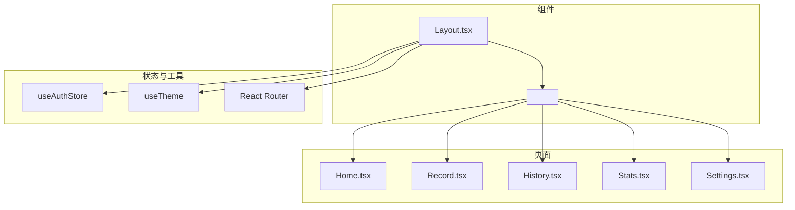
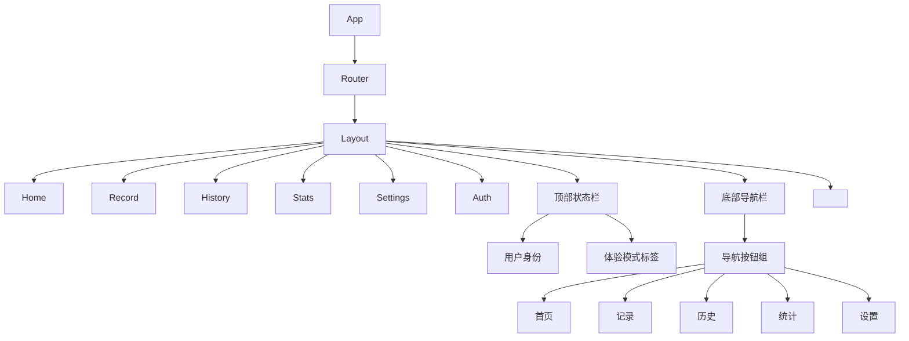
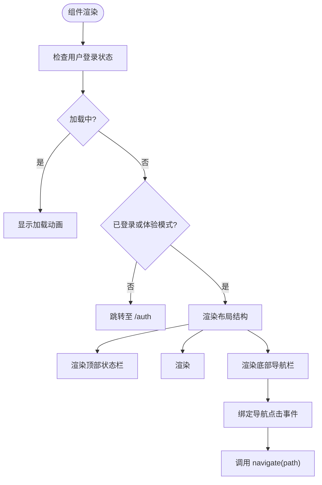
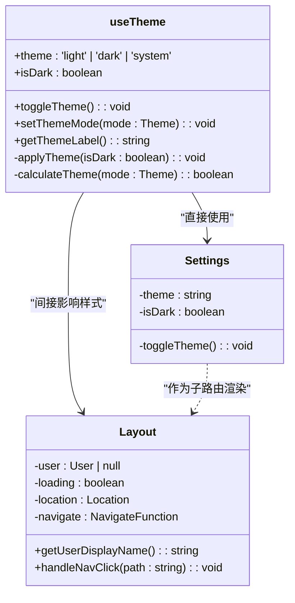

# 布局组件

<cite>
**本文档中引用的文件**  
- [Layout.tsx](file://src/components/Layout.tsx)
- [useTheme.ts](file://src/hooks/useTheme.ts)
- [Home.tsx](file://src/pages/Home.tsx)
- [Settings.tsx](file://src/pages/Settings.tsx)
- [App.tsx](file://src/App.tsx)
- [index.tsx](file://src/router/index.tsx)
</cite>

## 目录
1. [简介](#简介)
2. [项目结构](#项目结构)
3. [核心组件](#核心组件)
4. [架构概述](#架构概述)
5. [详细组件分析](#详细组件分析)
6. [依赖分析](#依赖分析)
7. [性能考虑](#性能考虑)
8. [故障排除指南](#故障排除指南)
9. [结论](#结论)

## 简介
`Layout.tsx` 是本应用的核心布局容器组件，负责为所有页面提供统一的视觉结构和交互体验。该组件封装了页眉、底部导航栏以及主内容区域，确保用户在不同页面间切换时保持一致的界面风格。它与 React Router 集成，通过 `<Outlet />` 渲染子路由内容，并基于用户认证状态自动跳转至登录页或主界面。此外，组件支持体验模式提示、用户身份展示及响应式设计，适配移动端使用场景。

## 项目结构
`Layout.tsx` 位于 `src/components/` 目录下，作为全局布局被 `src/router/index.tsx` 中的路由系统引用。其子内容由多个页面组件（如 Home、Record、Settings 等）填充，这些页面位于 `src/pages/` 目录中。布局组件依赖于全局状态管理（`useAuthStore`）、图标库（lucide-react）和路由控制（react-router-dom），并与主题系统（`useTheme`）协同工作以实现深色/浅色模式切换。



**Diagram sources**  
- [Layout.tsx](file://src/components/Layout.tsx#L1-L115)
- [index.tsx](file://src/router/index.tsx#L1-L45)

**Section sources**  
- [Layout.tsx](file://src/components/Layout.tsx#L1-L115)
- [index.tsx](file://src/router/index.tsx#L1-L45)

## 核心组件
`Layout` 组件是整个应用的外壳，承担着身份验证检查、导航控制和用户体验一致性维护的职责。它在初始化时调用 `initializeAuth()` 加载用户认证状态，并根据是否登录决定是否重定向到 `/auth` 页面。顶部状态栏显示当前用户身份及“体验模式”标识，底部固定导航栏提供五个主要功能入口：首页、记录、历史、统计和设置。

该组件通过 `useLocation` 监听路由变化，动态高亮当前激活的导航项，并使用 `handleNavClick` 实现页面跳转。在加载过程中显示旋转动画，提升等待体验。整体结构简洁清晰，符合移动端优先的设计理念。

**Section sources**  
- [Layout.tsx](file://src/components/Layout.tsx#L1-L115)

## 架构概述
`Layout` 组件作为应用的根级容器，处于路由树的中间层，位于 `RouterProvider` 之下，各具体页面之上。它不直接处理业务逻辑，而是作为状态传递和UI统一的桥梁，将认证信息、导航控制和主题能力注入到所有子页面中。



**Diagram sources**  
- [Layout.tsx](file://src/components/Layout.tsx#L1-L115)
- [index.tsx](file://src/router/index.tsx#L1-L45)

## 详细组件分析

### 布局组件分析
`Layout` 是一个典型的 React 函数组件，采用 Hook 模式管理状态和副作用。其主要功能包括：

- **认证状态监听**：通过 `useAuthStore` 获取用户状态，在组件挂载时初始化认证流程。
- **路由控制**：利用 `useNavigate` 和 `useLocation` 实现页面跳转与路径匹配。
- **导航逻辑**：定义 `navItems` 数组配置底部导航项，点击后触发 `handleNavClick` 进行跳转。
- **用户信息展示**：通过 `getUserDisplayName` 方法获取当前用户的显示名称，支持本地用户、Supabase 用户和体验模式三种情况。

#### 响应式设计实现
组件基于 Tailwind CSS 的响应式断点系统构建，适用于移动设备。其底部导航栏使用 `fixed` 定位，确保在滚动时始终可见；主内容区域设置 `pb-20` 避免被导航栏遮挡。所有尺寸单位采用 `rem` 和 `w-full` 等弹性单位，配合 `flex` 布局实现自适应。



**Diagram sources**  
- [Layout.tsx](file://src/components/Layout.tsx#L1-L115)

#### 主题集成机制
虽然 `Layout.tsx` 本身未直接调用 `useTheme`，但它所包含的子组件（如 `Settings.tsx`）会使用该 Hook 实现主题切换。`useTheme` 通过监听系统偏好（`prefers-color-scheme`）和本地存储（`localStorage`）来动态应用深色/浅色模式，并通过 CSS 变量控制全局颜色方案。`Layout` 的结构设计允许主题变化无缝传播至所有子页面。



**Diagram sources**  
- [useTheme.ts](file://src/hooks/useTheme.ts#L1-L111)
- [Settings.tsx](file://src/pages/Settings.tsx#L1-L624)

**Section sources**  
- [Layout.tsx](file://src/components/Layout.tsx#L1-L115)
- [useTheme.ts](file://src/hooks/useTheme.ts#L1-L111)
- [Settings.tsx](file://src/pages/Settings.tsx#L1-L624)

### 使用示例
在 `Home.tsx` 和 `Settings.tsx` 中，`Layout` 组件通过路由配置自动包裹页面内容，开发者无需手动引入。例如，在 `Home` 页面中只需关注数据展示与交互逻辑，而页眉、导航等公共元素由 `Layout` 统一管理。

```tsx
// 示例：Home 页面如何被 Layout 包裹
<Route path="/" element={<Layout />}>
  <Route index element={<Home />} />
</Route>
```

此设计模式提高了代码复用性，降低了维护成本。

**Section sources**  
- [Home.tsx](file://src/pages/Home.tsx#L1-L371)
- [Settings.tsx](file://src/pages/Settings.tsx#L1-L624)
- [index.tsx](file://src/router/index.tsx#L1-L45)

## 依赖分析
`Layout` 组件依赖多个外部模块和内部状态：

```mermaid
dependency-graph
Layout --> react
Layout --> react-router-dom
Layout --> lucide-react
Layout --> useAuthStore
useAuthStore --> supabase
Layout --> localStorage
```

其中，`useAuthStore` 来自 `src/store`，用于管理用户认证状态；`localStorage` 被用于读取“体验模式”和本地用户信息；`lucide-react` 提供导航图标。这些依赖共同支撑了布局组件的功能完整性。

**Diagram sources**  
- [Layout.tsx](file://src/components/Layout.tsx#L1-L115)
- [useAuthStore](file://src/store/index.ts)

**Section sources**  
- [Layout.tsx](file://src/components/Layout.tsx#L1-L115)

## 性能考虑
`Layout` 组件在性能方面表现良好：
- 使用 `useEffect` 仅在挂载时初始化认证，避免频繁执行。
- 导航点击事件绑定在按钮上，无多余监听器。
- 图标按需导入，未造成包体积膨胀。
- 条件渲染逻辑简单，不影响主线程。

唯一潜在优化点是 `getUserDisplayName` 中的多次 `localStorage` 读取，可考虑缓存结果以减少重复访问。

## 故障排除指南
### 常见使用错误
1. **嵌套不当导致样式冲突**  
   若在子组件中再次使用 `Layout`，会导致双层导航栏。应确保仅在路由层级使用一次。

2. **未正确处理加载状态**  
   忽略 `loading` 状态可能导致闪屏问题。建议保持原生加载动画或自定义骨架屏。

3. **导航跳转失败**  
   确保 `handleNavClick` 中的路径与路由配置完全一致，避免大小写或斜杠错误。

4. **体验模式标识不显示**  
   检查 `localStorage` 是否设置了 `experience_mode=true`，否则不会渲染标签。

解决方案：始终通过路由系统管理页面结构，避免手动嵌套布局组件；合理利用 `useLocation` 和 `useNavigate` 进行导航控制；在开发环境中打印 `localStorage` 内容以调试状态。

**Section sources**  
- [Layout.tsx](file://src/components/Layout.tsx#L1-L115)
- [Settings.tsx](file://src/pages/Settings.tsx#L1-L624)

## 结论
`Layout.tsx` 是本应用的核心骨架组件，实现了统一的页面结构、导航控制和用户体验保障。它通过与 React Router、状态管理、本地存储和主题系统的深度集成，构建了一个稳定、可扩展且易于维护的前端架构。其设计充分考虑了移动端使用场景，响应式布局和简洁交互提升了整体可用性。未来可进一步优化主题集成方式，使 `Layout` 能直接响应主题变化，提升一致性。