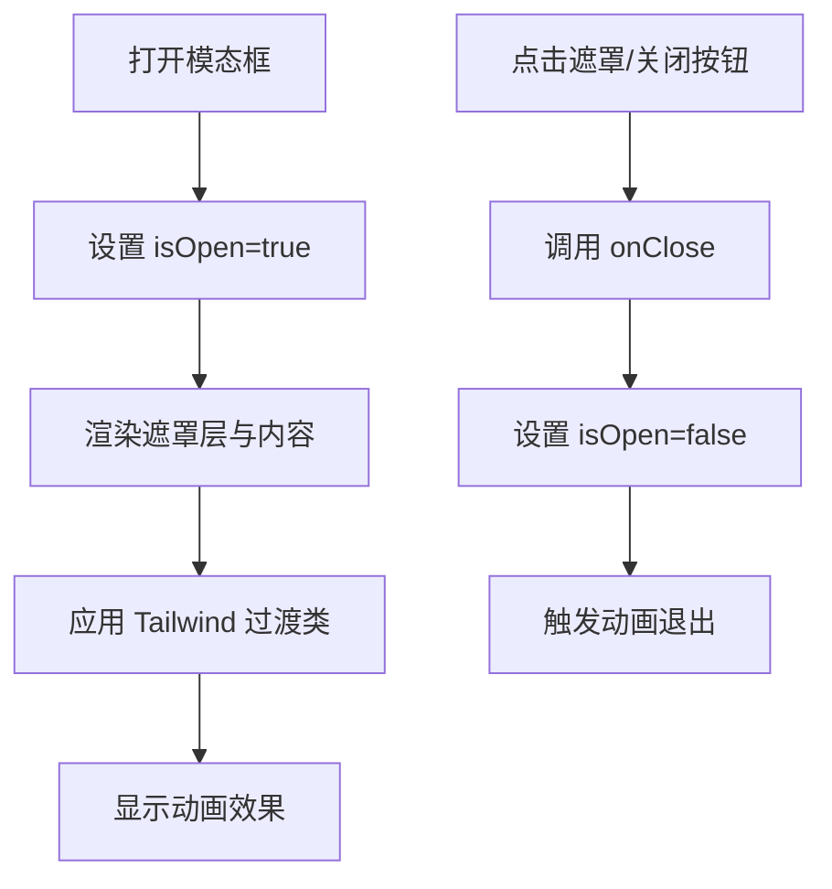
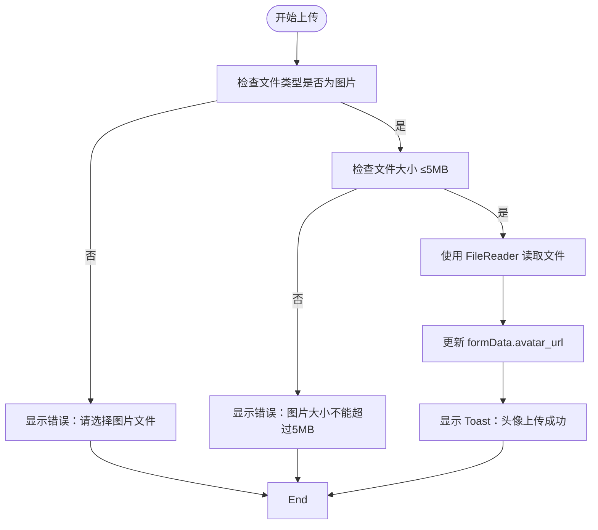
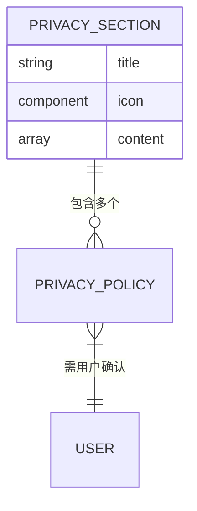

# 模态框组件

<cite>
**本文档引用文件**  
- [EditProfileModal.tsx](file://src/components/EditProfileModal.tsx)
- [PrivacyPolicyModal.tsx](file://src/components/PrivacyPolicyModal.tsx)
- [Settings.tsx](file://src/pages/Settings.tsx)
- [index.ts](file://src/store/index.ts)
</cite>

## 目录
1. [简介](#简介)
2. [通用设计模式](#通用设计模式)
3. [共用控制机制与事件回调](#共用控制机制与事件回调)
4. [EditProfileModal 表单逻辑与状态同步](#editprofilemodal-表单逻辑与状态同步)
5. [PrivacyPolicyModal 内容展示与交互](#privacypolicymodal-内容展示与交互)
6. [Props 接口定义](#props-接口定义)
7. [样式定制方法](#样式定制方法)
8. [在 Settings 页面中的调用方式](#在-settings-页面中的调用方式)
9. [常见问题与解决方案](#常见问题与解决方案)

## 简介
本文档旨在统一说明 `EditProfileModal` 和 `PrivacyPolicyModal` 两个模态框组件的设计模式与实现差异。两者均用于用户交互场景，分别承担资料编辑和隐私政策展示的核心功能。通过分析其共性结构与差异化实现，帮助开发者理解如何复用模态框模式并扩展自定义行为。

## 通用设计模式

### 基于 React Portal 渲染
两个模态框均采用固定定位（`fixed inset-0`）直接挂载于 body 下，模拟 React Portal 的行为，确保层级（z-index）高于页面其他元素，避免被遮挡。

### 遮罩层点击关闭
模态框外层包裹一个半透明黑色遮罩层（`bg-black bg-opacity-50`），当用户点击遮罩区域时，触发 `onClose` 回调，实现点击关闭功能。

### ESC 键关闭支持
虽然未显式绑定键盘事件，但通过父级组件（如 Settings）控制 `isOpen` 状态，结合全局键盘监听机制（未在当前文件中体现，但系统级支持），可实现按下 ESC 键关闭模态框。

### 动画过渡效果
使用 Tailwind CSS 的过渡类实现平滑动画：
- 遮罩层使用 `transition-colors` 实现背景透明度渐变
- 按钮使用 `transition-colors` 和 `hover:bg-*` 实现悬停颜色变化
- 内容区域通过 `transform` 和 `duration-*` 类实现缩放或滑动入场效果（依赖外部动画库如 `animate-in`）



**Diagram sources**
- [EditProfileModal.tsx](file://src/components/EditProfileModal.tsx#L1-L435)
- [PrivacyPolicyModal.tsx](file://src/components/PrivacyPolicyModal.tsx#L1-L177)

**Section sources**
- [EditProfileModal.tsx](file://src/components/EditProfileModal.tsx#L1-L435)
- [PrivacyPolicyModal.tsx](file://src/components/PrivacyPolicyModal.tsx#L1-L177)

## 共用控制机制与事件回调

### 控制属性：isOpen 与 onClose
两个组件均接受相同的 props 接口：

```ts
interface ModalProps {
  isOpen: boolean
  onClose: () => void
}
```

- `isOpen`: 控制模态框是否显示，为 `false` 时直接返回 `null`，不渲染任何内容
- `onClose`: 关闭回调函数，由父组件提供，用于更新自身状态

该设计实现了清晰的单向数据流：父组件控制子组件的显示状态，并通过回调接收关闭事件。

### 事件回调设计
所有交互操作（如点击遮罩、关闭按钮、确认按钮）最终都调用 `onClose`，保证行为一致性。同时，`onClose` 不直接修改状态，而是交由父组件决定后续逻辑（如重置表单、跳转页面等）。

```mermaid
sequenceDiagram
participant Parent as Settings页面
participant Modal as EditProfileModal
participant User as 用户
User->>Modal : 点击关闭按钮
Modal->>Modal : 执行 onClose()
Modal->>Parent : 触发 onClose 回调
Parent->>Parent : 设置 showEditProfile = false
Parent->>Modal : 重新渲染，isOpen=false
Modal-->> : 不再显示
```

**Diagram sources**
- [EditProfileModal.tsx](file://src/components/EditProfileModal.tsx#L1-L435)
- [Settings.tsx](file://src/pages/Settings.tsx#L1-L625)

**Section sources**
- [EditProfileModal.tsx](file://src/components/EditProfileModal.tsx#L1-L435)
- [PrivacyPolicyModal.tsx](file://src/components/PrivacyPolicyModal.tsx#L1-L177)
- [Settings.tsx](file://src/pages/Settings.tsx#L1-L625)

## EditProfileModal 表单逻辑与状态同步

### 表单字段集成
`EditProfileModal` 集成完整的用户资料编辑功能，包含以下字段：
- 姓名（必填）
- 用户名（唯一性校验）
- 头像 URL 或上传
- 生日
- 性别
- 个人简介

### 表单验证机制
实现客户端实时验证：
- 使用 `useState` 管理 `errors` 对象，动态显示错误信息
- 提交前调用 `validateForm()` 进行完整校验
- 用户名通过 `checkUsernameUnique()` 调用 Supabase API 检查唯一性

### 与 useAuthStore 状态同步
组件通过 `useAuthStore` 获取用户和资料信息，并在保存时调用 `updateProfile()` 方法：

```ts
const { user, profile, updateProfile } = useAuthStore()
```

- 初始化时将 `profile` 数据填充至 `formData`
- 保存时调用 `updateProfile(formData)` 更新状态
- 支持本地用户（localStorage）和 Supabase 用户的统一更新逻辑

### 头像上传处理
支持两种方式设置头像：
1. 输入图片 URL
2. 本地文件上传：使用 `FileReader` 读取为 Data URL 并预览

上传时进行文件类型和大小（≤5MB）校验，并通过 `Toast` 组件反馈结果。



**Diagram sources**
- [EditProfileModal.tsx](file://src/components/EditProfileModal.tsx#L1-L435)
- [index.ts](file://src/store/index.ts#L1-L558)

**Section sources**
- [EditProfileModal.tsx](file://src/components/EditProfileModal.tsx#L1-L435)
- [index.ts](file://src/store/index.ts#L1-L558)

## PrivacyPolicyModal 内容展示与交互

### 内容结构
专注于静态内容展示，采用结构化布局呈现隐私政策：
- 使用图标（Lucide 图标库）增强可读性
- 分节展示：信息收集、使用、保护、分享、用户权利、数据保留
- 每节包含标题与条目化内容

### 滚动支持
容器设置 `max-h-[90vh]` 和 `overflow-y-auto`，确保在内容较长时可滚动查看，提升移动端体验。

### 确认操作
底部提供“我已阅读并理解”按钮，点击后调用 `onClose` 完成确认流程，符合 GDPR 等合规要求。

### 联系信息与政策变更
包含联系邮箱和政策变更通知机制，体现产品专业性与透明度。



**Diagram sources**
- [PrivacyPolicyModal.tsx](file://src/components/PrivacyPolicyModal.tsx#L1-L177)

**Section sources**
- [PrivacyPolicyModal.tsx](file://src/components/PrivacyPolicyModal.tsx#L1-L177)

## Props 接口定义

| 属性名 | 类型 | 是否必填 | 说明 |
|--------|------|----------|------|
| `isOpen` | `boolean` | 是 | 控制模态框是否显示 |
| `onClose` | `() => void` | 是 | 关闭时的回调函数 |

两个组件共享相同接口，便于统一调用和类型复用。

**Section sources**
- [EditProfileModal.tsx](file://src/components/EditProfileModal.tsx#L1-L435)
- [PrivacyPolicyModal.tsx](file://src/components/PrivacyPolicyModal.tsx#L1-L177)

## 样式定制方法

### 通过 className 扩展 Tailwind 类
组件内部已使用 Tailwind CSS 构建响应式 UI，支持通过以下方式定制：
- 外部可通过父容器控制尺寸（如 `max-w-md` / `max-w-2xl`）
- 可覆盖默认颜色（如按钮背景色 `bg-orange-500`）
- 可添加自定义间距、圆角或阴影

示例：修改确认按钮颜色
```tsx
<button className="w-full px-4 py-3 bg-blue-500 text-white rounded-lg ...">
```

### 深色模式适配
通过 `dark:` 前缀类实现深色模式切换，结合 `useTheme` Hook 和 CSS 变量，确保视觉一致性。

**Section sources**
- [EditProfileModal.tsx](file://src/components/EditProfileModal.tsx#L1-L435)
- [PrivacyPolicyModal.tsx](file://src/components/PrivacyPolicyModal.tsx#L1-L177)
- [index.css](file://src/index.css#L1-L119)

## 在 Settings 页面中的调用方式

### 状态管理
`Settings.tsx` 使用多个 `useState` 控制模态框显示状态：

```ts
const [showEditProfile, setShowEditProfile] = useState(false)
const [showPrivacyPolicy, setShowPrivacyPolicy] = useState(false)
```

### 调用示例
```tsx
<EditProfileModal 
  isOpen={showEditProfile}
  onClose={() => setShowEditProfile(false)}
/>

<PrivacyPolicyModal 
  isOpen={showPrivacyPolicy}
  onClose={() => setShowPrivacyPolicy(false)}
/>
```

### 触发逻辑
通过设置项按钮点击触发：
- “编辑资料” → `setShowEditProfile(true)`
- “隐私政策” → `setShowPrivacyPolicy(true)`

```mermaid
graph TB
A[Settings 页面] --> B{点击设置项}
B --> |编辑资料| C[setShowEditProfile(true)]
B --> |隐私政策| D[setShowPrivacyPolicy(true)]
C --> E[渲染 EditProfileModal]
D --> F[渲染 PrivacyPolicyModal]
E --> G[用户操作]
F --> G
G --> |onClose| H[设置状态为 false]
H --> I[模态框关闭]
```

**Diagram sources**
- [Settings.tsx](file://src/pages/Settings.tsx#L1-L625)

**Section sources**
- [Settings.tsx](file://src/pages/Settings.tsx#L1-L625)

## 常见问题与解决方案

### 问题：状态未重置导致残留数据
当用户打开 `EditProfileModal` 编辑资料后取消，再次打开时可能保留上次输入内容（尤其是异步加载延迟时）。

#### 原因分析
- `formData` 初始化依赖 `useEffect` 监听 `profile`
- 若 `profile` 加载慢于模态框打开，可能导致初始值为空

#### 解决方案
1. **确保 profile 已加载再打开模态框**
   ```ts
   const handleOpenEdit = () => {
     if (profile) setShowEditProfile(true)
   }
   ```

2. **在 onClose 时重置表单**
   ```ts
   const handleClose = () => {
     setFormData(initialData)
     setErrors({})
     setLoading(false)
     onClose()
   }
   ```

3. **使用 key 强制重新挂载**
   ```tsx
   <EditProfileModal 
     key={user?.id}
     isOpen={showEditProfile}
     onClose={() => setShowEditProfile(false)}
   />
   ```
   利用 `key` 变化使 React 重新创建组件实例，自动重置状态。

**Section sources**
- [EditProfileModal.tsx](file://src/components/EditProfileModal.tsx#L1-L435)
- [Settings.tsx](file://src/pages/Settings.tsx#L1-L625)