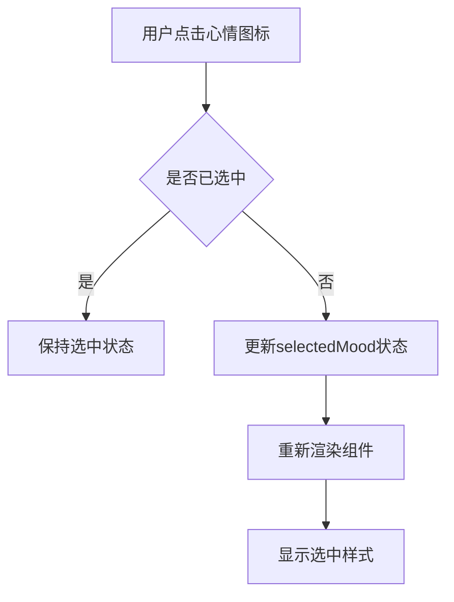
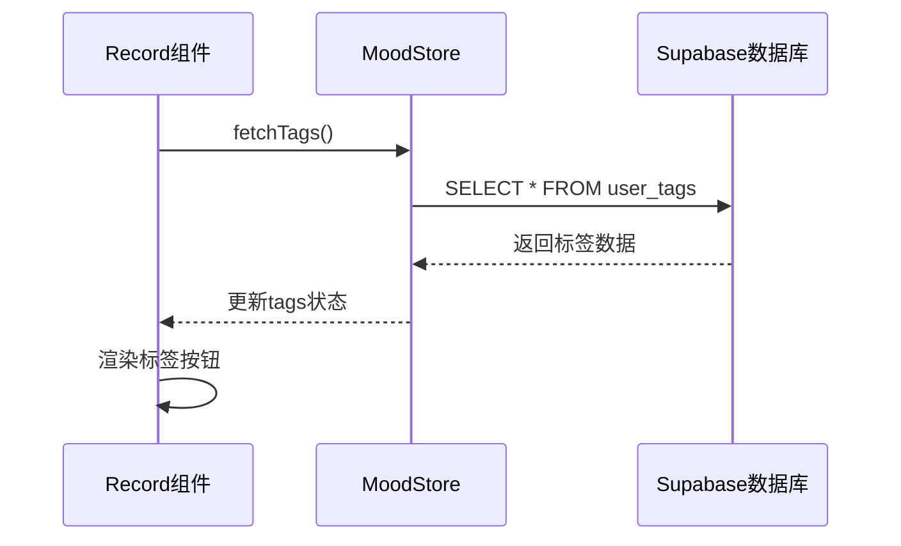
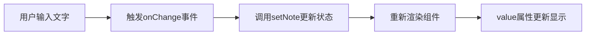
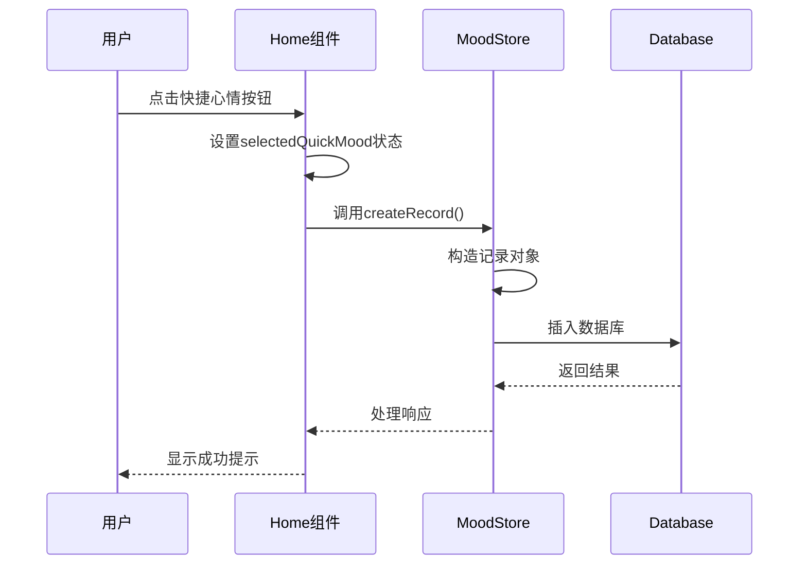

# 心情记录创建

<cite>
**本文档引用的文件**   
- [Record.tsx](file://src/pages/Record.tsx)
- [Home.tsx](file://src/pages/Home.tsx)
- [index.ts](file://src/store/index.ts)
- [supabase.ts](file://src/lib/supabase.ts)
- [create_mood_diary_tables.sql](file://supabase/migrations/create_mood_diary_tables.sql)
</cite>

## 目录
1. [表单组件结构设计](#表单组件结构设计)
2. [快捷记录流程](#快捷记录流程)
3. [数据持久化机制](#数据持久化机制)
4. [数据模型与验证](#数据模型与验证)
5. [错误处理与用户提示](#错误处理与用户提示)
6. [扩展建议](#扩展建议)

## 表单组件结构设计

`Record.tsx`中的表单组件采用React函数式组件设计，通过Zustand状态管理库实现状态控制。组件包含心情选择、强度调节、标签选择和备注输入四大功能模块。

### 16种心情图标的交互逻辑

组件定义了16种心情类型，每种类型包含表情符号、中文标签和配色方案。用户点击心情按钮时，通过`setSelectedMood(mood.type)`更新选中状态，被选中的按钮会显示橙色边框和浅色背景，实现视觉反馈。



**Diagram sources**
- [Record.tsx](file://src/pages/Record.tsx#L44-L92)

**Section sources**
- [Record.tsx](file://src/pages/Record.tsx#L0-L259)

### 标签选择器的动态加载

标签选择器通过`useMoodStore`中的`tags`状态和`fetchTags`方法实现动态加载。组件首次渲染时，`useEffect`钩子调用`fetchTags()`从Supabase数据库或本地存储获取用户自定义标签。

当数据库标签为空时，组件会显示5个默认标签：工作、生活、运动、学习、社交。用户点击标签按钮时，通过`setSelectedTags`更新选中状态数组，已选中的标签显示为橙色背景白色文字。



**Diagram sources**
- [Record.tsx](file://src/pages/Record.tsx#L44-L92)
- [index.ts](file://src/store/index.ts#L254-L295)

### 备注输入框的受控组件实现

备注输入框采用受控组件模式，通过`useState('')`创建`note`状态，`value={note}`绑定输入值，`onChange={(e) => setNote(e.target.value)}`同步用户输入。输入框支持多行文本，高度固定为32行，具备焦点高亮效果。



**Diagram sources**
- [Record.tsx](file://src/pages/Record.tsx#L224-L259)

## 快捷记录流程

`Home.tsx`中的快捷记录功能通过10个常用心情按钮实现快速记录，优化用户体验。

### 快捷按钮触发机制

快捷记录按钮位于首页"快速记录心情"区域，包含10个高频使用的心情类型。用户点击按钮时，触发`handleQuickRecord(moodType)`函数，该函数调用`createRecord`方法创建记录。



**Diagram sources**
- [Home.tsx](file://src/pages/Home.tsx#L49-L79)
- [index.ts](file://src/store/index.ts#L383-L420)

### 时间戳预填充

快捷记录功能自动预填充时间戳，无需用户手动输入。当调用`createRecord`方法时，`createRecord`异步函数会自动在记录对象中添加`created_at`字段，其值为当前时间的ISO格式字符串。

```typescript
const newRecord = {
  mood_type: moodType,
  intensity: 5,
  note: '',
  created_at: new Date().toISOString() // 自动预填充
}
```

**Section sources**
- [Home.tsx](file://src/pages/Home.tsx#L0-L371)
- [index.ts](file://src/store/index.ts#L383-L420)

## 数据持久化机制

心情记录的数据持久化通过Supabase客户端实现，采用Zustand状态管理库协调本地状态与远程数据库的同步。

### createMoodRecord方法流程

`createMoodRecord`方法位于`src/store/index.ts`中，是`useMoodStore`的核心功能之一。该方法处理异步数据持久化流程，支持Supabase用户和本地体验模式。

```mermaid
flowchart TD
A[调用createRecord] --> B{用户类型判断}
B --> |Supabase用户| C[获取用户身份]
B --> |本地用户| D[生成本地ID]
C --> E[构造MoodRecord对象]
D --> F[构造MoodRecord对象]
E --> G[调用supabase.insert()]
F --> H[保存到localStorage]
G --> I{插入成功?}
H --> J[更新本地状态]
I --> |是| K[创建标签关联]
I --> |否| L[抛出错误]
K --> M[刷新记录列表]
M --> N[完成]
L --> O[错误处理]
```

**Diagram sources**
- [index.ts](file://src/store/index.ts#L383-L465)

### MoodRecord对象构造

方法接收`Omit<MoodRecord, 'id' | 'user_id' | 'created_at' | 'updated_at'>`类型的记录数据和可选的标签ID数组。对于Supabase用户，自动添加`user_id`；对于所有用户，自动添加`created_at`和`updated_at`时间戳。

```typescript
const newRecord = {
  id: recordId,
  user_id: userId,
  mood_type: selectedMood,
  intensity,
  note: note.trim() || undefined,
  created_at: new Date().toISOString(),
  updated_at: new Date().toISOString()
}
```

**Section sources**
- [index.ts](file://src/store/index.ts#L383-L420)

### 数据同步更新

数据持久化后，方法会同步更新Zustand本地状态，确保UI即时反映最新数据。对于Supabase用户，调用`fetchRecords()`刷新整个记录列表；对于本地用户，直接更新`records`状态数组。

```mermaid
flowchart LR
A[数据插入成功] --> B[调用fetchRecords()]
B --> C[获取最新记录]
C --> D[更新Zustand状态]
D --> E[触发组件重新渲染]
```

**Section sources**
- [index.ts](file://src/store/index.ts#L414-L465)

## 数据模型与验证

系统采用严格的数据模型定义和验证机制，确保数据完整性和一致性。

### 字段类型约束

根据`src/lib/supabase.ts`中的`MoodRecord`接口定义，关键字段具有明确的类型约束：

- **mood_level**: 实际对应`intensity`字段，为1-5的整数（非1-16），表示情绪强度等级
- **notes**: 可为空字符串的可选字段，类型为`string | undefined`
- **created_at**: ISO时间戳格式的字符串，如"2023-12-01T10:30:00.000Z"

```typescript
export interface MoodRecord {
  id: string
  user_id: string
  mood_type: 'happy' | 'sad' | 'angry' | 'anxious' | 'calm' | 'excited' | 'tired' | 'confused' | 'grateful' | 'proud' | 'nervous' | 'hopeful' | 'lonely' | 'surprised' | 'loving' | 'frustrated'
  intensity: number // 1-5整数
  note?: string // 可为空字符串
  created_at: string // ISO时间戳
  updated_at: string // ISO时间戳
}
```

**Section sources**
- [supabase.ts](file://src/lib/supabase.ts#L0-L46)

### 数据库层面验证

Supabase数据库通过SQL约束实现数据验证：

- `mood_type`字段限制为16种预定义值
- `intensity`字段限制为1-5的整数
- `note`字段允许为空（TEXT类型）
- `created_at`字段默认为当前时间

```sql
CREATE TABLE mood_records (
  mood_type VARCHAR(20) NOT NULL CHECK (mood_type IN ('happy', 'sad', 'angry', 'anxious', 'calm', 'excited', 'tired', 'confused', 'grateful', 'proud', 'nervous', 'hopeful', 'lonely', 'surprised', 'loving', 'frustrated')),
  intensity INTEGER NOT NULL CHECK (intensity >= 1 AND intensity <= 5),
  note TEXT,
  created_at TIMESTAMP WITH TIME ZONE DEFAULT NOW()
);
```

**Section sources**
- [create_mood_diary_tables.sql](file://supabase/migrations/create_mood_diary_tables.sql#L0-L34)

## 错误处理与用户提示

系统实现了完善的错误处理机制，提供友好的用户反馈。

### 错误捕获实现

表单提交通过`try-catch`块捕获异步操作中的错误，在`handleSave`函数中处理：

```mermaid
flowchart TD
A[点击保存按钮] --> B[验证表单]
B --> C{选择心情?}
C --> |否| D[显示"请选择心情类型"]
C --> |是| E[调用createRecord]
E --> F{成功?}
F --> |是| G[显示成功提示]
F --> |否| H[捕获错误]
H --> I[解析错误信息]
I --> J[显示错误提示]
```

**Section sources**
- [Record.tsx](file://src/pages/Record.tsx#L44-L92)

### 网络异常处理

当发生网络连接问题时，Supabase客户端会抛出网络错误，系统捕获后显示"未知错误，请重试"的通用提示，同时在控制台输出详细错误信息用于调试。

### RLS权限拒绝处理

由于数据库启用了行级安全（RLS）策略，未认证用户尝试创建记录时会被拒绝。系统通过检查`user`身份状态提前预防此类错误，若发生权限拒绝，会显示"User not authenticated"错误。

```typescript
const { data: { user } } = await supabase.auth.getUser()
if (!user) throw new Error('User not authenticated')
```

**Section sources**
- [index.ts](file://src/store/index.ts#L414-L465)

## 扩展建议

### 添加图片URL字段

建议通过以下步骤扩展图片URL功能：

1. **修改数据模型**：在`MoodRecord`接口中添加`imageUrl?: string`字段
2. **更新数据库**：在`mood_records`表中添加`image_url` TEXT字段
3. **扩展表单**：在`Record.tsx`中添加图片URL输入框
4. **增强验证**：添加URL格式验证逻辑
5. **更新存储逻辑**：在`createRecord`方法中处理图片URL

```typescript
// 扩展后的MoodRecord接口
export interface MoodRecord {
  // ...原有字段
  imageUrl?: string // 新增字段
}

// URL验证函数
const isValidUrl = (string) => {
  try {
    new URL(string);
    return true;
  } catch (_) {
    return false;
  }
}
```

**Section sources**
- [supabase.ts](file://src/lib/supabase.ts#L0-L46)
- [Record.tsx](file://src/pages/Record.tsx#L0-L259)
- [index.ts](file://src/store/index.ts#L383-L465)