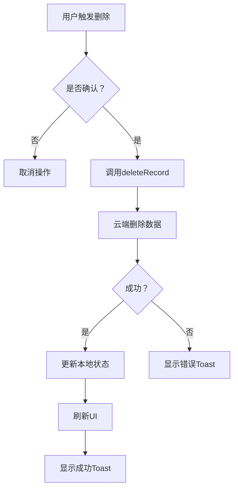
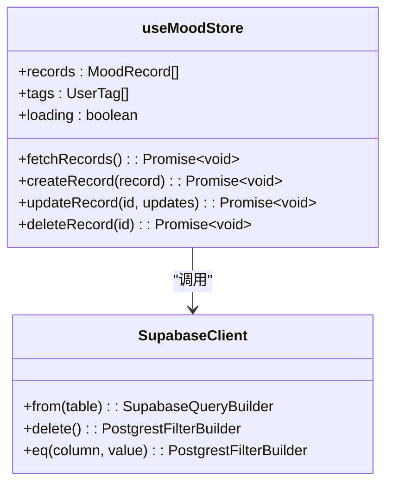

# 心情记录删除

<cite>
**本文档引用文件**  
- [History.tsx](file://src/pages/History.tsx)
- [index.ts](file://src/store/index.ts)
- [Toast.tsx](file://src/components/Toast.tsx)
- [supabase.ts](file://src/lib/supabase.ts)
</cite>

## 目录
1. [简介](#简介)
2. [删除功能实现逻辑概述](#删除功能实现逻辑概述)
3. [UI层事件绑定机制](#ui层事件绑定机制)
4. [确认对话框与UI反馈机制](#确认对话框与ui反馈机制)
5. [状态管理与数据同步](#状态管理与数据同步)
6. [云端数据删除与事务性保障](#云端数据删除与事务性保障)
7. [软删除与硬删除策略分析](#软删除与硬删除策略分析)
8. [批量删除扩展思路与性能优化](#批量删除扩展思路与性能优化)
9. [结论](#结论)

## 简介
本项目为一款心情日记应用，支持用户记录每日情绪状态。其中“心情记录删除”功能是核心数据管理操作之一，涉及前端交互、状态同步、云端通信及用户体验反馈等多个层面。本文档将深入解析该功能的完整实现逻辑，重点围绕`History.tsx`中的删除触发机制与`src/store/index.ts`中`deleteMoodRecord`方法的数据处理流程展开，全面阐述从用户点击到数据彻底移除的全过程。

## 删除功能实现逻辑概述
心情记录删除功能采用硬删除策略，通过用户在历史记录页面（History.tsx）执行操作触发，经确认后调用Zustand状态管理器中的`deleteRecord`方法，该方法通过Supabase客户端向数据库发送删除请求，并同步更新本地状态以保证一致性。整个流程包含事件绑定、确认提示、云端删除、状态更新和UI反馈五个关键阶段。

**Section sources**
- [History.tsx](file://src/pages/History.tsx#L1-L217)
- [index.ts](file://src/store/index.ts#L1-L557)

## UI层事件绑定机制
当前`History.tsx`组件尚未实现具体的删除按钮或滑动删除交互，但其结构已为后续功能扩展预留了空间。每个心情记录项由`filteredRecords.map`渲染生成，其容器`<div key={record.id}>`是理想的事件绑定位置。未来可在此处添加长按或左滑事件监听，用于触发删除操作。

典型的实现方式包括：
- 绑定`onContextMenu`事件实现长按弹出删除选项
- 使用`onTouchStart`/`onTouchMove`/`onTouchEnd`实现滑动删除手势
- 在记录项右侧添加显式删除图标按钮并绑定`onClick`事件

这些事件处理器将调用`useMoodStore`中的`deleteRecord`方法，并传入对应记录的ID。

**Section sources**
- [History.tsx](file://src/pages/History.tsx#L78-L100)

## 确认对话框与UI反馈机制
虽然`History.tsx`中未直接实现删除确认，但项目其他部分（如`Settings.tsx`）展示了统一的确认模态框设计模式。删除操作应使用类似`showDeleteConfirm`的状态变量控制确认弹窗的显示，确保用户不会误删重要数据。

UI反馈机制则通过`Toast.tsx`组件实现。该组件支持成功、错误和警告三种类型的消息提示，可通过`toast.success('删除成功')`等形式调用。删除成功后，系统会自动刷新记录列表，导致UI重新渲染，用户可在界面上直观看到记录已被移除。此外，统计图表（如`Stats.tsx`）也会因数据源变化而自动更新。



**Diagram sources**
- [Settings.tsx](file://src/pages/Settings.tsx#L560-L592)
- [Toast.tsx](file://src/components/Toast.tsx#L1-L81)

**Section sources**
- [Settings.tsx](file://src/pages/Settings.tsx#L254-L302)
- [Toast.tsx](file://src/components/Toast.tsx#L1-L81)

## 状态管理与数据同步
删除操作的核心逻辑位于`src/store/index.ts`的`useMoodStore`状态管理器中。`deleteRecord`方法是异步函数，接收`id: string`参数，其执行过程分为两步：

1. **云端删除请求**：调用`supabase.from('mood_records').delete().eq('id', id)`向Supabase数据库发起删除请求。
2. **本地状态同步**：无论云端操作是否成功，在`try`块中通过`set`函数更新Zustand状态，使用`filter`方法从`records`数组中移除对应ID的记录。

这种“先更新状态再处理结果”的模式实现了乐观更新（Optimistic Update），使UI响应更迅速。若云端删除失败，错误将在`catch`块中被捕获并抛出，但本地状态已变更，可能导致状态不一致。理想做法应在确认云端删除成功后再更新本地状态。



**Diagram sources**
- [index.ts](file://src/store/index.ts#L414-L465)

**Section sources**
- [index.ts](file://src/store/index.ts#L414-L465)

## 云端数据删除与事务性保障
当前删除操作仅针对`mood_records`表执行单表删除，未处理关联的标签关系（`record_tags`表）。Supabase支持通过`ON DELETE CASCADE`约束实现级联删除，但需在数据库层面配置外键约束。目前代码中未体现此逻辑，存在数据残留风险。

事务性方面，当前实现缺乏原子性保障。正确的做法是使用Supabase的存储过程或批量请求（batch request）将主记录删除与关联记录删除封装在同一事务中。例如，可使用`supabase.rpc('delete_mood_record', { record_id: id })`调用数据库函数，确保所有操作要么全部成功，要么全部回滚。

此外，`deleteRecord`方法未返回结果状态，调用方无法准确判断操作是否真正成功，建议修改为返回布尔值或Promise<boolean>。

**Section sources**
- [index.ts](file://src/store/index.ts#L448-L455)
- [supabase.ts](file://src/lib/supabase.ts#L1-L46)

## 软删除与硬删除策略分析
当前系统采用**硬删除**策略，即数据从数据库中物理移除。该策略优点是数据清理彻底，节省存储空间；缺点是无法恢复，存在误删风险。

相比之下，**软删除**策略通过添加`is_deleted`或`deleted_at`字段标记删除状态，数据仍保留在数据库中。优势在于支持数据恢复、审计追踪和逻辑一致性；劣势是增加查询复杂度（需过滤已删除项）和存储开销。

本项目选择硬删除，可能基于以下考虑：
- 应用定位为轻量级个人工具，数据量小，恢复需求低
- 用户隐私保护要求，确保数据可被彻底清除
- 简化数据模型和查询逻辑

但从用户体验角度，建议未来升级为软删除+定期清理机制，提供“回收站”功能。

**Section sources**
- [index.ts](file://src/store/index.ts#L448-L455)

## 批量删除扩展思路与性能优化
当前`deleteRecord`仅支持单条删除。扩展批量删除功能可通过以下方式实现：

1. **前端接口扩展**：在`useMoodStore`中新增`deleteRecords(ids: string[])`方法。
2. **数据库操作优化**：使用`IN`查询一次性删除多条记录：
   ```ts
   await supabase
     .from('mood_records')
     .delete()
     .in('id', ids)
   ```
3. **性能优化建议**：
   - 限制单次删除数量（如最多100条），避免请求超时
   - 使用分页或分批处理超大规模删除
   - 添加加载状态提示，提升用户体验
   - 在删除前进行二次确认，防止误操作
   - 记录删除日志，便于问题排查

此外，可结合WebSocket或Supabase Realtime实现多端同步，确保用户在不同设备上的数据一致性。

**Section sources**
- [index.ts](file://src/store/index.ts#L448-L455)

## 结论
心情记录删除功能目前实现了基本的硬删除逻辑，通过Zustand状态管理器协调本地状态与Supabase云端数据的同步。然而，现有实现存在事务性不足、缺少确认机制、未处理关联数据等问题。建议后续迭代中引入软删除机制、完善UI反馈流程、增强错误处理能力，并扩展批量操作支持，以提升系统的健壮性和用户体验。