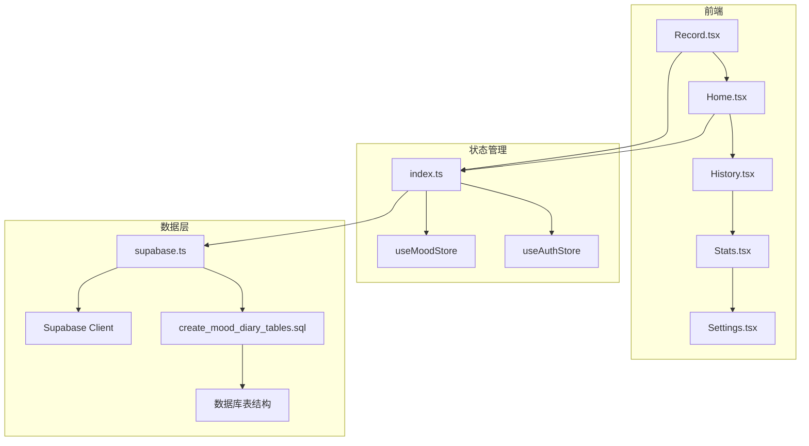
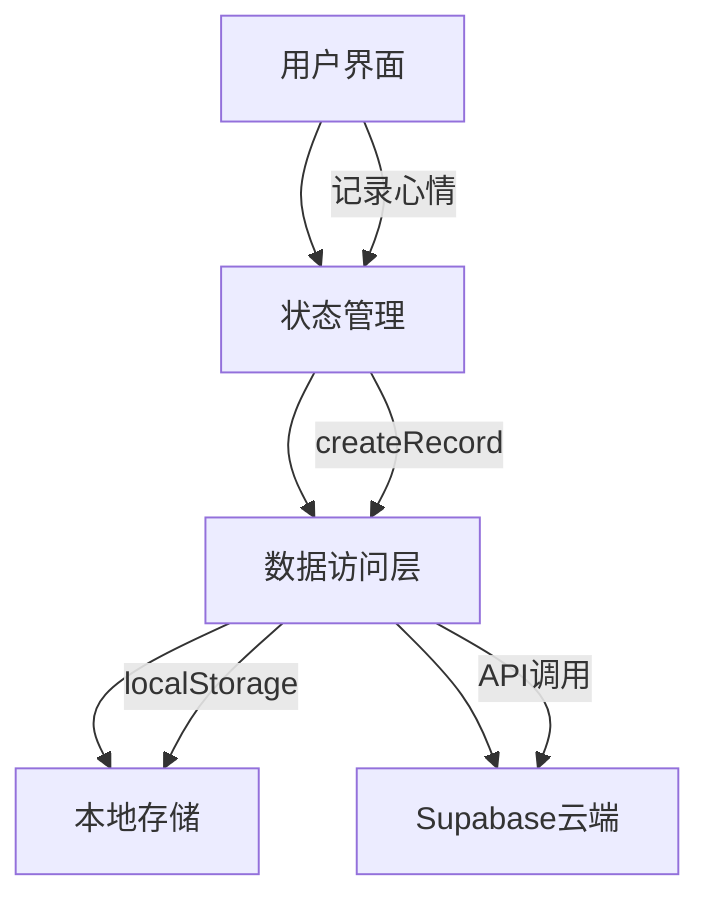
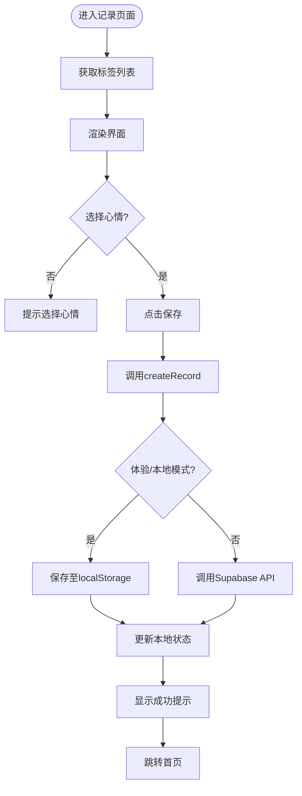
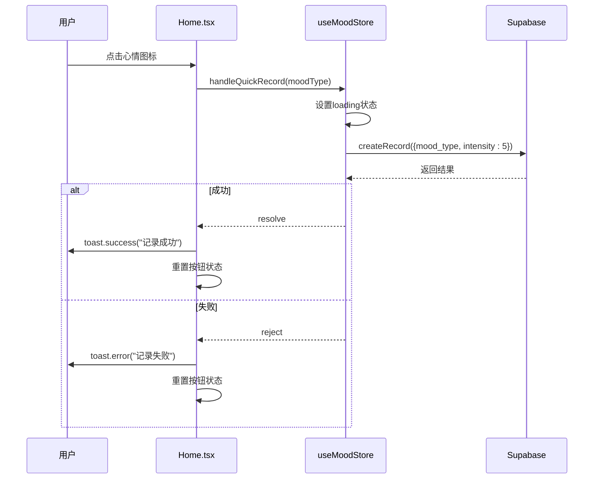
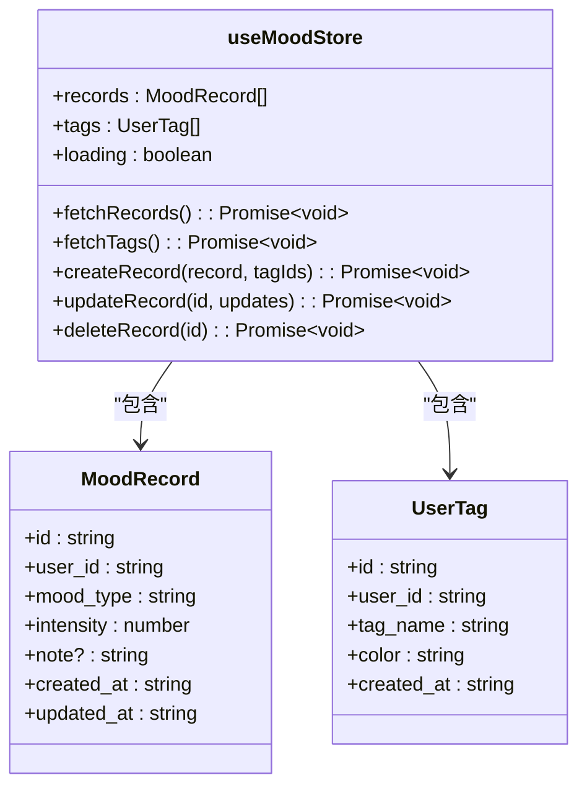
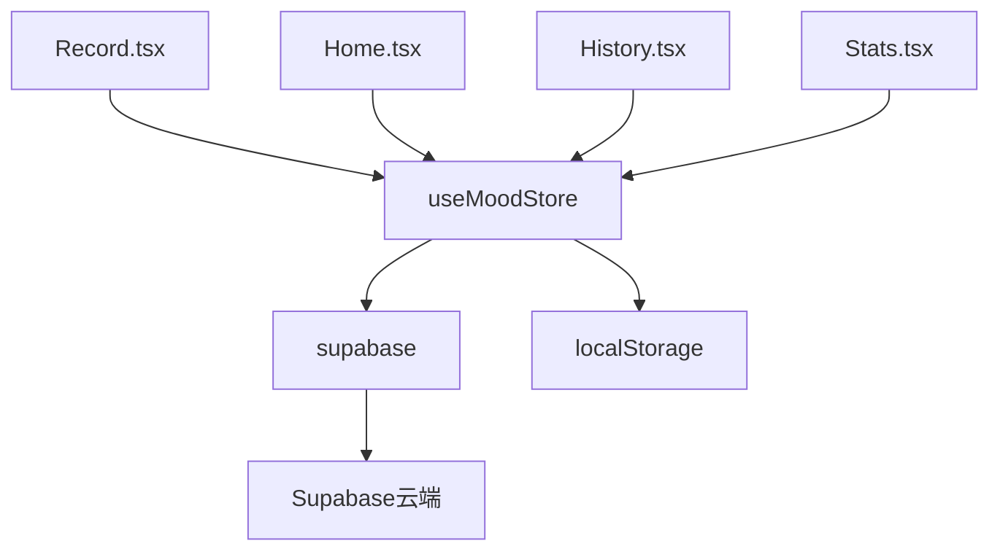

# 心情记录功能

<cite>
**本文档引用的文件**  
- [Record.tsx](file://src/pages/Record.tsx)
- [Home.tsx](file://src/pages/Home.tsx)
- [index.ts](file://src/store/index.ts)
- [supabase.ts](file://src/lib/supabase.ts)
- [create_mood_diary_tables.sql](file://supabase/migrations/create_mood_diary_tables.sql)
- [fix_record_tags_permissions.sql](file://supabase/migrations/fix_record_tags_permissions.sql)
- [fix_user_profiles_rls.sql](file://supabase/migrations/fix_user_profiles_rls.sql)
- [add_profile_fields.sql](file://supabase/migrations/add_profile_fields.sql)
</cite>

## 目录
1. [简介](#简介)
2. [项目结构](#项目结构)
3. [核心组件](#核心组件)
4. [架构概览](#架构概览)
5. [详细组件分析](#详细组件分析)
6. [依赖分析](#依赖分析)
7. [性能考虑](#性能考虑)
8. [故障排除指南](#故障排除指南)
9. [结论](#结论)

## 简介
本项目是一个基于React与Supabase的心情记录应用，支持用户通过图形化界面记录每日情绪状态。系统提供16种预设心情图标、自定义标签、备注输入等功能，并通过Zustand实现状态管理，结合Supabase进行云端数据持久化。支持本地存储与云端同步，确保离线可用性。用户可通过快捷按钮快速记录心情，也可进入详细页面进行深度记录。数据模型设计合理，具备良好的扩展性，适用于个人情绪追踪与心理健康管理。

## 项目结构
项目采用标准的React + Vite架构，结合Capacitor实现移动端支持。核心功能模块清晰划分，前端组件与状态管理分离，便于维护和扩展。

**图示来源**  
- [Record.tsx](file://src/pages/Record.tsx)
- [Home.tsx](file://src/pages/Home.tsx)
- [index.ts](file://src/store/index.ts)
- [supabase.ts](file://src/lib/supabase.ts)
- [create_mood_diary_tables.sql](file://supabase/migrations/create_mood_diary_tables.sql)

**本节来源**  
- [src/pages/Record.tsx](file://src/pages/Record.tsx)
- [src/pages/Home.tsx](file://src/pages/Home.tsx)
- [src/store/index.ts](file://src/store/index.ts)

## 核心组件
系统核心由三大组件构成：`Record.tsx` 提供完整心情记录界面；`Home.tsx` 提供首页快捷入口；`useMoodStore` 实现状态与数据持久化逻辑。三者通过Zustand状态管理器解耦通信，形成清晰的数据流闭环。

**本节来源**  
- [Record.tsx](file://src/pages/Record.tsx#L1-L260)
- [Home.tsx](file://src/pages/Home.tsx#L1-L372)
- [index.ts](file://src/store/index.ts#L1-L558)

## 架构概览
系统采用分层架构设计，从前端UI到后端数据库形成完整链路。状态管理作为中间层，封装了本地与云端的数据操作逻辑，屏蔽复杂性。

**图示来源**  
- [Record.tsx](file://src/pages/Record.tsx#L1-L260)
- [index.ts](file://src/store/index.ts#L1-L558)
- [supabase.ts](file://src/lib/supabase.ts#L1-L47)

## 详细组件分析

### Record.tsx 组件分析
该组件提供完整的心情记录界面，支持心情选择、强度调节、标签添加与备注输入。

#### 界面功能
- **心情选择**：提供16种预设心情图标，用户点击选择
- **强度调节**：滑动条控制情绪强度（1-5级）
- **标签选择**：从用户标签库中选择或使用默认标签
- **备注输入**：支持多行文本输入，描述具体感受

**图示来源**  
- [Record.tsx](file://src/pages/Record.tsx#L1-L260)
- [index.ts](file://src/store/index.ts#L1-L558)

**本节来源**  
- [Record.tsx](file://src/pages/Record.tsx#L1-L260)

### Home.tsx 组件分析
首页提供快捷心情记录入口，支持一键快速记录。

#### 快捷记录逻辑
- 用户点击任一心情图标
- 系统自动设置强度为5，无备注
- 调用`createRecord`保存至数据库
- 显示成功提示，短暂高亮按钮反馈

**图示来源**  
- [Home.tsx](file://src/pages/Home.tsx#L1-L372)
- [index.ts](file://src/store/index.ts#L1-L558)

**本节来源**  
- [Home.tsx](file://src/pages/Home.tsx#L1-L372)

### useMoodStore 状态管理分析
`useMoodStore` 是整个心情功能的核心，封装了所有数据操作。

#### 核心方法
- `createRecord`: 创建新记录，支持标签关联
- `fetchRecords`: 获取用户所有记录，含标签信息
- `fetchTags`: 获取用户标签，无则创建默认
- `update/deleteRecord`: 更新与删除记录

**图示来源**  
- [index.ts](file://src/store/index.ts#L1-L558)
- [supabase.ts](file://src/lib/supabase.ts#L1-L47)

**本节来源**  
- [index.ts](file://src/store/index.ts#L1-L558)

## 依赖分析
系统依赖关系清晰，前端组件依赖状态管理，状态管理依赖Supabase客户端进行数据持久化。

**图示来源**  
- [Record.tsx](file://src/pages/Record.tsx)
- [Home.tsx](file://src/pages/Home.tsx)
- [index.ts](file://src/store/index.ts)
- [supabase.ts](file://src/lib/supabase.ts)

**本节来源**  
- [src/pages/Record.tsx](file://src/pages/Record.tsx)
- [src/pages/Home.tsx](file://src/pages/Home.tsx)
- [src/store/index.ts](file://src/store/index.ts)

## 性能考虑
- **本地缓存优先**：在体验模式或本地用户场景下，优先使用localStorage，提升响应速度
- **懒加载**：标签在Record页面通过useEffect懒加载
- **批量操作**：标签关联采用批量插入，减少数据库交互次数
- **索引优化**：数据库对user_id、created_at等字段建立索引，提升查询效率

## 故障排除指南
### 常见问题
- **记录无法保存**：检查用户登录状态，确保`user_id`有效
- **标签不显示**：确认`fetchTags`已调用，本地模式下检查localStorage是否有默认标签
- **数据不同步**：云端用户需确保网络畅通，本地用户数据仅限当前设备

### 错误处理机制
- 所有异步操作均使用try-catch包裹
- 网络请求失败时抛出错误，由调用方处理
- 使用toast组件向用户展示友好错误信息
- 控制台输出详细错误日志，便于调试

**本节来源**  
- [index.ts](file://src/store/index.ts#L1-L558)
- [Record.tsx](file://src/pages/Record.tsx#L1-L260)
- [Home.tsx](file://src/pages/Home.tsx#L1-L372)

## 结论
本心情记录功能实现了从UI到数据持久化的完整闭环，具备良好的用户体验与系统健壮性。通过Zustand状态管理器有效解耦组件与数据逻辑，支持本地与云端双模式运行，兼顾离线可用性与数据安全。数据模型设计规范，权限控制严格，适合进一步扩展多媒体记录、情绪分析等高级功能。