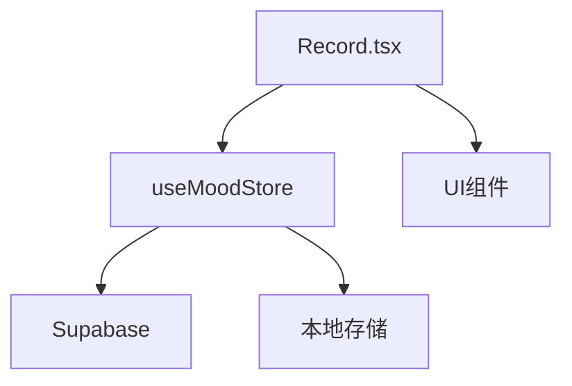
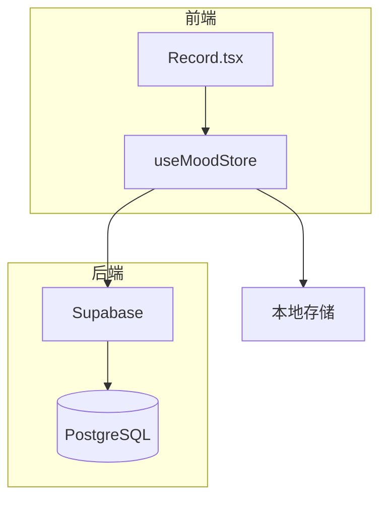
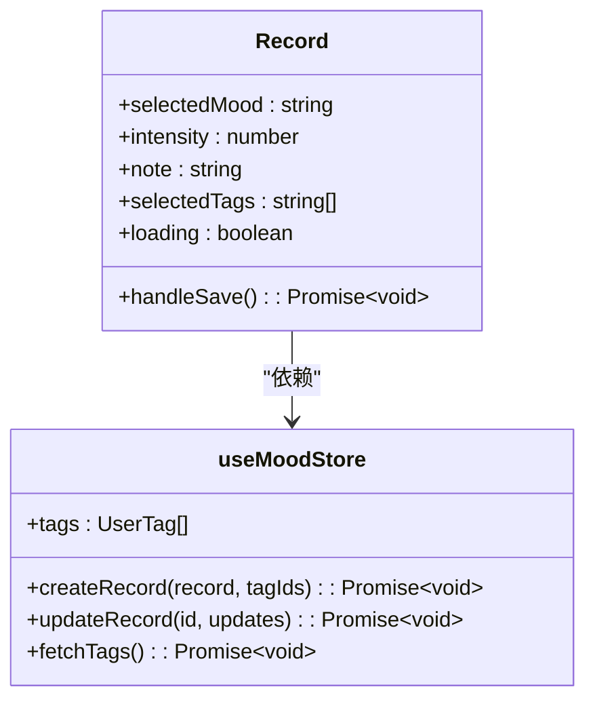
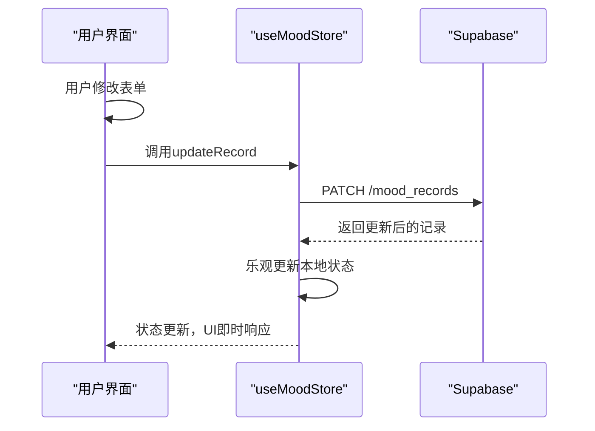
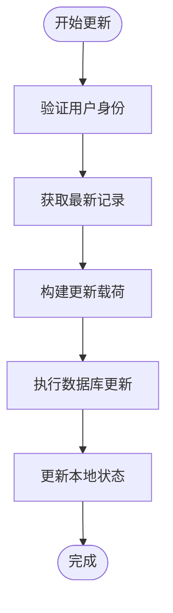
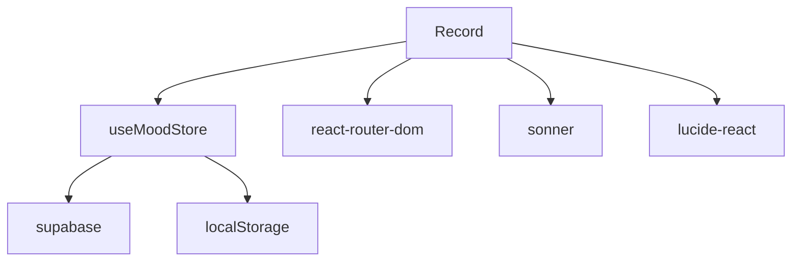

# 心情记录编辑

<cite>
**本文档中引用的文件**  
- [Record.tsx](file://src/pages/Record.tsx)
- [index.ts](file://src/store/index.ts)
- [supabase.ts](file://src/lib/supabase.ts)
</cite>

## 目录
1. [介绍](#介绍)
2. [项目结构](#项目结构)
3. [核心组件](#核心组件)
4. [架构概述](#架构概述)
5. [详细组件分析](#详细组件分析)
6. [依赖分析](#依赖分析)
7. [性能考虑](#性能考虑)
8. [故障排除指南](#故障排除指南)
9. [结论](#结论)

## 介绍
本技术文档深入分析心情记录应用中的编辑功能实现机制。重点阐述`Record.tsx`组件如何通过状态管理接收待编辑记录ID，从`useMoodStore`中获取对应数据进行表单初始化，以及`updateMoodRecord`方法如何执行乐观更新和数据库同步。同时分析数据一致性保障、字段变更检测、权限校验等关键机制。

## 项目结构
该应用采用典型的React + Zustand + Supabase架构，主要目录结构如下：
- `src/pages/Record.tsx`：心情记录编辑界面
- `src/store/index.ts`：全局状态管理，包含心情记录和用户标签逻辑
- `src/lib/supabase.ts`：Supabase客户端配置和数据类型定义

**Diagram sources**
- [Record.tsx](file://src/pages/Record.tsx#L1-L260)
- [index.ts](file://src/store/index.ts#L1-L558)

**Section sources**
- [Record.tsx](file://src/pages/Record.tsx#L1-L260)
- [index.ts](file://src/store/index.ts#L1-L558)

## 核心组件
`Record.tsx`作为心情记录的核心编辑组件，负责表单渲染、用户交互处理和数据提交。通过`useMoodStore`与后端服务进行数据同步，支持本地存储和Supabase数据库双模式。

**Section sources**
- [Record.tsx](file://src/pages/Record.tsx#L1-L260)

## 架构概述
系统采用分层架构设计，前端通过Zustand状态管理器统一管理数据流，通过Supabase与PostgreSQL数据库交互，同时支持本地存储作为离线方案。

**Diagram sources**
- [Record.tsx](file://src/pages/Record.tsx#L1-L260)
- [index.ts](file://src/store/index.ts#L1-L558)

## 详细组件分析

### Record组件分析
`Record.tsx`组件通过React Hooks管理表单状态，并利用`useMoodStore`获取全局状态。组件初始化时通过`fetchTags`加载标签数据。

#### 状态管理

**Diagram sources**
- [Record.tsx](file://src/pages/Record.tsx#L1-L260)
- [index.ts](file://src/store/index.ts#L1-L558)

#### 数据更新流程

**Diagram sources**
- [index.ts](file://src/store/index.ts#L414-L465)
- [Record.tsx](file://src/pages/Record.tsx#L129-L188)

**Section sources**
- [Record.tsx](file://src/pages/Record.tsx#L1-L260)
- [index.ts](file://src/store/index.ts#L1-L558)

### 数据一致性保障
在缺乏版本控制的情况下，系统采用"最后写入胜出"策略确保数据一致性。所有更新操作都基于最新服务器数据进行。

**Diagram sources**
- [index.ts](file://src/store/index.ts#L414-L465)

## 依赖分析
系统主要依赖关系如下：

**Diagram sources**
- [Record.tsx](file://src/pages/Record.tsx#L1-L260)
- [index.ts](file://src/store/index.ts#L1-L558)

**Section sources**
- [Record.tsx](file://src/pages/Record.tsx#L1-L260)
- [index.ts](file://src/store/index.ts#L1-L558)

## 性能考虑
- 采用乐观更新策略，确保UI即时响应
- 字段级变更检测减少不必要的数据库调用
- 标签数据缓存避免重复请求
- 分页加载机制（虽未在当前代码中体现）可扩展支持大量记录

## 故障排除指南
常见问题及解决方案：
- **保存失败**：检查网络连接，确认用户已登录
- **标签不显示**：确保`fetchTags`已正确调用
- **状态不同步**：手动刷新或重新登录
- **权限错误**：确认当前用户为记录所有者

**Section sources**
- [Record.tsx](file://src/pages/Record.tsx#L129-L188)
- [index.ts](file://src/store/index.ts#L414-L465)

## 结论
心情记录编辑功能通过Zustand状态管理实现高效的数据流控制，结合Supabase实现实时数据同步。系统设计考虑了离线支持、用户体验和数据一致性，为用户提供流畅的记录编辑体验。建议未来增加版本控制和冲突解决机制以应对并发编辑场景。