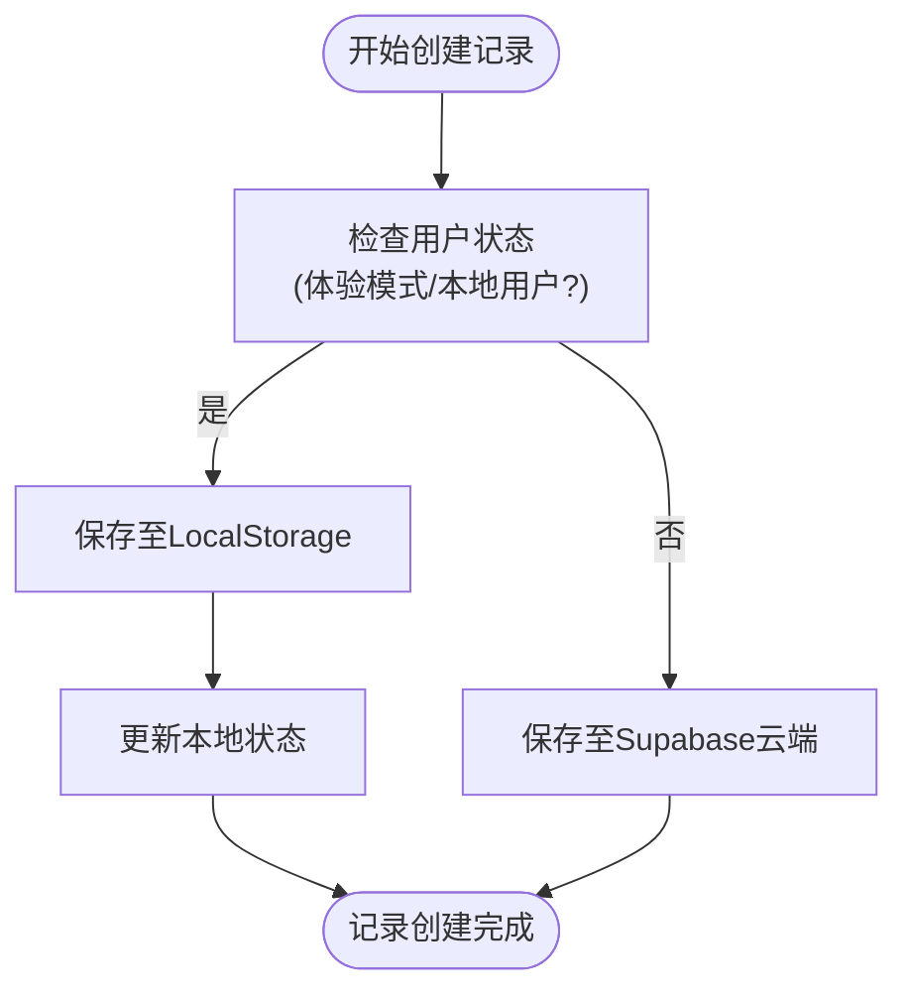
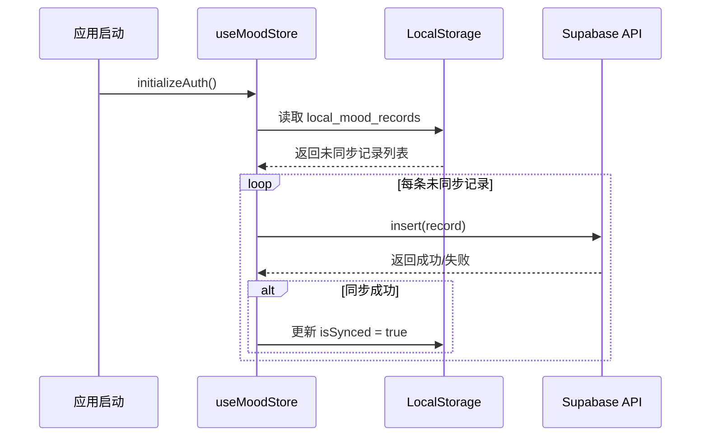
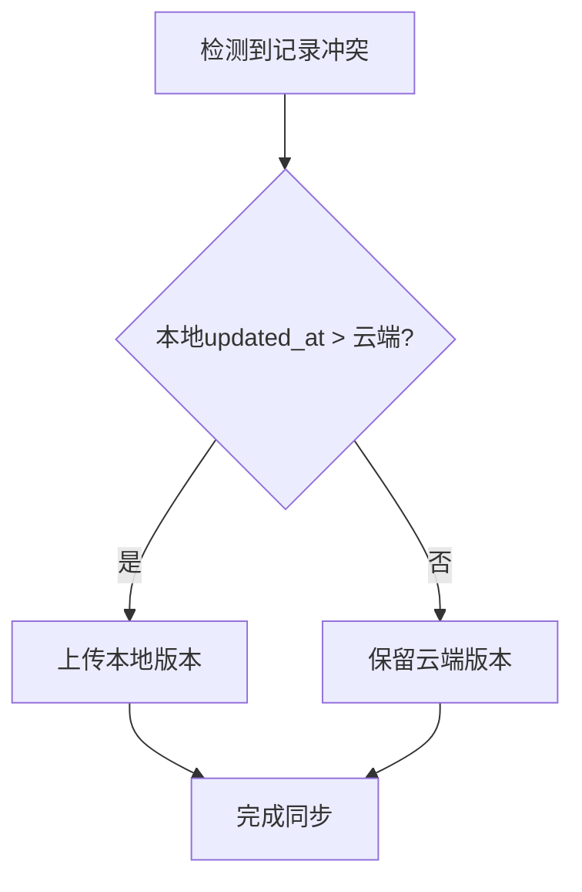
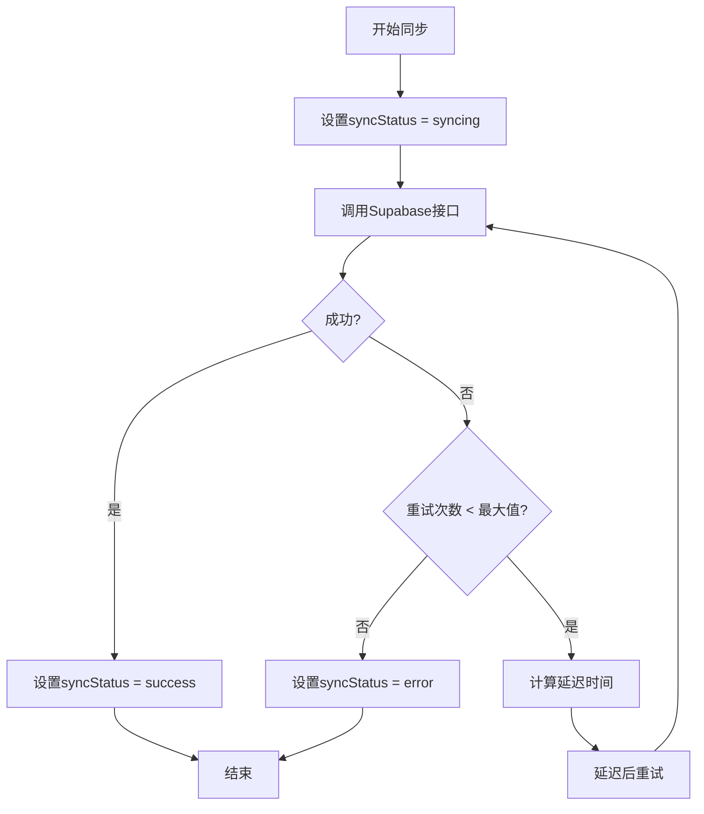

# 离线记录与云端同步

<cite>
**本文档引用文件**  
- [index.ts](file://src/store/index.ts)
- [supabase.ts](file://src/lib/supabase.ts)
</cite>

## 目录
1. [简介](#简介)
2. [本地存储机制](#本地存储机制)
3. [同步状态管理](#同步状态管理)
4. [自动同步逻辑](#自动同步逻辑)
5. [冲突解决策略](#冲突解决策略)
6. [网络状态监听](#网络状态监听)
7. [同步过程中的状态与重试机制](#同步过程中的状态与重试机制)
8. [性能优化建议](#性能优化建议)

## 简介
本系统通过 `useMoodStore` 实现了心情记录的本地缓存与云端同步机制，支持在离线状态下创建或修改心情记录，并在网络恢复后自动同步至 Supabase 云端数据库。该机制利用浏览器的 `LocalStorage` 实现数据持久化，确保用户体验的连续性。

**Section sources**
- [index.ts](file://src/store/index.ts#L1-L557)

## 本地存储机制
系统在用户处于体验模式或为本地用户时，使用浏览器的 `LocalStorage` 作为本地数据存储方案。所有心情记录、标签及标签关联关系均以 JSON 字符串形式存储于 `local_mood_records`、`local_user_tags` 和 `local_record_tags` 键下。

当调用 `createRecord` 方法时，若检测到本地用户或体验模式，系统将生成唯一 ID 并将记录写入 `LocalStorage`，同时更新状态管理中的记录列表。



**Diagram sources**
- [index.ts](file://src/store/index.ts#L320-L360)

## 同步状态管理
尽管当前代码中未显式定义 `isSynced: boolean` 字段，但可通过扩展 `MoodRecord` 类型来实现同步状态标记。建议在本地存储的记录对象中增加 `isSynced` 属性，默认值为 `false`，当成功同步至云端后更新为 `true`。

未来可优化为：
```ts
interface LocalMoodRecord extends MoodRecord {
  isSynced: boolean
}
```

**Section sources**
- [index.ts](file://src/store/index.ts#L320-L360)
- [supabase.ts](file://src/lib/supabase.ts#L10-L20)

## 自动同步逻辑
目前系统尚未实现自动同步未上传记录的功能，但已具备实现基础。可在应用启动或网络恢复时，遍历 `local_mood_records` 中所有记录，筛选出未标记为已同步的条目，逐条调用 Supabase 的 `insert` 接口进行上传。

伪逻辑如下：
1. 读取 `local_mood_records`
2. 过滤 `isSynced === false` 的记录
3. 对每条记录执行 `supabase.from('mood_records').insert()`
4. 成功后更新本地记录的 `isSynced = true`

此逻辑可封装为独立的 `syncPendingRecords` 方法。



**Diagram sources**
- [index.ts](file://src/store/index.ts#L200-L250)

## 冲突解决策略
当前系统在离线期间允许多次修改同一条记录，但由于本地存储直接覆盖写入，存在数据丢失风险。建议引入时间戳优先原则解决冲突：

- 所有记录包含 `created_at` 和 `updated_at` 时间戳
- 当云端与本地版本冲突时，比较 `updated_at` 时间
- 保留时间较新的版本（即“最后写入获胜”策略）

该策略可通过在同步时查询云端记录的最新更新时间并进行比对实现。



**Diagram sources**
- [index.ts](file://src/store/index.ts#L100-L150)

## 网络状态监听
虽然当前代码未集成 Capacitor 的 Network API，但可通过以下方式实现网络状态监听：

1. 使用 `@capacitor/network` 插件监听网络变化
2. 在 `App.tsx` 中注册事件监听器
3. 当网络恢复时触发同步流程

示例监听逻辑：
```ts
Network.addListener('networkStatusChange', (status) => {
  if (status.connected) {
    useMoodStore.getState().syncPendingRecords()
  }
})
```

**Section sources**
- [index.ts](file://src/store/index.ts#L1-L557)

## 同步过程中的状态与重试机制
当前系统在数据操作中已包含基本的错误处理与加载状态管理（`loading: boolean`），但缺乏重试机制。建议引入指数退避重试策略：

- 初始延迟 1 秒
- 每次失败后延迟翻倍（2s, 4s, 8s...）
- 最大重试次数限制（如 5 次）
- 可结合 `setTimeout` 与递归调用实现

同时可在 `useMoodStore` 中增加 `syncStatus` 字段，用于表示同步状态（idle, syncing, error, success）。



**Diagram sources**
- [index.ts](file://src/store/index.ts#L300-L310)

## 性能优化建议
为提升同步性能，建议实施以下优化措施：

### 批量提交
避免逐条提交记录，改为批量插入：
```ts
await supabase.from('mood_records').insert(recordsArray)
```

### 增量同步
仅同步自上次同步以来新增或修改的记录，可通过记录最后同步时间戳实现。

### 数据压缩
对于大量文本内容（如 `note` 字段），可考虑前端压缩后再存储与传输。

### 并行处理
将大批次同步任务分片，并行提交以提高效率。

### 缓存校验
使用 ETag 或 Last-Modified 头部避免重复下载未变更数据。

这些优化可在不影响现有架构的前提下逐步集成。

**Section sources**
- [index.ts](file://src/store/index.ts#L320-L360)