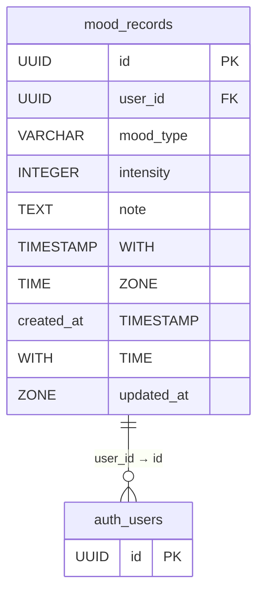
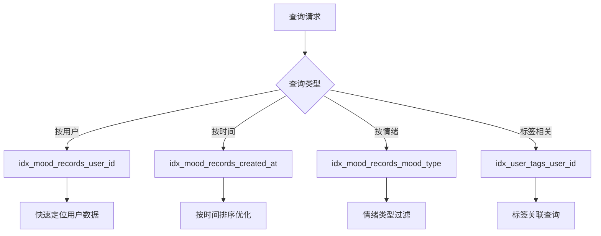
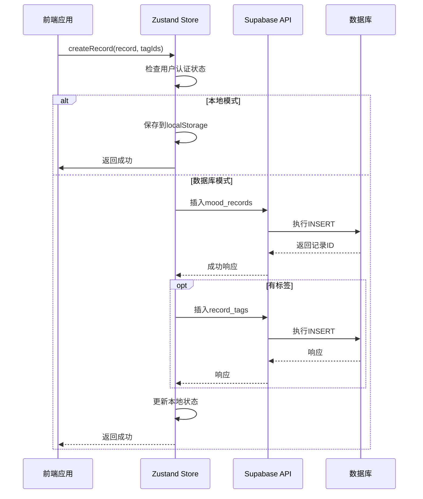

# 心情记录数据模型

<cite>
**本文档引用的文件**
- [create_mood_diary_tables.sql](file://supabase/migrations/create_mood_diary_tables.sql)
- [supabase.ts](file://src/lib/supabase.ts)
- [index.ts](file://src/store/index.ts)
</cite>

## 目录
1. [介绍](#介绍)
2. [心情记录表结构](#心情记录表结构)
3. [标签关联模型](#标签关联模型)
4. [索引与查询优化](#索引与查询优化)
5. [SQL操作示例](#sql操作示例)
6. [前端交互实现](#前端交互实现)
7. [常见问题与解决方案](#常见问题与解决方案)
8. [总结](#总结)

## 介绍
本项目实现了一个完整的心情记录系统，基于Supabase后端服务构建。核心数据模型围绕用户的心情记录展开，支持情绪类型、强度等级、文本备注和标签分类等功能。系统采用PostgreSQL数据库，通过合理的表结构设计和索引策略确保数据完整性和查询性能。本文档详细说明心情记录相关数据表的设计与实现，以及前后端交互逻辑。

**Section sources**
- [create_mood_diary_tables.sql](file://supabase/migrations/create_mood_diary_tables.sql#L0-L110)

## 心情记录表结构
心情记录表（mood_records）是系统的核心数据表，用于存储用户的情绪记录。该表采用UUID作为主键，确保全局唯一性，并通过外键关联到用户表实现数据隔离。

表字段定义如下：
- **id**: UUID类型，主键，自动生成
- **user_id**: UUID类型，外键关联auth.users表，级联删除
- **mood_type**: 字符串类型，限制为8种预定义情绪类型
- **intensity**: 整数类型，表示情绪强度，范围1-5
- **note**: 文本类型，可选的详细记录
- **created_at**: 带时区的时间戳，默认为当前时间
- **updated_at**: 带时区的时间戳，默认为当前时间

该表实现了行级安全（RLS）策略，确保用户只能访问自己的记录。所有操作都必须通过身份验证，且只能对自己创建的记录进行增删改查。



**Diagram sources**
- [create_mood_diary_tables.sql](file://supabase/migrations/create_mood_diary_tables.sql#L7-L20)

**Section sources**
- [create_mood_diary_tables.sql](file://supabase/migrations/create_mood_diary_tables.sql#L7-L34)

## 标签关联模型
系统通过三个表实现灵活的标签分类功能：user_tags、record_tags和mood_records。这种设计支持多对多标签关系，允许用户为每条心情记录添加多个标签。

### 用户标签表（user_tags）
存储用户自定义的标签信息：
- **id**: UUID主键
- **user_id**: 外键关联用户
- **tag_name**: 标签名称，每个用户的标签名称唯一
- **color**: 标签显示颜色
- **created_at**: 创建时间

### 记录标签关联表（record_tags）
作为多对多关系的中间表：
- **record_id**: 外键关联mood_records
- **tag_id**: 外键关联user_tags
- 复合主键（record_id, tag_id）

该表同样启用了RLS策略，确保用户只能管理自己记录的标签关联。权限检查通过EXISTS子查询实现，验证记录的所有者身份。

```mermaid
erDiagram
user_tags {
UUID id PK
UUID user_id FK
VARCHAR tag_name
VARCHAR color
TIMESTAMP WITH TIME ZONE created_at
}
record_tags {
UUID record_id PK, FK
UUID tag_id PK, FK
}
mood_records {
UUID id PK
UUID user_id FK
}
user_tags ||--o{ record_tags : "id → tag_id"
mood_records ||--o{ record_tags : "id → record_id"
user_tags }o--|| auth_users : "user_id → id"
mood_records }o--|| auth_users : "user_id → id"
```

**Diagram sources**
- [create_mood_diary_tables.sql](file://supabase/migrations/create_mood_diary_tables.sql#L45-L60)

**Section sources**
- [create_mood_diary_tables.sql](file://supabase/migrations/create_mood_diary_tables.sql#L31-L74)

## 索引与查询优化
为确保查询性能，系统在关键字段上创建了多个索引：

### 主要索引
- **idx_mood_records_user_id**: 在user_id字段上的B树索引，用于快速定位用户的所有记录
- **idx_mood_records_created_at**: 在created_at字段上的降序索引，优化按时间排序的查询
- **idx_mood_records_mood_type**: 在mood_type字段上的索引，加速按情绪类型过滤
- **idx_user_tags_user_id**: 在user_tags表的user_id字段上的索引

### 索引策略分析
这些索引覆盖了最常见的查询场景：
1. 按用户查询所有记录
2. 按时间范围查询最新记录
3. 按情绪类型统计分布
4. 获取用户的所有标签

复合查询可以通过索引合并或位图扫描高效执行。例如，查询某个用户在过去一周的"happy"记录可以利用user_id和created_at索引的组合。



**Diagram sources**
- [create_mood_diary_tables.sql](file://supabase/migrations/create_mood_diary_tables.sql#L22-L28)

**Section sources**
- [create_mood_diary_tables.sql](file://supabase/migrations/create_mood_diary_tables.sql#L22-L28)

## SQL操作示例
以下是常见数据库操作的SQL示例：

### 插入新记录
```sql
INSERT INTO mood_records (user_id, mood_type, intensity, note) 
VALUES ('user-uuid', 'happy', 4, '今天完成了重要项目');
```

### 按时间范围查询
```sql
SELECT * FROM mood_records 
WHERE user_id = 'user-uuid' 
AND created_at >= NOW() - INTERVAL '7 days'
ORDER BY created_at DESC;
```

### 统计情绪分布
```sql
SELECT mood_type, COUNT(*) as count 
FROM mood_records 
WHERE user_id = 'user-uuid' 
GROUP BY mood_type 
ORDER BY count DESC;
```

### 查询带标签的记录
```sql
SELECT mr.*, ut.tag_name, ut.color 
FROM mood_records mr
LEFT JOIN record_tags rt ON mr.id = rt.record_id
LEFT JOIN user_tags ut ON rt.tag_id = ut.id
WHERE mr.user_id = 'user-uuid'
ORDER BY mr.created_at DESC;
```

### 插入标签关联
```sql
INSERT INTO record_tags (record_id, tag_id) 
VALUES ('record-uuid', 'tag-uuid');
```

**Section sources**
- [create_mood_diary_tables.sql](file://supabase/migrations/create_mood_diary_tables.sql#L7-L74)

## 前端交互实现
前端通过Supabase客户端库与数据库交互，主要逻辑在store中实现。

### 数据类型定义
前端定义了与后端匹配的TypeScript接口，确保类型安全：
- MoodRecord: 对应mood_records表
- UserTag: 对应user_tags表
- RecordTag: 对应record_tags表

### 核心操作流程
1. **创建记录**: 先插入mood_records，成功后插入record_tags关联
2. **读取记录**: 使用嵌套select查询获取记录及其标签信息
3. **更新记录**: 通过update方法修改指定记录
4. **删除记录**: 通过delete方法移除记录

### 关键代码路径
- 记录创建: [index.ts](file://src/store/index.ts#L383-L420)
- 记录读取: [index.ts](file://src/store/index.ts#L254-L295)
- 标签处理: [index.ts](file://src/store/index.ts#L414-L465)

系统还实现了本地存储作为缓存层，优先读取本地数据，然后同步到远程数据库。



**Diagram sources**
- [supabase.ts](file://src/lib/supabase.ts#L0-L46)
- [index.ts](file://src/store/index.ts#L383-L420)

**Section sources**
- [supabase.ts](file://src/lib/supabase.ts#L0-L46)
- [index.ts](file://src/store/index.ts#L383-L465)

## 常见问题与解决方案
### 时区处理
**问题**: 客户端和服务器时区不一致可能导致时间显示错误。

**解决方案**: 
1. 数据库存储使用TIMESTAMP WITH TIME ZONE类型
2. 前端获取用户时区设置（存储在user_profiles.timezone）
3. 显示时根据用户偏好转换时区
4. 使用UTC时间进行跨时区比较

### 数据去重
**问题**: 网络不稳定时可能导致重复提交。

**解决方案**:
1. 使用UUID主键避免ID冲突
2. 在应用层实现防重复提交（按钮禁用）
3. 对于关键操作，使用数据库唯一约束
4. 实现幂等性API设计

### 性能优化
**问题**: 大量记录导致查询变慢。

**解决方案**:
1. 合理使用索引（已实现）
2. 分页查询，避免一次性加载过多数据
3. 实现数据归档策略
4. 使用缓存层减少数据库压力

### 并发更新
**问题**: 多设备同时更新可能导致数据覆盖。

**解决方案**:
1. 使用updated_at字段实现乐观锁
2. 前端在更新时携带最新版本号
3. 服务器检查版本一致性，冲突时返回错误

**Section sources**
- [create_mood_diary_tables.sql](file://supabase/migrations/create_mood_diary_tables.sql#L7-L110)
- [index.ts](file://src/store/index.ts#L383-L465)

## 总结
心情记录数据模型通过精心设计的表结构和索引策略，实现了高效、安全的数据管理。mood_records表作为核心，结合user_tags和record_tags表提供了灵活的标签分类功能。系统通过RLS策略确保数据隔离，每个用户只能访问自己的数据。前端通过Supabase客户端库与后端无缝集成，实现了完整的CRUD操作。针对时区处理、数据去重等常见问题，系统提供了相应的解决方案，确保用户体验和数据一致性。