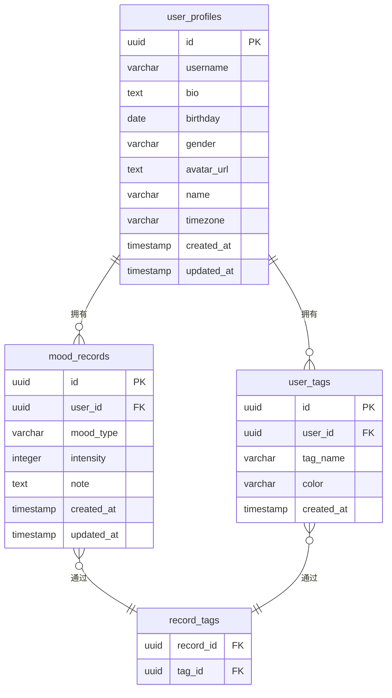

# 数据库设计与迁移

<cite>
**本文档引用的文件**  
- [create_mood_diary_tables.sql](file://supabase/migrations/create_mood_diary_tables.sql)
- [create_user_profiles.sql](file://supabase/migrations/create_user_profiles.sql)
- [add_profile_fields.sql](file://supabase/migrations/add_profile_fields.sql)
- [fix_user_profiles_rls.sql](file://supabase/migrations/fix_user_profiles_rls.sql)
</cite>

## 目录
1. [项目结构](#项目结构)
2. [核心表结构设计](#核心表结构设计)
3. [用户资料表扩展](#用户资料表扩展)
4. [行级安全（RLS）策略解析](#行级安全rls策略解析)
5. [实体关系图（ER图）](#实体关系图er图)
6. [数据库迁移机制](#数据库迁移机制)
7. [开发指导建议](#开发指导建议)

## 项目结构

本项目采用Supabase作为后端数据库服务，数据库迁移脚本集中存放在 `supabase/migrations/` 目录下。该目录包含多个SQL脚本，按执行顺序命名，用于逐步构建和演进数据库模式。

**Section sources**
- [create_mood_diary_tables.sql](file://supabase/migrations/create_mood_diary_tables.sql#L1-L110)
- [create_user_profiles.sql](file://supabase/migrations/create_user_profiles.sql#L1-L45)
- [add_profile_fields.sql](file://supabase/migrations/add_profile_fields.sql#L1-L10)
- [fix_user_profiles_rls.sql](file://supabase/migrations/fix_user_profiles_rls.sql#L1-L35)

## 核心表结构设计

### mood_records 表（心情记录）

该表用于存储用户的心情记录，是应用的核心数据表。

- **id**: UUID类型，主键，自动生成。
- **user_id**: UUID类型，外键，引用 `auth.users(id)`，级联删除，标识记录所属用户。
- **mood_type**: 字符串类型，限制为预定义的8种情绪值（如 'happy', 'sad' 等）。
- **intensity**: 整数类型，表示情绪强度，取值范围为1-5。
- **note**: 文本类型，用于存储用户的心情笔记。
- **created_at**: 带时区的时间戳，记录创建时间，默认为当前时间。
- **updated_at**: 带时区的时间戳，记录最后更新时间，默认为当前时间。

**索引策略**：
- `idx_mood_records_user_id`：在 `user_id` 上创建索引，加速按用户查询。
- `idx_mood_records_created_at`：在 `created_at` 上创建降序索引，优化按时间排序的查询。
- `idx_mood_records_mood_type`：在 `mood_type` 上创建索引，加速按情绪类型筛选。

**Section sources**
- [create_mood_diary_tables.sql](file://supabase/migrations/create_mood_diary_tables.sql#L3-L20)

### user_tags 表（用户标签）

该表用于存储用户自定义的标签，支持个性化分类。

- **id**: UUID类型，主键，自动生成。
- **user_id**: UUID类型，外键，引用 `auth.users(id)`，级联删除，标识标签所属用户。
- **tag_name**: 字符串类型，标签名称，不允许重复（与 `user_id` 组合唯一）。
- **color**: 字符串类型，标签颜色，7位十六进制颜色码，默认为 '#FF6B35'。
- **created_at**: 带时区的时间戳，记录创建时间，默认为当前时间。

**索引策略**：
- `idx_user_tags_user_id`：在 `user_id` 上创建索引，加速按用户查询标签。

**Section sources**
- [create_mood_diary_tables.sql](file://supabase/migrations/create_mood_diary_tables.sql#L36-L45)

### record_tags 表（记录-标签关联）

该表是多对多关系的关联表，连接 `mood_records` 和 `user_tags`。

- **record_id**: UUID类型，外键，引用 `mood_records(id)`，级联删除。
- **tag_id**: UUID类型，外键，引用 `user_tags(id)`，级联删除。
- **PRIMARY KEY (record_id, tag_id)**：复合主键，确保每条记录与每个标签的关联唯一。

**Section sources**
- [create_mood_diary_tables.sql](file://supabase/migrations/create_mood_diary_tables.sql#L59-L65)

## 用户资料表扩展

### user_profiles 表构建

`user_profiles` 表的构建分为两个阶段：

1.  **初始创建** (`create_user_profiles.sql`)：
    - 通过 `id` 字段与 `auth.users` 表建立一对一关系。
    - 包含 `username`、`avatar_url` 等基础字段。
    - 创建触发器 `create_user_profile_trigger`，当新用户在 `auth.users` 表中注册时，自动为其创建资料记录。

2.  **字段扩展** (`add_profile_fields.sql`)：
    - 使用 `ALTER TABLE` 语句为 `user_profiles` 表添加了三个新字段：
        - `bio` (TEXT): 个人简介。
        - `birthday` (DATE): 生日。
        - `gender` (VARCHAR): 性别，通过 `CHECK` 约束限制为 'male', 'female', 'other' 或空字符串。

**Section sources**
- [create_user_profiles.sql](file://supabase/migrations/create_user_profiles.sql#L1-L10)
- [add_profile_fields.sql](file://supabase/migrations/add_profile_fields.sql#L1-L9)

## 行级安全（RLS）策略解析

RLS（Row Level Security）是Supabase实现数据隔离的核心机制。以下策略确保了“用户只能访问自己的数据”这一业务规则。

### mood_records 表RLS策略

- **SELECT策略**：用户只能查看 `user_id` 等于自己ID的记录。
- **INSERT策略**：用户只能创建 `user_id` 等于自己ID的记录。
- **UPDATE/DELETE策略**：用户只能更新或删除 `user_id` 等于自己ID的记录。

### user_tags 表RLS策略

- **ALL策略**：一个统一的策略覆盖所有操作（SELECT, INSERT, UPDATE, DELETE），要求 `user_id` 必须等于当前用户ID。

### record_tags 表RLS策略

- **ALL策略**：策略更为复杂，使用 `EXISTS` 子查询。用户只能管理那些关联的 `mood_records` 记录的 `user_id` 等于自己ID的标签。这确保了用户不能通过操作关联表来越权访问他人的记录。

### user_profiles 表RLS策略修复

`fix_user_profiles_rls.sql` 脚本用于修复和确保 `user_profiles` 表的RLS策略正确无误：
- 它首先删除可能存在的旧策略。
- 然后重新创建三个核心策略：用户只能查看、更新和插入自己的资料（通过 `auth.uid() = id` 判断）。
- 最后，它重新启用RLS并确认 `anon` 和 `authenticated` 角色的权限设置正确。

这些策略共同构成了一个安全的数据访问边界。

**Section sources**
- [create_mood_diary_tables.sql](file://supabase/migrations/create_mood_diary_tables.sql#L23-L34)
- [create_mood_diary_tables.sql](file://supabase/migrations/create_mood_diary_tables.sql#L48-L52)
- [create_mood_diary_tables.sql](file://supabase/migrations/create_mood_diary_tables.sql#L68-L74)
- [create_user_profiles.sql](file://supabase/migrations/create_user_profiles.sql#L14-L22)
- [fix_user_profiles_rls.sql](file://supabase/migrations/fix_user_profiles_rls.sql#L5-L27)

## 实体关系图（ER图）

**Diagram sources**
- [create_user_profiles.sql](file://supabase/migrations/create_user_profiles.sql#L1-L10)
- [create_mood_diary_tables.sql](file://supabase/migrations/create_mood_diary_tables.sql#L3-L20)
- [create_mood_diary_tables.sql](file://supabase/migrations/create_mood_diary_tables.sql#L36-L45)
- [create_mood_diary_tables.sql](file://supabase/migrations/create_mood_diary_tables.sql#L59-L65)

## 数据库迁移机制

项目的数据库模式通过一系列版本化的SQL迁移脚本进行管理：
- **版本控制**：每个迁移脚本都有一个唯一的名称（通常包含时间戳），确保按顺序执行。
- **执行顺序**：脚本按文件名的字典顺序执行。例如，`create_user_profiles.sql` 必须在 `add_profile_fields.sql` 之前执行，因为后者依赖于前者的表结构。
- **幂等性**：脚本中使用了 `IF NOT EXISTS` 和 `IF EXISTS` 等条件语句（如 `ADD COLUMN IF NOT EXISTS`, `DROP TRIGGER IF EXISTS`），确保脚本可以安全地重复执行，避免因环境差异导致的错误。
- **自动化**：当项目部署时，Supabase会自动检测并按顺序应用所有新的迁移脚本，将数据库模式更新到最新状态。

**Section sources**
- [create_user_profiles.sql](file://supabase/migrations/create_user_profiles.sql#L1-L45)
- [add_profile_fields.sql](file://supabase/migrations/add_profile_fields.sql#L1-L10)
- [create_mood_diary_tables.sql](file://supabase/migrations/create_mood_diary_tables.sql#L1-L110)

## 开发指导建议

### 新增数据库表
1.  在 `supabase/migrations/` 目录下创建一个新的SQL文件，命名格式为 `YYYYMMDDHHMMSS_create_new_table.sql`。
2.  在文件中编写 `CREATE TABLE` 语句，并定义好字段、主键、外键和约束。
3.  **务必**为新表启用RLS (`ALTER TABLE table_name ENABLE ROW LEVEL SECURITY;`) 并创建相应的安全策略。
4.  为关键字段创建索引以优化查询性能。
5.  使用 `GRANT` 语句为 `anon` 和 `authenticated` 角色分配适当的权限。

### 修改现有字段
1.  创建新的迁移脚本，如 `YYYYMMDDHHMMSS_alter_table_add_column.sql`。
2.  使用 `ALTER TABLE ... ADD COLUMN` 或 `ALTER TABLE ... ALTER COLUMN` 语句进行修改。
3.  如果修改涉及数据类型或约束，需考虑数据迁移和兼容性。

### 编写自定义SQL函数
1.  可以在迁移脚本中使用 `CREATE OR REPLACE FUNCTION` 来定义函数，例如 `create_default_tags()`。
2.  函数可用于实现复杂的业务逻辑或自动化任务（如为新用户创建默认数据）。
3.  可以通过 `CREATE TRIGGER` 将函数与特定的数据库事件（如INSERT）关联起来，实现自动化。

**Section sources**
- [create_mood_diary_tables.sql](file://supabase/migrations/create_mood_diary_tables.sql#L76-L109)
- [create_user_profiles.sql](file://supabase/migrations/create_user_profiles.sql#L25-L44)