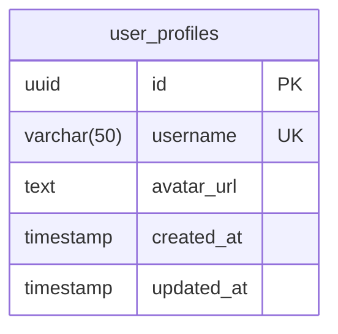
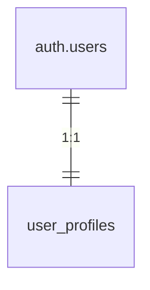
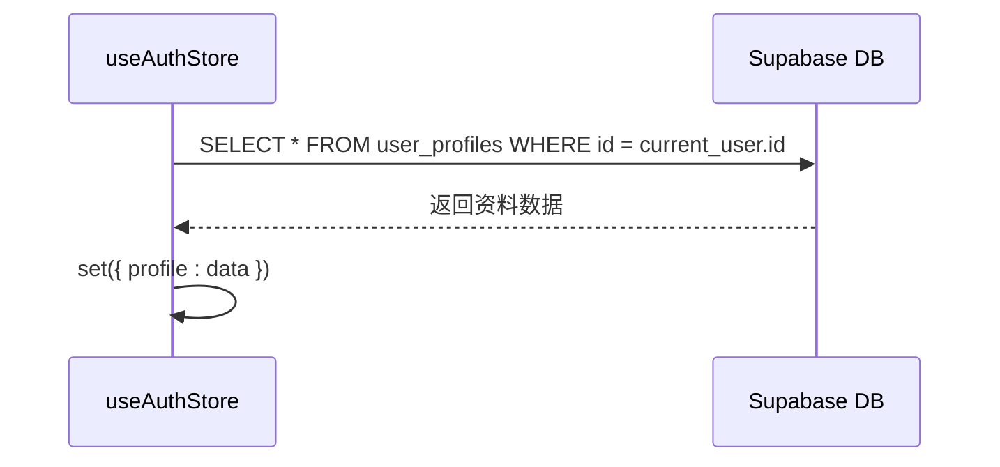

# 用户资料数据模型

<cite>
**本文档引用的文件**  
- [create_user_profiles.sql](file://supabase/migrations/create_user_profiles.sql)
- [add_profile_fields.sql](file://supabase/migrations/add_profile_fields.sql)
- [index.ts](file://src/store/index.ts)
- [supabase.ts](file://src/lib/supabase.ts)
- [EditProfileModal.tsx](file://src/components/EditProfileModal.tsx)
</cite>

## 目录
1. [简介](#简介)
2. [用户资料表结构设计](#用户资料表结构设计)
3. [表结构的演进过程](#表结构的演进过程)
4. [外键关系与数据同步机制](#外键关系与数据同步机制)
5. [字段类型与约束条件](#字段类型与约束条件)
6. [前端状态管理与用户资料交互](#前端状态管理与用户资料交互)
7. [数据库默认值与触发器建议](#数据库默认值与触发器建议)
8. [资料更新失败原因与调试方法](#资料更新失败原因与调试方法)
9. [总结](#总结)

## 简介
本文档详细阐述 `user_profiles` 表的设计理念、演进路径及其与前端应用的集成方式。该表用于存储用户个性化信息，通过 Supabase 的身份验证系统与 `auth.users` 表建立关联，实现自动同步与安全访问控制。文档涵盖从初始建表到字段扩展的全过程，并结合前端状态管理机制说明资料读取与更新流程。

## 用户资料表结构设计

`user_profiles` 表是用户个性化数据的核心存储结构，其设计遵循最小化初始字段、逐步扩展的原则。初始版本由 `create_user_profiles.sql` 脚本创建，包含基础字段以支持快速注册和基本展示。



**Diagram sources**  
- [create_user_profiles.sql](file://supabase/migrations/create_user_profiles.sql#L1-L44)

**Section sources**  
- [create_user_profiles.sql](file://supabase/migrations/create_user_profiles.sql#L1-L44)

## 表结构的演进过程

随着产品功能迭代，用户资料需要支持更多属性。`add_profile_fields.sql` 迁移脚本实现了非破坏性字段扩展，确保现有数据不受影响。

```sql
-- 为user_profiles表添加新字段
ALTER TABLE user_profiles 
ADD COLUMN IF NOT EXISTS bio TEXT,
ADD COLUMN IF NOT EXISTS birthday DATE,
ADD COLUMN IF NOT EXISTS gender VARCHAR(10) CHECK (gender IN ('male', 'female', 'other', ''));
```

此设计体现了渐进式演进策略：
- 使用 `IF NOT EXISTS` 防止重复执行
- 新增字段允许 `NULL` 值，避免阻塞历史数据
- `CHECK` 约束确保 `gender` 字段取值合法

**Section sources**  
- [add_profile_fields.sql](file://supabase/migrations/add_profile_fields.sql#L1-L10)

## 外键关系与数据同步机制

`user_profiles` 表通过 `id` 字段与 `auth.users` 建立一对一外键关系，确保每个用户仅有一份资料记录。



**Diagram sources**  
- [create_user_profiles.sql](file://supabase/migrations/create_user_profiles.sql#L2)

数据同步通过数据库触发器自动完成：
1. 当新用户在 `auth.users` 表中创建时
2. 触发 `create_user_profile` 函数
3. 自动插入对应 `id` 的资料记录

该机制保证了资料表与用户表的一致性，无需前端干预。

**Section sources**  
- [create_user_profiles.sql](file://supabase/migrations/create_user_profiles.sql#L35-L44)

## 字段类型与约束条件

各字段的数据类型和约束设计兼顾功能性与性能：

| 字段名 | 类型 | 约束 | 说明 |
|-------|------|------|------|
| `id` | UUID | PRIMARY KEY, FOREIGN KEY | 引用 `auth.users.id`，级联删除 |
| `username` | VARCHAR(50) | UNIQUE | 用户唯一标识，用于展示 |
| `avatar_url` | TEXT | - | 头像图片URL，不限长度 |
| `bio` | TEXT | - | 个人简介，支持长文本 |
| `birthday` | DATE | - | 生日日期，无时区 |
| `gender` | VARCHAR(10) | CHECK | 枚举值限制，增强数据一致性 |

索引 `idx_user_profiles_username` 提升用户名查询效率。

**Section sources**  
- [create_user_profiles.sql](file://supabase/migrations/create_user_profiles.sql#L1-L44)
- [add_profile_fields.sql](file://supabase/migrations/add_profile_fields.sql#L1-L10)

## 前端状态管理与用户资料交互

前端使用 Zustand 管理用户状态，`useAuthStore` 提供统一接口处理资料操作。

### 资料读取流程


**Diagram sources**  
- [index.ts](file://src/store/index.ts#L133-L139)

### 资料更新流程
```mermaid
flowchart TD
A[用户修改资料] --> B[调用 updateProfile(updates)]
B --> C{isLocalUser?}
C --> |是| D[更新 localStorage]
C --> |否| E[执行 Supabase UPDATE]
E --> F[eq('id', user.id)]
F --> G[更新状态]
G --> H[set({ profile: data })]
```

**Diagram sources**  
- [index.ts](file://src/store/index.ts#L141-L183)
- [EditProfileModal.tsx](file://src/components/EditProfileModal.tsx#L0-L40)

`EditProfileModal` 组件绑定表单字段与 `UserProfile` 接口，实现双向数据绑定。

**Section sources**  
- [index.ts](file://src/store/index.ts#L133-L183)
- [supabase.ts](file://src/lib/supabase.ts#L35-L47)
- [EditProfileModal.tsx](file://src/components/EditProfileModal.tsx#L0-L40)

## 数据库默认值与触发器建议

当前已实现的数据库机制：
- `created_at` 和 `updated_at` 默认为 `NOW()`
- 插入时自动创建资料记录的触发器

**优化建议：**
1. 添加 `updated_at` 自动更新触发器：
```sql
CREATE OR REPLACE FUNCTION update_updated_at_column()
RETURNS TRIGGER AS $$
BEGIN
   NEW.updated_at = NOW();
   RETURN NEW;
END;
$$ language 'plpgsql';

CREATE TRIGGER update_user_profiles_updated_at 
    BEFORE UPDATE ON user_profiles 
    FOR EACH ROW 
    EXECUTE FUNCTION update_updated_at_column();
```
2. 为 `username` 设置默认值（如邮箱前缀）
3. 在 `bio` 字段添加长度检查约束（如 `CHECK(length(bio) <= 500)`）

## 资料更新失败原因与调试方法

### 常见失败原因
1. **权限不足**：未通过 RLS 策略验证（非本人操作）
2. **唯一性冲突**：`username` 已被其他用户使用
3. **数据类型错误**：如 `birthday` 格式不正确
4. **字段长度超限**：`username` 超过 50 字符
5. **网络问题**：Supabase 连接失败

### 调试方法
1. 检查浏览器控制台错误日志：
```ts
console.error('Update profile error:', error)
```
2. 验证 RLS 策略是否生效：
```sql
SELECT * FROM user_profiles WHERE id = auth.uid();
```
3. 测试用户名唯一性检查逻辑：
```ts
const checkUsernameUnique = async (username: string) => { ... }
```
4. 使用 Supabase Dashboard 直接执行 SQL 验证更新语句

**Section sources**  
- [index.ts](file://src/store/index.ts#L141-L183)
- [EditProfileModal.tsx](file://src/components/EditProfileModal.tsx#L38-L88)

## 总结
`user_profiles` 表的设计体现了从简到繁、安全可控的数据库演进思路。通过外键关联、触发器同步和 RLS 安全策略，确保了数据一致性与访问安全。前端通过 Zustand 统一管理状态，实现了本地存储与远程数据库的无缝集成。未来可进一步完善字段约束和自动化机制，提升系统健壮性。