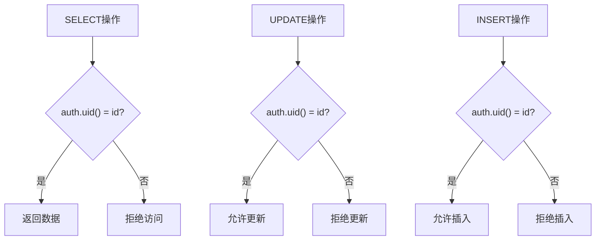
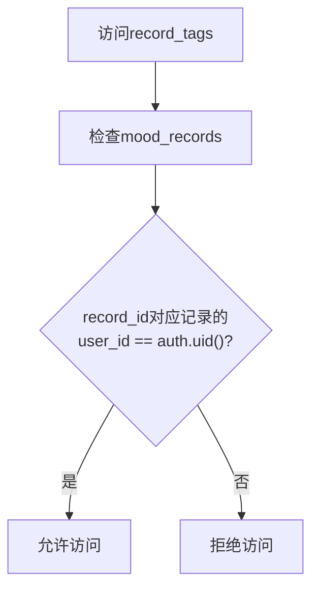
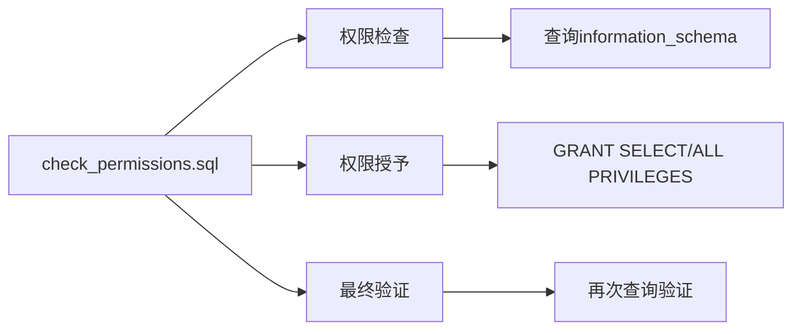
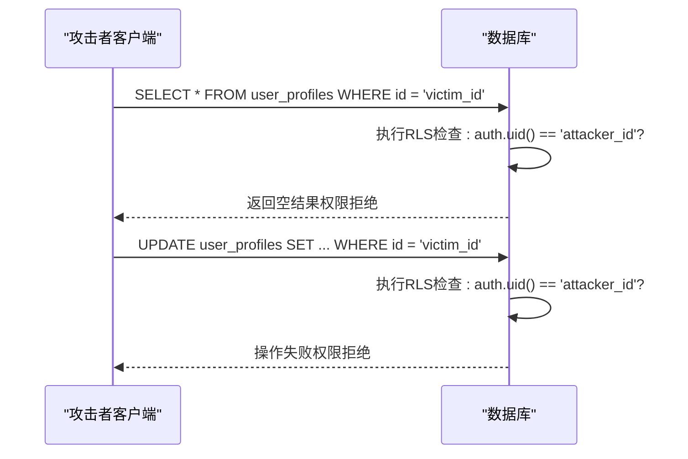
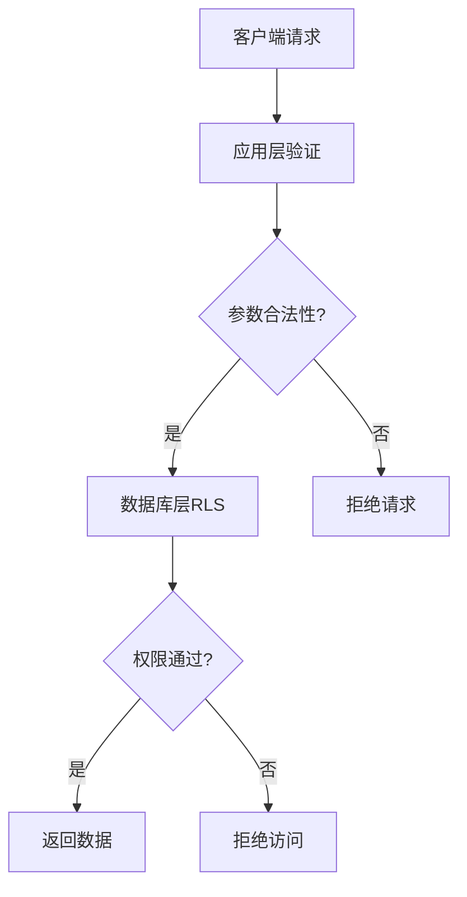

# 行级安全策略（RLS）

<cite>
**本文档引用的文件**  
- [fix_user_profiles_rls.sql](file://supabase/migrations/fix_user_profiles_rls.sql)
- [fix_record_tags_permissions.sql](file://supabase/migrations/fix_record_tags_permissions.sql)
- [check_permissions.sql](file://supabase/migrations/check_permissions.sql)
- [create_user_profiles.sql](file://supabase/migrations/create_user_profiles.sql)
- [fix_registration_rls.sql](file://supabase/migrations/fix_registration_rls.sql)
</cite>

## 目录
1. [引言](#引言)
2. [核心安全机制分析](#核心安全机制分析)
3. [用户资料表RLS策略实现](#用户资料表rls策略实现)
4. [关联表权限保护机制](#关联表权限保护机制)
5. [权限验证与检查机制](#权限验证与检查机制)
6. [RLS启用与策略编写标准流程](#rls启用与策略编写标准流程)
7. [实际攻击场景防御分析](#实际攻击场景防御分析)
8. [策略调试技巧](#策略调试技巧)
9. [RLS与应用层权限协同](#rls与应用层权限协同)
10. [结论](#结论)

## 引言
行级安全（Row Level Security, RLS）是Supabase提供的一种数据库级安全机制，用于确保用户只能访问其被授权的数据行。本文深入解析funnyrecord项目中RLS的实现机制，重点分析用户资料、心情记录及标签等核心数据表的安全策略设计，阐述如何通过精细化的策略控制实现纵深防御。

## 核心安全机制分析

### RLS工作原理
Supabase的RLS基于PostgreSQL的行级安全策略，通过在数据库层面定义策略（POLICY），自动对每个查询和修改操作进行权限检查。当客户端发起请求时，数据库会根据当前用户身份（`auth.uid()`）自动过滤数据，无需在应用层手动添加WHERE条件。

### 安全架构设计
本项目采用分层安全架构：
- **数据库层**：通过RLS策略强制执行数据访问控制
- **应用层**：使用Supabase客户端库进行身份验证和API调用
- **角色系统**：利用`anon`（匿名）和`authenticated`（认证）角色区分访问权限

**Section sources**
- [create_user_profiles.sql](file://supabase/migrations/create_user_profiles.sql#L1-L44)
- [fix_registration_rls.sql](file://supabase/migrations/fix_registration_rls.sql#L0-L141)

## 用户资料表RLS策略实现

### 策略修复与强化
`fix_user_profiles_rls.sql`文件中的策略确保用户只能访问自己的资料记录：

**Diagram sources**
- [fix_user_profiles_rls.sql](file://supabase/migrations/fix_user_profiles_rls.sql#L10-L28)

### 策略实现细节
- **SELECT策略**：使用`USING (auth.uid() = id)`确保用户只能查询自己的资料
- **UPDATE策略**：同样基于`auth.uid() = id`进行更新权限控制
- **INSERT策略**：使用`WITH CHECK (auth.uid() = id)`确保用户只能插入属于自己的资料
- **RLS启用**：通过`ALTER TABLE user_profiles ENABLE ROW LEVEL SECURITY`显式启用

### 注册流程特殊处理
`fix_registration_rls.sql`中包含注册流程的特殊策略：
- 临时允许`anon`角色插入用户资料
- 使用`WITH CHECK (true)`允许匿名用户在注册时创建资料
- 注册完成后立即切换回严格策略

**Section sources**
- [fix_user_profiles_rls.sql](file://supabase/migrations/fix_user_profiles_rls.sql#L1-L34)
- [fix_registration_rls.sql](file://supabase/migrations/fix_registration_rls.sql#L0-L37)

## 关联表权限保护机制

### record_tags表权限控制
`fix_record_tags_permissions.sql`不仅授予权限，更重要的是在`fix_registration_rls.sql`中定义了严格的RLS策略：

**Diagram sources**
- [fix_registration_rls.sql](file://supabase/migrations/fix_registration_rls.sql#L99-L141)

### 深层关联验证
通过`EXISTS`子查询实现跨表权限验证：
- 插入标签时：检查目标记录是否属于当前用户
- 删除标签时：同样验证记录归属
- 查询标签时：仅返回属于用户记录的标签

这种设计有效防止了通过直接操作`record_tags`表进行的越权访问。

**Section sources**
- [fix_record_tags_permissions.sql](file://supabase/migrations/fix_record_tags_permissions.sql#L1-L10)
- [fix_registration_rls.sql](file://supabase/migrations/fix_registration_rls.sql#L99-L141)

## 权限验证与检查机制

### check_permissions.sql的作用
该脚本提供全面的权限审计功能：

**Diagram sources**
- [check_permissions.sql](file://supabase/migrations/check_permissions.sql#L1-L24)

### 权限审计流程
1. **初始检查**：查询所有表的权限分配情况
2. **权限修正**：为`anon`和`authenticated`角色授予适当的权限
3. **最终验证**：再次检查权限设置，确保一致性

该脚本作为部署后验证工具，确保整个数据库的权限配置符合安全要求。

**Section sources**
- [check_permissions.sql](file://supabase/migrations/check_permissions.sql#L1-L24)

## RLS启用与策略编写标准流程

### 标准化实施步骤
1. **创建表结构**
2. **启用RLS**：`ALTER TABLE table_name ENABLE ROW LEVEL SECURITY`
3. **定义策略**：
   - SELECT：使用`USING`子句
   - INSERT/UPDATE：使用`WITH CHECK`子句
   - DELETE：使用`USING`子句
4. **授予权限**：`GRANT`语句分配角色权限
5. **验证配置**：使用信息模式查询验证

### 最佳实践
- **策略命名**：使用中文描述性名称，提高可读性
- **权限最小化**：遵循最小权限原则
- **分阶段部署**：先宽松后严格，避免阻塞注册流程
- **自动化验证**：使用检查脚本确保配置一致性

## 实际攻击场景防御分析

### ID篡改攻击防御
假设攻击者尝试通过修改请求中的用户ID进行越权访问：

**Diagram sources**
- [fix_user_profiles_rls.sql](file://supabase/migrations/fix_user_profiles_rls.sql#L15-L28)

### 防御机制解析
即使攻击者知道其他用户的ID，RLS策略中的`auth.uid() = id`条件会自动过滤掉不属于当前用户的数据，从根本上防止了ID篡改导致的越权访问。

## 策略调试技巧

### 使用supabase.auth.admin API测试
1. **模拟用户身份**：通过管理API临时切换用户上下文
2. **直接数据库查询**：在Supabase控制台以不同角色执行查询
3. **策略临时禁用**：`ALTER TABLE table_name DISABLE ROW LEVEL SECURITY`（仅限调试）
4. **日志分析**：查看策略拒绝的详细日志

### 调试建议
- 在开发环境中保留`check_permissions.sql`的输出结果
- 使用`pg_policies`系统表检查所有策略配置
- 通过`information_schema.role_table_grants`验证权限分配

**Section sources**
- [check_permissions.sql](file://supabase/migrations/check_permissions.sql#L1-L24)
- [fix_registration_rls.sql](file://supabase/migrations/fix_registration_rls.sql#L100-L141)

## RLS与应用层权限协同

### 纵深防御策略
RLS不应作为唯一的防护手段，而应与应用层权限校验形成互补：

**Diagram sources**
- [fix_user_profiles_rls.sql](file://supabase/migrations/fix_user_profiles_rls.sql#L1-L34)
- [fix_record_tags_permissions.sql](file://supabase/migrations/fix_record_tags_permissions.sql#L1-L10)

### 协同优势
- **应用层**：提供快速失败和友好错误提示
- **数据库层**：提供最终的安全保障，防止绕过
- **双重保护**：即使应用层出现漏洞，数据库层仍能阻止越权访问

## 结论
Supabase的行级安全策略为funnyrecord项目提供了强大的数据访问控制能力。通过精心设计的RLS策略，项目实现了用户数据的严格隔离，有效防御了各类越权访问攻击。建议在实际开发中遵循标准化的RLS实施流程，结合应用层权限校验，构建纵深防御体系，确保用户数据的安全性和隐私性。