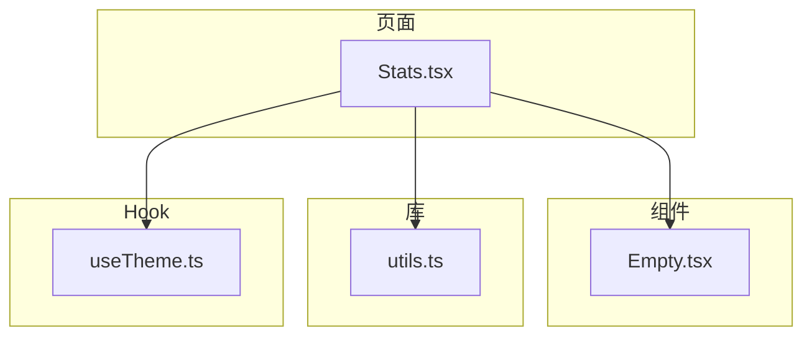
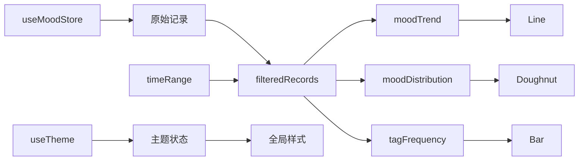
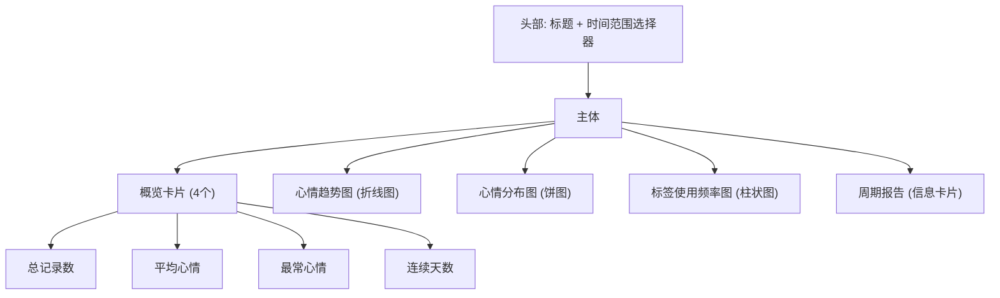
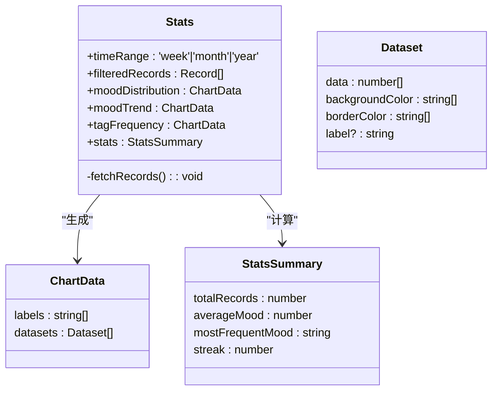
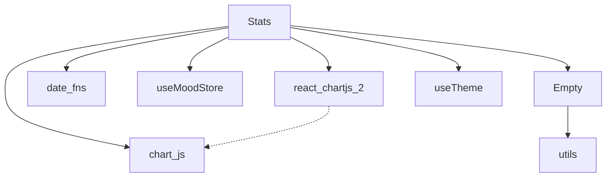

# 可视化图表渲染

<cite>
**本文档引用文件**  
- [Stats.tsx](file://src/pages/Stats.tsx)
- [Empty.tsx](file://src/components/Empty.tsx)
- [utils.ts](file://src/lib/utils.ts)
- [useTheme.ts](file://src/hooks/useTheme.ts)
</cite>

## 目录
1. [项目结构](#项目结构)
2. [核心组件](#核心组件)
3. [架构概览](#架构概览)
4. [详细组件分析](#详细组件分析)
5. [依赖分析](#依赖分析)
6. [性能考虑](#性能考虑)
7. [故障排除指南](#故障排除指南)
8. [结论](#结论)

## 项目结构

该项目采用典型的React前端架构，主要功能集中在`src`目录下。可视化图表功能由`Stats.tsx`页面组件实现，该组件依赖于`react-chartjs-2`库来渲染多种图表类型。UI组件位于`components`目录，工具函数在`lib`目录，状态管理使用Zustand存储在`store`目录，而自定义Hook则存放在`hooks`目录。

**图表来源**  
- [Stats.tsx](file://src/pages/Stats.tsx)
- [Empty.tsx](file://src/components/Empty.tsx)
- [utils.ts](file://src/lib/utils.ts)
- [useTheme.ts](file://src/hooks/useTheme.ts)

**章节来源**  
- [Stats.tsx](file://src/pages/Stats.tsx)
- [components](file://src/components)
- [lib](file://src/lib)
- [hooks](file://src/hooks)

## 核心组件

`Stats.tsx`是实现可视化图表渲染的核心组件，它集成了`react-chartjs-2`库来展示心情数据。该组件通过`useMoodStore`从全局状态获取心情记录，并根据用户选择的时间范围（周、月、年）对数据进行过滤和统计。组件内部使用`useMemo`优化计算，生成用于折线图、饼图和柱状图的数据集。`Empty.tsx`组件用于在无数据时显示占位内容。`utils.ts`提供了`cn`函数用于合并Tailwind CSS类名，支持动态样式。`useTheme` Hook则管理应用的主题模式（浅色、深色、跟随系统），其状态可能间接影响图表的视觉呈现。

**章节来源**  
- [Stats.tsx](file://src/pages/Stats.tsx#L1-L386)
- [Empty.tsx](file://src/components/Empty.tsx#L1-L8)
- [utils.ts](file://src/lib/utils.ts#L1-L7)
- [useTheme.ts](file://src/hooks/useTheme.ts#L1-L111)

## 架构概览

整个可视化系统以`Stats`页面为中心，通过状态管理获取原始数据，经过数据预处理后，驱动`react-chartjs-2`的图表组件进行渲染。UI布局采用响应式设计，包含时间筛选器、概览卡片和多个图表容器。数据流从`useMoodStore`开始，经过`filteredRecords`过滤，再通过`useMemo`计算出`moodTrend`、`moodDistribution`等特定格式的数据集，最终传递给`Line`、`Doughnut`、`Bar`等图表组件。

**图表来源**  
- [Stats.tsx](file://src/pages/Stats.tsx#L1-L386)

## 详细组件分析

### Stats组件分析

`Stats`组件是整个可视化功能的入口，它负责协调数据获取、处理和展示。

#### UI布局结构
组件的UI布局清晰，分为头部和主体两部分。头部包含一个下拉选择器，允许用户在“本周”、“本月”、“本年”之间切换时间范围。主体部分是一个垂直堆叠的布局，包含四个主要区块：概览卡片网格、心情趋势图、心情分布图和标签使用频率图。每个图表都包裹在白色背景的卡片中，并有明确的标题。

**图表来源**  
- [Stats.tsx](file://src/pages/Stats.tsx#L267-L386)

#### 图表集成与数据处理
组件通过`ChartJS.register`注册了`CategoryScale`、`LinearScale`、`LineElement`、`ArcElement`、`BarElement`等必要的Chart.js组件，确保多类型图表能正常工作。数据处理是核心逻辑，`filteredRecords`根据`timeRange`状态过滤出指定时间内的记录。`moodDistribution`计算心情类型的分布，生成饼图所需的数据集，其中包含了自定义的颜色映射（如“开心”对应`#FEF3C7`背景色和`#F59E0B`边框色）。`moodTrend`则计算每日心情指数的平均值，生成折线图数据。

**图表来源**  
- [Stats.tsx](file://src/pages/Stats.tsx#L55-L260)

#### Chart.js配置
组件定义了`chartOptions`和`doughnutOptions`两个配置对象。`chartOptions`应用于折线图和柱状图，设置了`responsive: true`和`maintainAspectRatio: false`以实现响应式布局，隐藏了图例（`legend.display: false`），并移除了X轴和Y轴的网格线以获得更简洁的视觉效果。`doughnutOptions`则专门用于饼图，将图例放置在底部（`position: 'bottom'`），并使用点状样式（`usePointStyle: true`）。

**章节来源**  
- [Stats.tsx](file://src/pages/Stats.tsx#L260-L296)

### Empty组件分析

`Empty`组件是一个简单的占位符组件，当没有数据可展示时，它会显示一个居中的“Empty”文本。该组件使用了`cn`工具函数来合并Tailwind CSS的类名，实现了Flexbox居中布局。

**章节来源**  
- [Empty.tsx](file://src/components/Empty.tsx#L1-L8)

## 依赖分析

`Stats`组件的依赖关系清晰。它直接依赖于`react-chartjs-2`和`chart.js`库来渲染图表，依赖`date-fns`库进行日期计算。在项目内部，它依赖`useMoodStore`来获取数据，依赖`Empty`组件作为占位符。`utils.ts`中的`cn`函数被`Empty`组件使用，而`useTheme`虽然未在`Stats.tsx`中直接调用，但其设置的CSS变量可能被全局样式引用，间接影响图表的视觉效果。

**图表来源**  
- [package-lock.json](file://package-lock.json#L4003-L4048)
- [pnpm-lock.yaml](file://pnpm-lock.yaml#L2368-L2399)
- [Stats.tsx](file://src/pages/Stats.tsx#L1-L386)

**章节来源**  
- [Stats.tsx](file://src/pages/Stats.tsx#L1-L386)
- [package.json](file://package.json)

## 性能考虑

组件在性能方面做了优化。使用`useMemo`对`filteredRecords`、`moodDistribution`、`moodTrend`和`stats`等计算密集型操作进行缓存，避免了不必要的重复计算。例如，`moodTrend`仅在`filteredRecords`或`timeRange`变化时重新计算。图表的`responsive`和`maintainAspectRatio`配置确保了在不同设备上的良好渲染性能。然而，`tagFrequency`目前是硬编码的空数据，未来实现时应确保其计算效率，避免成为性能瓶颈。

## 故障排除指南

- **图表不显示**：检查`ChartJS.register`是否正确注册了所有必需的组件（`CategoryScale`, `LinearScale`, `LineElement`, `ArcElement`等）。确保`data`对象的`labels`和`datasets`结构正确。
- **数据未更新**：确认`useMemo`的依赖数组是否完整。例如，`moodTrend`的依赖项应包含`[filteredRecords, timeRange]`。
- **样式问题**：检查`chartOptions`中的配置项拼写是否正确，例如`scales`下的`y`和`x`轴配置。
- **主题不生效**：虽然`Stats.tsx`未直接使用`useTheme`，但如果图表颜色需要跟随主题，应从`useTheme`获取`isDark`状态，并据此动态设置`backgroundColor`和`borderColor`。

**章节来源**  
- [Stats.tsx](file://src/pages/Stats.tsx#L1-L386)
- [useTheme.ts](file://src/hooks/useTheme.ts#L1-L111)

## 结论

`Stats`组件成功地集成`chart.js`实现了多类型图表的展示，通过清晰的UI布局和高效的数据处理，为用户提供了直观的心情数据分析。时间筛选器与图表容器的组织方式合理，能够根据数据状态动态切换显示不同的图表。通过`useMemo`进行的优化保证了良好的性能。未来可以完善`tagFrequency`的实现，并根据`useTheme`的状态实现图表颜色的深色模式适配，以提供更完整的用户体验。