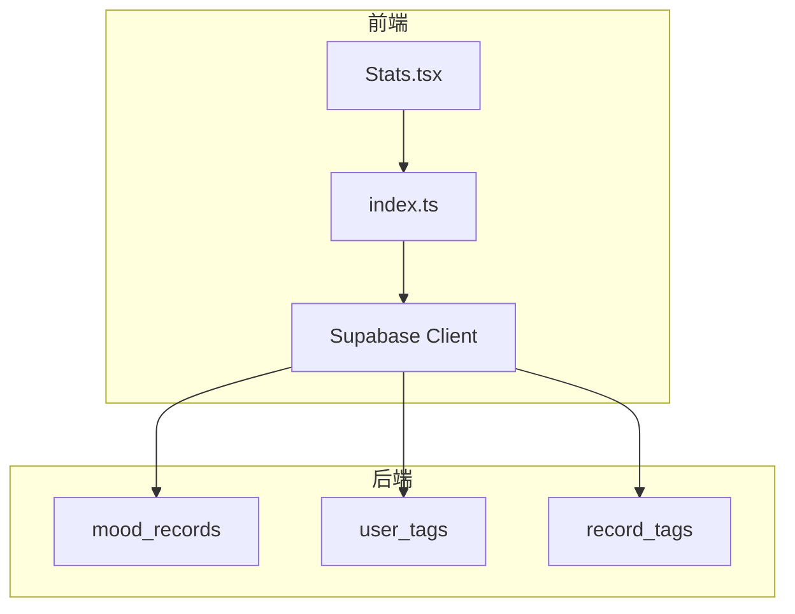
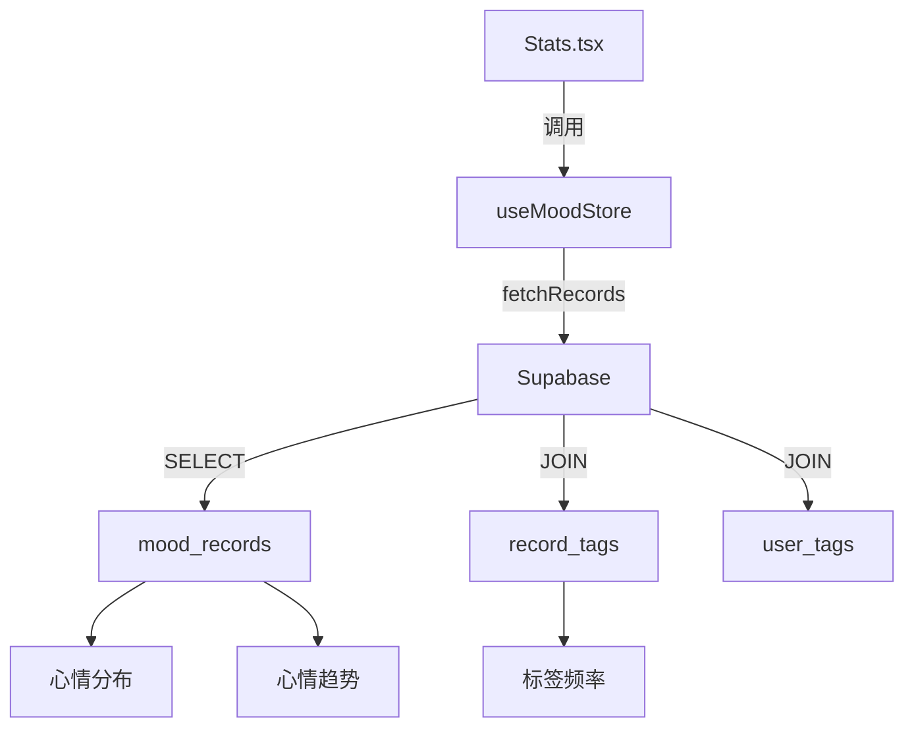
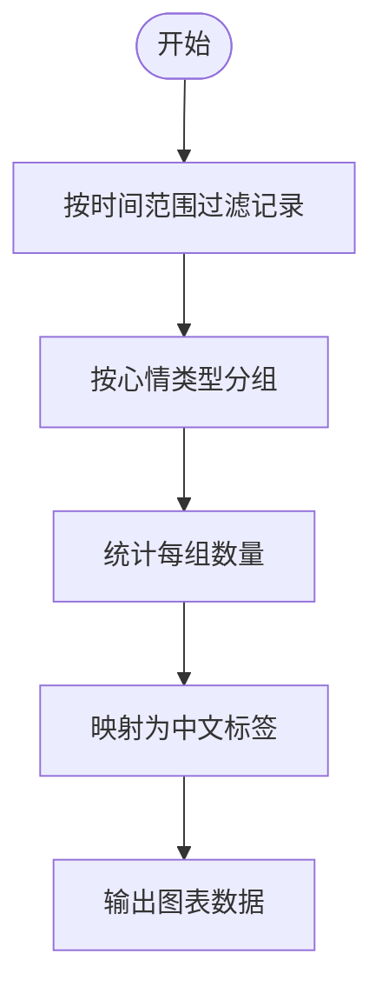
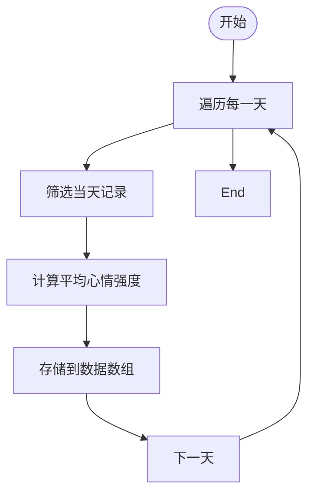
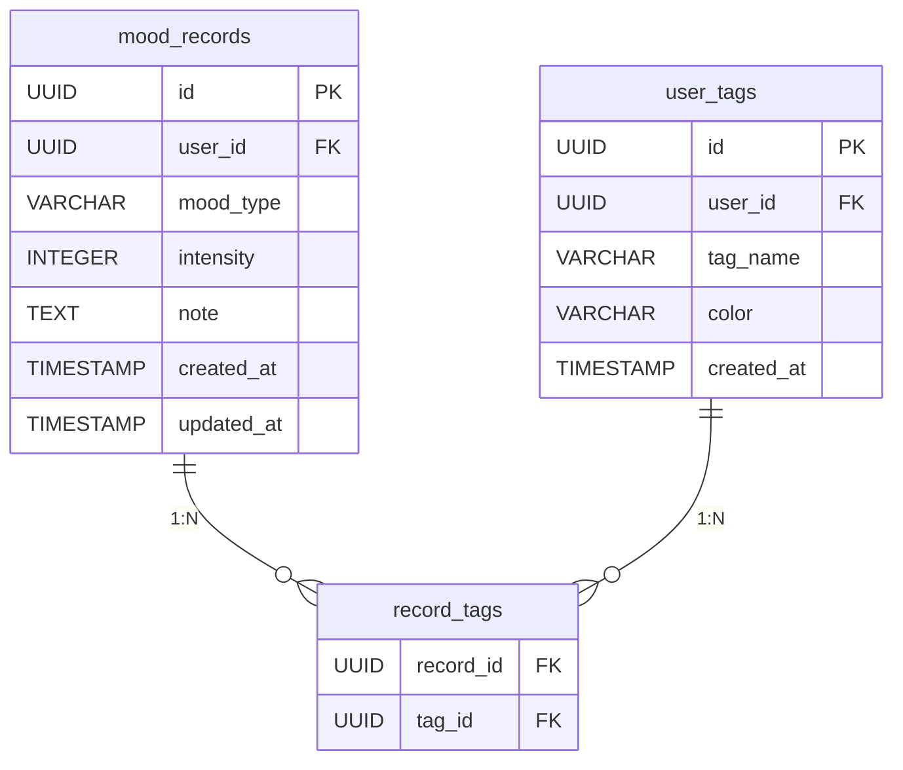
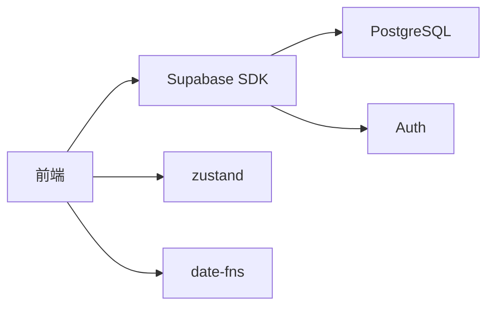

# 数据处理与聚合

<cite>
**本文档引用的文件**  
- [index.ts](file://src/store/index.ts)
- [create_mood_diary_tables.sql](file://supabase/migrations/create_mood_diary_tables.sql)
- [Stats.tsx](file://src/pages/Stats.tsx)
</cite>

## 目录
1. [引言](#引言)
2. [项目结构](#项目结构)
3. [核心组件](#核心组件)
4. [架构概览](#架构概览)
5. [详细组件分析](#详细组件分析)
6. [依赖分析](#依赖分析)
7. [性能考虑](#性能考虑)
8. [故障排除指南](#故障排除指南)
9. [结论](#结论)

## 引言
本项目“心情日记”是一个基于 Supabase 的心情记录与统计应用，支持用户记录每日情绪状态并进行多维度数据分析。系统通过前端状态管理封装对数据库的复杂查询逻辑，实现高效的数据聚合与可视化展示。本文档聚焦于 `src/store/index.ts` 中实现的统计查询逻辑，深入解析其如何封装 Supabase 查询请求，结合数据库表结构说明数据聚合机制，并提供性能优化建议。

## 项目结构
项目采用典型的 React + Zustand + Supabase 架构，主要分为以下几个模块：
- `src/components`：通用 UI 组件
- `src/hooks`：自定义 Hook
- `src/lib`：Supabase 客户端与工具函数
- `src/pages`：页面组件，其中 `Stats.tsx` 负责统计展示
- `src/store`：全局状态管理，核心为 `index.ts`
- `supabase/migrations`：数据库迁移脚本，定义表结构与策略

**Diagram sources**  
- [index.ts](file://src/store/index.ts)
- [create_mood_diary_tables.sql](file://supabase/migrations/create_mood_diary_tables.sql)

**Section sources**
- [index.ts](file://src/store/index.ts#L1-L557)
- [create_mood_diary_tables.sql](file://supabase/migrations/create_mood_diary_tables.sql#L1-L110)

## 核心组件
`useMoodStore` 是心情数据状态管理的核心，封装了对 `mood_records`、`user_tags` 和 `record_tags` 表的增删改查操作。其 `fetchRecords` 方法通过 Supabase 的 `select` 语法实现关联查询，获取记录及其标签信息，为后续统计分析提供数据基础。

**Section sources**
- [index.ts](file://src/store/index.ts#L100-L200)

## 架构概览
系统采用分层架构，前端通过 Zustand 管理状态，调用 Supabase SDK 与 PostgreSQL 数据库交互。统计功能在前端完成数据聚合，利用 `useMemo` 缓存计算结果，提升性能。

**Diagram sources**  
- [index.ts](file://src/store/index.ts#L150-L180)
- [Stats.tsx](file://src/pages/Stats.tsx#L50-L100)

## 详细组件分析

### 统计查询逻辑分析
`Stats.tsx` 中的 `useMemo` 钩子实现了多种统计功能，包括心情分布、趋势分析和标签频率。

#### 心情分布统计
`moodDistribution` 计算当前时间范围内各心情类型的出现次数，使用 `reduce` 聚合数据，并映射为中文标签用于图表展示。

**Diagram sources**  
- [Stats.tsx](file://src/pages/Stats.tsx#L178-L231)

#### 心情趋势分析
`moodTrend` 根据用户选择的时间范围（周/月/年），计算每日心情强度的平均值，生成趋势图数据。对于“年”视图，按月聚合数据。

**Diagram sources**  
- [Stats.tsx](file://src/pages/Stats.tsx#L233-L265)

### 数据库表结构分析
`create_mood_diary_tables.sql` 定义了核心数据模型。

#### 表关系图

**Diagram sources**  
- [create_mood_diary_tables.sql](file://supabase/migrations/create_mood_diary_tables.sql#L1-L110)

#### 字段说明
- **mood_records**: 存储用户的心情记录，`mood_type` 为枚举类型，`intensity` 为1-5的强度评分。
- **user_tags**: 用户自定义标签，支持颜色标记。
- **record_tags**: 多对多关联表，连接记录与标签。

**Section sources**
- [create_mood_diary_tables.sql](file://supabase/migrations/create_mood_diary_tables.sql#L1-L110)

## 依赖分析
系统依赖 Supabase 提供的实时数据库、身份验证和存储服务。前端通过 `@supabase/supabase-js` SDK 与后端通信，`zustand` 用于状态管理，`date-fns` 处理日期逻辑。

**Diagram sources**  
- [index.ts](file://src/store/index.ts#L1-L10)
- [package.json](file://package.json#L1-L20)

**Section sources**
- [index.ts](file://src/store/index.ts#L1-L10)
- [package.json](file://package.json#L1-L20)

## 性能考虑
1. **索引优化**：数据库已为 `mood_records.user_id` 和 `created_at` 创建索引，确保按用户和时间查询的效率。
2. **前端缓存**：使用 `useMemo` 缓存统计计算结果，避免重复计算。
3. **分页处理**：当前实现一次性加载所有记录，建议在数据量大时实现分页加载，如按月分批获取。
4. **查询优化**：可考虑在数据库端创建物化视图或使用 RPC 函数进行复杂聚合，减少前端计算压力。

**Section sources**
- [create_mood_diary_tables.sql](file://supabase/migrations/create_mood_diary_tables.sql#L10-L15)
- [Stats.tsx](file://src/pages/Stats.tsx#L178-L265)

## 故障排除指南
- **数据未更新**：检查 `fetchRecords` 是否被正确调用，确保 Supabase 客户端已初始化。
- **图表显示异常**：确认 `filteredRecords` 数据是否正确，检查时间范围过滤逻辑。
- **权限错误**：查看数据库 RLS 策略，确保用户只能访问自己的数据。
- **本地存储问题**：清除 `localStorage` 中的 `local_mood_records` 等键值进行重置。

**Section sources**
- [index.ts](file://src/store/index.ts#L150-L180)
- [Stats.tsx](file://src/pages/Stats.tsx#L50-L100)

## 结论
本系统通过前端状态管理与数据库查询的紧密结合，实现了灵活的心情数据统计功能。`useMoodStore` 封装了数据访问逻辑，`Stats.tsx` 实现了丰富的可视化分析。未来可进一步优化性能，如引入数据库端聚合、实现分页加载等，以支持更大规模的数据处理。