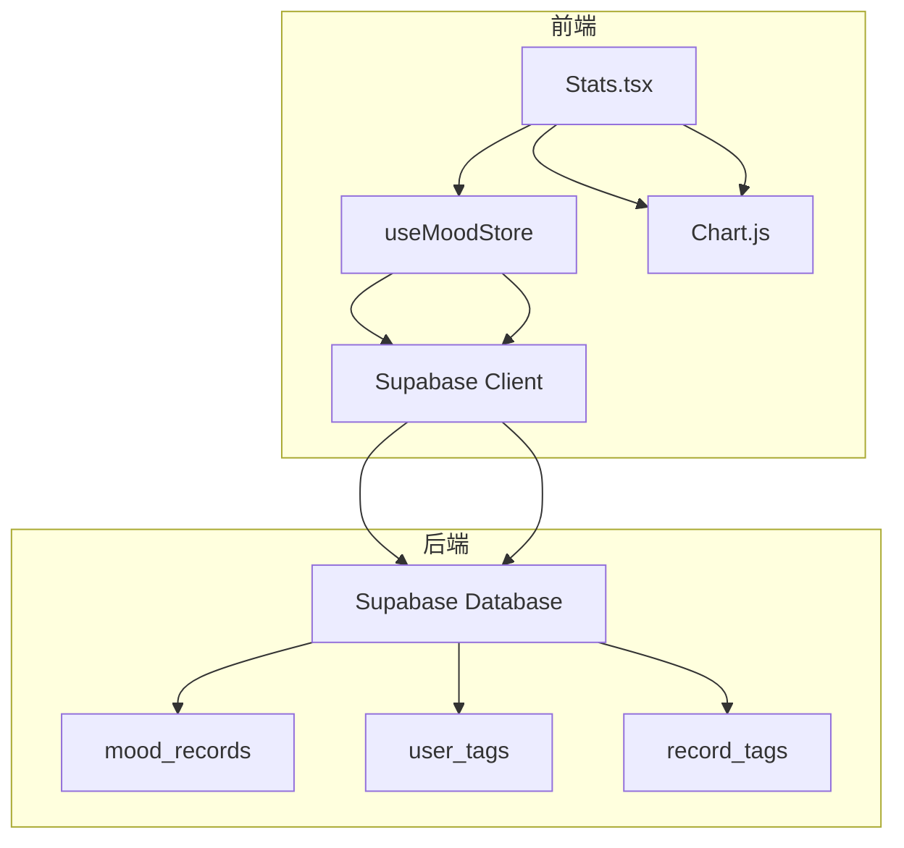
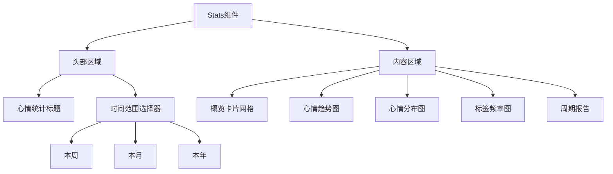
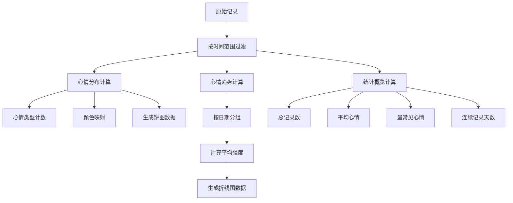
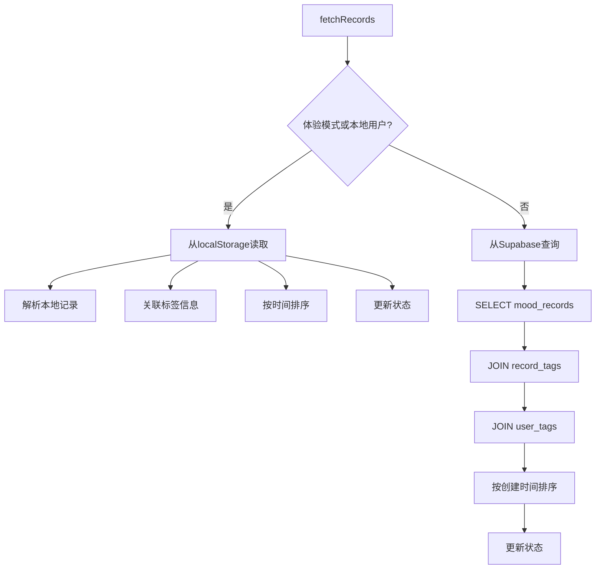
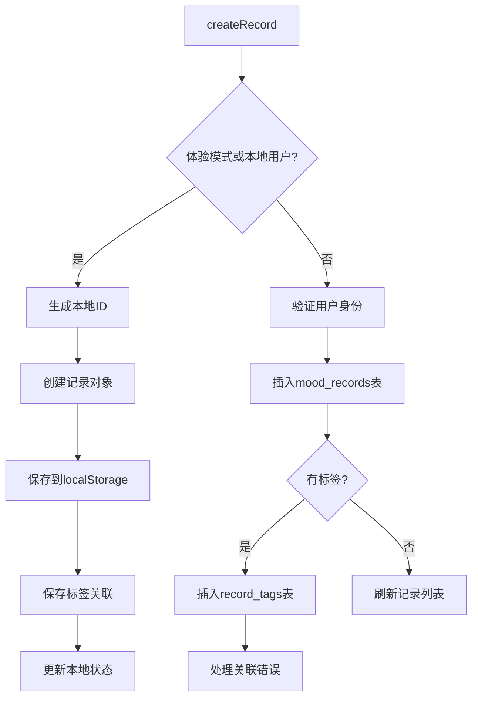
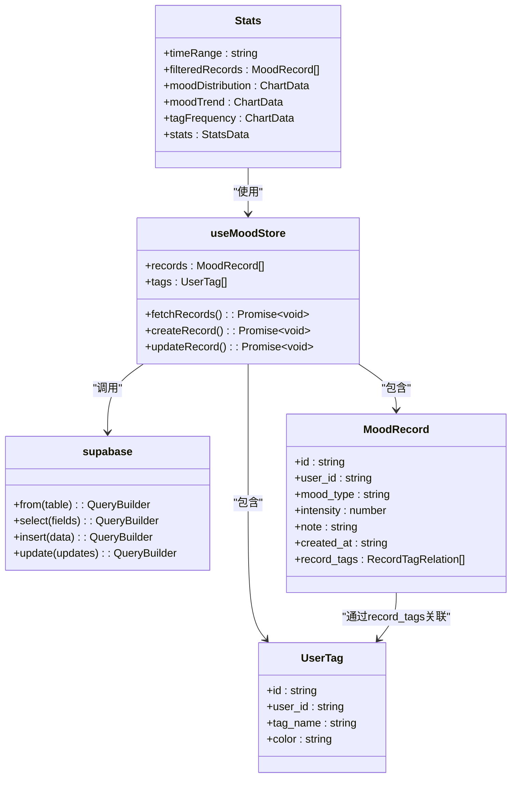

# 数据统计与可视化

<cite>
**本文档引用的文件**
- [Stats.tsx](file://src/pages/Stats.tsx)
- [index.ts](file://src/store/index.ts)
- [supabase.ts](file://src/lib/supabase.ts)
- [create_mood_diary_tables.sql](file://supabase/migrations/create_mood_diary_tables.sql)
</cite>

## 目录
1. [简介](#简介)
2. [项目结构](#项目结构)
3. [核心组件](#核心组件)
4. [架构概览](#架构概览)
5. [详细组件分析](#详细组件分析)
6. [依赖分析](#依赖分析)
7. [性能考量](#性能考量)
8. [故障排除指南](#故障排除指南)
9. [结论](#结论)

## 简介
本文档详细阐述了心情日记应用中的数据统计与可视化功能。重点介绍如何将原始心情数据转化为可视化洞察，涵盖Stats.tsx页面组件的UI布局、时间范围筛选器、多种图表类型、数据聚合查询方法、chart.js集成方式以及前端数据处理逻辑。文档还为开发者提供了扩展统计功能的指导。

## 项目结构
项目采用典型的React应用结构，核心统计功能位于`src/pages/Stats.tsx`，状态管理在`src/store/index.ts`，数据访问通过`src/lib/supabase.ts`。数据库迁移文件定义了数据表结构。

**Section sources**
- [Stats.tsx](file://src/pages/Stats.tsx)
- [index.ts](file://src/store/index.ts)
- [supabase.ts](file://src/lib/supabase.ts)

## 核心组件
核心组件包括Stats.tsx页面组件和useMoodStore状态管理器。Stats.tsx负责UI渲染和数据可视化，useMoodStore提供数据获取和状态管理功能。

**Section sources**
- [Stats.tsx](file://src/pages/Stats.tsx#L1-L386)
- [index.ts](file://src/store/index.ts#L1-L557)

## 架构概览
系统采用前端React组件与后端Supabase数据库的架构。前端通过Zustand状态管理器管理应用状态，使用Chart.js进行数据可视化，通过Supabase客户端与后端数据库交互。

**Diagram sources**
- [Stats.tsx](file://src/pages/Stats.tsx#L1-L386)
- [index.ts](file://src/store/index.ts#L1-L557)
- [supabase.ts](file://src/lib/supabase.ts#L1-L46)

## 详细组件分析

### 统计页面组件分析
Stats.tsx组件实现了完整的数据统计与可视化功能，包含时间范围筛选、多种图表展示和数据概览。

#### UI布局与时间范围筛选
组件提供了直观的UI布局，包括头部的时间范围选择器和多个数据可视化区域。时间范围筛选支持周、月、年三种粒度。

**Diagram sources**
- [Stats.tsx](file://src/pages/Stats.tsx#L267-L296)

#### 数据聚合与处理
组件通过useMemo优化数据处理，根据选定时间范围过滤记录，并计算各种统计数据。

**Diagram sources**
- [Stats.tsx](file://src/pages/Stats.tsx#L52-L96)
- [Stats.tsx](file://src/pages/Stats.tsx#L93-L132)
- [Stats.tsx](file://src/pages/Stats.tsx#L128-L187)
- [Stats.tsx](file://src/pages/Stats.tsx#L178-L231)

### 状态管理分析
useMoodStore提供了数据获取和管理功能，支持本地存储和Supabase数据库两种数据源。

#### 数据获取方法
状态管理器实现了fetchRecords方法，根据用户状态从不同数据源获取记录。

**Diagram sources**
- [index.ts](file://src/store/index.ts#L254-L295)

#### 数据创建方法
createRecord方法处理新记录的创建，支持标签关联功能。

**Diagram sources**
- [index.ts](file://src/store/index.ts#L414-L465)

## 依赖分析
系统依赖关系清晰，前端组件依赖状态管理器，状态管理器依赖Supabase客户端，Supabase客户端与数据库交互。

**Diagram sources**
- [Stats.tsx](file://src/pages/Stats.tsx#L1-L386)
- [index.ts](file://src/store/index.ts#L1-L557)
- [supabase.ts](file://src/lib/supabase.ts#L1-L46)

## 性能考量
系统在性能方面进行了多项优化，包括数据缓存、懒加载和查询优化。

### 数据处理优化
- 使用useMemo缓存计算结果，避免重复计算
- 在fetchRecords中批量处理数据，减少状态更新次数
- 对记录按时间排序，提高后续查询效率

### 查询性能优化
- 数据库表创建了适当的索引（user_id, created_at）
- 使用JOIN查询一次性获取记录和关联标签
- 限制查询结果数量，避免大数据量加载

**Section sources**
- [Stats.tsx](file://src/pages/Stats.tsx#L93-L132)
- [index.ts](file://src/store/index.ts#L254-L295)

## 故障排除指南
### 常见问题与解决方案
- **图表不显示数据**：检查fetchRecords是否成功获取数据，确认时间范围筛选是否正确
- **标签统计为空**：当前实现中标签频率统计为TODO状态，需要实现完整逻辑
- **性能问题**：对于大量数据，考虑实现分页加载或数据聚合

### 调试建议
- 使用console.log监控数据流
- 检查Supabase查询是否返回预期结果
- 验证时间范围计算逻辑是否正确

**Section sources**
- [Stats.tsx](file://src/pages/Stats.tsx#L128-L187)
- [index.ts](file://src/store/index.ts#L414-L465)

## 结论
数据统计功能通过精心设计的组件和状态管理实现了高效的数据可视化。系统支持多种时间范围和图表类型，为用户提供全面的心情洞察。未来可扩展标签频率统计等新功能，进一步丰富数据分析维度。