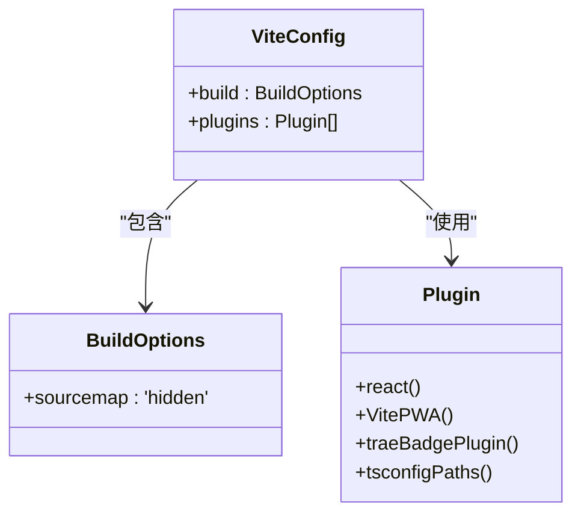
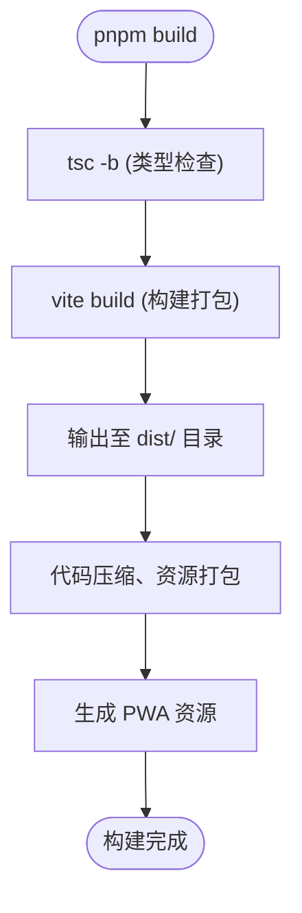
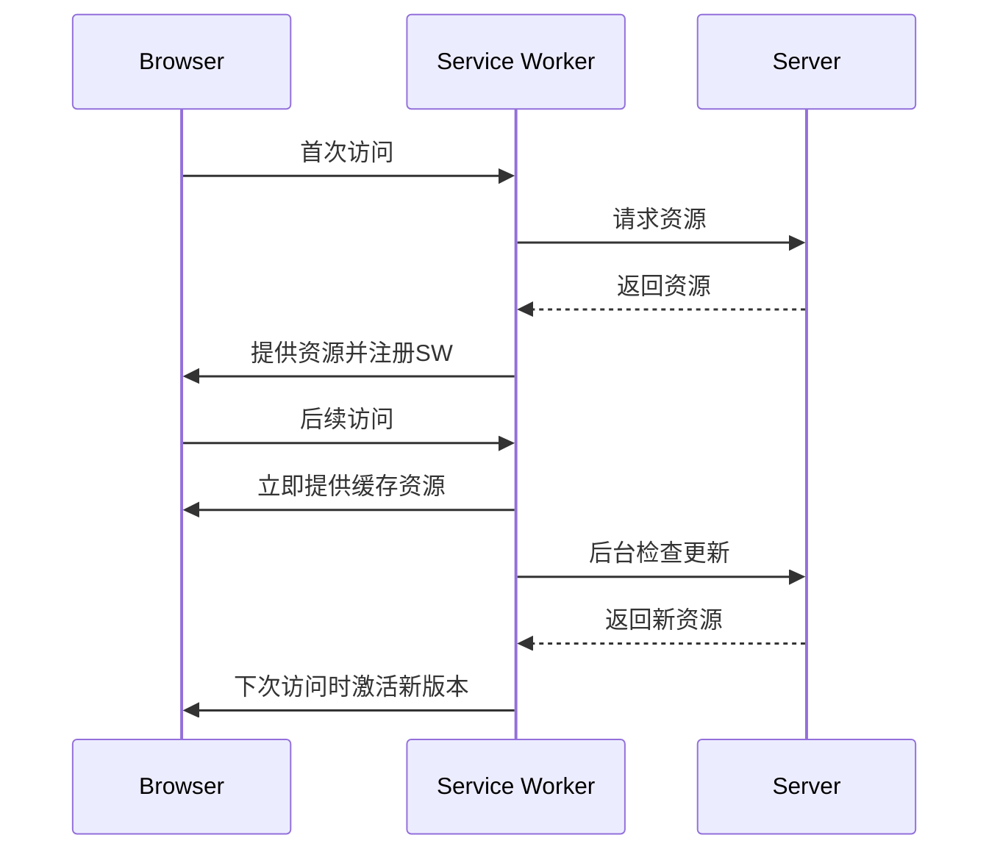

# Web端部署

<cite>
**本文档引用的文件**  
- [vite.config.ts](file://vite.config.ts)
- [package.json](file://package.json)
- [src/lib/supabase.ts](file://src/lib/supabase.ts)
- [index.html](file://index.html)
- [src/main.tsx](file://src/main.tsx)
</cite>

## 目录
1. [简介](#简介)
2. [项目结构](#项目结构)
3. [核心构建配置](#核心构建配置)
4. [构建流程详解](#构建流程详解)
5. [环境变量管理](#环境变量管理)
6. [部署至静态托管平台](#部署至静态托管平台)
7. [进阶配置](#进阶配置)
8. [常见问题排查](#常见问题排查)
9. [结论](#结论)

## 简介
本文档旨在为“心情日记”项目提供完整的Web端生产环境部署指南。重点介绍如何使用Vite构建工具生成优化的静态资源，并详细说明`pnpm build`命令的执行机制。文档涵盖从构建配置、环境管理到主流静态托管平台部署的全流程，帮助开发者高效、稳定地发布应用。

## 项目结构
项目采用标准的前端工程化结构，主要目录包括：
- `src/`：源码目录，包含组件、页面、状态管理等
- `public/`：公共静态资源（本项目中部分资源直接置于根目录）
- `dist/`：Vite构建输出目录（默认）
- 根目录包含构建配置文件如 `vite.config.ts`、`package.json` 等

**Section sources**
- [vite.config.ts](file://vite.config.ts#L1-L67)
- [package.json](file://package.json#L1-L62)

## 核心构建配置
Vite构建行为由 `vite.config.ts` 文件定义，核心配置如下：



**Diagram sources**
- [vite.config.ts](file://vite.config.ts#L1-L67)

### 输出配置
- **输出目录**：默认为 `dist`，可通过 `build.outDir` 自定义
- **资源公共路径**：默认为 `/`，适用于根路径部署
- **Source Map**：设置为 `'hidden'`，生成但不直接暴露于生产环境，便于错误追踪

### 关键插件
- **@vitejs/plugin-react**：支持React开发，集成Babel插件 `react-dev-locator`
- **vite-plugin-pwa**：实现PWA功能，自动生成Service Worker和Manifest
- **vite-plugin-trae-solo-badge**：在生产环境右下角显示Trae品牌徽章
- **vite-tsconfig-paths**：支持TypeScript路径别名解析

**Section sources**
- [vite.config.ts](file://vite.config.ts#L1-L67)

## 构建流程详解
执行 `pnpm build` 命令时，实际运行的是 `tsc -b && vite build`，分为两个阶段：



**Diagram sources**
- [package.json](file://package.json#L7-L8)
- [vite.config.ts](file://vite.config.ts#L1-L67)

### 构建阶段说明
1. **类型检查**：`tsc -b` 基于 `tsconfig.json` 执行完整的TypeScript类型检查，确保代码类型安全
2. **资源打包**：
   - 使用Rollup进行模块打包
   - 自动分割代码（Code Splitting）
   - CSS自动提取与压缩
   - 静态资源（图片、字体）自动优化与哈希命名
3. **代码压缩**：通过Terser对JavaScript进行压缩混淆
4. **PWA生成**：`vite-plugin-pwa` 自动生成 `sw.js` 和预缓存资源列表

**Section sources**
- [package.json](file://package.json#L7-L8)
- [vite.config.ts](file://vite.config.ts#L1-L67)

## 环境变量管理
项目通过Vite的环境变量机制管理不同环境的配置。

### 环境变量定义
- **前缀要求**：所有注入客户端的环境变量必须以 `VITE_` 开头
- **文件约定**：支持 `.env`、`.env.local`、`.env.[mode]` 等文件

### API地址配置示例
在 `src/lib/supabase.ts` 中，通过 `import.meta.env` 访问环境变量：

```typescript
const supabaseUrl = import.meta.env.VITE_SUPABASE_URL
const supabaseAnonKey = import.meta.env.VITE_SUPABASE_ANON_KEY
```

**推荐的环境文件结构**：
```
.env.development
  VITE_SUPABASE_URL=https://dev.supabase.com
  VITE_SUPABASE_ANON_KEY=dev-key

.env.production
  VITE_SUPABASE_URL=https://prod.supabase.com
  VITE_SUPABASE_ANON_KEY=prod-key
```

构建时，Vite会根据 `--mode` 参数自动加载对应环境文件。

**Section sources**
- [src/lib/supabase.ts](file://src/lib/supabase.ts#L2-L5)
- [vite.config.ts](file://vite.config.ts#L1-L67)

## 部署至静态托管平台
构建产物位于 `dist/` 目录，可直接部署到任意静态文件托管服务。

### Netlify 部署
1. 将 `dist/` 目录拖拽上传或连接GitHub仓库
2. 构建命令：`pnpm build`
3. 发布目录：`dist`
4. **重写规则**（解决SPA路由）：
   ```
   /*  /index.html  200
   ```

### Vercel 部署
1. 导入项目，自动识别为Vite项目
2. 构建命令：`pnpm build`
3. 输出目录：`dist`
4. Vercel自动处理SPA路由，无需额外配置

### GitHub Pages 部署
1. 使用 `gh-pages` 包：
   ```bash
   npx gh-pages -d dist
   ```
2. 或配置GitHub Actions自动部署
3. **注意**：若部署到子路径，需在 `vite.config.ts` 中设置 `base` 选项

**Section sources**
- [vite.config.ts](file://vite.config.ts#L1-L67)
- [package.json](file://package.json#L7-L8)

## 进阶配置

### HTTPS与自定义域名
- **Netlify/Vercel**：提供免费HTTPS，绑定自定义域名后自动配置SSL
- **GitHub Pages**：支持HTTPS，自定义域名需在DNS服务商处配置CNAME记录

### 缓存策略优化
Vite默认为静态资源生成唯一哈希文件名，实现永久缓存。建议托管平台配置：
- `*.js`, `*.css`：`Cache-Control: public, max-age=31536000, immutable`
- 其他资源：合理设置`max-age`

### PWA支持
本项目已通过 `vite-plugin-pwa` 启用PWA：
- **Manifest配置**：定义应用名称、主题色、图标等
- **Service Worker**：实现自动更新（`registerType: 'autoUpdate'`）
- **缓存策略**：预缓存所有JS、CSS、HTML及指定静态资源



**Diagram sources**
- [vite.config.ts](file://vite.config.ts#L15-L50)

**Section sources**
- [vite.config.ts](file://vite.config.ts#L1-L67)
- [index.html](file://index.html#L1-L28)

## 常见问题排查

### 路径错误
**现象**：资源404，页面空白  
**原因**：`base` 路径配置不正确  
**解决方案**：若部署到子目录，需在 `vite.config.ts` 中设置：
```ts
export default defineConfig({
  base: '/your-repo-name/'
})
```

### 资源加载失败
**现象**：CSS/JS未生效  
**原因**：缓存或构建产物不完整  
**解决方案**：
1. 清除 `dist/` 目录后重新构建
2. 检查 `index.html` 中资源引用路径是否正确

### 环境变量未生效
**现象**：`VITE_` 变量为 `undefined`  
**原因**：文件命名错误或未以 `VITE_` 开头  
**解决方案**：
- 确认环境文件名为 `.env.[mode]`
- 确认变量前缀为 `VITE_`
- 检查 `vite.config.ts` 中是否正确加载

**Section sources**
- [vite.config.ts](file://vite.config.ts#L1-L67)
- [src/lib/supabase.ts](file://src/lib/supabase.ts#L2-L5)
- [index.html](file://index.html#L1-L28)

## 结论
通过本文档的指导，开发者可顺利完成“心情日记”Web应用的生产构建与部署。Vite提供了高效、现代化的构建能力，结合PWA插件实现了离线可用和安装体验。合理的环境变量管理确保了多环境配置的安全与灵活。部署至主流平台简单快捷，配合HTTPS、自定义域名和缓存优化，可为用户提供高性能、高可用的Web应用体验。