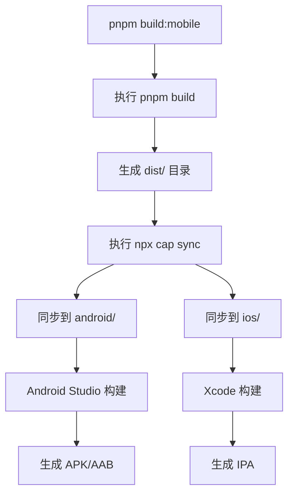

# 构建与部署

<cite>
**本文档中引用的文件**   
- [MOBILE_BUILD_GUIDE.md](file://MOBILE_BUILD_GUIDE.md)
- [package.json](file://package.json)
- [capacitor.config.ts](file://capacitor.config.ts)
- [vite.config.ts](file://vite.config.ts)
- [strings.xml](file://android/app/src/main/res/values/strings.xml)
</cite>

## 目录
1. [介绍](#介绍)
2. [Web端构建与部署](#web端构建与部署)
3. [移动端构建流程](#移动端构建流程)
4. [Capacitor配置详解](#capacitor配置详解)
5. [环境变量管理策略](#环境变量管理策略)
6. [代码签名与发布渠道](#代码签名与发布渠道)
7. [CI/CD集成建议](#cicd集成建议)
8. [故障排除与调试](#故障排除与调试)

## 介绍
本指南旨在为“心情日记”项目提供完整的构建与部署权威说明，涵盖Web端和移动端（Android/iOS）的全流程。文档详细解释了如何通过Vite构建Web资源，使用Capacitor同步至原生平台，并完成最终的应用打包、签名及发布。同时包含环境变量管理、CI/CD自动化建议以及常见问题解决方案。

## Web端构建与部署

### Web构建流程
Web端使用Vite作为构建工具，通过`pnpm build`命令生成生产级静态资源。该命令会执行TypeScript类型检查并输出压缩后的JavaScript、CSS和静态资源文件到`dist`目录。

```bash
pnpm build
```

此命令等价于：
```bash
tsc -b && vite build
```

构建产物包括：
- HTML入口文件
- 混淆压缩的JS/CSS
- Service Worker（用于PWA）
- Web App Manifest及图标资源

### 部署到Netlify
1. 登录Netlify并创建新站点
2. 连接GitHub仓库或手动上传`dist`目录
3. 设置构建命令：`pnpm build`
4. 输出目录：`dist`
5. 点击部署，Netlify将自动完成构建与发布

### 部署到Vercel
1. 导入项目到Vercel
2. 配置项目设置：
   - Framework Preset: 自动检测（React/Vite）
   - Build Command: `pnpm build`
   - Output Directory: `dist`
3. 部署并绑定自定义域名（可选）

**Section sources**
- [package.json](file://package.json#L6-L10)
- [vite.config.ts](file://vite.config.ts#L1-L67)

## 移动端构建流程

### 构建命令说明
移动端构建通过组合命令完成Web资源构建与原生同步：

```bash
pnpm build:mobile
```

该命令定义在`package.json`中，实际执行：
```bash
pnpm build && npx cap sync
```

即先构建Web资源，再使用Capacitor同步到Android和iOS原生项目。

### Android APK/AAB构建
#### 开发环境快速运行
```bash
pnpm android:dev
```
该命令自动构建、同步并在连接的Android设备上运行应用。

#### 手动构建APK
1. 使用Android Studio打开项目：
   ```bash
   pnpm cap:open:android
   ```
2. 在Android Studio中选择 `Build` → `Build Bundle(s) / APK(s)` → `Build APK(s)`
3. 生成的APK路径：`android/app/build/outputs/apk/debug/app-debug.apk`

#### 构建发布版本（Release）
1. 生成签名密钥：
   ```bash
   keytool -genkey -v -keystore my-release-key.keystore -alias my-key-alias -keyalg RSA -keysize 2048 -validity 10000
   ```
2. 配置`android/app/build.gradle`中的签名信息
3. 执行发布构建：
   ```bash
   cd android && ./gradlew assembleRelease
   ```
   生成AAB文件位于：`android/app/build/outputs/bundle/release/app-release.aab`

### iOS应用构建
#### 开发环境运行
```bash
pnpm ios:dev
```
自动构建并在iOS模拟器或设备上运行。

#### 使用Xcode构建
1. 打开Xcode项目：
   ```bash
   pnpm cap:open:ios
   ```
2. 选择目标设备
3. 构建：`Product` → `Build`
4. 运行：`Product` → `Run`

#### 发布到App Store
1. 配置App Store Connect
2. 创建Archive：`Product` → `Archive`
3. 通过Xcode Organizer上传至App Store

**Section sources**
- [MOBILE_BUILD_GUIDE.md](file://MOBILE_BUILD_GUIDE.md#L0-L249)
- [package.json](file://package.json#L11-L20)

## Capacitor配置详解

### capacitor.config.ts核心配置
`capacitor.config.ts`是Capacitor的核心配置文件，定义了应用的基本属性：

```typescript
const config: CapacitorConfig = {
  appId: 'com.mooddiary.app',     // 应用唯一标识（包名）
  appName: '心情日记',             // 应用显示名称
  webDir: 'dist'                  // Web资源输出目录
};
```

- **appId**: 必须全局唯一，用于Google Play和App Store识别应用
- **appName**: 在设备主屏幕上显示的名称
- **webDir**: 与Vite的build.outDir保持一致

### 平台特定资源配置
- 图标资源路径在`vite.config.ts`中通过`manifest.icons`指定
- 启动画面由Capacitor自动生成，基于`pwa-192x192.png`等资源
- Android应用名称在`strings.xml`中定义，与`capacitor.config.ts`同步

```xml
<string name="app_name">心情日记</string>
<string name="package_name">com.mooddiary.app</string>
```

**Diagram sources**
- [capacitor.config.ts](file://capacitor.config.ts#L1-L9)
- [vite.config.ts](file://vite.config.ts#L30-L65)
- [strings.xml](file://android/app/src/main/res/values/strings.xml#L1-L7)



**Diagram sources**
- [package.json](file://package.json#L11)
- [MOBILE_BUILD_GUIDE.md](file://MOBILE_BUILD_GUIDE.md#L45-L48)

## 环境变量管理策略

### 构建环境区分
项目通过不同构建命令区分环境：
- 开发环境：`pnpm dev`
- 预发布环境：`pnpm build` + 部署到预发服务器
- 生产环境：`pnpm build:mobile` + 签名发布

### 环境变量实现方式
虽然当前项目未显式使用`.env`文件，但可通过Vite的模式（mode）支持多环境配置：

```ts
// vite.config.ts 支持根据模式加载不同配置
export default defineConfig(({ mode }) => {
  if (mode === 'development') {
    // 开发配置
  } else if (mode === 'staging') {
    // 预发配置
  } else {
    // 生产配置
  }
})
```

建议在根目录添加：
- `.env.development`
- `.env.staging`
- `.env.production`

并在`vite.config.ts`中通过`loadEnv`加载。

**Section sources**
- [vite.config.ts](file://vite.config.ts#L1-L67)
- [package.json](file://package.json#L6-L20)

## 代码签名与发布渠道

### Android代码签名
1. **生成密钥库**：使用`keytool`创建`.keystore`文件
2. **配置build.gradle**：
   ```gradle
   android {
       signingConfigs {
           release {
               storeFile file('my-release-key.keystore')
               storePassword 'password'
               keyAlias 'my-key-alias'
               keyPassword 'password'
           }
       }
       buildTypes {
           release {
               signingConfig signingConfigs.release
           }
       }
   }
   ```
3. **安全存储密钥**：切勿提交至版本控制

### Google Play发布注意事项
- **应用签名**：使用Google Play应用签名功能更安全
- **版本号管理**：每次发布必须递增`android/app/build.gradle`中的`versionCode`
- **权限声明**：在`AndroidManifest.xml`中声明所需权限
- **目标API级别**：确保符合Google Play最新要求（目前为API 33+）

### iOS发布注意事项
- **开发者账号**：必须拥有Apple Developer Program会员资格
- **证书与配置文件**：通过Xcode自动管理或手动配置
- **审核指南**：遵守App Store审核指南，特别是关于隐私和数据收集的部分
- **版本更新**：每次提交需增加`CFBundleShortVersionString`和`CFBundleVersion`

**Section sources**
- [MOBILE_BUILD_GUIDE.md](file://MOBILE_BUILD_GUIDE.md#L70-L80)
- [android/app/build.gradle](file://android/app/build.gradle)（未直接提供，但被引用）

## CI/CD集成建议

### GitHub Actions自动化流程
建议在`.github/workflows`目录下创建CI/CD工作流：

```yaml
name: Build and Deploy

on:
  push:
    branches: [ main ]

jobs:
  build:
    runs-on: ubuntu-latest
    steps:
      - uses: actions/checkout@v4
      
      - name: Setup Node.js
        uses: actions/setup-node@v4
        with:
          node-version: 18

      - run: pnpm install
      
      # Web构建并部署到Vercel/Netlify
      - run: pnpm build
      - name: Deploy to Vercel
        uses: amondnet/vercel-action@v27
        with:
          scope: ${{ secrets.VERCEL_SCOPE }}
          token: ${{ secrets.VERCEL_TOKEN }}

      # Android构建（可选）
      - name: Build Android Release
        if: github.event_name == 'push' && contains(github.ref, 'release')
        run: |
          pnpm build:mobile
          cd android
          ./gradlew assembleRelease
        env:
          ANDROID_KEYSTORE: ${{ secrets.ANDROID_KEYSTORE }}
          ANDROID_KEY_ALIAS: ${{ secrets.ANDROID_KEY_ALIAS }}
```

### 自动化优势
- 减少人为错误
- 提高发布频率
- 确保构建环境一致性
- 实现持续交付（CD）

**Section sources**
- [package.json](file://package.json#L6-L20)
- [MOBILE_BUILD_GUIDE.md](file://MOBILE_BUILD_GUIDE.md#L45-L48)

## 故障排除与调试

### 常见问题解决方案
1. **构建失败**
   ```bash
   pnpm clean
   rm -rf node_modules
   pnpm install
   ```

2. **Android构建错误**
   - 检查JDK版本（需17+）
   - 更新Android SDK
   - 清理项目：`cd android && ./gradlew clean`

3. **iOS构建失败**
   - 更新Xcode
   - 清理缓存：`Product` → `Clean Build Folder`
   - 检查iOS部署目标版本

4. **PWA无法安装**
   - 确保HTTPS
   - 验证`manifest.json`和Service Worker
   - 检查`<link rel="manifest">`标签

### 调试技巧
- **Android调试**：Chrome浏览器访问`chrome://inspect`进行远程调试
- **iOS调试**：Safari开发者工具 → 开发 → 设备名称
- **查看详细日志**：`pnpm build:mobile --verbose`
- **检查环境状态**：`npx cap doctor`

**Section sources**
- [MOBILE_BUILD_GUIDE.md](file://MOBILE_BUILD_GUIDE.md#L170-L220)