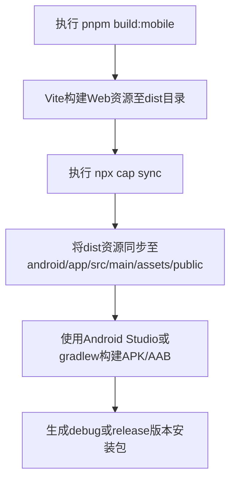
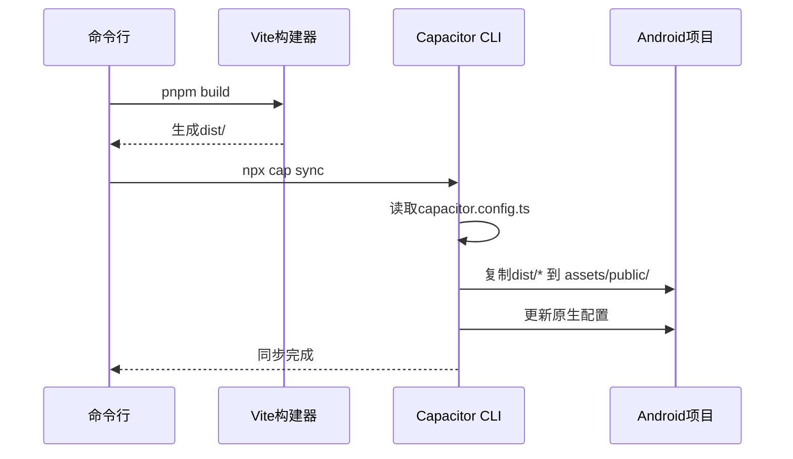
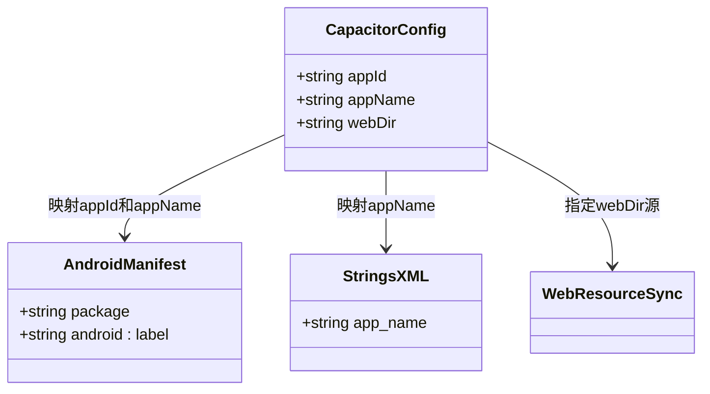
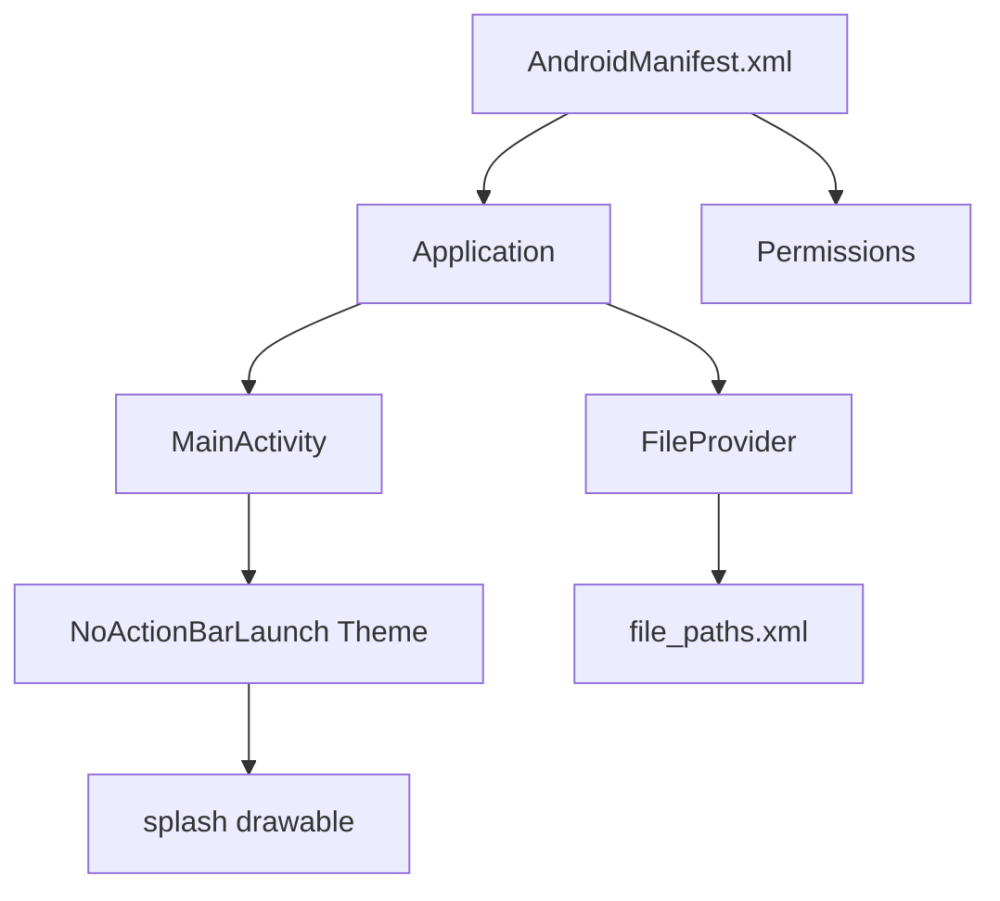

# 移动端构建

<cite>
**本文档引用文件**  
- [MOBILE_BUILD_GUIDE.md](file://MOBILE_BUILD_GUIDE.md)
- [capacitor.config.ts](file://capacitor.config.ts)
- [package.json](file://package.json)
- [android/app/src/main/AndroidManifest.xml](file://android/app/src/main/AndroidManifest.xml)
- [android/app/src/main/res/values/strings.xml](file://android/app/src/main/res/values/strings.xml)
- [android/app/src/main/res/values/styles.xml](file://android/app/src/main/res/values/styles.xml)
- [android/app/src/main/res/xml/file_paths.xml](file://android/app/src/main/res/xml/file_paths.xml)
- [android/gradle.properties](file://android/gradle.properties)
</cite>

## 目录
1. [简介](#简介)
2. [构建流程概览](#构建流程概览)
3. [Web资源同步与注入机制](#web资源同步与注入机制)
4. [Capacitor配置解析](#capacitor配置解析)
5. [Android原生项目构建](#android原生项目构建)
6. [构建类型与签名配置](#构建类型与签名配置)
7. [AndroidManifest权限与资源引用](#androidmanifest权限与资源引用)
8. [常见问题与解决方案](#常见问题与解决方案)

## 简介
本指南深入解析基于Capacitor框架的移动端构建全流程，涵盖从Web资源同步到原生包生成的完整过程。重点阐述`npx cap sync`命令如何将Vite构建的前端资源注入Android项目，并详细说明构建、签名、发布等关键环节。

## 构建流程概览
移动端构建主要分为三个阶段：Web资源构建、原生资源同步、原生应用打包。



**图示来源**  
- [package.json](file://package.json#L10-L15)
- [MOBILE_BUILD_GUIDE.md](file://MOBILE_BUILD_GUIDE.md#L77-L85)

## Web资源同步与注入机制
`npx cap sync`命令是连接Web前端与原生Android项目的核心桥梁。

### 同步流程
1. 执行`pnpm build:mobile`，该脚本先运行`pnpm build`生成dist目录
2. 调用`npx cap sync`，根据`capacitor.config.ts`中的`webDir`配置同步资源
3. Capacitor CLI将dist目录内容复制到Android项目的`app/src/main/assets/public`目录
4. Android应用启动时通过`MainActivity`加载本地assets中的index.html



**图示来源**  
- [package.json](file://package.json#L10)
- [capacitor.config.ts](file://capacitor.config.ts#L1-L9)
- [MOBILE_BUILD_GUIDE.md](file://MOBILE_BUILD_GUIDE.md#L80-L81)

## Capacitor配置解析
`capacitor.config.ts`是Capacitor项目的核心配置文件，定义了应用的基本属性和行为。

### 核心配置项
| 配置项 | 作用 | 来源文件 |
|-------|------|---------|
| `appId` | 应用唯一标识符，对应Android的package name | [capacitor.config.ts](file://capacitor.config.ts#L4) |
| `appName` | 应用显示名称 | [capacitor.config.ts](file://capacitor.config.ts#L5) |
| `webDir` | Web构建输出目录，决定资源同步源 | [capacitor.config.ts](file://capacitor.config.ts#L6) |

### 配置映射机制
Capacitor在同步过程中会自动将配置项映射到原生项目：
- `appId` → AndroidManifest.xml中的package属性和`${applicationId}`占位符
- `appName` → strings.xml中的`app_name`字符串资源
- `webDir` → 确定从哪个目录复制Web资源



**图示来源**  
- [capacitor.config.ts](file://capacitor.config.ts#L4-L6)
- [android/app/src/main/AndroidManifest.xml](file://android/app/src/main/AndroidManifest.xml#L3)
- [android/app/src/main/res/values/strings.xml](file://android/app/src/main/res/values/strings.xml#L3)

## Android原生项目构建
构建Android应用可通过Android Studio图形界面或命令行工具完成。

### 构建命令
```bash
# 使用Gradle构建debug版本APK
cd android
./gradlew assembleDebug

# 构建release版本AAB
./gradlew bundleRelease
```

### 构建输出路径
- Debug APK: `android/app/build/outputs/apk/debug/app-debug.apk`
- Release AAB: `android/app/build/outputs/bundle/release/app-release.aab`

### 构建环境配置
`android/gradle.properties`文件包含项目级Gradle配置：
- `org.gradle.jvmargs`: JVM内存参数
- `android.useAndroidX`: 启用AndroidX支持库

**本节来源**  
- [MOBILE_BUILD_GUIDE.md](file://MOBILE_BUILD_GUIDE.md#L90-L95)
- [android/gradle.properties](file://android/gradle.properties#L1-L21)

## 构建类型与签名配置
Android应用支持多种构建类型，主要分为debug和release。

### 构建类型对比
| 特性 | Debug版本 | Release版本 |
|------|----------|------------|
| 签名 | 自动使用调试密钥 | 需配置发布密钥 |
| 优化 | 无代码混淆 | 启用ProGuard/R8混淆 |
| 性能 | 未优化 | 经过优化 |
| 分发 | 仅用于测试 | 可发布到应用商店 |

### 代码签名流程
1. **生成keystore**
   ```bash
   keytool -genkey -v -keystore my-release-key.keystore -alias my-key-alias -keyalg RSA -keysize 2048 -validity 10000
   ```
2. **配置build.gradle**
   在`android/app/build.gradle`中添加signingConfigs
3. **构建发布版本**
   ```bash
   ./gradlew assembleRelease
   ```

### Google Play发布
- 生成AAB格式包（`bundleRelease`）
- 上传至Google Play Console
- 配置应用信息、截图、隐私政策等
- 提交审核

**本节来源**  
- [MOBILE_BUILD_GUIDE.md](file://MOBILE_BUILD_GUIDE.md#L100-L110)
- [package.json](file://package.json#L13-L14)

## AndroidManifest权限与资源引用
`AndroidManifest.xml`是Android应用的核心配置文件，定义了应用的结构和权限。

### 权限配置
当前项目仅声明了必要权限：
```xml
<uses-permission android:name="android.permission.INTERNET" />
```
此权限允许应用访问网络，用于与Supabase后端通信。

### 应用组件
- **MainActivity**: 主活动，设置为启动器（LAUNCHER）
- **FileProvider**: 用于安全地共享文件，配置在`file_paths.xml`中

### 资源引用机制
| 资源类型 | 目录 | 用途 |
|--------|------|------|
| 图标 | mipmap-* | 应用启动图标（支持自适应图标） |
| 字符串 | values/strings.xml | 本地化文本 |
| 样式 | values/styles.xml | 应用主题和UI样式 |
| 布局 | layout/ | Activity界面布局 |
| XML配置 | xml/ | FileProvider路径配置 |

### 主题与启动画面
- 使用`Theme.SplashScreen`作为启动主题
- 启动画面背景通过`AppTheme.NoActionBarLaunch`中的`android:background`指定
- 正式主题继承自`Theme.AppCompat.DayNight.NoActionBar`



**图示来源**  
- [android/app/src/main/AndroidManifest.xml](file://android/app/src/main/AndroidManifest.xml)
- [android/app/src/main/res/xml/file_paths.xml](file://android/app/src/main/res/xml/file_paths.xml)
- [android/app/src/main/res/values/styles.xml](file://android/app/src/main/res/values/styles.xml)

## 常见问题与解决方案
### 签名失败
**现象**: `Failed to load signer "signer #1"`  
**解决方案**: 
1. 确认keystore文件路径正确
2. 检查密码是否正确
3. 确保alias名称匹配

### 资源冲突
**现象**: `Duplicate resources`  
**解决方案**:
1. 清理构建缓存: `cd android && ./gradlew clean`
2. 检查res目录是否有重复文件名
3. 确认没有重复的资源引用

### Gradle版本不兼容
**现象**: `Could not resolve all artifacts`  
**解决方案**:
1. 检查`gradle.properties`中的配置
2. 确认Gradle版本与Android Gradle Plugin兼容
3. 更新Android Studio和SDK工具

### 构建环境问题
```bash
# 通用解决步骤
pnpm clean
rm -rf node_modules
pnpm install
cd android && ./gradlew clean
```

**本节来源**  
- [MOBILE_BUILD_GUIDE.md](file://MOBILE_BUILD_GUIDE.md#L200-L230)
- [android/gradle.properties](file://android/gradle.properties)