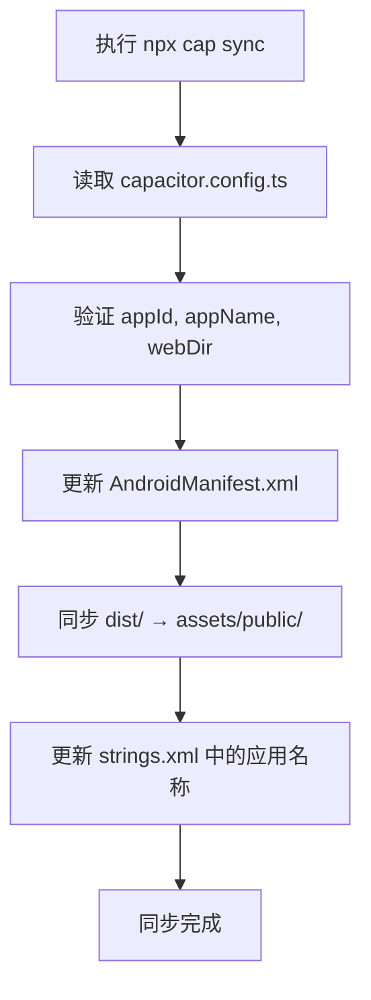
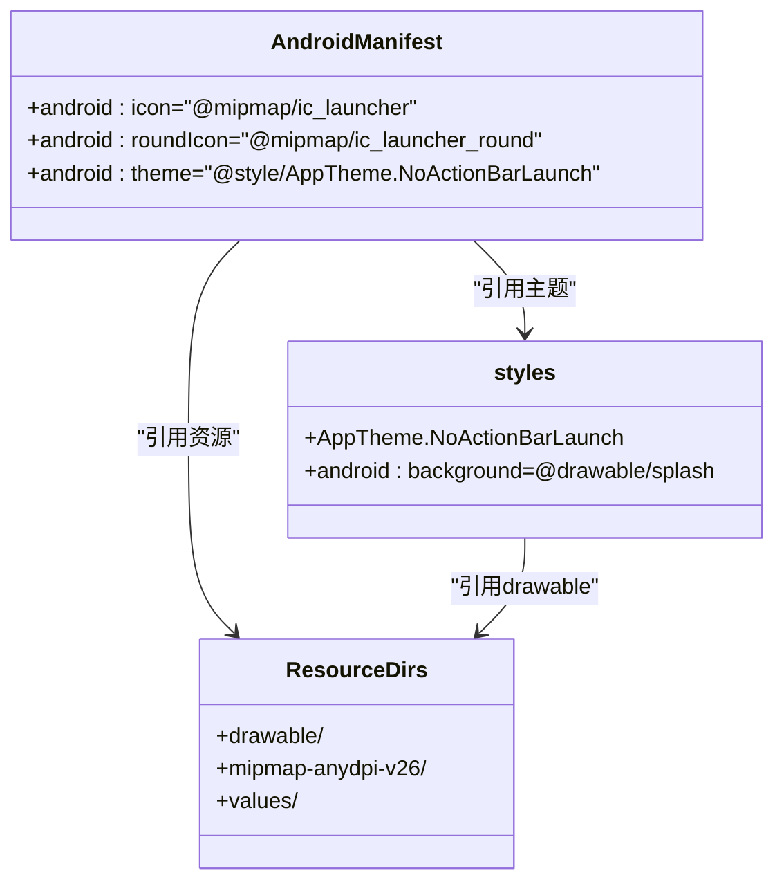

# 配置与资源同步

<cite>
**本文档中引用的文件**  
- [capacitor.config.ts](file://capacitor.config.ts)
- [MOBILE_BUILD_GUIDE.md](file://MOBILE_BUILD_GUIDE.md)
- [AndroidManifest.xml](file://android/app/src/main/AndroidManifest.xml)
- [strings.xml](file://android/app/src/main/res/values/strings.xml)
- [styles.xml](file://android/app/src/main/res/values/styles.xml)
- [res目录结构](file://android/app/src/main/res/)
</cite>

## 目录

1. [简介](#简介)
2. [核心配置解析](#核心配置解析)
3. [资源同步机制](#资源同步机制)
4. [Android资源结构与适配](#android资源结构与适配)
5. [启动画面与图标配置](#启动画面与图标配置)
6. [常见同步问题排查](#常见同步问题排查)
7. [最佳实践建议](#最佳实践建议)

## 简介

本指南详细说明基于Capacitor框架的移动端构建配置与资源同步流程。重点解析`capacitor.config.ts`中的核心配置项如何影响原生项目生成，阐述`npx cap sync`命令的执行机制，并说明Android端资源目录的组织结构与适配规则。结合项目中的MOBILE_BUILD_GUIDE.md文档，提供配置错误的排查方法与最佳实践。

## 核心配置解析

`capacitor.config.ts`是Capacitor项目的主配置文件，定义了应用的基本属性和构建行为。其核心配置项包括：

- **appId**: 应用唯一标识符，对应Android的包名（package name），在`AndroidManifest.xml`中通过`${applicationId}`引用
- **appName**: 应用显示名称，将同步至`res/values/strings.xml`中的`app_name`字段
- **webDir**: Web构建产物输出目录，默认为`dist`，指定`npx cap sync`命令同步的源路径

这些配置在项目初始化时写入原生平台，后续通过同步命令更新相关元数据。

**Section sources**
- [capacitor.config.ts](file://capacitor.config.ts#L1-L9)
- [strings.xml](file://android/app/src/main/res/values/strings.xml#L3-L4)

## 资源同步机制

`npx cap sync`命令执行时，Capacitor CLI会执行以下关键操作：

1. **读取配置**: 解析`capacitor.config.ts`中的`appId`、`appName`、`webDir`等字段
2. **更新AndroidManifest.xml**: 确保应用权限（如`INTERNET`）和组件声明正确
3. **同步Web资源**: 将`webDir`（即`dist`目录）中的所有静态资源复制到Android项目的`app/src/main/assets/public`目录
4. **更新元数据**: 将`appName`写入`res/values/strings.xml`，确保应用显示名称一致

此过程确保Web端构建产物能无缝集成到原生容器中。

**Diagram sources**
- [capacitor.config.ts](file://capacitor.config.ts#L1-L9)
- [AndroidManifest.xml](file://android/app/src/main/AndroidManifest.xml#L1-L42)
- [strings.xml](file://android/app/src/main/res/values/strings.xml#L3-L4)

**Section sources**
- [capacitor.config.ts](file://capacitor.config.ts#L1-L9)
- [AndroidManifest.xml](file://android/app/src/main/AndroidManifest.xml#L1-L42)

## Android资源结构与适配

Android项目的`res`目录用于存放各类资源文件，各子目录用途如下：

- **drawable**: 存放通用位图资源，如启动画面背景
- **drawable-v24**: 针对API 24+设备的高分辨率drawable资源
- **mipmap-anydpi-v26**: 存放自适应图标（Adaptive Icons），支持不同设备的图标形状
- **values**: 存放字符串、颜色、样式等资源定义
- **xml**: 存放配置文件，如`file_paths.xml`用于FileProvider路径映射

资源适配规则遵循Android的资源限定符机制，系统会根据设备特性（如屏幕密度、语言、API级别）自动选择最匹配的资源。

**Section sources**
- [res目录结构](file://android/app/src/main/res/)
- [styles.xml](file://android/app/src/main/res/values/styles.xml#L1-L22)

## 启动画面与图标配置

当前项目通过以下方式配置启动画面与应用图标：

- **启动画面**: 在`styles.xml`中定义`AppTheme.NoActionBarLaunch`样式，其`android:background`指向`@drawable/splash`。该资源需在`drawable`目录下提供
- **应用图标**: 通过`mipmap-anydpi-v26`中的`ic_launcher.xml`和`ic_launcher_round.xml`定义自适应图标，`AndroidManifest.xml`中引用`@mipmap/ic_launcher`

尽管配置文件中未显式定义`icon`和`splash`路径，Capacitor默认使用平台标准路径进行资源查找与注入。

**Diagram sources**
- [AndroidManifest.xml](file://android/app/src/main/AndroidManifest.xml#L7-L10)
- [styles.xml](file://android/app/src/main/res/values/styles.xml#L18-L21)
- [res目录结构](file://android/app/src/main/res/)

## 常见同步问题排查

根据MOBILE_BUILD_GUIDE.md文档，常见同步失败原因及解决方案如下：

- **路径错误**: 确认`webDir`配置与实际构建输出路径一致（应为`dist`）
- **资源格式不支持**: Android要求图标为PNG格式，启动画面建议使用XML定义或高分辨率PNG
- **XML语法问题**: 检查`AndroidManifest.xml`和`strings.xml`的标签闭合与属性引用
- **权限缺失**: 确保`AndroidManifest.xml`包含必要权限（如`INTERNET`）
- **缓存问题**: 执行`npx cap doctor`检查环境，必要时清理`android/.gradle`缓存

可通过`npx cap sync --verbose`启用详细日志输出以定位问题。

**Section sources**
- [MOBILE_BUILD_GUIDE.md](file://MOBILE_BUILD_GUIDE.md#L150-L200)
- [AndroidManifest.xml](file://android/app/src/main/AndroidManifest.xml#L38-L40)

## 最佳实践建议

1. **配置一致性**: 确保`capacitor.config.ts`中的`appId`和`appName`与平台要求一致，避免特殊字符
2. **资源预处理**: 在同步前验证`res`目录下的图标与启动画面资源完整性
3. **版本控制**: 将`android`和`ios`原生目录纳入版本管理，便于团队协作
4. **自动化同步**: 使用`pnpm build:mobile`脚本自动执行构建与同步，减少人为错误
5. **定期验证**: 通过`npx cap doctor`定期检查Capacitor环境健康状态

遵循以上实践可显著提升移动端构建的稳定性与效率。