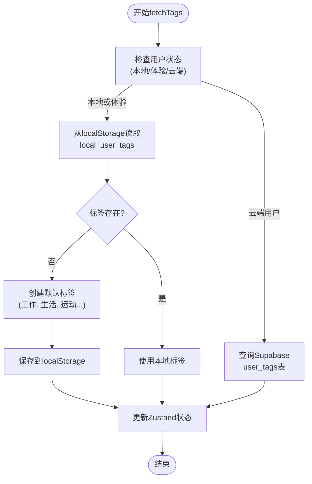

# 标签CRUD操作实现

<cite>
**本文档引用的文件**  
- [src/store/index.ts](file://src/store/index.ts)
- [src/lib/supabase.ts](file://src/lib/supabase.ts)
- [supabase/migrations/fix_registration_rls.sql](file://supabase/migrations/fix_registration_rls.sql)
- [src/pages/Record.tsx](file://src/pages/Record.tsx)
</cite>

## 目录
1. [简介](#简介)
2. [项目结构](#项目结构)
3. [核心组件](#核心组件)
4. [架构概述](#架构概述)
5. [详细组件分析](#详细组件分析)
6. [依赖分析](#依赖分析)
7. [性能考虑](#性能考虑)
8. [故障排除指南](#故障排除指南)
9. [结论](#结论)

## 简介
本文档深入解析“心情记录”应用中标签的创建、读取、更新和删除（CRUD）操作在前端状态管理中的实现机制。重点分析基于Zustand的状态管理器如何与Supabase后端数据库交互，同时支持本地体验模式和云端认证用户的数据分离策略。文档详细说明了`fetchTags`、`createUserTag`、`updateTag`和`deleteTag`等异步操作函数的逻辑流程，涵盖错误处理、状态同步和用户体验优化等方面。

## 项目结构
项目采用典型的前端架构，核心状态管理位于`src/store/index.ts`，数据访问通过`src/lib/supabase.ts`封装的Supabase客户端进行。应用支持本地体验模式（localStorage）和云端认证用户（Supabase Auth）两种数据存储策略。

**图示来源**  
- [src/store/index.ts](file://src/store/index.ts#L1-L557)
- [src/lib/supabase.ts](file://src/lib/supabase.ts#L1-L47)

**本节来源**  
- [src/store/index.ts](file://src/store/index.ts#L1-L557)
- [src/lib/supabase.ts](file://src/lib/supabase.ts#L1-L47)

## 核心组件
核心组件包括`useMoodStore`状态管理器，它负责管理心情记录和用户标签的全局状态。该组件通过异步函数与Supabase数据库或本地存储进行交互，确保数据的一致性和实时性。

**本节来源**  
- [src/store/index.ts](file://src/store/index.ts#L35-L557)

## 架构概述
系统采用分层架构，前端通过Zustand进行状态管理，后端使用Supabase提供数据库和认证服务。数据流遵循单向原则：用户操作触发状态更新函数，函数与数据库交互后，将结果同步回全局状态，最终反映在UI上。

**图示来源**  
- [src/store/index.ts](file://src/store/index.ts#L490-L499)
- [src/lib/supabase.ts](file://src/lib/supabase.ts#L22-L28)

## 详细组件分析

### 标签CRUD操作分析
`useMoodStore`中的标签CRUD操作实现了对`user_tags`表的完整控制，并根据用户类型（本地体验或云端认证）选择不同的数据存储策略。

#### 数据模型

**图示来源**  
- [src/lib/supabase.ts](file://src/lib/supabase.ts#L22-L28)
- [supabase/migrations/fix_registration_rls.sql](file://supabase/migrations/fix_registration_rls.sql#L66-L104)

#### 获取标签 (fetchTags)
`fetchTags`函数根据用户状态决定数据来源：
- **本地/体验模式**：从`localStorage`读取`local_user_tags`，若为空则创建默认标签集。
- **云端用户**：通过Supabase客户端从`user_tags`表查询数据。

**图示来源**  
- [src/store/index.ts](file://src/store/index.ts#L309-L347)
- [src/pages/Record.tsx](file://src/pages/Record.tsx#L27-L46)

#### 创建标签 (createTag)
`createTag`函数仅对已认证的云端用户有效。它将新标签插入`user_tags`表，并将创建的标签添加到本地状态数组末尾。

**图示来源**  
- [src/store/index.ts](file://src/store/index.ts#L490-L504)

#### 更新标签 (updateTag)
`updateTag`函数接收标签ID和更新字段，通过Supabase更新数据库记录，并使用Zustand的`set`函数映射更新本地状态数组中的对应项。

**图示来源**  
- [src/store/index.ts](file://src/store/index.ts#L516-L528)

#### 删除标签 (deleteTag)
`deleteTag`函数从`user_tags`表中删除指定ID的标签，并通过过滤本地状态数组来移除该标签。

**图示来源**  
- [src/store/index.ts](file://src/store/index.ts#L539-L557)

**本节来源**  
- [src/store/index.ts](file://src/store/index.ts#L309-L557)

## 依赖分析
应用依赖Supabase进行后端服务，包括数据库存储和用户认证。前端状态管理依赖Zustand库，确保状态变更的高效和可预测性。

**图示来源**  
- [src/store/index.ts](file://src/store/index.ts#L1-L557)
- [src/lib/supabase.ts](file://src/lib/supabase.ts#L1-L47)

**本节来源**  
- [src/store/index.ts](file://src/store/index.ts#L1-L557)
- [src/lib/supabase.ts](file://src/lib/supabase.ts#L1-L47)

## 性能考虑
- **本地优先**：体验模式和本地用户使用`localStorage`，避免网络请求，提升响应速度。
- **状态批量更新**：Zustand确保状态更新是原子的，避免不必要的UI重渲染。
- **错误容忍**：在创建记录时，即使标签关联失败，主记录仍能成功创建，保证核心功能可用。

## 故障排除指南
- **标签无法创建**：检查用户是否已登录（`user`对象是否存在）。
- **标签未显示**：确认`fetchTags`是否已调用，或检查Supabase策略是否允许读取。
- **并发编辑冲突**：Supabase的行级安全（RLS）策略确保用户只能操作自己的数据，避免冲突。

**本节来源**  
- [src/store/index.ts](file://src/store/index.ts#L490-L557)
- [supabase/migrations/fix_registration_rls.sql](file://supabase/migrations/fix_registration_rls.sql#L66-L104)

## 结论
本文档详细解析了“心情记录”应用中标签CRUD操作的实现。通过Zustand与Supabase的结合，应用实现了高效、安全的状态管理，同时兼顾了用户体验和数据一致性。开发者在调用这些API时，应确保用户状态已正确初始化，并妥善处理可能的异步错误。