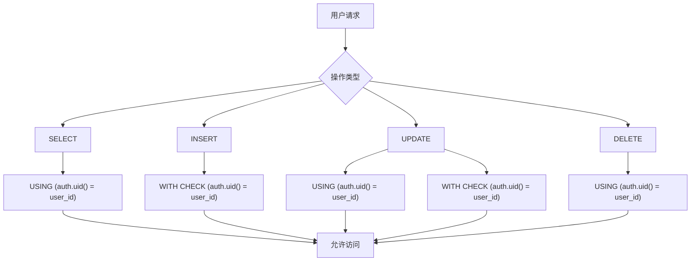
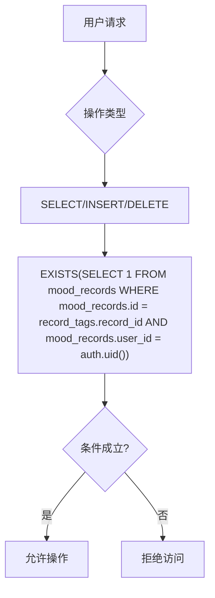

# 标签数据模型与数据库设计

<cite>
**本文档引用的文件**  
- [create_mood_diary_tables.sql](file://supabase/migrations/create_mood_diary_tables.sql)
- [fix_registration_rls.sql](file://supabase/migrations/fix_registration_rls.sql)
- [fix_record_tags_permissions.sql](file://supabase/migrations/fix_record_tags_permissions.sql)
- [index.ts](file://src/store/index.ts)
</cite>

## 目录
1. [引言](#引言)
2. [用户标签表（user_tags）数据模型](#用户标签表user_tags数据模型)
3. [记录标签关联表（record_tags）数据模型](#记录标签关联表record_tags数据模型)
4. [行级安全（RLS）策略解析](#行级安全rls策略解析)
5. [默认标签初始化逻辑](#默认标签初始化逻辑)
6. [数据库查询性能优化建议](#数据库查询性能优化建议)
7. [结论](#结论)

## 引言
本文档全面阐述心情日记应用中用户标签（user_tags）和记录标签关联（record_tags）的数据模型设计。基于 Supabase 数据库迁移脚本，详细描述两张核心表的字段定义、约束机制、索引策略及行级安全规则。重点分析数据隔离机制如何保障用户只能操作自身创建的标签及其关联记录，并说明默认标签的初始化流程与本地存储实现方式，最后提供数据库性能优化建议。

**Section sources**
- [create_mood_diary_tables.sql](file://supabase/migrations/create_mood_diary_tables.sql#L0-L109)

## 用户标签表（user_tags）数据模型

### 字段类型与约束
`user_tags` 表用于存储用户自定义的标签信息，其结构设计如下：

| 字段名 | 类型 | 约束 | 说明 |
|--------|------|------|------|
| id | UUID | PRIMARY KEY, DEFAULT gen_random_uuid() | 标签唯一标识符 |
| user_id | UUID | REFERENCES auth.users(id) ON DELETE CASCADE NOT NULL | 所属用户ID，外键关联认证用户表 |
| tag_name | VARCHAR(50) | NOT NULL | 标签名称，最大长度50字符 |
| color | VARCHAR(7) | DEFAULT '#FF6B35' | 标签颜色，HEX格式，默认为橙色 |
| created_at | TIMESTAMP WITH TIME ZONE | DEFAULT NOW() | 创建时间戳 |

该表通过 `UNIQUE(user_id, tag_name)` 约束确保同一用户不能创建同名标签，防止数据冗余。

### 索引策略
为提升查询性能，系统在 `user_id` 字段上创建了索引：
```sql
CREATE INDEX idx_user_tags_user_id ON user_tags(user_id);
```
此索引支持按用户快速检索其所有标签，适用于标签列表加载等高频操作。

**Section sources**
- [create_mood_diary_tables.sql](file://supabase/migrations/create_mood_diary_tables.sql#L31-L45)

## 记录标签关联表（record_tags）数据模型

### 字段类型与约束
`record_tags` 表作为多对多关联表，连接心情记录（mood_records）与用户标签（user_tags），其结构如下：

| 字段名 | 类型 | 约束 | 说明 |
|--------|------|------|------|
| record_id | UUID | REFERENCES mood_records(id) ON DELETE CASCADE | 心情记录ID，外键 |
| tag_id | UUID | REFERENCES user_tags(id) ON DELETE CASCADE | 标签ID，外键 |
| PRIMARY KEY | (record_id, tag_id) | 唯一组合主键 | 防止重复关联 |

该表采用复合主键设计，确保每条记录与每个标签之间最多存在一条关联关系。

### 索引策略
由于主键 `(record_id, tag_id)` 自动创建唯一索引，系统无需额外索引即可高效支持基于记录ID或标签ID的查询。该设计优化了标签聚合分析和记录详情加载场景。

**Section sources**
- [create_mood_diary_tables.sql](file://supabase/migrations/create_mood_diary_tables.sql#L55-L65)

## 行级安全（RLS）策略解析

### 用户标签表RLS控制
`user_tags` 表启用了行级安全，确保用户只能管理自己的标签。相关策略如下：



**Diagram sources**
- [create_mood_diary_tables.sql](file://supabase/migrations/create_mood_diary_tables.sql#L47-L53)
- [fix_registration_rls.sql](file://supabase/migrations/fix_registration_rls.sql#L66-L78)

### 记录标签关联表RLS控制
`record_tags` 表的RLS策略更为复杂，需确保用户仅能操作其拥有记录的标签关联：



该策略通过子查询验证目标记录是否属于当前用户，实现了间接的数据隔离，防止越权操作。

**Diagram sources**
- [create_mood_diary_tables.sql](file://supabase/migrations/create_mood_diary_tables.sql#L67-L71)
- [fix_registration_rls.sql](file://supabase/migrations/fix_registration_rls.sql#L85-L104)

## 默认标签初始化逻辑

### 数据库层实现
系统通过数据库函数与触发器自动为新用户创建默认标签：

```sql
CREATE OR REPLACE FUNCTION create_default_tags()
RETURNS TRIGGER AS $$
BEGIN
  INSERT INTO user_tags (user_id, tag_name, color) VALUES
    (NEW.id, '工作', '#FF6B35'),
    (NEW.id, '生活', '#4A90E2'),
    (NEW.id, '运动', '#7ED321'),
    (NEW.id, '学习', '#9013FE'),
    (NEW.id, '社交', '#FF9500');
  RETURN NEW;
END;
$$ LANGUAGE plpgsql;

CREATE TRIGGER create_user_default_tags
  AFTER INSERT ON user_profiles
  FOR EACH ROW
  EXECUTE FUNCTION create_default_tags();
```

当新用户资料插入 `user_profiles` 表后，触发器将调用 `create_default_tags()` 函数，自动为其创建五项常用标签。

### 本地存储实现
对于体验模式或未登录用户，前端在 `src/store/index.ts` 中实现本地默认标签初始化：

```typescript
const defaultTags = [
  { id: 'local_tag_1', user_id: userId, tag_name: '工作', color: '#FF6B35', created_at: new Date().toISOString() },
  { id: 'local_tag_2', user_id: userId, tag_name: '生活', color: '#4A90E2', created_at: new Date().toISOString() },
  // ... 其他标签
];
localStorage.setItem('local_user_tags', JSON.stringify(defaultTags));
```

该逻辑在用户首次访问时检查本地存储，若无标签则生成默认集合并持久化。

**Section sources**
- [create_mood_diary_tables.sql](file://supabase/migrations/create_mood_diary_tables.sql#L72-L88)
- [index.ts](file://src/store/index.ts#L326-L352)

## 数据库查询性能优化建议

### 索引使用建议
- **user_tags 表**：现有 `idx_user_tags_user_id` 索引已满足按用户查询需求，无需额外索引。
- **record_tags 表**：复合主键提供高效查询能力，若需按标签统计使用频率，可考虑添加 `CREATE INDEX idx_record_tags_tag_id ON record_tags(tag_id);`。
- **mood_records 表**：已有 `idx_mood_records_user_id` 和 `idx_mood_records_created_at`，支持高效的时间线查询。

### 数据聚合查询模式
推荐使用 Supabase 的嵌套查询语法一次性获取记录及其标签：

```sql
SELECT 
  *,
  record_tags (
    tag_id,
    user_tags (
      id,
      tag_name,
      color
    )
  )
FROM mood_records
ORDER BY created_at DESC;
```

此模式减少客户端请求次数，提升数据加载效率。

### 前端缓存策略
结合 Zustand 状态管理，实现标签数据的本地缓存：

```typescript
fetchTags: async () => {
  // 优先从本地状态或localStorage读取
  // 仅当缓存缺失时发起数据库查询
}
```

避免重复请求，提升用户体验。

**Section sources**
- [create_mood_diary_tables.sql](file://supabase/migrations/create_mood_diary_tables.sql#L10-L15)
- [index.ts](file://src/store/index.ts#L289-L352)

## 结论
本系统通过精心设计的 `user_tags` 和 `record_tags` 表结构，实现了灵活的标签分类功能。结合严格的行级安全策略，保障了用户数据的隔离性与安全性。默认标签的自动化初始化提升了新用户体验，而合理的索引与查询模式则确保了系统的高性能运行。整体设计兼顾了功能性、安全性和可扩展性，为心情日记应用提供了坚实的数据基础。