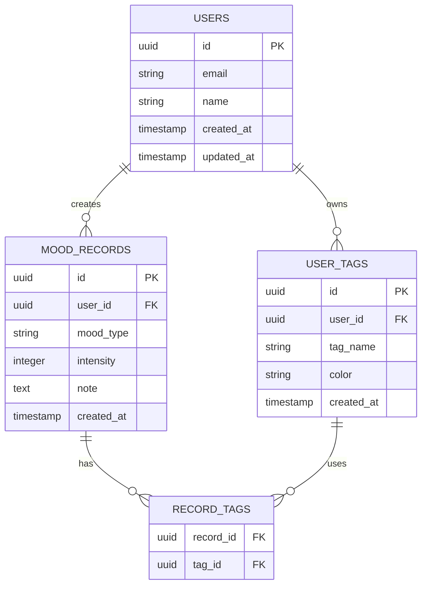
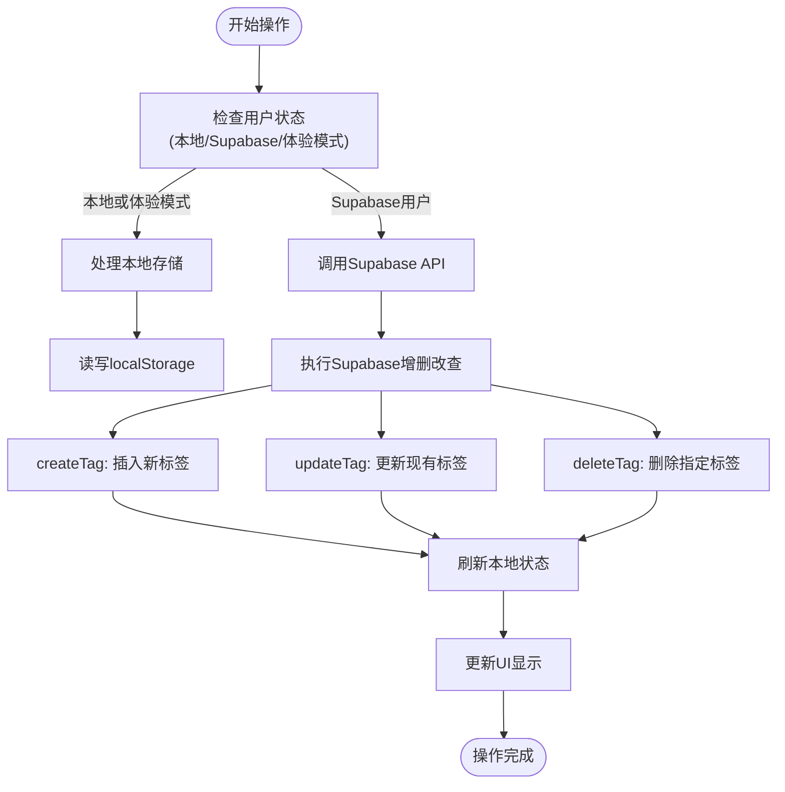
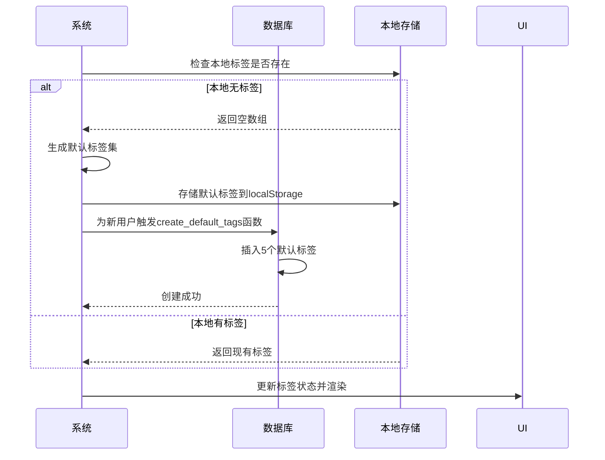
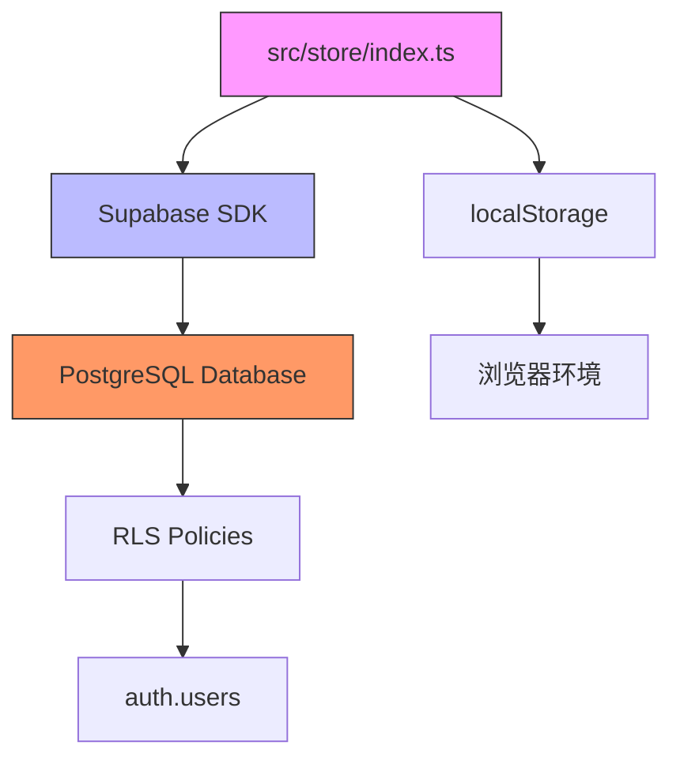

# 标签管理系统

<cite>
**本文档引用文件**  
- [src/store/index.ts](file://src/store/index.ts)
- [supabase/migrations/create_mood_diary_tables.sql](file://supabase/migrations/create_mood_diary_tables.sql)
- [src/lib/supabase.ts](file://src/lib/supabase.ts)
</cite>

## 目录
1. [引言](#引言)
2. [项目结构](#项目结构)
3. [核心组件](#核心组件)
4. [架构概览](#架构概览)
5. [详细组件分析](#详细组件分析)
6. [依赖分析](#依赖分析)
7. [性能考量](#性能考量)
8. [故障排除指南](#故障排除指南)
9. [结论](#结论)

## 引言
本系统为心情记录应用提供完整的标签管理功能，支持用户通过UI界面创建、编辑和删除自定义标签（UserTag），并将这些标签与具体的心情记录（RecordTag）进行关联。系统采用Zustand状态管理库结合Supabase后端服务，实现了前后端一致的数据流控制。通过本地存储支持体验模式与离线操作，确保良好的用户体验。

## 项目结构
标签管理功能主要分布在以下目录中：
- `src/store/index.ts`：核心状态管理逻辑，包含标签的增删改查操作
- `supabase/migrations/`：数据库表结构定义及RLS安全策略
- `src/lib/supabase.ts`：类型定义与Supabase客户端配置
- `src/pages/`：页面级UI组件，如记录、设置等页面

**Section sources**
- [src/store/index.ts](file://src/store/index.ts#L1-L557)
- [supabase/migrations/create_mood_diary_tables.sql](file://supabase/migrations/create_mood_diary_tables.sql#L1-L110)

## 核心组件
系统围绕`useMoodStore`状态管理器构建，提供`fetchUserTags`、`createUserTag`、`deleteUserTag`等方法，统一处理本地与远程数据同步。标签数据结构包括唯一ID、用户ID、标签名称和颜色值，支持个性化视觉呈现。

**Section sources**
- [src/store/index.ts](file://src/store/index.ts#L200-L557)
- [src/lib/supabase.ts](file://src/lib/supabase.ts#L22-L28)

## 架构概览
系统采用分层架构设计，前端通过Zustand管理状态，中间层使用Supabase SDK进行数据交互，后端基于PostgreSQL实现数据持久化与行级安全控制。标签系统通过多对多关联表实现灵活的数据组织。



**Diagram sources**
- [supabase/migrations/create_mood_diary_tables.sql](file://supabase/migrations/create_mood_diary_tables.sql#L1-L110)
- [src/lib/supabase.ts](file://src/lib/supabase.ts#L22-L33)

## 详细组件分析

### 用户标签管理分析
用户可通过UI界面创建、编辑和删除自定义标签。所有操作均通过`useMoodStore`中的异步方法实现，并自动同步至本地存储或Supabase数据库。

#### 状态操作逻辑


**Diagram sources**
- [src/store/index.ts](file://src/store/index.ts#L400-L557)

**Section sources**
- [src/store/index.ts](file://src/store/index.ts#L400-L557)

### 数据库表结构解析
系统通过SQL迁移脚本定义了三张核心表，确保数据一致性与安全性。

#### user_tags 表结构
```sql
CREATE TABLE user_tags (
  id UUID PRIMARY KEY DEFAULT gen_random_uuid(),
  user_id UUID REFERENCES auth.users(id) ON DELETE CASCADE NOT NULL,
  tag_name VARCHAR(50) NOT NULL,
  color VARCHAR(7) DEFAULT '#FF6B35',
  created_at TIMESTAMP WITH TIME ZONE DEFAULT NOW(),
  UNIQUE(user_id, tag_name)
);
```

- **主键约束**：`id` 为UUID主键
- **外键约束**：`user_id` 关联 `auth.users` 表，删除用户时级联删除标签
- **唯一性约束**：同一用户不能创建同名标签
- **默认值**：颜色字段默认为橙色 `#FF6B35`

#### record_tags 表结构
```sql
CREATE TABLE record_tags (
  record_id UUID REFERENCES mood_records(id) ON DELETE CASCADE,
  tag_id UUID REFERENCES user_tags(id) ON DELETE CASCADE,
  PRIMARY KEY (record_id, tag_id)
);
```

- **复合主键**：`(record_id, tag_id)` 唯一标识一个关联
- **双外键级联删除**：任一端删除时自动清理关联记录

#### RLS（行级安全）策略
```sql
CREATE POLICY "用户只能管理自己的标签" ON user_tags
  FOR ALL USING (auth.uid() = user_id);

CREATE POLICY "用户只能管理自己记录的标签" ON record_tags
  FOR ALL USING (
    EXISTS (
      SELECT 1 FROM mood_records 
      WHERE mood_records.id = record_tags.record_id 
      AND mood_records.user_id = auth.uid()
    )
  );
```

- **权限控制**：每个用户只能访问和修改属于自己的标签数据
- **细粒度安全**：通过`auth.uid()`函数验证当前用户身份

**Section sources**
- [supabase/migrations/create_mood_diary_tables.sql](file://supabase/migrations/create_mood_diary_tables.sql#L50-L110)

### 默认标签初始化机制
系统在用户首次使用时自动创建一组默认标签，提升初始体验。



**Diagram sources**
- [src/store/index.ts](file://src/store/index.ts#L250-L290)
- [supabase/migrations/create_mood_diary_tables.sql](file://supabase/migrations/create_mood_diary_tables.sql#L90-L110)

**Section sources**
- [src/store/index.ts](file://src/store/index.ts#L250-L290)
- [supabase/migrations/create_mood_diary_tables.sql](file://supabase/migrations/create_mood_diary_tables.sql#L90-L110)

## 依赖分析
系统依赖关系清晰，前端状态管理独立于UI组件，数据库通过Supabase SDK封装，降低耦合度。



**Diagram sources**
- [src/store/index.ts](file://src/store/index.ts#L1-L557)
- [supabase/migrations/create_mood_diary_tables.sql](file://supabase/migrations/create_mood_diary_tables.sql#L1-L110)

**Section sources**
- [src/store/index.ts](file://src/store/index.ts#L1-L557)
- [supabase/migrations/create_mood_diary_tables.sql](file://supabase/migrations/create_mood_diary_tables.sql#L1-L110)

## 性能考量
- **本地优先策略**：体验模式和本地用户优先使用localStorage，减少网络请求
- **批量操作优化**：标签关联采用批量插入，减少数据库往返次数
- **索引优化**：关键字段如`user_id`、`created_at`均已建立索引
- **状态更新效率**：使用Zustand的不可变更新机制，避免不必要的重渲染

## 故障排除指南
常见问题及解决方案：

| 问题现象 | 可能原因 | 解决方案 |
|--------|--------|--------|
| 标签无法保存 | 用户未登录 | 检查认证状态，确保`user`存在 |
| 标签重复创建 | 唯一性约束失效 | 检查数据库`UNIQUE(user_id, tag_name)`约束 |
| 标签不显示 | RLS策略阻止访问 | 验证`auth.uid()`是否正确返回当前用户ID |
| 关联丢失 | 级联删除触发 | 检查`ON DELETE CASCADE`行为是否符合预期 |

**Section sources**
- [src/store/index.ts](file://src/store/index.ts#L400-L557)
- [supabase/migrations/create_mood_diary_tables.sql](file://supabase/migrations/create_mood_diary_tables.sql#L50-L110)

## 结论
标签管理系统通过清晰的分层架构和严格的安全策略，实现了高效、安全的数据管理。前端状态管理与后端数据库设计协同工作，既保证了用户体验，又维护了数据一致性。建议未来可扩展以下功能：
- 批量导入/导出标签配置
- 标签分组与层级管理
- 标签使用统计分析
- 跨设备同步机制

系统已具备良好的可扩展性基础，可通过Supabase的实时功能进一步增强多端协同能力。