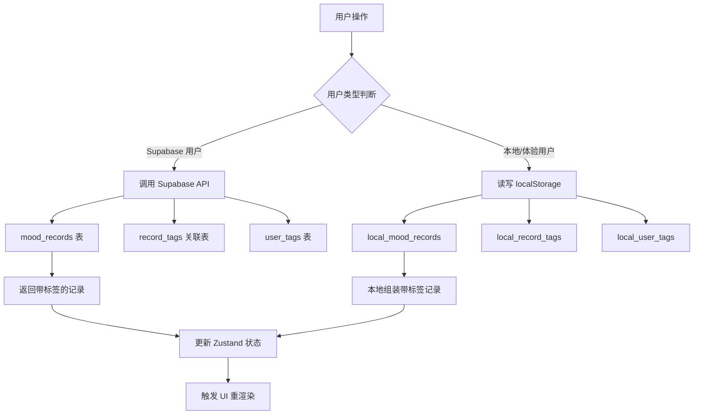
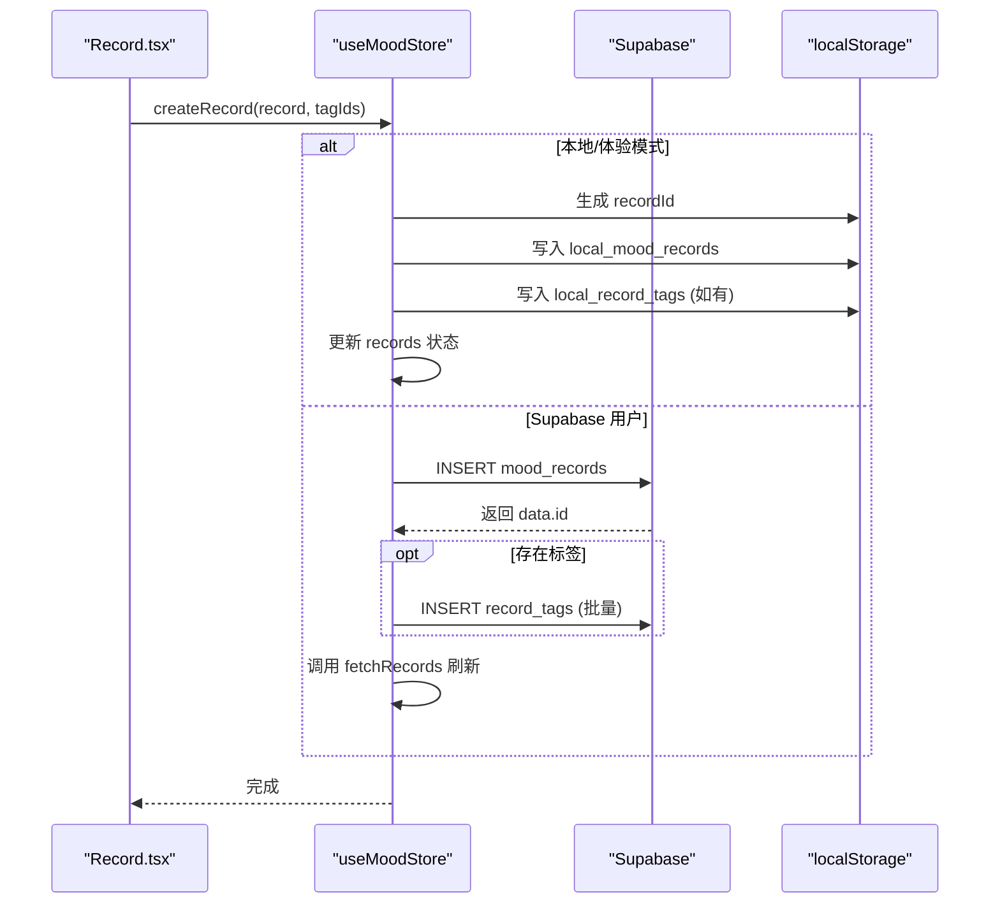
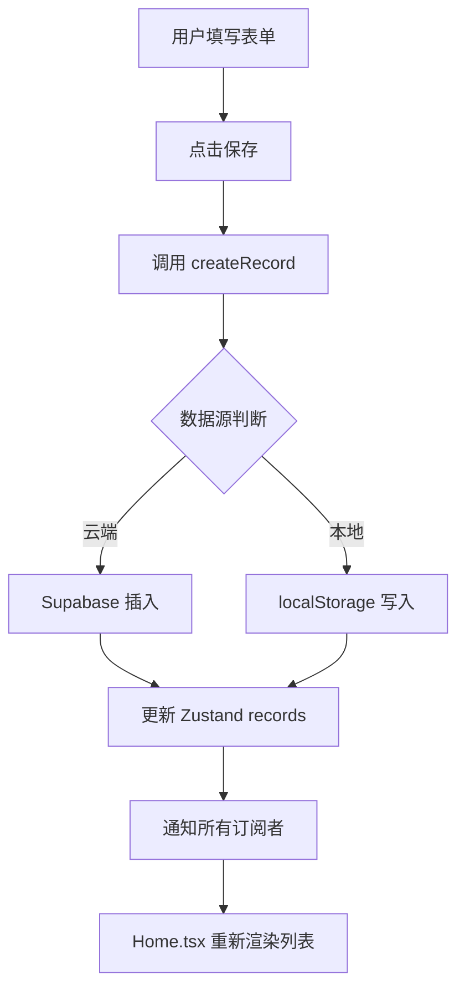
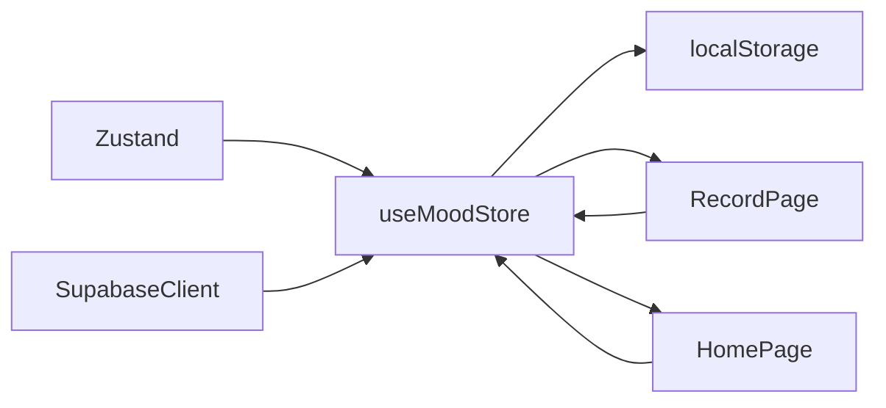

# 心情数据状态管理

<cite>
**本文档引用文件**  
- [index.ts](file://src/store/index.ts)
- [supabase.ts](file://src/lib/supabase.ts)
- [Record.tsx](file://src/pages/Record.tsx)
- [Home.tsx](file://src/pages/Home.tsx)
</cite>

## 目录
1. [简介](#简介)
2. [项目结构](#项目结构)
3. [核心组件](#核心组件)
4. [架构概览](#架构概览)
5. [详细组件分析](#详细组件分析)
6. [依赖分析](#依赖分析)
7. [性能考虑](#性能考虑)
8. [故障排除指南](#故障排除指南)
9. [结论](#结论)

## 简介
`useMoodStore` 是一个基于 Zustand 的状态管理模块，用于统一管理心情记录应用中的心情数据（记录、标签、加载状态等）。该 store 支持多种用户类型：Supabase 认证用户、本地用户和体验模式用户，并根据用户类型智能切换数据源——云端使用 Supabase 数据库，本地则通过 `localStorage` 实现持久化。本文档深入解析其设计与实现机制，涵盖状态结构、核心方法、数据同步策略及与 UI 组件的交互方式。

## 项目结构

```mermaid
graph TB
subgraph "核心模块"
Store[store/index.ts]
Lib[lib/supabase.ts]
Pages[pages/]
end
subgraph "UI 组件"
RecordPage[pages/Record.tsx]
HomePage[pages/Home.tsx]
end
Store --> Lib : "使用 Supabase 客户端"
RecordPage --> Store : "调用 createRecord"
HomePage --> Store : "调用 fetchRecords"
Store --> LocalStorage["localStorage API"]
```

**Diagram sources**  
- [index.ts](file://src/store/index.ts#L1-L557)
- [supabase.ts](file://src/lib/supabase.ts#L1-L47)
- [Record.tsx](file://src/pages/Record.tsx#L1-L260)
- [Home.tsx](file://src/pages/Home.tsx)

**Section sources**  
- [index.ts](file://src/store/index.ts#L1-L557)
- [supabase.ts](file://src/lib/supabase.ts#L1-L47)

## 核心组件

`useMoodStore` 管理的核心状态包括：
- `records`: 心情记录数组，每条记录包含情绪类型、强度、笔记及关联标签。
- `tags`: 用户自定义标签集合，用于分类心情记录。
- `loading`: 布尔值，表示当前是否正在进行异步操作。

核心操作方法包括：
- `fetchRecords`: 获取所有心情记录（含标签）。
- `fetchTags`: 获取用户标签列表。
- `createRecord`: 创建新心情记录并关联标签。
- `updateRecord`: 更新指定记录。
- `deleteRecord`: 删除指定记录。

这些方法均根据当前用户类型（Supabase 用户、本地用户或体验模式）自动选择数据源。

**Section sources**  
- [index.ts](file://src/store/index.ts#L100-L557)

## 架构概览



**Diagram sources**  
- [index.ts](file://src/store/index.ts#L200-L500)
- [supabase.ts](file://src/lib/supabase.ts#L10-L35)

## 详细组件分析

### useMoodStore 状态管理分析

#### 状态结构与类型定义
`useMoodStore` 的状态结构清晰地划分为记录、标签和加载状态三部分。其类型 `MoodState` 定义了所有可操作的方法和状态字段，确保类型安全。

**Section sources**  
- [index.ts](file://src/store/index.ts#L80-L98)

#### createRecord 方法标签关联逻辑分析
`createRecord` 方法在创建心情记录时，支持传入 `tagIds` 数组以建立与标签的关联。对于 Supabase 用户，该方法首先插入主记录到 `mood_records` 表，然后将 `record_id` 与 `tag_id` 的组合批量插入 `record_tags` 多对多关联表。对于本地用户，则将关联关系以 `{record_id, tag_id}` 对象形式存储在 `local_record_tags` 键中。



**Diagram sources**  
- [index.ts](file://src/store/index.ts#L350-L420)
- [Record.tsx](file://src/pages/Record.tsx#L150-L180)

#### fetchRecords 方法嵌套查询分析
`fetchRecords` 方法利用 Supabase 的 PostgREST API 特性，在查询 `mood_records` 表时通过 `select` 参数嵌套查询 `record_tags` 及其关联的 `user_tags` 信息。SQL 等效于：
```sql
SELECT *, 
       (SELECT tag_id, (SELECT id, tag_name, color FROM user_tags WHERE id=tag_id) 
        FROM record_tags WHERE record_id=mood_records.id) 
FROM mood_records 
ORDER BY created_at DESC;
```
这使得单次请求即可获取包含完整标签信息的记录集合，避免了多次网络请求。

**Section sources**  
- [index.ts](file://src/store/index.ts#L200-L240)

#### 本地存储实现细节分析
本地存储使用三个独立的键来管理数据：
- `local_mood_records`: 存储心情记录数组。
- `local_user_tags`: 存储用户标签数组。
- `local_record_tags`: 存储记录与标签的关联关系数组。

在 `fetchRecords` 中，当处于本地模式时，store 会从这三个键分别读取数据，并在内存中手动“连接”（join）它们，为每条记录添加 `record_tags` 字段，最后按创建时间排序返回。这种设计模拟了数据库的关联查询，保证了本地与云端数据结构的一致性。

**Section sources**  
- [index.ts](file://src/store/index.ts#L210-L235)

### UI 组件交互分析

#### Record.tsx 组件状态更新分析
`Record.tsx` 组件通过 `useMoodStore` 钩子订阅 `tags` 状态和 `createRecord` 方法。当用户点击保存时，组件收集表单数据，调用 `createRecord`。store 状态更新后，Zustand 自动通知所有订阅者，但 `Record.tsx` 本身在保存后会导航回首页，真正的重渲染发生在 `Home.tsx` 页面。



**Diagram sources**  
- [Record.tsx](file://src/pages/Record.tsx#L150-L180)
- [index.ts](file://src/store/index.ts#L350-L420)

#### Home.tsx 组件数据同步分析
`Home.tsx` 组件在挂载时调用 `fetchRecords`，从相应数据源加载数据并填充到 `records` 状态。由于组件使用 `useMoodStore(state => state.records)` 订阅了记录列表，每当 `createRecord`、`updateRecord` 或 `deleteRecord` 被调用并更新状态时，`Home.tsx` 会立即重新渲染，展示最新数据，实现了实时同步。

**Section sources**  
- [Home.tsx](file://src/pages/Home.tsx)
- [index.ts](file://src/store/index.ts#L200-L240)

## 依赖分析



**Diagram sources**  
- [index.ts](file://src/store/index.ts)
- [Record.tsx](file://src/pages/Record.tsx)
- [Home.tsx](file://src/pages/Home.tsx)

**Section sources**  
- [index.ts](file://src/store/index.ts#L1-L557)

## 性能考虑

为优化性能，建议：
1. **避免在循环中调用 store 方法**：如非必要，不要在 `map` 或 `forEach` 循环中频繁调用 `createRecord` 等异步方法，应考虑批量操作。
2. **选择性订阅状态**：组件应仅订阅所需的状态字段（如 `state.records` 而非整个 `state`），以减少不必要的重渲染。
3. **本地模式优化**：在本地模式下，所有操作均为同步的 `localStorage` 操作，响应迅速，但大量数据时需注意序列化/反序列化的开销。

**Section sources**  
- [index.ts](file://src/store/index.ts)
- [Record.tsx](file://src/pages/Record.tsx)

## 故障排除指南

常见问题及解决方案：
- **问题**：新记录保存后未在首页显示。
  **原因**：`createRecord` 在 Supabase 模式下未调用 `fetchRecords` 刷新。
  **解决**：确保 `createRecord` 方法在插入成功后调用 `get().fetchRecords()`。

- **问题**：本地模式下标签丢失。
  **原因**：`local_user_tags` 未正确初始化。
  **解决**：`fetchTags` 方法在本地标签为空时会创建默认标签集，确保逻辑正确执行。

- **问题**：体验模式无法使用。
  **原因**：`localStorage` 中 `experience_mode` 未设为 `'true'`。
  **解决**：检查 `useAuthStore` 的 `initializeAuth` 方法中对 `experience_mode` 的判断逻辑。

**Section sources**  
- [index.ts](file://src/store/index.ts#L350-L420)
- [index.ts](file://src/store/index.ts#L250-L290)

## 结论

`useMoodStore` 通过 Zustand 实现了高效、灵活的状态管理。其核心优势在于能够无缝适配多种用户场景（云端、本地、体验），通过统一的 API 抽象了底层数据源的差异。结合 Supabase 强大的嵌套查询能力和 `localStorage` 的离线持久化，为用户提供了流畅一致的数据操作体验。未来可进一步优化批量操作和数据同步策略。