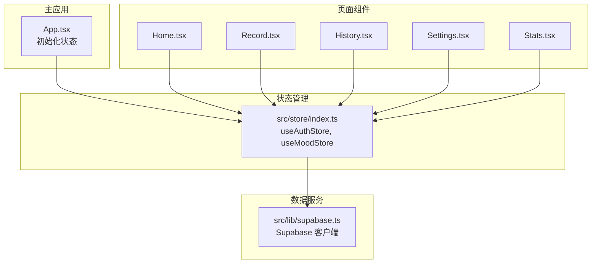
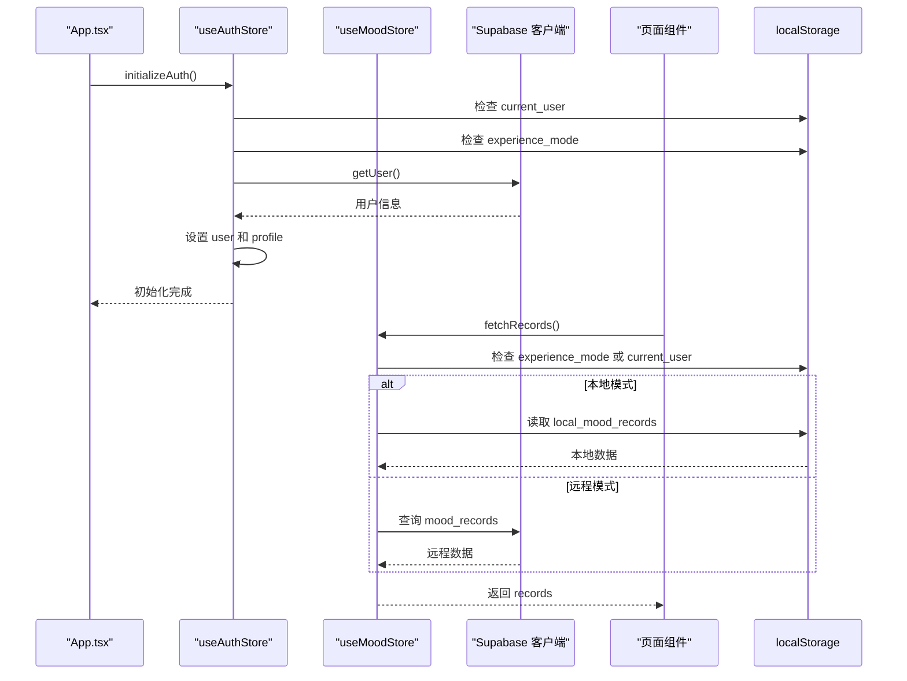
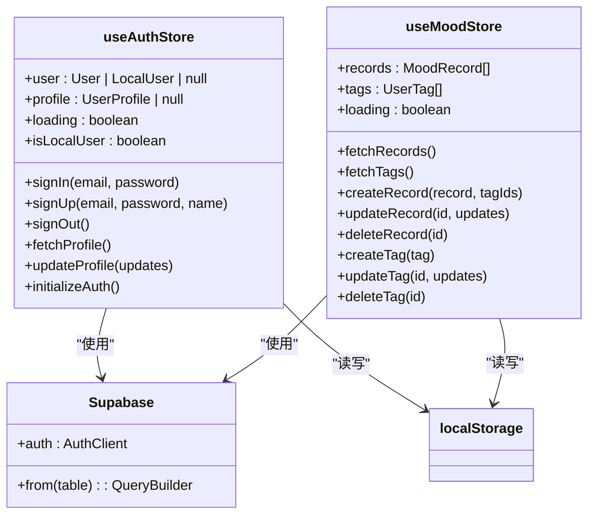
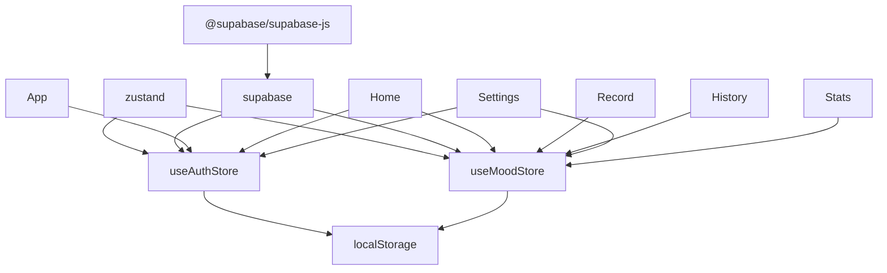

# 状态管理架构

<cite>
**本文档引用的文件**  
- [index.ts](file://src/store/index.ts)
- [App.tsx](file://src/App.tsx)
- [supabase.ts](file://src/lib/supabase.ts)
</cite>

## 目录
1. [项目结构](#项目结构)
2. [核心组件](#核心组件)
3. [架构概述](#架构概述)
4. [详细组件分析](#详细组件分析)
5. [依赖分析](#依赖分析)
6. [性能考虑](#性能考虑)
7. [故障排除指南](#故障排除指南)
8. [结论](#结论)

## 项目结构

项目采用模块化结构，状态管理集中于 `src/store/index.ts` 文件中，通过 Zustand 实现全局状态管理。`App.tsx` 作为应用入口，负责初始化状态。`src/lib/supabase.ts` 提供与 Supabase 后端服务的集成接口。各页面组件通过 Hooks 消费状态，实现数据驱动的 UI 更新。

**图示来源**
- [index.ts](file://src/store/index.ts)
- [App.tsx](file://src/App.tsx)
- [supabase.ts](file://src/lib/supabase.ts)

**本节来源**
- [index.ts](file://src/store/index.ts)
- [App.tsx](file://src/App.tsx)

## 核心组件

状态管理架构的核心是 `useAuthStore` 和 `useMoodStore` 两个 Zustand Store。`useAuthStore` 管理用户认证状态、个人资料及登录/登出逻辑，支持本地用户、Supabase 认证用户和体验模式。`useMoodStore` 管理心情记录和标签数据，提供增删改查操作，并根据用户类型自动选择本地存储或远程数据库。

**本节来源**
- [index.ts](file://src/store/index.ts#L1-L557)

## 架构概述

系统采用 Zustand 作为状态管理库，通过 Provider 模式在 `App.tsx` 中注入全局状态。各组件通过自定义 Hook 消费状态，状态更新自动触发 UI 重渲染。数据持久化通过 `localStorage` 实现，支持本地用户和体验模式。与 Supabase 的集成确保了远程数据的同步。

**图示来源**
- [index.ts](file://src/store/index.ts#L1-L557)
- [App.tsx](file://src/App.tsx#L1-L27)

## 详细组件分析

### 认证状态管理分析

`useAuthStore` 采用 Zustand 的 `create` 函数定义，包含用户信息、个人资料、加载状态等。通过 `initializeAuth` 方法在应用启动时检查用户状态，支持三种模式：本地用户、Supabase 用户和体验模式。登录、注册、登出等操作均通过 Supabase SDK 与后端交互，并更新本地状态。

**图示来源**
- [index.ts](file://src/store/index.ts#L1-L557)

### 心情数据状态管理分析

`useMoodStore` 管理心情记录和标签数据。`fetchRecords` 和 `fetchTags` 方法根据用户类型选择数据源：本地用户和体验模式从 `localStorage` 读取，Supabase 用户从数据库查询。`createRecord` 等操作同样根据用户类型决定数据存储位置，确保数据一致性。

**本节来源**
- [index.ts](file://src/store/index.ts#L1-L557)

## 依赖分析

状态管理模块依赖于 `zustand` 库进行状态管理，`@supabase/supabase-js` 库进行后端通信。`localStorage` 用于数据持久化。各页面组件依赖 `useAuthStore` 和 `useMoodStore` 获取状态。`App.tsx` 依赖 `useAuthStore` 进行初始化。

**图示来源**
- [index.ts](file://src/store/index.ts)
- [package.json](file://package.json)

**本节来源**
- [index.ts](file://src/store/index.ts)
- [package.json](file://package.json)

## 性能考虑

为避免不必要的重新渲染，组件应使用 Zustand 的选择器（selector）来订阅特定状态。例如，`const user = useAuthStore(state => state.user)` 只有在 `user` 变化时才会触发组件更新。对于复杂状态计算，可使用 `useMemo` 进行缓存。`localStorage` 的读写操作应尽量减少，避免阻塞主线程。

**本节来源**
- [index.ts](file://src/store/index.ts)
- [Home.tsx](file://src/pages/Home.tsx)
- [Settings.tsx](file://src/pages/Settings.tsx)

## 故障排除指南

- **状态未更新**：检查是否正确使用了 Zustand 的 `set` 函数，确保状态是不可变更新。
- **数据不同步**：确认 `localStorage` 和 Supabase 数据库的一致性，特别是在切换用户模式时。
- **初始化失败**：检查 `initializeAuth` 是否在 `App.tsx` 中正确调用，确保 `useEffect` 依赖项正确。
- **类型错误**：确保 `supabase.ts` 中的数据类型定义与数据库 schema 一致。

**本节来源**
- [index.ts](file://src/store/index.ts#L1-L557)
- [App.tsx](file://src/App.tsx#L1-L27)

## 结论

本项目通过 Zustand 实现了高效的状态管理，结合 `localStorage` 和 Supabase 提供了灵活的数据持久化方案。`useAuthStore` 和 `useMoodStore` 的设计模式清晰，易于维护和扩展。通过 Provider 模式和 Hooks，实现了状态的全局共享和局部消费，确保了数据驱动的 UI 更新。建议在后续开发中进一步优化状态选择器的使用，提升应用性能。