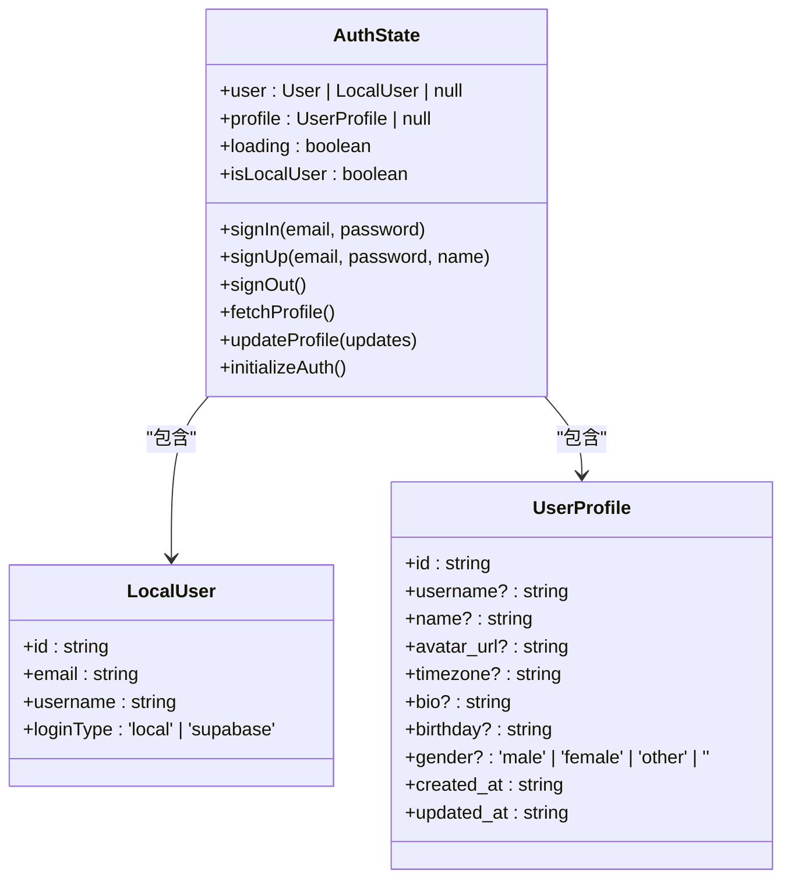
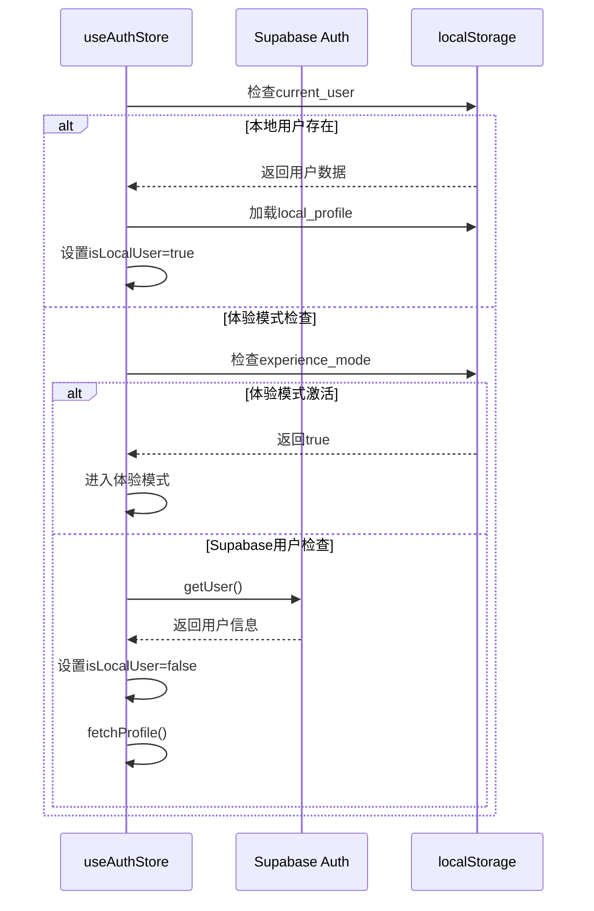
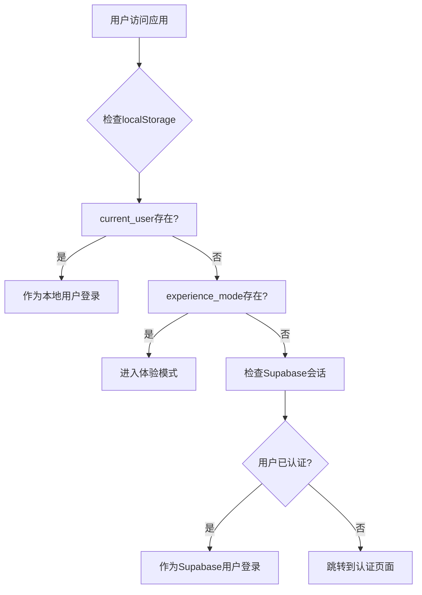
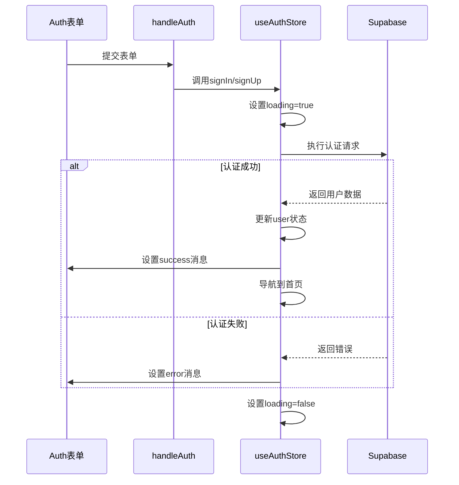

# 认证状态管理

<cite>
**本文档中引用的文件**  
- [index.ts](file://src/store/index.ts)
- [Auth.tsx](file://src/pages/Auth.tsx)
- [supabase.ts](file://src/lib/supabase.ts)
</cite>

## 目录
1. [简介](#简介)
2. [核心状态定义](#核心状态定义)
3. [异步操作实现](#异步操作实现)
4. [用户类型支持机制](#用户类型支持机制)
5. [认证状态恢复流程](#认证状态恢复流程)
6. [状态持久化机制](#状态持久化机制)
7. [UI驱动与表单集成](#ui驱动与表单集成)
8. [错误处理最佳实践](#错误处理最佳实践)
9. [isLocalUser标志位作用](#islocaluser标志位作用)

## 简介
本项目通过 `useAuthStore` 状态管理机制实现了灵活的用户认证系统，支持三种用户类型：Supabase认证用户、本地持久化用户和体验模式用户。该系统基于Zustand库构建，结合localStorage实现状态持久化，并与Supabase Auth API深度集成。store在应用启动时通过`initializeAuth`方法自动恢复认证状态，确保用户体验的连续性。

**Section sources**
- [index.ts](file://src/store/index.ts#L1-L50)

## 核心状态定义
`useAuthStore` 定义了以下核心状态字段：

- **user**: 当前用户对象，可以是Supabase用户或本地用户
- **profile**: 用户资料对象，包含用户名、头像等信息
- **loading**: 加载状态标志，用于控制UI加载指示器
- **isLocalUser**: 布尔标志，标识当前是否为本地用户

这些状态通过Zustand的create函数创建，提供了响应式的状态管理能力。

**Diagram sources**
- [index.ts](file://src/store/index.ts#L11-L22)
- [supabase.ts](file://src/lib/supabase.ts#L35-L46)

**Section sources**
- [index.ts](file://src/store/index.ts#L11-L36)

## 异步操作实现
`useAuthStore` 提供了完整的异步操作集，包括登录、注册、登出等核心功能。

### 登录与注册
`signIn` 和 `signUp` 方法通过Supabase Auth API实现用户认证。在注册过程中，系统会自动创建用户资料记录，并将其插入到`user_profiles`表中。

### 资料获取与更新
`fetchProfile` 方法从数据库获取用户资料，而 `updateProfile` 则根据用户类型决定更新策略：本地用户更新localStorage，Supabase用户更新云端数据库。

### 认证初始化
`initializeAuth` 是应用启动时的关键方法，负责恢复用户的认证状态。

**Diagram sources**
- [index.ts](file://src/store/index.ts#L39-L227)

**Section sources**
- [index.ts](file://src/store/index.ts#L39-L227)

## 用户类型支持机制
系统支持三种用户类型，每种类型有不同的认证和数据存储策略。

### Supabase认证用户
通过Supabase Auth API进行身份验证，用户数据存储在云端数据库中。这种模式适合需要跨设备同步数据的用户。

### 本地持久化用户
使用localStorage存储用户凭证和资料，数据完全保存在本地设备上。这种模式提供了更好的隐私保护。

### 体验模式用户
无需注册即可使用的临时模式，所有数据都存储在本地，适合新用户快速体验应用功能。

**Diagram sources**
- [index.ts](file://src/store/index.ts#L180-L219)
- [Auth.tsx](file://src/pages/Auth.tsx#L152-L198)

**Section sources**
- [index.ts](file://src/store/index.ts#L180-L219)
- [Auth.tsx](file://src/pages/Auth.tsx#L152-L198)

## 认证状态恢复流程
`initializeAuth` 方法在应用启动时执行，按照优先级顺序检查用户的认证状态：

1. 首先检查是否存在本地用户（`current_user`）
2. 然后检查是否处于体验模式（`experience_mode`）
3. 最后检查Supabase会话状态

这种分层检查机制确保了用户能够无缝恢复之前的会话状态，无论他们使用哪种认证方式。

**Section sources**
- [index.ts](file://src/store/index.ts#L180-L219)

## 状态持久化机制
系统通过localStorage实现状态持久化，使用了多个键值对来存储不同类型的数据：

- **current_user**: 存储当前用户的登录信息
- **local_profile**: 存储本地用户的个人资料
- **experience_mode**: 标记是否处于体验模式
- **local_mood_records**: 存储本地心情记录
- **local_user_tags**: 存储本地用户标签

这些键值的设计遵循了清晰的命名规范，便于维护和扩展。

**Section sources**
- [index.ts](file://src/store/index.ts#L105-L116)
- [index.ts](file://src/store/index.ts#L154-L156)

## UI驱动与表单集成
`Auth.tsx` 组件中的登录/注册表单直接与 `useAuthStore` 的状态和方法集成，实现了双向数据绑定和状态驱动的UI更新。

当用户提交表单时，`handleAuth` 方法会被调用，触发相应的认证操作。表单的加载状态、错误信息和成功提示都由store的状态驱动，确保了UI的一致性和响应性。

**Diagram sources**
- [Auth.tsx](file://src/pages/Auth.tsx#L19-L238)

**Section sources**
- [Auth.tsx](file://src/pages/Auth.tsx#L19-L238)

## 错误处理最佳实践
系统实现了全面的错误处理机制，包括：

- 捕获并记录所有认证相关的异常
- 根据错误类型提供具体的用户提示
- 为常见问题提供解决方案建议
- 确保错误不会导致应用崩溃

在登录失败的情况下，系统会分析错误类型，并给出相应的提示信息，如"邮箱或密码错误"、"密码至少需要6位字符"等。

**Section sources**
- [Auth.tsx](file://src/pages/Auth.tsx#L152-L198)

## isLocalUser标志位作用
`isLocalUser` 标志位在系统中起着关键作用，它决定了数据的流向和存储位置：

- 当 `isLocalUser` 为true时，用户资料更新会保存到localStorage
- 当 `isLocalUser` 为false时，用户资料更新会同步到Supabase云端数据库
- 该标志位还影响登出行为：本地用户清除localStorage，Supabase用户调用auth.signOut()

这个标志位是区分不同用户类型的核心依据，确保了不同类型用户的数据隔离和正确的处理逻辑。

**Section sources**
- [index.ts](file://src/store/index.ts#L133-L183)