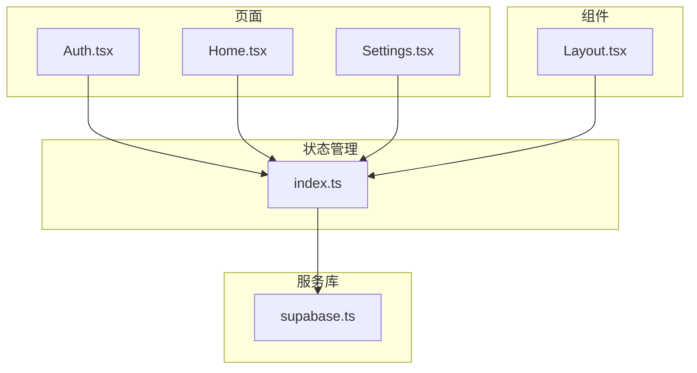
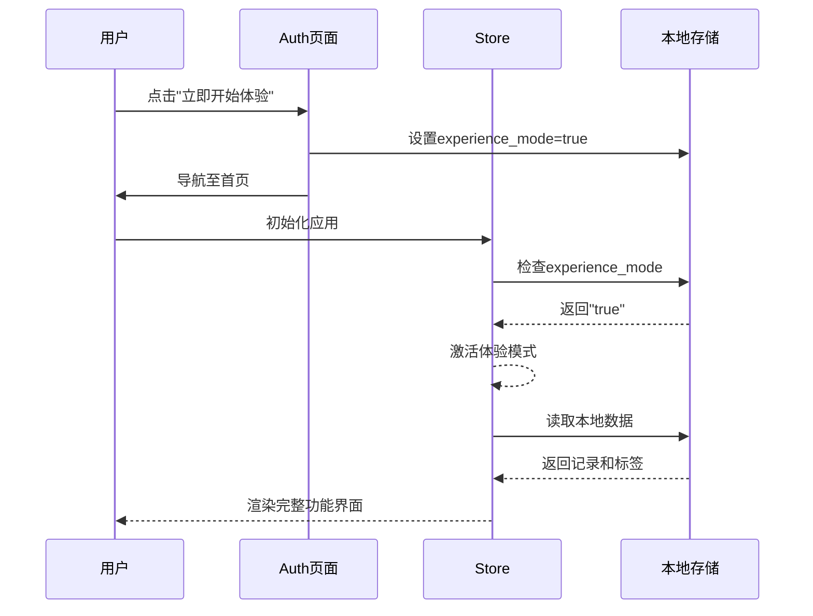
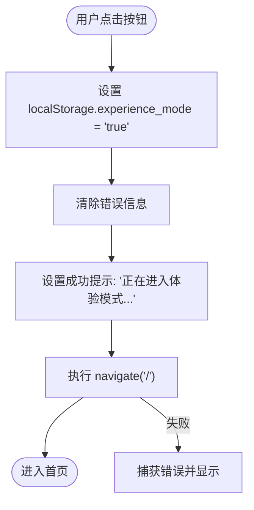
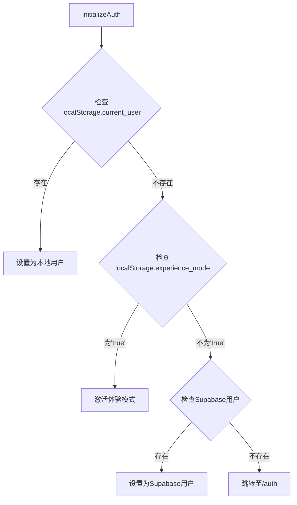
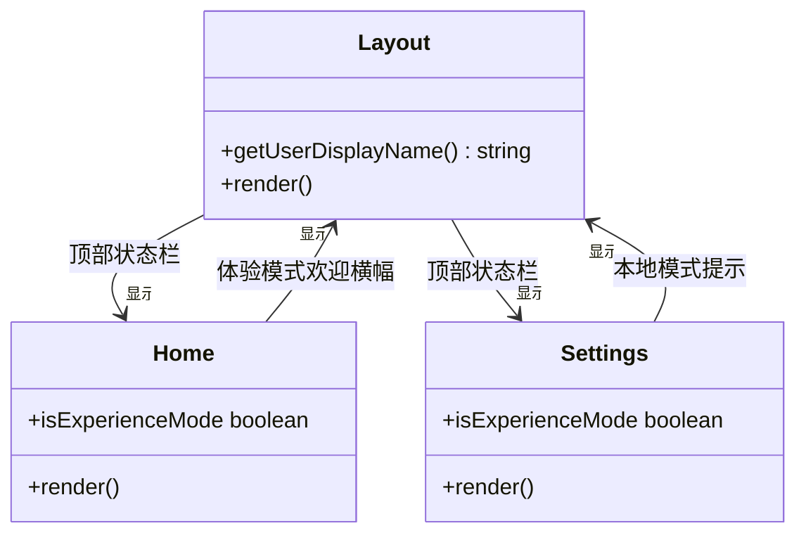
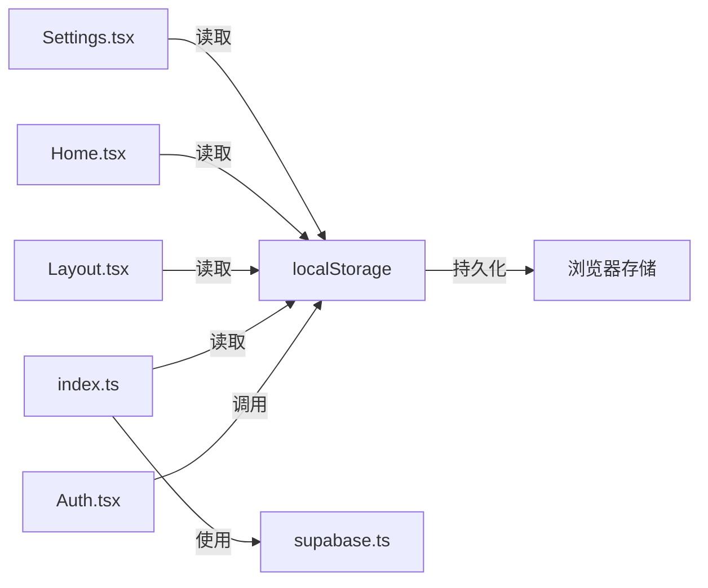

# 体验模式（匿名登录）

<cite>
**本文档引用的文件**
- [Auth.tsx](file://src/pages/Auth.tsx)
- [index.ts](file://src/store/index.ts)
- [supabase.ts](file://src/lib/supabase.ts)
- [Layout.tsx](file://src/components/Layout.tsx)
- [Home.tsx](file://src/pages/Home.tsx)
- [Settings.tsx](file://src/pages/Settings.tsx)
</cite>

## 目录
1. [简介](#简介)
2. [项目结构](#项目结构)
3. [核心组件](#核心组件)
4. [架构概述](#架构概述)
5. [详细组件分析](#详细组件分析)
6. [依赖分析](#依赖分析)
7. [性能考虑](#性能考虑)
8. [故障排除指南](#故障排除指南)
9. [结论](#结论)
10. [附录](#附录)（如有必要）

## 简介
本文档详细阐述了“心情日记”应用中的体验模式（匿名登录）功能。该功能旨在提升新用户转化率，允许用户无需注册即可快速进入应用试用核心功能。通过分析代码实现，文档解释了体验模式如何在数据库配置问题或注册失败时作为备用方案，确保用户能够立即使用应用的完整功能。体验模式通过本地存储机制保存用户数据，保障隐私安全，并支持后续升级为正式账户。

## 项目结构
本项目采用典型的React应用结构，结合Zustand状态管理与Supabase后端服务。核心功能模块按页面（pages）和组件（components）分离，状态逻辑集中于store目录，外部服务集成于lib目录。体验模式的实现贯穿于认证、状态初始化和UI展示等多个层面。

**图示来源**
- [Auth.tsx](file://src/pages/Auth.tsx)
- [index.ts](file://src/store/index.ts)
- [supabase.ts](file://src/lib/supabase.ts)
- [Layout.tsx](file://src/components/Layout.tsx)

**本节来源**
- [Auth.tsx](file://src/pages/Auth.tsx)
- [index.ts](file://src/store/index.ts)

## 核心组件
体验模式的核心在于`Auth.tsx`中的“立即开始体验”按钮和`store/index.ts`中的`initializeAuth`方法。当用户点击按钮时，系统在`localStorage`中设置`experience_mode`标记，随后在应用初始化时检测到该标记，跳过常规认证流程，直接进入主界面。所有用户数据（心情记录、标签等）均通过`useMoodStore`存储在本地，确保功能完整性和数据隐私。

**本节来源**
- [Auth.tsx](file://src/pages/Auth.tsx#L152-L198)
- [index.ts](file://src/store/index.ts#L180-L219)

## 架构概述
体验模式的架构设计围绕着无状态访问和本地数据持久化展开。它不依赖于Supabase的用户认证系统，而是利用浏览器的`localStorage`作为临时数据存储。该设计有效规避了后端配置问题（如环境变量缺失、权限错误）导致的注册失败，为用户提供无缝的初次体验。

**图示来源**
- [Auth.tsx](file://src/pages/Auth.tsx#L152-L198)
- [index.ts](file://src/store/index.ts#L180-L254)

## 详细组件分析

### 认证页面分析
`Auth.tsx`文件中的`handleSkipAuth`函数是体验模式的入口。它通过设置`localStorage`中的`experience_mode`键来标记用户的体验状态，并立即导航至首页。

**图示来源**
- [Auth.tsx](file://src/pages/Auth.tsx#L152-L198)

**本节来源**
- [Auth.tsx](file://src/pages/Auth.tsx#L152-L198)

### 状态管理分析
`useAuthStore`中的`initializeAuth`方法是体验模式的中枢。它在应用启动时被调用，按优先级检查本地用户、体验模式和Supabase用户。一旦检测到`experience_mode`为`true`，即刻返回，阻止后续的认证检查。

**图示来源**
- [index.ts](file://src/store/index.ts#L180-L219)

**本节来源**
- [index.ts](file://src/store/index.ts#L180-L219)

### UI展示分析
应用的多个UI组件会检测`experience_mode`并相应地调整显示内容，向用户明确其当前状态。

**图示来源**
- [Layout.tsx](file://src/components/Layout.tsx#L36-L75)
- [Home.tsx](file://src/pages/Home.tsx#L179-L213)
- [Settings.tsx](file://src/pages/Settings.tsx#L485-L514)

**本节来源**
- [Layout.tsx](file://src/components/Layout.tsx#L36-L75)
- [Home.tsx](file://src/pages/Home.tsx#L179-L213)
- [Settings.tsx](file://src/pages/Settings.tsx#L485-L514)

## 依赖分析
体验模式的实现依赖于几个关键的前端技术栈组件。其核心依赖关系清晰地展示了从用户交互到数据存储的完整链条。

**图示来源**
- [Auth.tsx](file://src/pages/Auth.tsx)
- [index.ts](file://src/store/index.ts)
- [supabase.ts](file://src/lib/supabase.ts)
- [Layout.tsx](file://src/components/Layout.tsx)
- [Home.tsx](file://src/pages/Home.tsx)
- [Settings.tsx](file://src/pages/Settings.tsx)

**本节来源**
- [Auth.tsx](file://src/pages/Auth.tsx)
- [index.ts](file://src/store/index.ts)
- [Layout.tsx](file://src/components/Layout.tsx)

## 性能考虑
体验模式对性能有积极影响。由于数据操作完全在本地进行，避免了网络延迟，使得记录创建、读取和删除操作极为迅速。此外，`initializeAuth`的检查逻辑是轻量级的同步操作，不会阻塞应用启动。然而，`localStorage`的存储容量有限，长期大量使用可能导致性能下降或存储溢出，建议实现数据导出功能以供用户备份。

## 故障排除指南
当用户无法正常注册时，体验模式是推荐的解决方案。常见问题及解决方法如下：

- **问题：注册失败，提示“数据库配置问题”**
  - **原因**：Supabase环境变量未配置或权限错误。
  - **解决方案**：点击“立即开始体验”按钮使用应用。
  - **代码来源**：[Auth.tsx](file://src/pages/Auth.tsx#L267-L294)

- **问题：应用启动后自动跳转回登录页**
  - **原因**：`initializeAuth`未能正确检测到`experience_mode`。
  - **解决方案**：检查`localStorage`中`experience_mode`的值是否为`'true'`，并确认`index.ts`中的检查逻辑。
  - **代码来源**：[index.ts](file://src/store/index.ts#L180-L219)

- **问题：体验模式下数据未保存**
  - **原因**：`useMoodStore`中的`fetchRecords`和`createRecord`方法未能正确处理`experience_mode`。
  - **解决方案**：确认相关方法中对`localStorage.getItem('experience_mode')`的检查逻辑。
  - **代码来源**：[index.ts](file://src/store/index.ts#L217-L254)

## 结论
体验模式（匿名登录）是“心情日记”应用中一项关键的用户增长策略。它通过简洁的`localStorage`标记和条件逻辑，巧妙地绕过了复杂的后端认证流程，为新用户提供了一个零门槛的入口。该功能不仅提升了应用的可用性和用户转化率，还通过清晰的UI反馈和本地数据管理，保障了良好的用户体验。开发者可以基于此模式，进一步实现匿名用户数据向正式账户的平滑迁移。