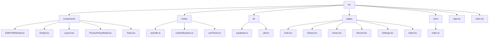
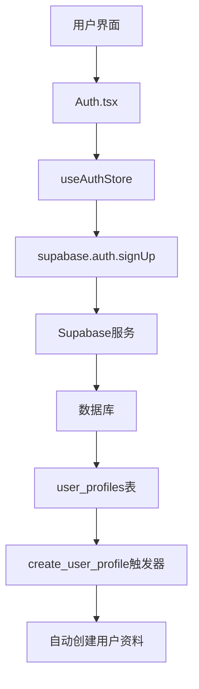
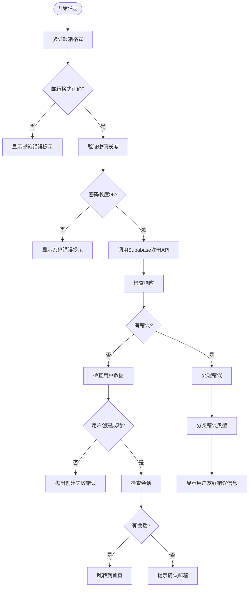
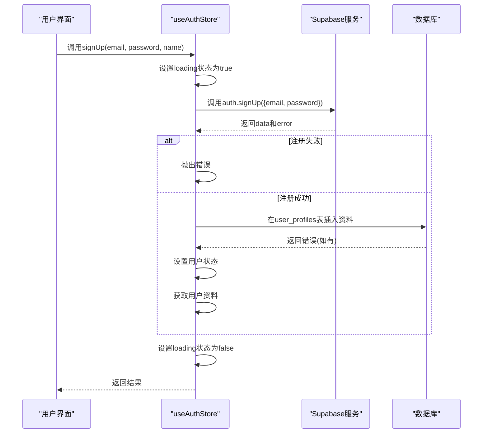
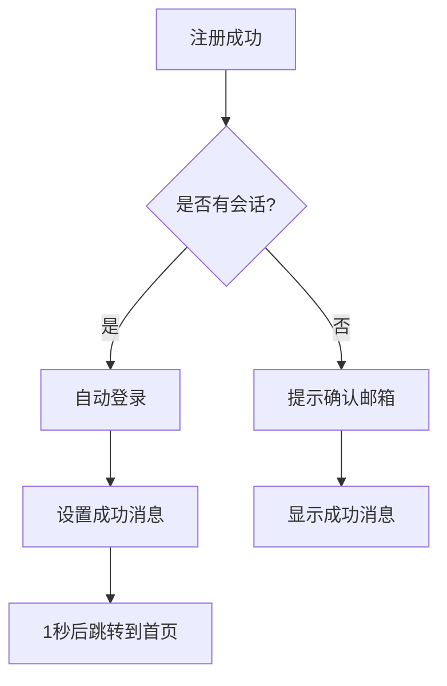
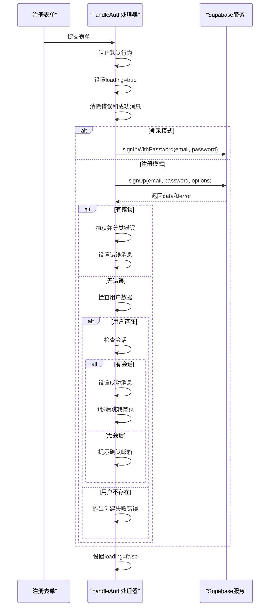
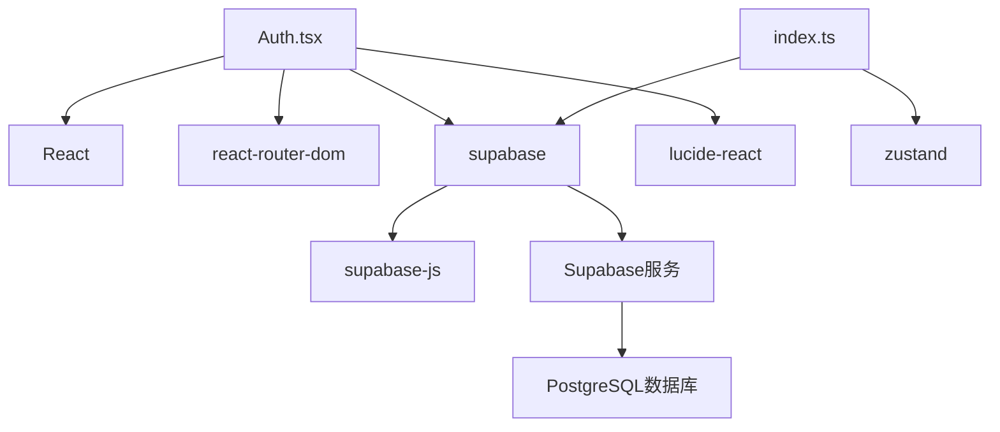

# 用户注册

<cite>
**本文档中引用的文件**   
- [Auth.tsx](file://src/pages/Auth.tsx)
- [supabase.ts](file://src/lib/supabase.ts)
- [index.ts](file://src/store/index.ts)
- [create_user_profiles.sql](file://supabase/migrations/create_user_profiles.sql)
- [fix_registration_rls.sql](file://supabase/migrations/fix_registration_rls.sql)
</cite>

## 目录
1. [项目结构](#项目结构)
2. [核心组件](#核心组件)
3. [架构概述](#架构概述)
4. [详细组件分析](#详细组件分析)
5. [依赖分析](#依赖分析)
6. [性能考虑](#性能考虑)
7. [故障排除指南](#故障排除指南)
8. [结论](#结论)

## 项目结构

**图示来源**
- [Auth.tsx](file://src/pages/Auth.tsx)
- [supabase.ts](file://src/lib/supabase.ts)
- [index.ts](file://src/store/index.ts)

**本节来源**
- [Auth.tsx](file://src/pages/Auth.tsx)
- [supabase.ts](file://src/lib/supabase.ts)
- [index.ts](file://src/store/index.ts)

## 核心组件

本项目的核心组件包括用户认证系统、状态管理、Supabase集成以及用户界面组件。用户注册功能主要由`Auth.tsx`页面组件实现，该组件负责处理用户输入、验证、与后端服务通信以及用户界面反馈。

**本节来源**
- [Auth.tsx](file://src/pages/Auth.tsx#L0-L41)
- [index.ts](file://src/store/index.ts#L39-L227)

## 架构概述

**图示来源**
- [Auth.tsx](file://src/pages/Auth.tsx#L0-L41)
- [index.ts](file://src/store/index.ts#L39-L227)
- [create_user_profiles.sql](file://supabase/migrations/create_user_profiles.sql#L0-L44)

## 详细组件分析

### 注册表单分析

#### 注册表单字段与验证规则
注册表单包含邮箱、密码和确认密码字段。邮箱字段要求符合标准邮箱格式，密码字段要求至少6位字符。在`Auth.tsx`中，通过HTML5的`type="email"`和`minLength={6}`属性实现基本验证。

**图示来源**
- [Auth.tsx](file://src/pages/Auth.tsx#L0-L41)
- [supabase.ts](file://src/lib/supabase.ts#L0-L46)

#### 用户体验设计
注册表单采用实时验证提示设计，当用户输入信息时，系统会立即验证并提供反馈。错误信息以红色文本显示在表单下方，成功信息以绿色文本显示。此外，表单提交时会显示加载状态，防止重复提交。

**本节来源**
- [Auth.tsx](file://src/pages/Auth.tsx#L0-L41)

### useAuthStore中的register方法分析

#### register方法实现
`useAuthStore`中的`signUp`方法封装了用户注册逻辑。该方法首先调用Supabase的`signUp` API创建新用户，然后在`user_profiles`表中创建对应的用户资料记录。

**图示来源**
- [index.ts](file://src/store/index.ts#L39-L227)
- [supabase.ts](file://src/lib/supabase.ts#L0-L46)

#### 邮箱唯一性约束处理
系统通过Supabase的身份验证机制自动处理邮箱唯一性约束。当用户尝试使用已存在的邮箱注册时，Supabase会返回相应的错误信息，前端捕获该错误并显示"邮箱已被使用"的提示。

#### 弱密码策略处理
密码强度验证由Supabase后端处理。如果用户输入的密码太弱，Supabase会返回密码相关的错误信息，前端捕获后显示"密码至少需要6位字符"的提示。

**本节来源**
- [index.ts](file://src/store/index.ts#L39-L227)
- [supabase.ts](file://src/lib/supabase.ts#L0-L46)

### 注册成功后的自动登录机制

#### 自动登录与重定向逻辑
注册成功后，如果Supabase返回了会话(session)，系统会自动登录用户并重定向到首页。如果未返回会话（可能需要邮箱确认），则提示用户检查邮箱确认链接。

**图示来源**
- [Auth.tsx](file://src/pages/Auth.tsx#L76-L107)
- [index.ts](file://src/store/index.ts#L39-L227)

**本节来源**
- [Auth.tsx](file://src/pages/Auth.tsx#L76-L107)

### 失败情况下的错误分类与反馈

#### 错误分类
系统对注册失败的情况进行了详细的分类处理，包括：
- 数据库错误：显示"数据库配置问题"
- 邮箱未授权：显示"该邮箱域名未被授权"
- 注册被禁用：显示"用户注册功能已禁用"
- 邮箱或密码错误：显示"邮箱格式不正确或已被使用"
- 网络异常：显示"网络连接问题"

#### 前端反馈方式
所有错误信息都会在表单下方以红色文本显示，同时提供具体的解决方案建议。对于持续失败的情况，系统建议用户使用"体验模式"直接进入应用。

**本节来源**
- [Auth.tsx](file://src/pages/Auth.tsx#L105-L154)

### 安全考虑

#### 密码加密传输
系统通过Supabase服务实现密码加密传输。所有认证请求都通过HTTPS协议发送，密码在传输过程中被加密，确保用户信息安全。

#### 验证码机制建议
虽然当前系统未实现验证码机制，但建议在后续扩展中添加。可以通过Supabase的自定义验证功能或第三方服务（如Google reCAPTCHA）实现，以防止自动化注册和滥用。

**本节来源**
- [supabase.ts](file://src/lib/supabase.ts#L0-L46)
- [Auth.tsx](file://src/pages/Auth.tsx#L0-L41)

### 代码示例

以下代码示例展示了表单提交、异步注册调用与状态同步的完整流程：

**图示来源**
- [Auth.tsx](file://src/pages/Auth.tsx#L0-L41)
- [supabase.ts](file://src/lib/supabase.ts#L0-L46)

**本节来源**
- [Auth.tsx](file://src/pages/Auth.tsx#L0-L41)

## 依赖分析

**图示来源**
- [Auth.tsx](file://src/pages/Auth.tsx#L0-L41)
- [index.ts](file://src/store/index.ts#L39-L227)
- [supabase.ts](file://src/lib/supabase.ts#L0-L46)

**本节来源**
- [Auth.tsx](file://src/pages/Auth.tsx#L0-L41)
- [index.ts](file://src/store/index.ts#L39-L227)

## 性能考虑

注册功能的性能主要受网络延迟和Supabase服务响应时间影响。系统通过以下方式优化用户体验：
- 显示加载状态，防止用户重复提交
- 提供即时的错误反馈，减少等待时间
- 实现本地存储的备用方案，确保在Supabase服务不可用时仍可使用应用

## 故障排除指南

常见注册问题及解决方案：
- **数据库配置问题**：检查Supabase环境变量配置
- **邮箱未授权**：在Supabase控制台配置允许的邮箱域名
- **注册被禁用**：在Supabase控制台启用用户注册功能
- **网络连接问题**：检查网络连接，重试注册
- **持续失败**：使用"体验模式"直接进入应用

**本节来源**
- [Auth.tsx](file://src/pages/Auth.tsx#L105-L154)

## 结论

用户注册功能通过React组件、Zustand状态管理和Supabase后端服务的协同工作，实现了完整的用户认证流程。系统不仅提供了标准的注册功能，还考虑了各种异常情况的处理，确保了良好的用户体验。通过"体验模式"的设计，即使在后端服务不可用的情况下，用户仍可使用应用的核心功能。