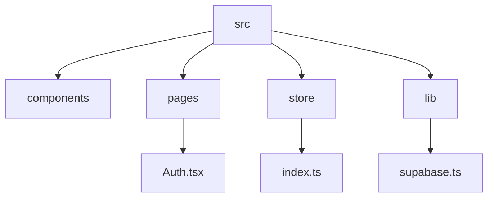
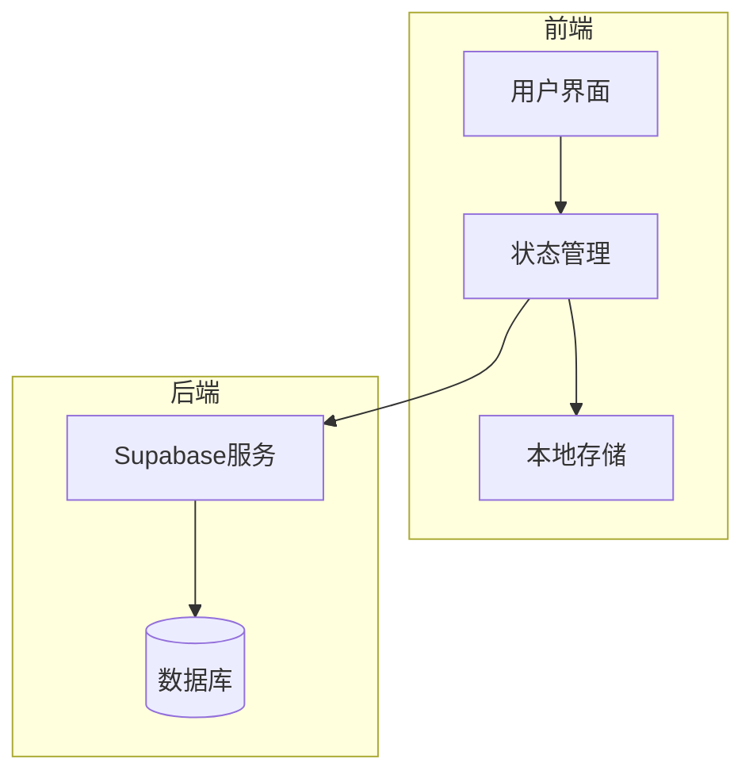
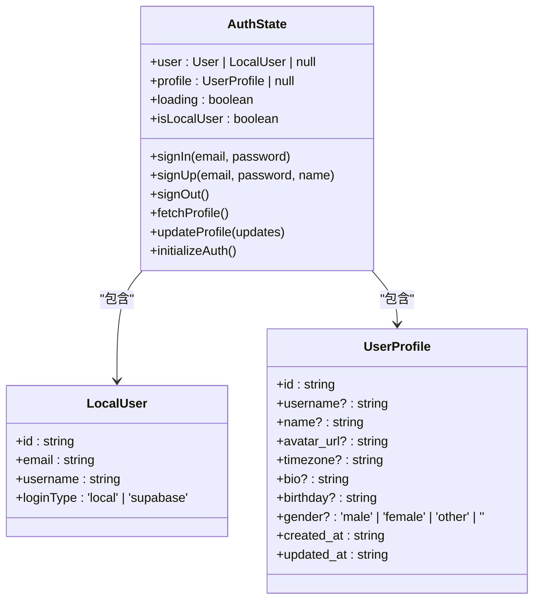
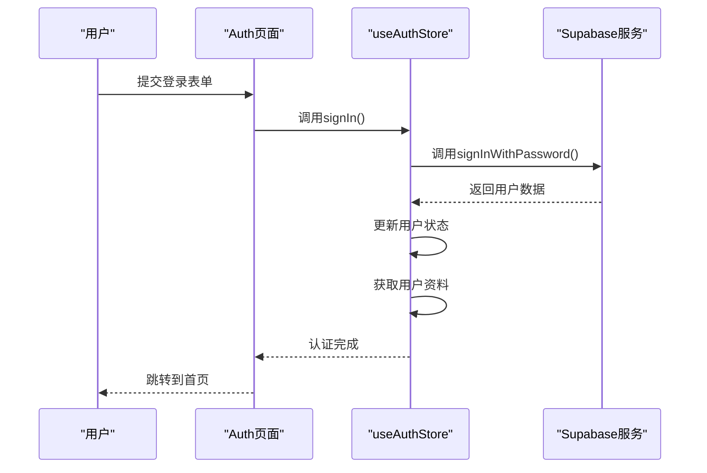
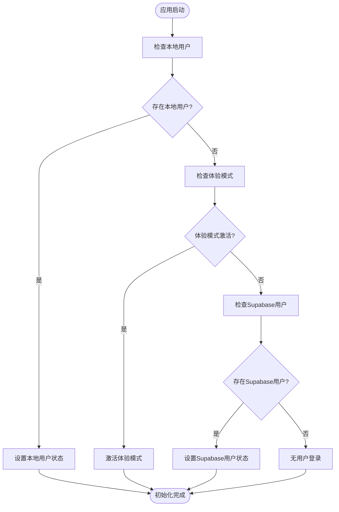
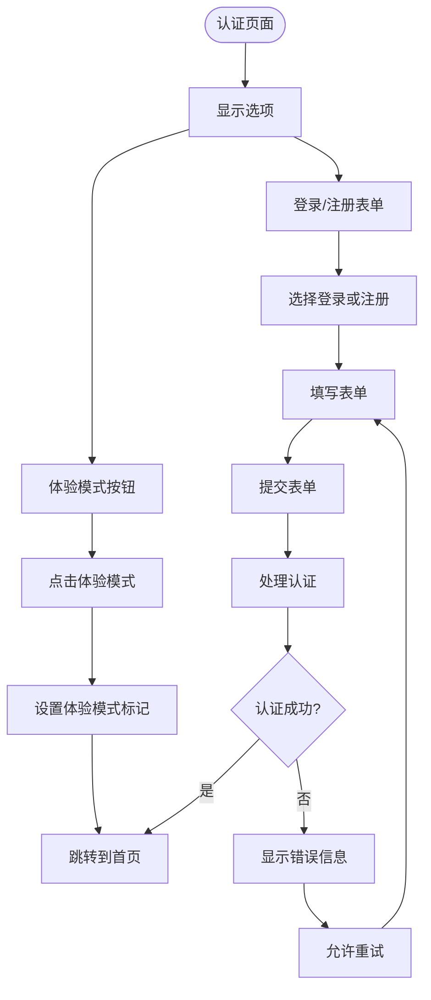
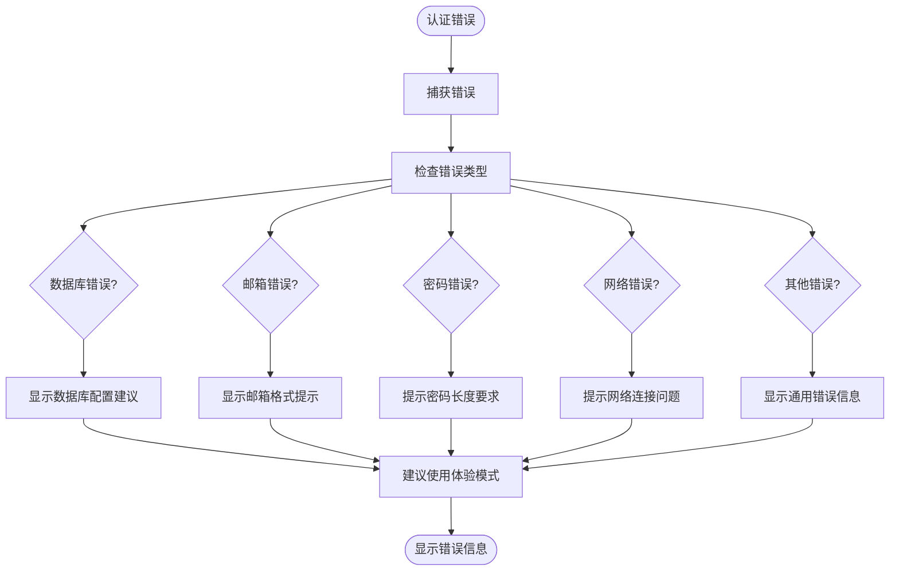
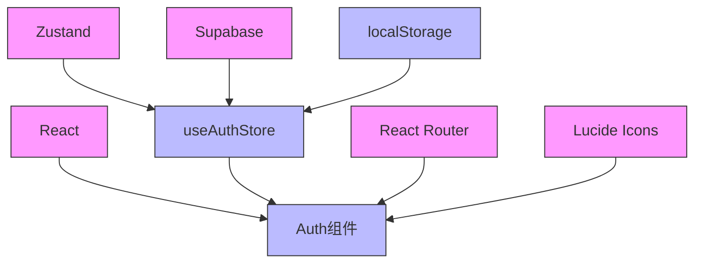

# 用户认证系统

<cite>
**本文档引用的文件**
- [src/store/index.ts](file://src/store/index.ts)
- [src/pages/Auth.tsx](file://src/pages/Auth.tsx)
- [src/lib/supabase.ts](file://src/lib/supabase.ts)
- [src/App.tsx](file://src/App.tsx)
- [src/components/Layout.tsx](file://src/components/Layout.tsx)
</cite>

## 目录
1. [简介](#简介)
2. [项目结构](#项目结构)
3. [核心组件](#核心组件)
4. [架构概览](#架构概览)
5. [详细组件分析](#详细组件分析)
6. [依赖分析](#依赖分析)
7. [性能考虑](#性能考虑)
8. [故障排除指南](#故障排除指南)
9. [结论](#结论)

## 简介
本项目实现了一个完整的用户认证系统，支持三种登录方式：邮箱密码认证（基于Supabase Auth）、体验模式（匿名登录）以及本地存储注册。系统使用Zustand进行状态管理，通过React组件收集用户输入，并与Supabase后端进行交互。认证状态在应用启动时通过持久化检查逻辑进行恢复，确保用户体验的连续性。

## 项目结构
项目采用模块化设计，主要分为组件、页面、状态管理和工具库等部分。认证相关的核心逻辑集中在`src/store/index.ts`和`src/pages/Auth.tsx`中。

**图示来源**
- [src/pages/Auth.tsx](file://src/pages/Auth.tsx)
- [src/store/index.ts](file://src/store/index.ts)
- [src/lib/supabase.ts](file://src/lib/supabase.ts)

**本节来源**
- [src/pages/Auth.tsx](file://src/pages/Auth.tsx)
- [src/store/index.ts](file://src/store/index.ts)

## 核心组件
认证系统的核心组件包括`useAuthStore`状态管理器和`Auth`页面组件。`useAuthStore`负责管理用户会话状态，而`Auth`组件提供用户界面和交互逻辑。

**本节来源**
- [src/store/index.ts](file://src/store/index.ts#L0-L39)
- [src/pages/Auth.tsx](file://src/pages/Auth.tsx#L0-L41)

## 架构概览
系统采用分层架构，前端通过React组件与用户交互，状态管理使用Zustand，数据持久化通过localStorage和Supabase实现。

**图示来源**
- [src/store/index.ts](file://src/store/index.ts)
- [src/lib/supabase.ts](file://src/lib/supabase.ts)

## 详细组件分析

### 认证状态管理分析
`useAuthStore`使用Zustand创建了一个全局状态管理器，用于处理用户认证相关的所有状态和操作。

#### 状态定义

**图示来源**
- [src/store/index.ts](file://src/store/index.ts#L0-L39)

#### 认证流程

**图示来源**
- [src/store/index.ts](file://src/store/index.ts#L35-L87)
- [src/pages/Auth.tsx](file://src/pages/Auth.tsx#L0-L41)

#### 初始化流程

**图示来源**
- [src/store/index.ts](file://src/store/index.ts#L180-L219)
- [src/App.tsx](file://src/App.tsx#L0-L26)

**本节来源**
- [src/store/index.ts](file://src/store/index.ts#L0-L254)
- [src/App.tsx](file://src/App.tsx#L0-L26)

### 认证页面分析
`Auth`组件提供用户友好的认证界面，支持登录、注册和体验模式。

#### 用户体验流程

**图示来源**
- [src/pages/Auth.tsx](file://src/pages/Auth.tsx#L0-L416)

#### 错误处理机制

**图示来源**
- [src/pages/Auth.tsx](file://src/pages/Auth.tsx#L131-L154)

**本节来源**
- [src/pages/Auth.tsx](file://src/pages/Auth.tsx#L0-L416)

## 依赖分析
认证系统依赖于多个外部库和内部模块，形成了清晰的依赖关系。

**图示来源**
- [src/store/index.ts](file://src/store/index.ts)
- [src/pages/Auth.tsx](file://src/pages/Auth.tsx)
- [package.json](file://package.json)

**本节来源**
- [src/store/index.ts](file://src/store/index.ts)
- [src/pages/Auth.tsx](file://src/pages/Auth.tsx)
- [package.json](file://package.json)

## 性能考虑
系统在性能方面做了多项优化，确保用户体验流畅。

- **状态管理优化**：使用Zustand进行细粒度的状态更新，避免不必要的重新渲染
- **本地存储优先**：在体验模式下优先使用localStorage，减少网络请求
- **错误处理优化**：详细的错误日志帮助快速定位问题，减少调试时间
- **异步操作管理**：合理使用loading状态，提供良好的用户反馈

## 故障排除指南
当用户遇到认证问题时，可以参考以下解决方案：

1. **数据库配置问题**：检查Supabase环境变量是否正确配置
2. **邮箱验证问题**：确认邮箱域名是否被授权
3. **注册被禁用**：在Supabase控制台中启用用户注册功能
4. **网络连接问题**：检查网络连接状态
5. **使用体验模式**：作为替代方案，直接使用体验模式进入应用

**本节来源**
- [src/pages/Auth.tsx](file://src/pages/Auth.tsx#L105-L131)
- [src/pages/Auth.tsx](file://src/pages/Auth.tsx#L267-L294)

## 结论
本认证系统实现了完整的用户管理功能，支持多种登录方式和详细的错误处理。通过Zustand状态管理和Supabase后端服务的结合，提供了稳定可靠的认证体验。系统设计考虑了用户体验和开发者的可维护性，为后续功能扩展奠定了良好基础。