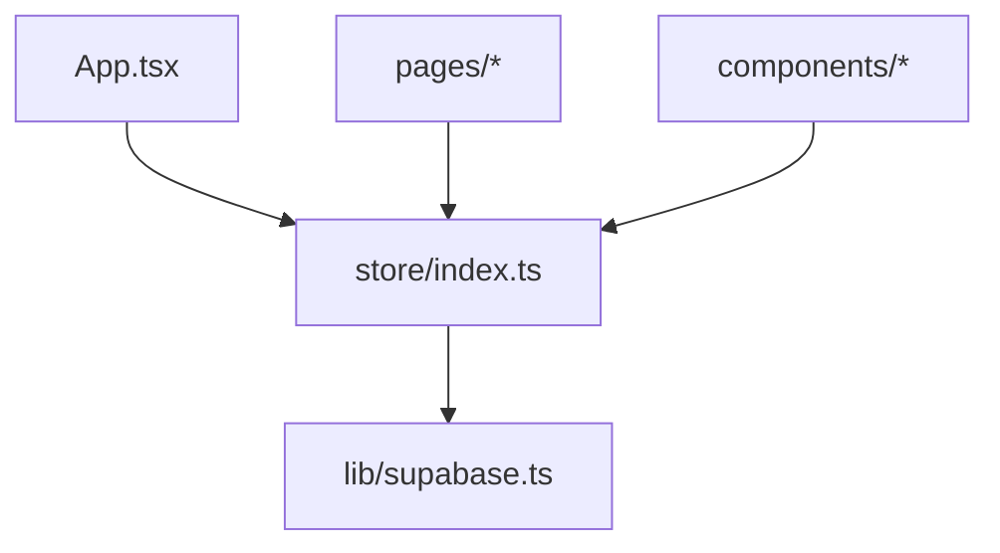
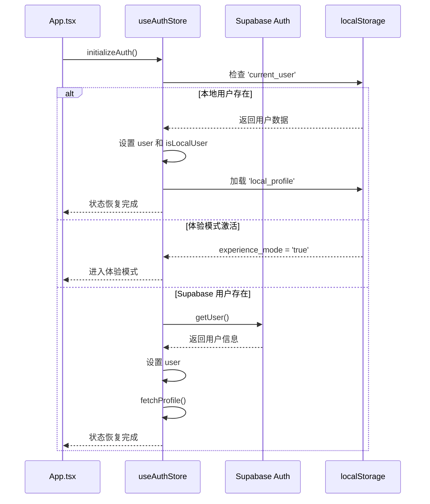
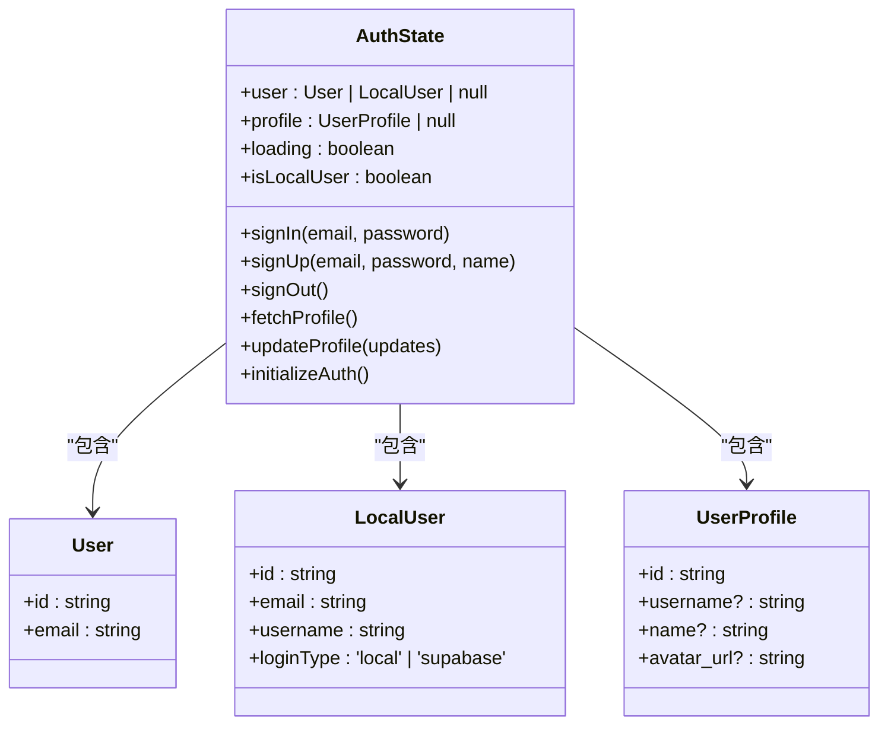
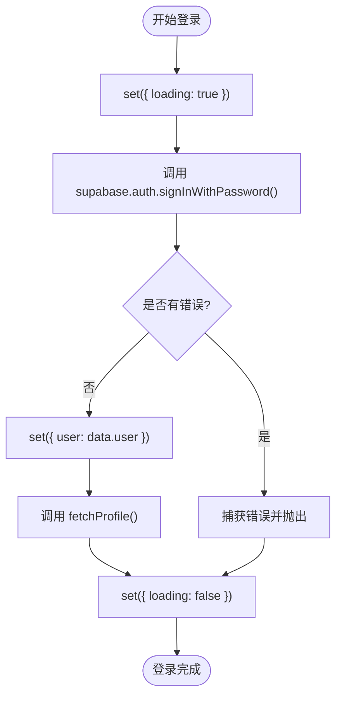
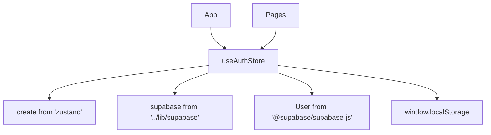

# 认证状态管理

<cite>
**本文档引用的文件**  
- [index.ts](file://src/store/index.ts)
- [supabase.ts](file://src/lib/supabase.ts)
- [App.tsx](file://src/App.tsx)
- [main.tsx](file://src/main.tsx)
</cite>

## 目录
1. [简介](#简介)
2. [项目结构](#项目结构)
3. [核心组件](#核心组件)
4. [架构概览](#架构概览)
5. [详细组件分析](#详细组件分析)
6. [依赖分析](#依赖分析)
7. [性能考虑](#性能考虑)
8. [故障排除指南](#故障排除指南)
9. [结论](#结论)

## 简介
本架构级文档深入解析 `useAuthStore` 在全局状态管理中的核心作用与设计模式。聚焦于 `src/store/index.ts` 中基于 Zustand 实现的响应式认证状态管理机制，涵盖用户会话持久化、自动恢复、状态同步与 UI 响应联动等关键特性。文档详细阐述登录、注册、登出等异步操作流程，以及加载与错误状态的处理策略，为开发者提供全面的状态管理实践指导。

## 项目结构
项目采用模块化结构，核心状态管理集中于 `src/store/index.ts`。`useAuthStore` 作为全局认证状态中心，被 `App.tsx` 在应用启动时初始化，并由各页面组件订阅使用。`lib/supabase.ts` 提供与 Supabase 后端服务的连接和数据类型定义。

**图示来源**  
- [App.tsx](file://src/App.tsx#L6)
- [index.ts](file://src/store/index.ts#L39)
- [supabase.ts](file://src/lib/supabase.ts#L1)

**本节来源**
- [App.tsx](file://src/App.tsx#L1-L27)
- [index.ts](file://src/store/index.ts#L1-L557)
- [supabase.ts](file://src/lib/supabase.ts#L1-L47)

## 核心组件
`useAuthStore` 是应用认证逻辑的核心，它使用 Zustand 库创建了一个全局可访问的响应式状态对象。该状态包含用户信息（`user`）、用户资料（`profile`）、加载状态（`loading`）和错误处理机制。通过 `signIn`、`signUp` 和 `signOut` 等异步操作方法，实现了与 Supabase 身份验证服务的交互。

**本节来源**
- [index.ts](file://src/store/index.ts#L39-L227)

## 架构概览
`useAuthStore` 的设计遵循了集中式状态管理的最佳实践。其核心在于 `initializeAuth` 方法，该方法在应用启动时被调用，负责检查本地存储（`localStorage`）以恢复用户的认证状态，从而实现会话的持久性。

**图示来源**  
- [App.tsx](file://src/App.tsx#L6)
- [index.ts](file://src/store/index.ts#L198-L227)

## 详细组件分析

### useAuthStore 分析
`useAuthStore` 是一个 Zustand 状态机，其状态和方法被精心设计以管理复杂的认证流程。

#### 状态定义

**图示来源**  
- [index.ts](file://src/store/index.ts#L12-L21)

#### 认证操作流程

**图示来源**  
- [index.ts](file://src/store/index.ts#L52-L74)

### 状态持久化与自动恢复
`useAuthStore` 通过 `initializeAuth` 方法在应用启动时自动恢复用户会话。它按优先级顺序检查：
1.  **本地用户**：检查 `localStorage` 中的 `current_user`。
2.  **体验模式**：检查 `experience_mode` 标志。
3.  **Supabase 用户**：调用 `supabase.auth.getUser()` 查询当前会话。

此机制确保了用户刷新页面后仍能保持登录状态。

**本节来源**
- [index.ts](file://src/store/index.ts#L198-L227)
- [App.tsx](file://src/App.tsx#L6)

## 依赖分析
`useAuthStore` 的实现依赖于多个外部模块和内部组件。

**图示来源**  
- [index.ts](file://src/store/index.ts#L1-L3)
- [supabase.ts](file://src/lib/supabase.ts#L1)
- [App.tsx](file://src/App.tsx#L2)

**本节来源**
- [index.ts](file://src/store/index.ts#L1-L557)
- [supabase.ts](file://src/lib/supabase.ts#L1-L47)

## 性能考虑
`useAuthStore` 的设计考虑了性能和用户体验：
- **加载状态**：在所有异步操作前后设置 `loading: true/false`，使 UI 能够显示加载指示器，避免用户重复操作。
- **选择性订阅**：React 组件通过 `useAuthStore(state => state.user)` 等方式订阅特定状态，避免了不必要的重渲染。
- **本地存储**：对于本地用户和体验模式，直接使用 `localStorage`，避免了网络请求，提升了响应速度。

## 故障排除指南
`useAuthStore` 内置了详细的错误处理和日志记录，便于调试。

- **错误传播**：`signIn`、`signUp` 等方法在 `catch` 块中 `throw error`，将错误抛给调用者（通常是 UI 组件），以便在界面上显示错误信息。
- **日志记录**：代码中包含 `console.log` 和 `console.error` 语句，可用于追踪认证流程和排查问题。
- **常见问题**：
  - **用户无法登录**：检查 Supabase 环境变量（`VITE_SUPABASE_URL`, `VITE_SUPABASE_ANON_KEY`）是否正确。
  - **状态未更新**：确保组件正确订阅了 `useAuthStore` 的状态。
  - **会话未持久化**：检查 `localStorage` 是否被正确写入和读取。

**本节来源**
- [index.ts](file://src/store/index.ts#L60-L74)
- [index.ts](file://src/store/index.ts#L110-L126)

## 结论
`useAuthStore` 是一个设计精良、功能完整的全局认证状态管理解决方案。它利用 Zustand 的简洁性，结合 Supabase 的强大后端服务和 `localStorage` 的本地持久化能力，实现了无缝的用户认证体验。其清晰的代码结构、完善的错误处理和自动会话恢复机制，为应用的稳定性和用户体验提供了坚实保障。遵循其设计模式，可以有效管理复杂的应用状态。