# 邮箱密码登录

<cite>
**本文档引用文件**   
- [Auth.tsx](file://src/pages/Auth.tsx)
- [index.ts](file://src/store/index.ts)
- [supabase.ts](file://src/lib/supabase.ts)
- [Toast.tsx](file://src/components/Toast.tsx)
</cite>

## 目录
1. [简介](#简介)
2. [登录表单实现](#登录表单实现)
3. [认证状态管理](#认证状态管理)
4. [错误处理机制](#错误处理机制)
5. [登录状态持久化](#登录状态持久化)
6. [自定义登录流程](#自定义登录流程)
7. [最佳实践示例](#最佳实践示例)
8. [结论](#结论)

## 简介
本项目实现了一套完整的邮箱密码登录系统，支持Supabase认证、本地存储认证和体验模式三种登录方式。系统采用React + Zustand + Supabase技术栈，提供了完善的错误处理、状态管理和用户体验反馈机制。核心功能包括邮箱密码登录/注册、本地数据持久化、会话状态管理以及多层级的错误反馈系统。

## 登录表单实现

### 表单结构与状态管理
登录表单组件`Auth.tsx`使用React Hooks管理表单状态，包含邮箱、密码、姓名等输入字段，以及加载、错误、成功等UI状态。

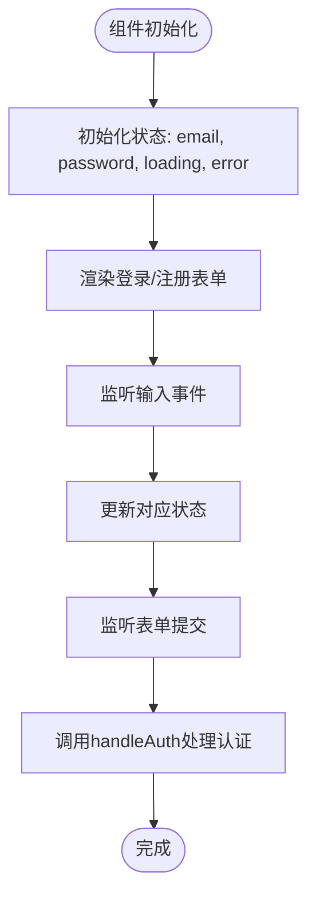

**表单字段说明**
- **邮箱输入**: 使用`type="email"`进行基础格式验证
- **密码输入**: 设置`minLength=6`确保密码长度
- **姓名输入**: 仅在注册时显示
- **状态反馈**: 通过`error`和`success`状态显示操作结果

**交互逻辑**
- 支持登录/注册模式切换
- 提交时显示加载状态
- 提供体验模式快速入口
- 包含本地存储备用方案

**Section sources**
- [Auth.tsx](file://src/pages/Auth.tsx#L10-L45)

### 输入验证机制
系统实现了多层级的输入验证机制，确保用户输入的合法性和安全性。

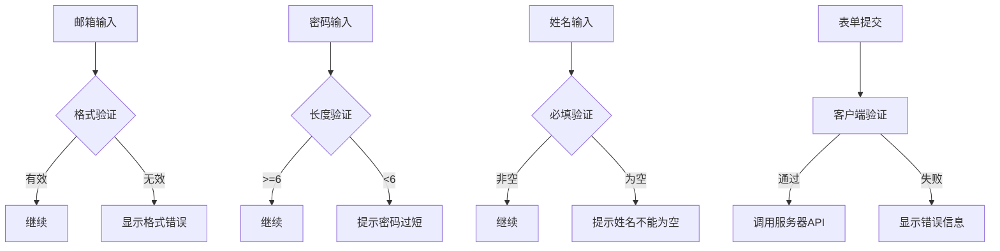

**验证规则**
- 邮箱格式：标准邮箱格式验证
- 密码长度：至少6位字符
- 姓名：注册时必填
- 实时反馈：输入时即时验证

**Section sources**
- [Auth.tsx](file://src/pages/Auth.tsx#L10-L45)
- [Auth.tsx](file://src/pages/Auth.tsx#L131-L154)

## 认证状态管理

### useAuthStore核心方法
`useAuthStore`使用Zustand创建全局认证状态，管理用户会话和资料信息。

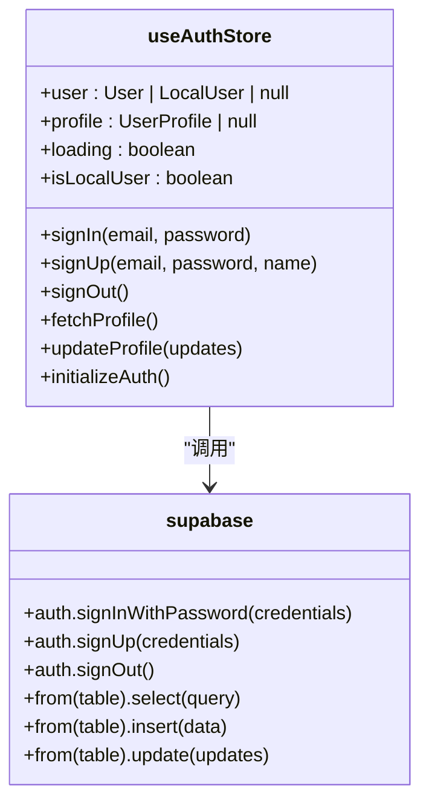

**核心方法说明**
- `signIn`: 处理登录逻辑
- `signUp`: 处理注册逻辑
- `signOut`: 处理登出逻辑
- `fetchProfile`: 获取用户资料
- `updateProfile`: 更新用户资料
- `initializeAuth`: 初始化认证状态

**Section sources**
- [index.ts](file://src/store/index.ts#L35-L87)

### 登录流程实现
登录流程通过`signIn`方法实现，调用Supabase的认证API并更新本地状态。

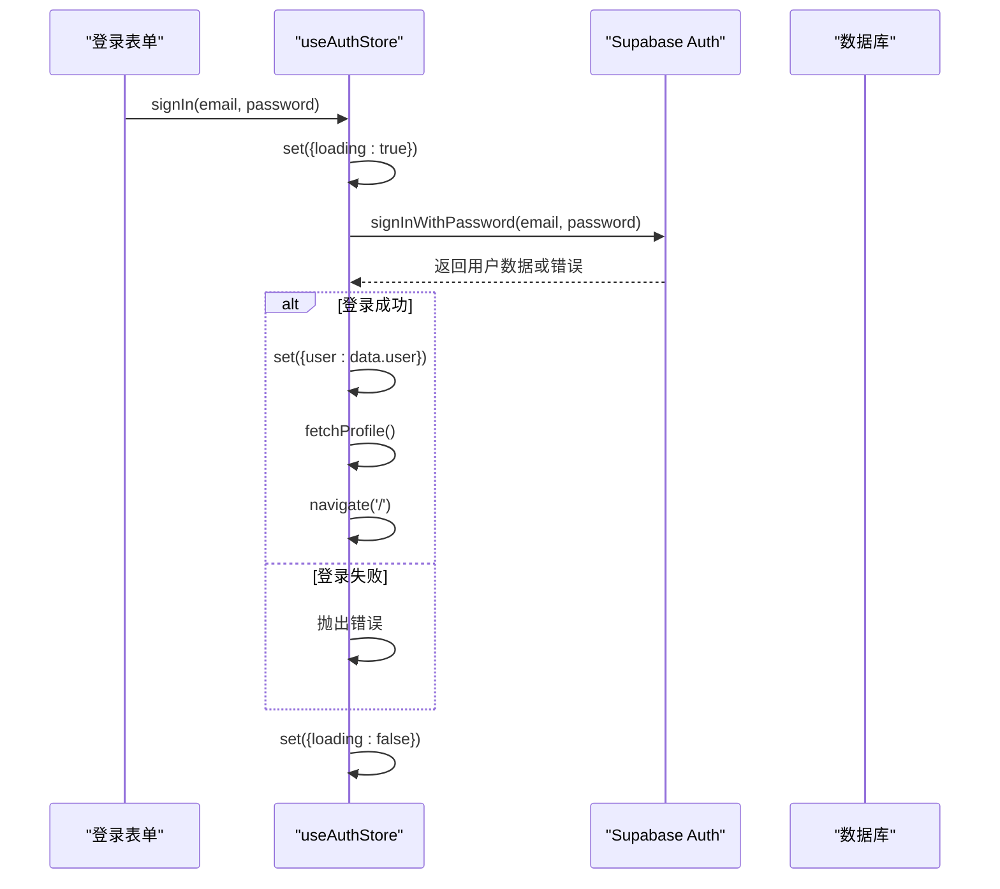

**流程说明**
1. 调用`signIn`方法传入邮箱密码
2. 设置加载状态为true
3. 调用Supabase的`signInWithPassword` API
4. 成功则更新用户状态并获取个人资料
5. 失败则抛出错误供上层处理
6. 最终设置加载状态为false

**Section sources**
- [index.ts](file://src/store/index.ts#L35-L55)

### 会话状态更新
成功登录后，系统会自动更新会话状态并获取用户资料。

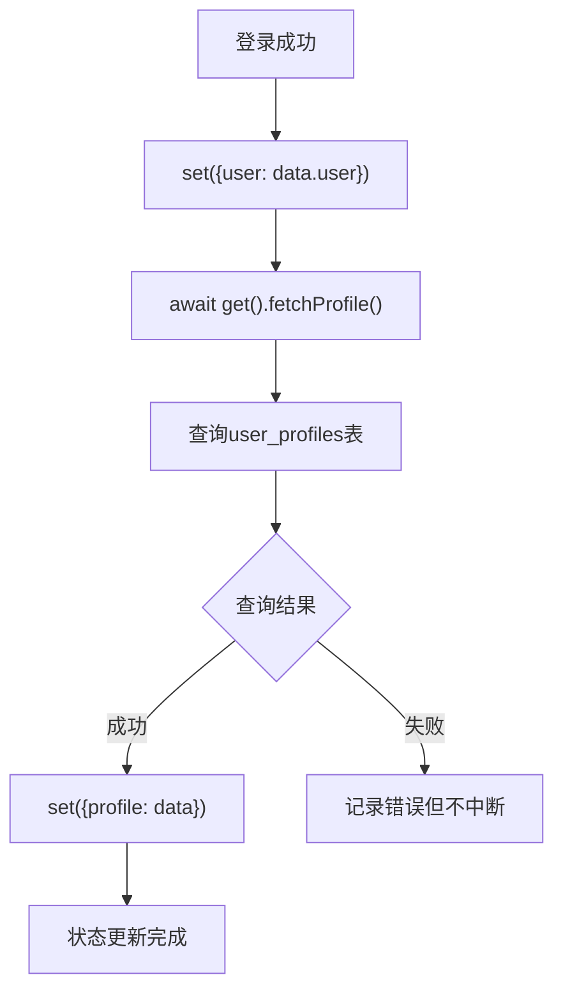

**状态更新流程**
- 将用户信息存储在Zustand状态中
- 自动调用`fetchProfile`获取详细资料
- 从`user_profiles`表查询用户资料
- 更新profile状态供全局使用
- 错误处理：记录错误但不影响主流程

**Section sources**
- [index.ts](file://src/store/index.ts#L48-L55)
- [index.ts](file://src/store/index.ts#L113-L137)

## 错误处理机制

### 错误类型与处理
系统实现了精细化的错误分类处理，针对不同错误类型提供相应的用户反馈。

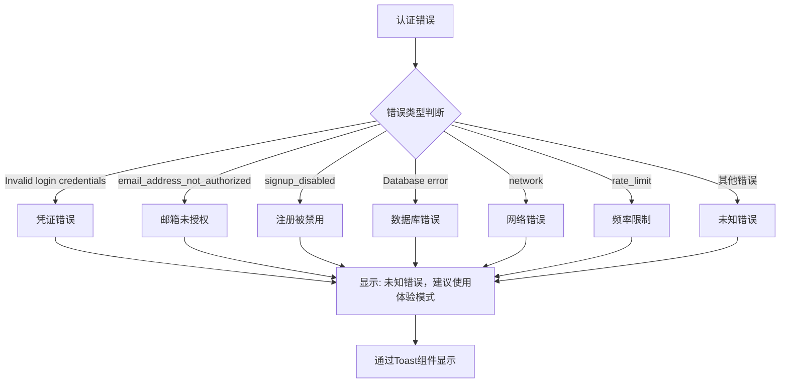

**具体错误处理策略**
- **凭据错误**: 提示邮箱或密码错误
- **网络中断**: 提示网络连接问题
- **账户未激活**: 提示邮箱确认链接
- **注册限制**: 提示请求频率限制
- **数据库问题**: 提供体验模式建议

**Section sources**
- [Auth.tsx](file://src/pages/Auth.tsx#L131-L154)

### Toast反馈系统
前端通过Toast组件向用户反馈操作结果和错误信息。

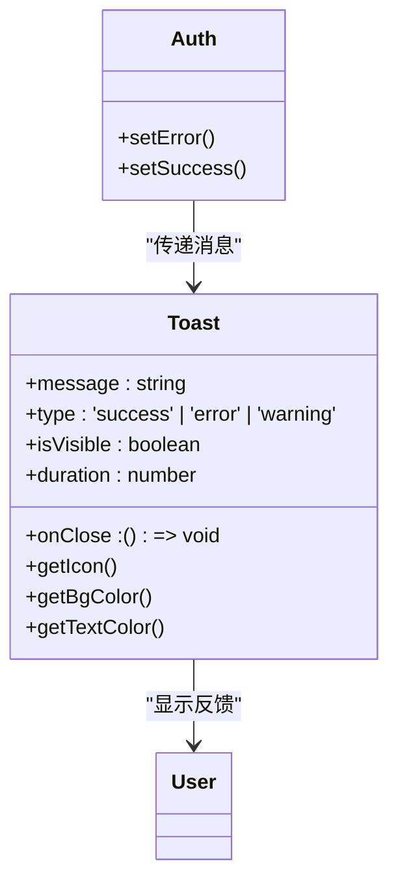

**Toast组件特性**
- 支持成功、错误、警告三种类型
- 自动定时关闭（默认3秒）
- 可手动关闭
- 不同类型对应不同颜色和图标
- 右上角固定位置显示

**使用方式**
- 成功操作显示绿色Toast
- 错误信息显示红色Toast
- 警告信息显示黄色Toast
- 包含关闭按钮和自动消失功能

**Section sources**
- [Toast.tsx](file://src/components/Toast.tsx#L0-L81)
- [Auth.tsx](file://src/pages/Auth.tsx#L25-L30)

## 登录状态持久化

### 会话自动恢复
系统在初始化时自动恢复登录状态，提供无缝的用户体验。

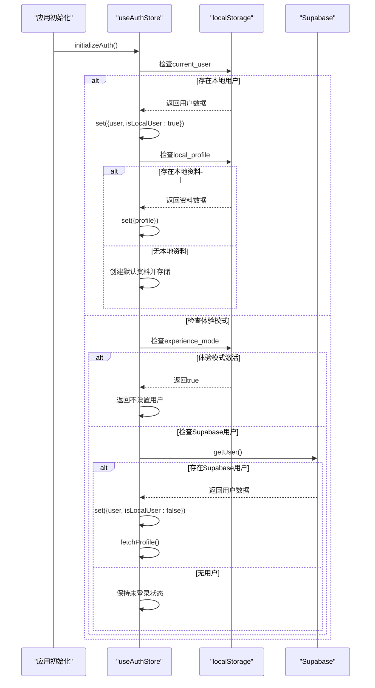

**恢复优先级**
1. 本地用户（`current_user`）
2. 体验模式（`experience_mode`）
3. Supabase会话（`supabase.auth.getUser()`）

**Section sources**
- [index.ts](file://src/store/index.ts#L180-L219)

### 登出清理逻辑
登出时系统会清理相关状态和存储数据，确保安全退出。

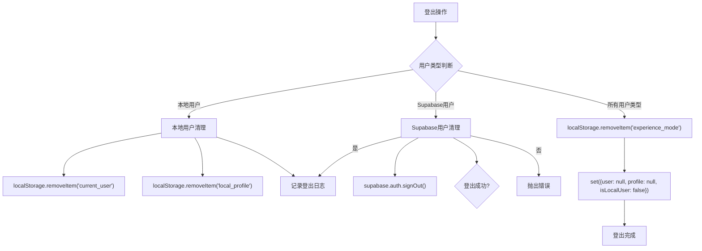

**清理内容**
- 清除用户会话数据
- 删除本地存储的用户信息
- 移除体验模式标记
- 重置Zustand状态
- 调用Supabase登出API

**Section sources**
- [index.ts](file://src/store/index.ts#L84-L108)

## 自定义登录流程

### 体验模式实现
系统提供了体验模式，允许用户无需注册即可使用应用。

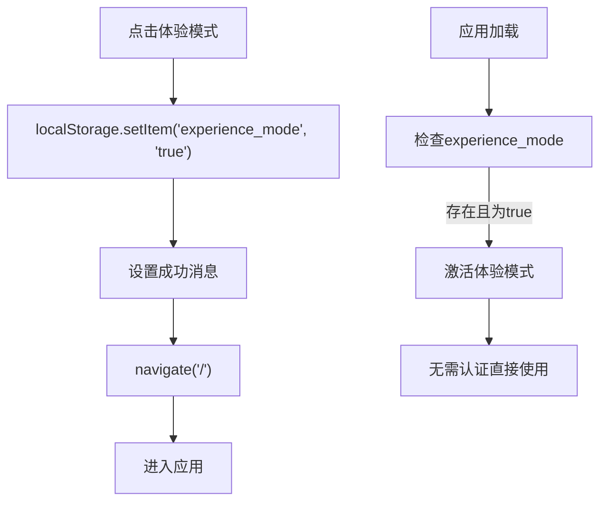

**体验模式特点**
- 一键进入，无需注册登录
- 数据保存在本地设备
- 提供完整功能体验
- 隐私安全，数据不上传
- 可随时切换到正式账号

**Section sources**
- [Auth.tsx](file://src/pages/Auth.tsx#L152-L171)
- [index.ts](file://src/store/index.ts#L198-L202)

### 本地存储认证
作为备用方案，系统实现了基于localStorage的本地认证机制。

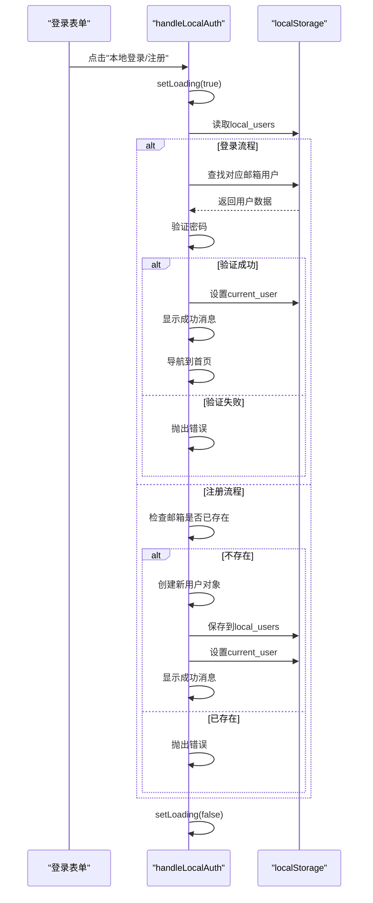

**本地认证优势**
- 作为网络问题时的备用方案
- 数据完全本地化，隐私安全
- 快速登录，无需网络请求
- 支持离线使用
- 简单可靠的实现机制

**Section sources**
- [Auth.tsx](file://src/pages/Auth.tsx#L173-L238)

## 最佳实践示例

### 表单绑定最佳实践
登录表单采用了标准的React表单绑定模式，确保数据同步和用户体验。

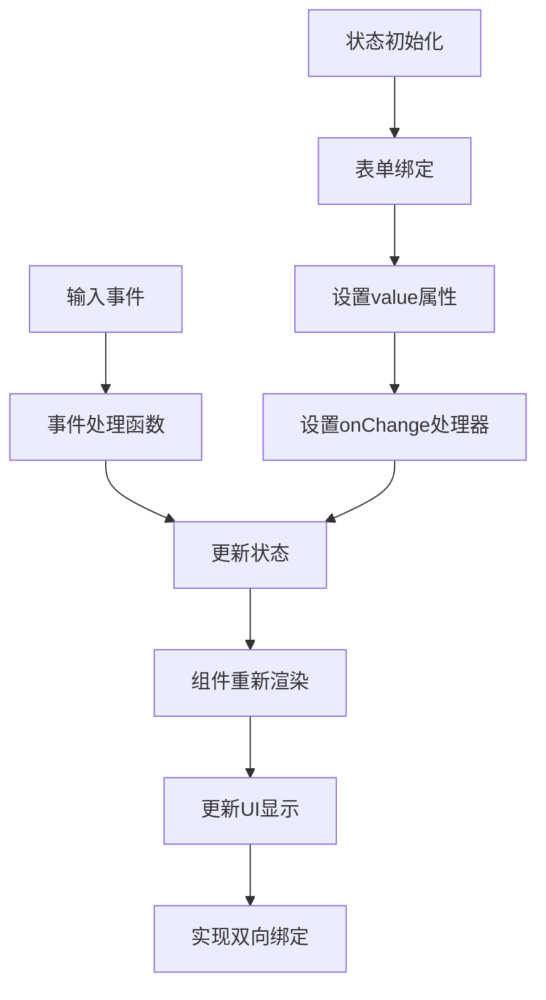

**关键实现要点**
- 使用`useState`管理表单状态
- `value`属性绑定状态值
- `onChange`事件更新状态
- 表单提交时阻止默认行为
- 加载状态控制按钮禁用

**Section sources**
- [Auth.tsx](file://src/pages/Auth.tsx#L10-L45)

### 异步调用最佳实践
认证操作采用async/await模式处理异步请求，确保代码可读性和错误处理。

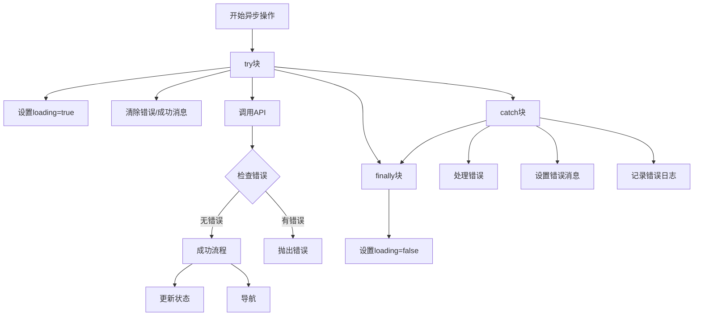

**异步处理模式**
- 使用try-catch捕获异常
- finally块确保加载状态重置
- 错误分类处理提供精确反馈
- 成功后自动导航
- 详细的错误日志记录

**Section sources**
- [Auth.tsx](file://src/pages/Auth.tsx#L50-L154)

### 状态监听最佳实践
系统通过Zustand的状态管理实现了高效的状态监听和更新机制。

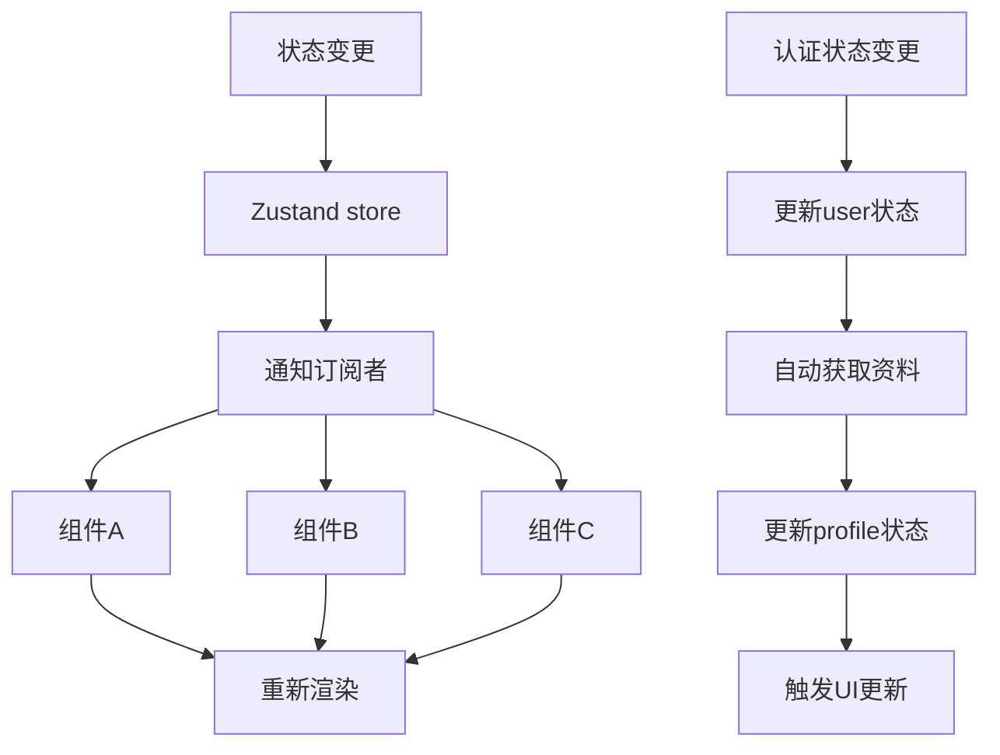

**状态管理优势**
- 集中式状态管理
- 自动订阅和更新
- 类型安全的API
- 中间件支持
- 开发者工具集成

**Section sources**
- [index.ts](file://src/store/index.ts#L35-L219)

## 结论
本邮箱密码登录系统实现了完整的认证流程，包含表单验证、状态管理、错误处理和持久化等核心功能。系统采用分层架构设计，前端表单与后端认证分离，状态管理集中化，错误处理精细化。特别的是，系统提供了体验模式和本地存储认证作为备用方案，确保在各种网络和配置环境下都能提供良好的用户体验。通过Toast组件提供即时反馈，通过自动状态恢复实现无缝体验，是一套成熟可靠的登录解决方案。