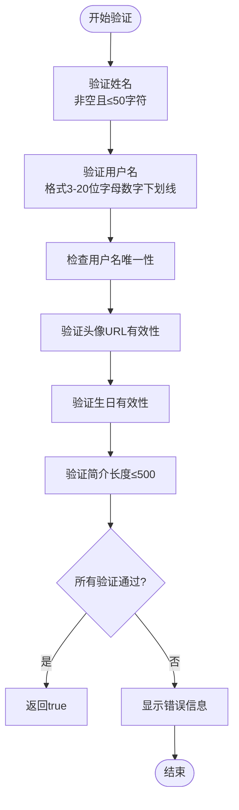

# 个人资料管理

<cite>
**本文档引用的文件**
- [EditProfileModal.tsx](file://src/components/EditProfileModal.tsx)
- [index.ts](file://src/store/index.ts)
- [Settings.tsx](file://src/pages/Settings.tsx)
- [supabase.ts](file://src/lib/supabase.ts)
- [add_profile_fields.sql](file://supabase/migrations/add_profile_fields.sql)
- [Toast.tsx](file://src/components/Toast.tsx)
</cite>

## 目录
1. [简介](#简介)
2. [组件结构与数据流](#组件结构与数据流)
3. [核心功能实现](#核心功能实现)
4. [表单验证与错误处理](#表单验证与错误处理)
5. [状态管理与组件通信](#状态管理与组件通信)
6. [扩展字段实现建议](#扩展字段实现建议)
7. [最佳实践总结](#最佳实践总结)

## 简介
本文档详细描述了心情日记应用中个人资料管理功能的实现机制，重点分析`EditProfileModal`组件如何通过Zustand状态管理库与Supabase后端服务协同工作，实现用户资料的编辑、验证和持久化存储。文档涵盖了从UI交互到数据持久化的完整流程，为开发者提供深入的技术理解和扩展指导。

## 组件结构与数据流

```mermaid
graph TD
A[Settings.tsx] --> |点击"编辑资料"| B(EditProfileModal)
B --> |读取| C[useAuthStore]
C --> |获取| D[用户资料]
B --> |输入| E[表单数据]
E --> |验证| F[validateForm]
F --> |成功| G[updateProfile]
G --> |调用| H[Supabase客户端]
H --> |更新| I[user_profiles表]
G --> |更新| C
B --> |显示| J[Toast通知]
```

**图表来源**
- [Settings.tsx](file://src/pages/Settings.tsx#L200-L205)
- [EditProfileModal.tsx](file://src/components/EditProfileModal.tsx#L1-L435)
- [index.ts](file://src/store/index.ts#L1-L558)

**本节来源**
- [EditProfileModal.tsx](file://src/components/EditProfileModal.tsx#L1-L435)
- [Settings.tsx](file://src/pages/Settings.tsx#L1-L625)

## 核心功能实现

### 资料编辑模态框
`EditProfileModal`组件实现了用户资料的可视化编辑界面，支持昵称、头像、生日、性别和个人简介等字段的修改。组件通过`useAuthStore`从Zustand store中获取当前用户信息，并在打开时自动填充表单。

### 头像上传处理
组件支持两种头像设置方式：通过文件选择器上传图片或输入图片URL。文件上传时会进行类型和大小验证（最大5MB），并使用`FileReader`创建预览URL，实现即时预览效果。

### 用户名唯一性检查
在用户名输入时，组件会自动检查其唯一性，避免重复。检查逻辑通过Supabase查询`user_profiles`表，排除当前用户ID的记录，确保用户名在整个系统中的唯一性。

**本节来源**
- [EditProfileModal.tsx](file://src/components/EditProfileModal.tsx#L1-L435)
- [supabase.ts](file://src/lib/supabase.ts#L1-L47)

## 表单验证与错误处理

### 验证规则
组件实现了全面的表单验证机制，包括：
- **姓名**：不能为空，长度不超过50字符
- **用户名**：3-20位字母数字下划线，全局唯一
- **头像URL**：必须是有效的URL格式
- **生日**：有效日期，不能为未来日期，年龄不超过150岁
- **个人简介**：长度不超过500字符



**图表来源**
- [EditProfileModal.tsx](file://src/components/EditProfileModal.tsx#L150-L250)

### 错误反馈机制
验证失败时，组件会在对应字段下方显示红色错误提示，并通过`Toast`组件向用户展示统一的警告信息。加载状态通过禁用按钮和显示旋转图标来管理，防止重复提交。

**本节来源**
- [EditProfileModal.tsx](file://src/components/EditProfileModal.tsx#L150-L250)
- [Toast.tsx](file://src/components/Toast.tsx#L1-L81)

## 状态管理与组件通信

### Zustand状态管理
`useAuthStore`是应用的核心状态管理器，负责维护用户认证状态和资料信息。`updateProfile`方法是资料更新的关键，它根据用户类型（Supabase用户或本地用户）采用不同的更新策略。


**图表来源**
- [index.ts](file://src/store/index.ts#L1-L558)
- [EditProfileModal.tsx](file://src/components/EditProfileModal.tsx#L1-L435)

### 乐观更新与错误回滚
`updateProfile`方法实现了乐观更新模式：先在本地状态中更新资料，然后异步同步到服务器。如果服务器更新失败，会抛出异常并触发错误处理，但本地状态已更新，需要开发者根据业务需求决定是否回滚。

### 组件间通信
`Settings`页面通过控制`showEditProfile`状态变量来管理`EditProfileModal`的显示与隐藏，形成清晰的父子组件通信模式。这种模式确保了状态的单向数据流，便于调试和维护。

**本节来源**
- [index.ts](file://src/store/index.ts#L1-L558)
- [Settings.tsx](file://src/pages/Settings.tsx#L1-L625)

## 扩展字段实现建议

### 数据库迁移
要添加新的个人资料字段（如职业、地区等），需要创建新的数据库迁移脚本。参考现有的`add_profile_fields.sql`，可以创建类似的SQL文件：

```sql
-- 为user_profiles表添加新字段
ALTER TABLE user_profiles 
ADD COLUMN IF NOT EXISTS occupation TEXT,
ADD COLUMN IF NOT EXISTS location VARCHAR(100);

-- 添加注释
COMMENT ON COLUMN user_profiles.occupation IS '职业';
COMMENT ON COLUMN user_profiles.location IS '所在地区';
```

**本节来源**
- [add_profile_fields.sql](file://supabase/migrations/add_profile_fields.sql#L1-L9)
- [supabase.ts](file://src/lib/supabase.ts#L1-L47)

### 类型定义更新
在`supabase.ts`中更新`UserProfile`接口，添加新字段的类型定义：

```typescript
export interface UserProfile {
  id: string
  username?: string
  name?: string
  avatar_url?: string
  bio?: string
  birthday?: string
  gender?: 'male' | 'female' | 'other' | ''
  occupation?: string
  location?: string
  created_at: string
  updated_at: string
}
```

### 组件扩展
在`EditProfileModal`中添加新的表单项，并更新验证逻辑。确保新字段的验证规则符合业务需求，如长度限制、格式要求等。

## 最佳实践总结
1. **表单验证分层**：前端进行基础验证，后端进行最终验证，确保数据完整性
2. **用户体验优化**：使用加载状态和Toast通知提供即时反馈
3. **错误处理健壮性**：捕获并处理所有可能的异常，避免应用崩溃
4. **状态管理清晰**：使用Zustand集中管理应用状态，避免prop drilling
5. **代码可维护性**：保持组件职责单一，便于测试和扩展

**本节来源**
- [EditProfileModal.tsx](file://src/components/EditProfileModal.tsx#L1-L435)
- [index.ts](file://src/store/index.ts#L1-L558)
- [Settings.tsx](file://src/pages/Settings.tsx#L1-L625)