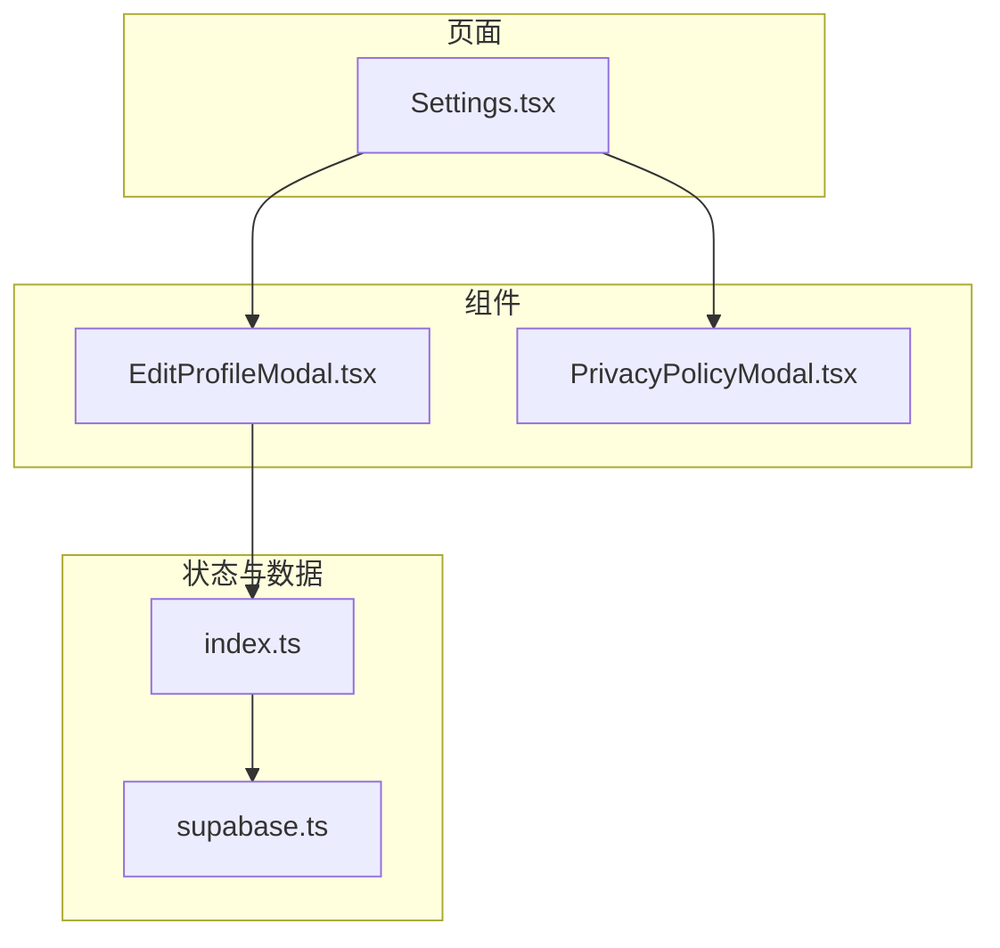
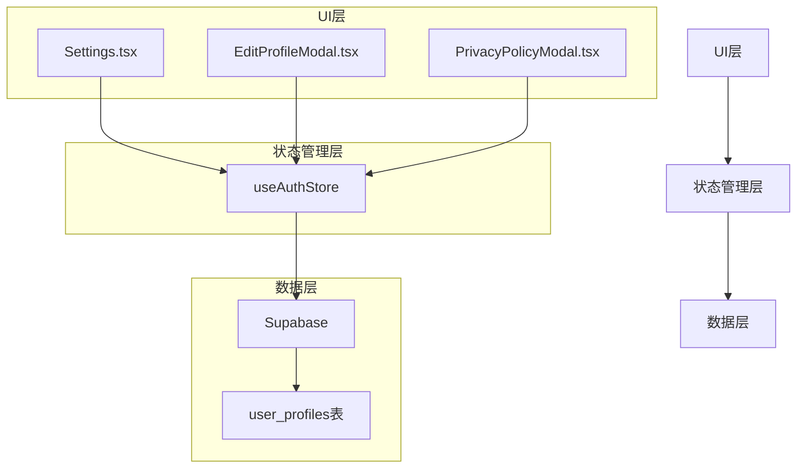
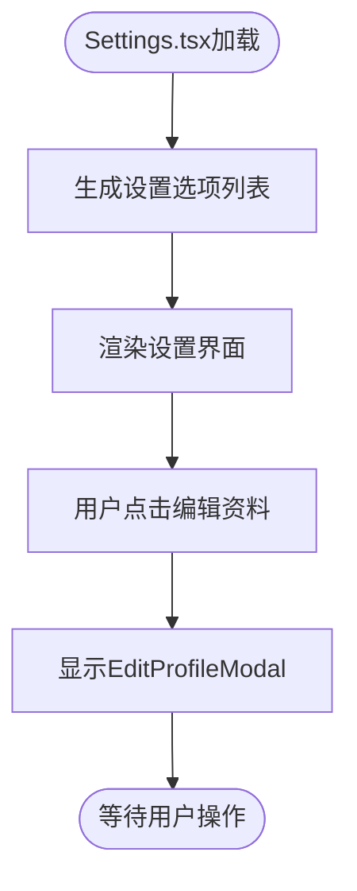
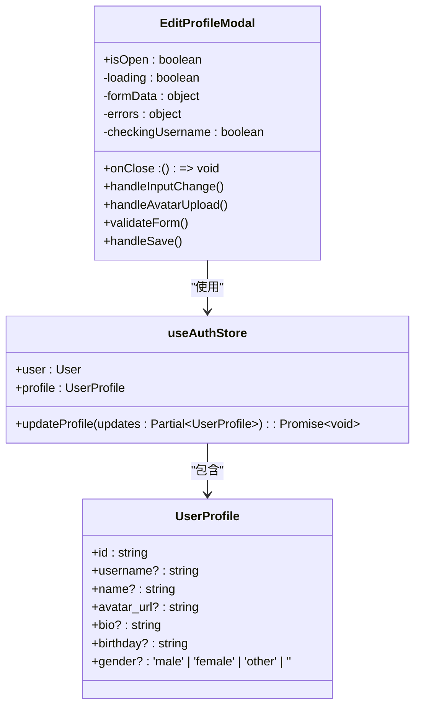
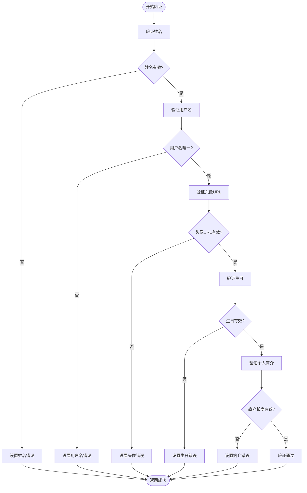
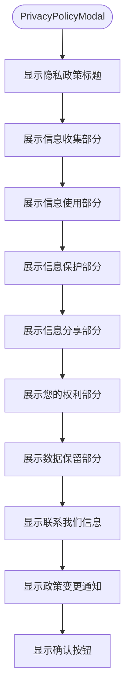
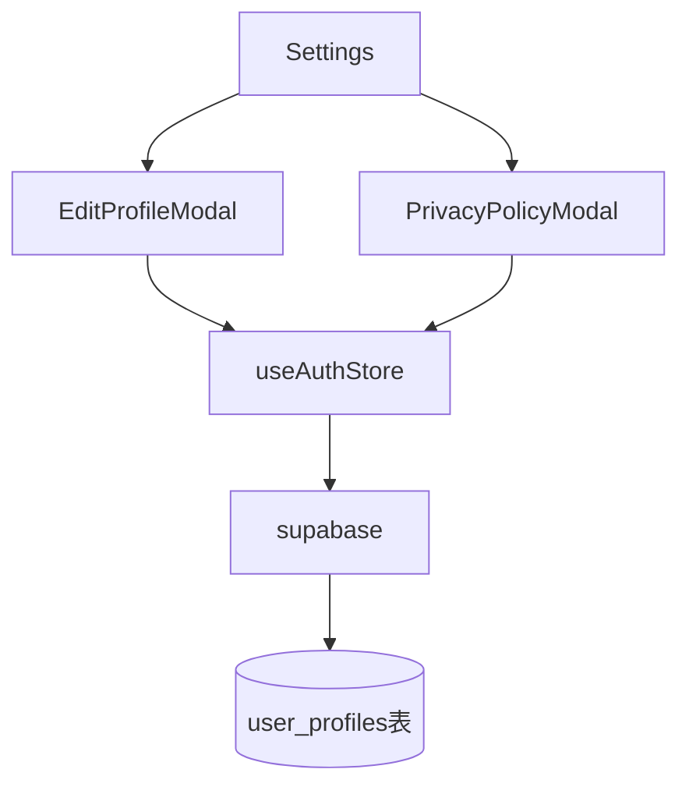

# 用户设置功能

<cite>
**本文档引用的文件**
- [Settings.tsx](file://src/pages/Settings.tsx)
- [EditProfileModal.tsx](file://src/components/EditProfileModal.tsx)
- [PrivacyPolicyModal.tsx](file://src/components/PrivacyPolicyModal.tsx)
- [index.ts](file://src/store/index.ts)
- [supabase.ts](file://src/lib/supabase.ts)
- [add_profile_fields.sql](file://supabase/migrations/add_profile_fields.sql)
- [fix_user_profiles_rls.sql](file://supabase/migrations/fix_user_profiles_rls.sql)
</cite>

## 目录
1. [简介](#简介)
2. [项目结构](#项目结构)
3. [核心组件](#核心组件)
4. [架构概览](#架构概览)
5. [详细组件分析](#详细组件分析)
6. [依赖分析](#依赖分析)
7. [性能考虑](#性能考虑)
8. [故障排除指南](#故障排除指南)
9. [结论](#结论)

## 简介
本文档全面阐述了心情日记应用的用户设置模块，重点介绍个人资料管理与隐私政策查看功能。文档详细解析了`Settings.tsx`页面的导航结构与功能入口，包括编辑个人资料、查看隐私政策、注销账户等选项。深入说明了`EditProfileModal.tsx`模态框的实现机制，如何允许用户修改昵称、头像等信息，并通过`useAuthStore`中的`updateProfile`方法持久化到Supabase的`user_profiles`表。同时，文档解析了`PrivacyPolicyModal.tsx`的内容展示逻辑，强调了用户数据隐私保护措施，并为开发者提供了功能扩展路径。

## 项目结构
用户设置功能主要由三个核心组件构成，分别位于不同的目录中。主设置页面`Settings.tsx`位于`src/pages/`目录下，负责整体布局和功能入口的组织。两个模态框组件`EditProfileModal.tsx`和`PrivacyPolicyModal.tsx`则位于`src/components/`目录下，分别处理个人资料编辑和隐私政策展示。状态管理通过`src/store/index.ts`中的`useAuthStore`实现，而数据持久化则依赖于`src/lib/supabase.ts`提供的Supabase客户端。

**图示来源**
- [Settings.tsx](file://src/pages/Settings.tsx)
- [EditProfileModal.tsx](file://src/components/EditProfileModal.tsx)
- [PrivacyPolicyModal.tsx](file://src/components/PrivacyPolicyModal.tsx)
- [index.ts](file://src/store/index.ts)
- [supabase.ts](file://src/lib/supabase.ts)

**本节来源**
- [Settings.tsx](file://src/pages/Settings.tsx)
- [EditProfileModal.tsx](file://src/components/EditProfileModal.tsx)
- [PrivacyPolicyModal.tsx](file://src/components/PrivacyPolicyModal.tsx)

## 核心组件
用户设置模块的核心功能由`Settings.tsx`、`EditProfileModal.tsx`和`PrivacyPolicyModal.tsx`三个组件协同实现。`Settings.tsx`作为主入口，通过动态生成的设置选项列表，为用户提供清晰的功能导航。`EditProfileModal.tsx`实现了完整的个人资料编辑流程，包含表单验证、头像上传和数据持久化。`PrivacyPolicyModal.tsx`则以结构化的方式向用户展示详细的隐私政策内容。

**本节来源**
- [Settings.tsx](file://src/pages/Settings.tsx#L1-L625)
- [EditProfileModal.tsx](file://src/components/EditProfileModal.tsx#L1-L435)
- [PrivacyPolicyModal.tsx](file://src/components/PrivacyPolicyModal.tsx#L1-L177)

## 架构概览
整个用户设置模块采用分层架构，从上至下分别为UI层、状态管理层和数据层。UI层由React组件构成，负责用户交互和界面展示。状态管理层使用Zustand库，集中管理用户认证和资料信息。数据层通过Supabase客户端与后端数据库进行通信，实现数据的持久化存储。

**图示来源**
- [Settings.tsx](file://src/pages/Settings.tsx)
- [EditProfileModal.tsx](file://src/components/EditProfileModal.tsx)
- [index.ts](file://src/store/index.ts)
- [supabase.ts](file://src/lib/supabase.ts)

## 详细组件分析

### 设置页面分析
`Settings.tsx`组件是用户设置功能的入口，它通过`getSettingSections`函数动态生成设置选项列表。该列表被划分为“个人信息”、“应用设置”、“数据管理”和“其他”四个部分，每个部分包含多个功能项。用户点击“编辑资料”会触发`setShowEditProfile(true)`，从而显示`EditProfileModal`模态框。

**图示来源**
- [Settings.tsx](file://src/pages/Settings.tsx#L1-L625)

**本节来源**
- [Settings.tsx](file://src/pages/Settings.tsx#L1-L625)

### 编辑资料模态框分析
`EditProfileModal.tsx`组件实现了个人资料的编辑功能。它使用`useAuthStore`中的`profile`状态初始化表单数据，并通过`updateProfile`方法将修改后的数据持久化。模态框包含了姓名、用户名、头像、生日、性别和个人简介等多个字段的输入和验证。

#### 类图

**图示来源**
- [EditProfileModal.tsx](file://src/components/EditProfileModal.tsx#L1-L435)
- [index.ts](file://src/store/index.ts#L1-L558)
- [supabase.ts](file://src/lib/supabase.ts#L1-L47)

#### 表单验证流程

**图示来源**
- [EditProfileModal.tsx](file://src/components/EditProfileModal.tsx#L1-L435)

**本节来源**
- [EditProfileModal.tsx](file://src/components/EditProfileModal.tsx#L1-L435)
- [index.ts](file://src/store/index.ts#L1-L558)

### 隐私政策模态框分析
`PrivacyPolicyModal.tsx`组件以清晰的结构向用户展示隐私政策。它将政策内容划分为“信息收集”、“信息使用”、“信息保护”、“信息分享”、“您的权利”和“数据保留”六个部分，每个部分都有对应的图标和详细说明。

**图示来源**
- [PrivacyPolicyModal.tsx](file://src/components/PrivacyPolicyModal.tsx#L1-L177)

**本节来源**
- [PrivacyPolicyModal.tsx](file://src/components/PrivacyPolicyModal.tsx#L1-L177)

## 依赖分析
用户设置模块的组件之间存在明确的依赖关系。`Settings.tsx`直接依赖于`EditProfileModal.tsx`和`PrivacyPolicyModal.tsx`两个组件。这两个模态框组件又共同依赖于`useAuthStore`状态管理器。`useAuthStore`则依赖于`supabase.ts`提供的Supabase客户端与后端数据库进行交互。

**图示来源**
- [Settings.tsx](file://src/pages/Settings.tsx)
- [EditProfileModal.tsx](file://src/components/EditProfileModal.tsx)
- [PrivacyPolicyModal.tsx](file://src/components/PrivacyPolicyModal.tsx)
- [index.ts](file://src/store/index.ts)
- [supabase.ts](file://src/lib/supabase.ts)

**本节来源**
- [Settings.tsx](file://src/pages/Settings.tsx)
- [EditProfileModal.tsx](file://src/components/EditProfileModal.tsx)
- [PrivacyPolicyModal.tsx](file://src/components/PrivacyPolicyModal.tsx)
- [index.ts](file://src/store/index.ts)

## 性能考虑
在用户设置模块的设计中，已考虑了多项性能优化措施。例如，在`EditProfileModal`中，用户名唯一性检查采用了防抖机制，避免了频繁的网络请求。表单验证在客户端完成，减少了不必要的服务器交互。此外，`useAuthStore`的状态管理避免了不必要的组件重渲染，提升了整体性能。

## 故障排除指南
当用户设置功能出现问题时，可参考以下排查步骤：
1. 检查Supabase环境变量是否正确配置。
2. 确认`user_profiles`表的RLS（行级安全）策略是否正确设置。
3. 验证`useAuthStore`中的用户状态是否正常。
4. 检查网络请求是否成功，特别是`updateProfile`方法的调用。

**本节来源**
- [index.ts](file://src/store/index.ts#L1-L558)
- [supabase.ts](file://src/lib/supabase.ts#L1-L47)
- [fix_user_profiles_rls.sql](file://supabase/migrations/fix_user_profiles_rls.sql)

## 结论
本文档全面解析了心情日记应用的用户设置模块，涵盖了从UI设计到数据持久化的各个方面。通过`Settings.tsx`、`EditProfileModal.tsx`和`PrivacyPolicyModal.tsx`三个组件的协同工作，为用户提供了一个完整、安全且易于使用的设置体验。模块的设计充分考虑了可扩展性，为未来添加新功能（如通知偏好、主题切换）提供了清晰的路径。