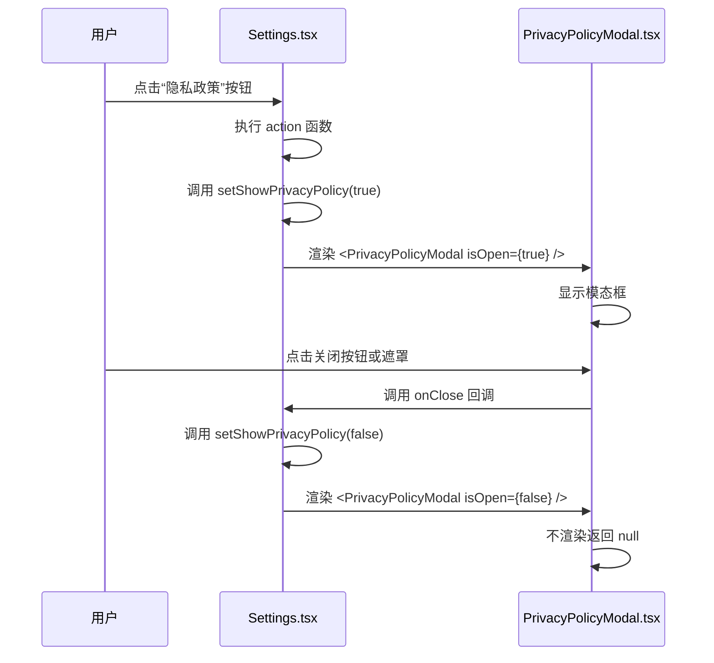
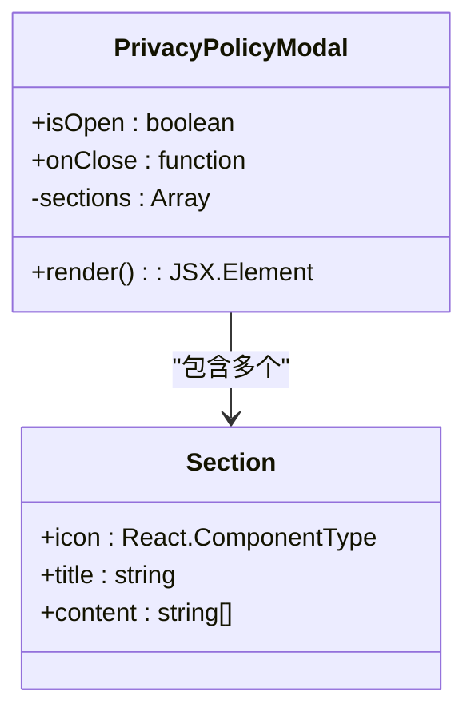
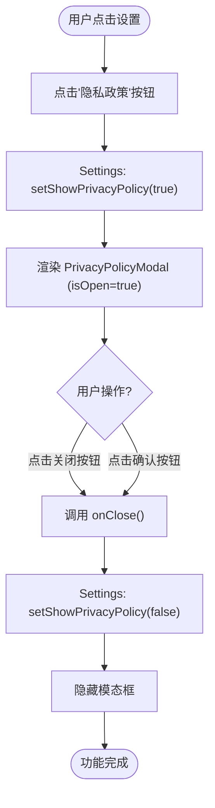
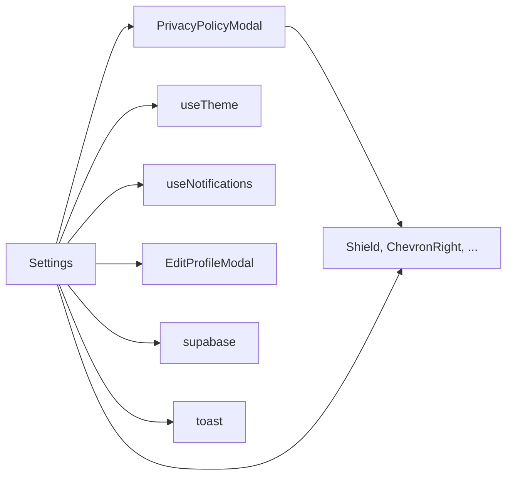

# 隐私政策查看

<cite>
**本文档引用的文件**  
- [PrivacyPolicyModal.tsx](file://src/components/PrivacyPolicyModal.tsx)
- [Settings.tsx](file://src/pages/Settings.tsx)
- [useTheme.ts](file://src/hooks/useTheme.ts)
</cite>

## 目录
1. [简介](#简介)
2. [项目结构](#项目结构)
3. [核心组件](#核心组件)
4. [架构概览](#架构概览)
5. [详细组件分析](#详细组件分析)
6. [依赖分析](#依赖分析)
7. [性能考虑](#性能考虑)
8. [故障排除指南](#故障排除指南)
9. [结论](#结论)

## 简介
本技术文档详细解析了“心情日记”应用中隐私政策查看功能的实现机制。该功能通过 `PrivacyPolicyModal` 组件为用户提供清晰、合规的隐私政策展示，确保用户可随时查阅应用对个人信息的收集、使用、保护和共享方式。文档深入分析了模态框在 `Settings` 页面中的触发逻辑、UI 结构、交互行为、样式实现以及与主题系统的集成，同时探讨了其在满足数据合规性要求方面的作用，并提出未来多语言支持的扩展建议。

## 项目结构
隐私政策功能主要由两个核心文件构成：`src/components/PrivacyPolicyModal.tsx` 负责模态框的 UI 渲染和内容展示，`src/pages/Settings.tsx` 负责管理其显示状态和触发逻辑。该功能作为设置页面的一个选项被集成，体现了应用对用户隐私权的尊重和透明度。

```mermaid
graph TB
subgraph "页面"
Settings[Settings.tsx]
end
subgraph "组件"
PrivacyPolicyModal[PrivacyPolicyModal.tsx]
EditProfileModal[EditProfileModal.tsx]
end
subgraph "钩子"
useTheme[useTheme.ts]
useNotifications[useNotifications.ts]
end
Settings --> PrivacyPolicyModal : "渲染"
Settings --> EditProfileModal : "渲染"
Settings --> useTheme : "使用"
Settings --> useNotifications : "使用"
PrivacyPolicyModal --> useTheme : "隐式依赖"
```

**Diagram sources**
- [Settings.tsx](file://src/pages/Settings.tsx)
- [PrivacyPolicyModal.tsx](file://src/components/PrivacyPolicyModal.tsx)
- [useTheme.ts](file://src/hooks/useTheme.ts)

**Section sources**
- [Settings.tsx](file://src/pages/Settings.tsx)
- [PrivacyPolicyModal.tsx](file://src/components/PrivacyPolicyModal.tsx)

## 核心组件
`PrivacyPolicyModal` 组件是一个受控的模态对话框，接收 `isOpen` 和 `onClose` 两个关键属性。当 `isOpen` 为 `true` 时，组件渲染一个半透明的遮罩层和一个居中的内容卡片。其核心功能是结构化地展示应用的隐私政策文本，并提供明确的关闭途径。该组件的设计强调了可读性和用户友好性，通过图标、分段标题和清晰的排版来组织复杂的信息。

**Section sources**
- [PrivacyPolicyModal.tsx](file://src/components/PrivacyPolicyModal.tsx#L7-L176)

## 架构概览
整个隐私政策查看功能的架构遵循了清晰的职责分离原则。`Settings` 页面作为状态管理者，持有 `showPrivacyPolicy` 这个布尔状态来控制模态框的显示。`PrivacyPolicyModal` 组件则作为纯粹的展示层，不管理自身状态，仅根据传入的属性进行渲染。这种模式使得组件高度可复用，并且逻辑清晰。



**Diagram sources**
- [Settings.tsx](file://src/pages/Settings.tsx#L389-L394)
- [PrivacyPolicyModal.tsx](file://src/components/PrivacyPolicyModal.tsx#L7-L10)

## 详细组件分析

### PrivacyPolicyModal 组件分析
`PrivacyPolicyModal` 组件是隐私政策功能的核心，其设计旨在提供一个合规、易读且美观的政策展示界面。

#### UI 结构与内容组织
该模态框采用垂直布局，分为四个主要区域：
1.  **头部区域**：包含一个盾牌图标（`Shield`）和“隐私政策”标题，以及一个位于右上角的关闭按钮（`X` 图标）。
2.  **引言区域**：提供一段简短的欢迎语，说明隐私的重要性，并显示政策的最后更新日期。
3.  **主体条款区域**：这是内容的核心，通过 `sections` 数组动态渲染。每个条款包含一个图标（如 `Eye`、`Database`）、一个标题和一个内容列表。内容以项目符号（`•`）的形式组织，提高了可读性。
4.  **联系信息与底部区域**：包含联系邮箱和一个“我已阅读并理解”的确认按钮，点击该按钮可关闭模态框。



**Diagram sources**
- [PrivacyPolicyModal.tsx](file://src/components/PrivacyPolicyModal.tsx#L13-L72)

#### 样式与可滚动区域实现
组件的样式完全基于 Tailwind CSS 实现，确保了与应用整体设计语言的一致性。
- **遮罩层**：使用 `fixed inset-0 bg-black bg-opacity-50` 创建一个覆盖全屏的半透明黑色背景。
- **内容卡片**：使用 `bg-white rounded-xl` 创建白色圆角卡片，并通过 `w-full max-w-2xl` 限制最大宽度，`max-h-[90vh]` 限制最大高度。
- **可滚动内容**：关键的可滚动区域通过 `flex-1 overflow-y-auto p-6` 实现。`flex-1` 使内容区域占据除头部和底部外的所有可用空间，`overflow-y-auto` 在内容超出时自动显示垂直滚动条，确保在小屏幕上也能完整查看所有政策条款。

**Section sources**
- [PrivacyPolicyModal.tsx](file://src/components/PrivacyPolicyModal.tsx#L72-L176)

### Settings 页面集成分析
`Settings` 页面是 `PrivacyPolicyModal` 的宿主和控制器。它通过 React 的 `useState` Hook 管理模态框的显示状态。

#### 触发逻辑
1.  **状态定义**：在 `Settings` 组件中，通过 `const [showPrivacyPolicy, setShowPrivacyPolicy] = useState(false)` 定义了一个名为 `showPrivacyPolicy` 的状态变量，初始值为 `false`。
2.  **菜单项配置**：在 `getSettingSections` 函数中，创建了一个“其他”设置项，其 `action` 属性被设置为 `() => setShowPrivacyPolicy(true)`。这意味着当用户点击“隐私政策”按钮时，会触发此函数，将 `showPrivacyPolicy` 状态更新为 `true`。
3.  **组件渲染**：在 JSX 的最后，通过 `<PrivacyPolicyModal isOpen={showPrivacyPolicy} onClose={() => setShowPrivacyPolicy(false)} />` 将状态和状态更新函数作为 `isOpen` 和 `onClose` 属性传递给模态框组件。

#### 关闭逻辑
用户可以通过两种方式关闭模态框：
1.  **点击关闭按钮**：模态框头部的 `X` 按钮和底部的“我已阅读并理解”按钮都绑定了 `onClose` 回调。
2.  **点击遮罩层**：虽然代码中未直接实现点击遮罩层关闭，但遮罩层 (`div`) 本身没有绑定 `onClick` 事件，因此点击遮罩层不会触发关闭。关闭行为完全依赖于模态框内部的按钮。



**Diagram sources**
- [Settings.tsx](file://src/pages/Settings.tsx#L52-L52)
- [Settings.tsx](file://src/pages/Settings.tsx#L389-L394)
- [Settings.tsx](file://src/pages/Settings.tsx#L617-L624)
- [PrivacyPolicyModal.tsx](file://src/components/PrivacyPolicyModal.tsx#L7-L10)

**Section sources**
- [Settings.tsx](file://src/pages/Settings.tsx#L19-L624)

### 主题系统集成
虽然 `PrivacyPolicyModal` 组件本身没有直接使用 `useTheme` 钩子，但它通过应用的全局主题系统实现了亮色/暗色模式的适配。
- **全局主题**：`useTheme` 钩子通过监听系统偏好和用户选择，动态地向 `document.documentElement` 添加或移除 `dark` 类，并设置 CSS 自定义属性。
- **Tailwind CSS 响应**：`PrivacyPolicyModal` 使用的 Tailwind CSS 类（如 `bg-white`, `text-gray-800`, `bg-gray-50`）会根据 `dark` 类的存在而自动切换其实际颜色。例如，`bg-white` 在暗色模式下可能会表现为深灰色背景，从而确保了文本在任何主题下都有良好的对比度和可读性。

**Section sources**
- [useTheme.ts](file://src/hooks/useTheme.ts#L30-L60)

## 依赖分析
该功能的实现依赖于项目中的多个模块，形成了一个清晰的依赖链。



**Diagram sources**
- [Settings.tsx](file://src/pages/Settings.tsx#L1-L19)
- [PrivacyPolicyModal.tsx](file://src/components/PrivacyPolicyModal.tsx#L1-L7)

## 性能考虑
该功能的性能表现优异：
- **轻量级组件**：`PrivacyPolicyModal` 是一个纯函数式组件，不涉及复杂的计算或状态管理，渲染开销极小。
- **条件渲染**：当 `isOpen` 为 `false` 时，组件直接返回 `null`，避免了不必要的 DOM 挂载和渲染。
- **静态内容**：政策文本是硬编码在组件内的静态数据，无需进行网络请求或异步加载，确保了打开模态框的即时性。

## 故障排除指南
*   **问题：点击“隐私政策”按钮，模态框未弹出。**
    *   **检查**：确认 `Settings.tsx` 中的 `showPrivacyPolicy` 状态是否被正确更新。检查控制台是否有 JavaScript 错误。
*   **问题：模态框内容在暗色模式下难以阅读。**
    *   **检查**：确认 `useTheme` 钩子是否正常工作，`dark` 类是否已正确添加到 `html` 标签上。检查 Tailwind CSS 的 `darkMode` 配置是否正确。
*   **问题：模态框内容过长，滚动不流畅。**
    *   **检查**：确认 `overflow-y-auto` 类是否已正确应用到内容区域。检查是否有其他 CSS 规则覆盖了滚动行为。

**Section sources**
- [Settings.tsx](file://src/pages/Settings.tsx#L52-L52)
- [useTheme.ts](file://src/hooks/useTheme.ts#L30-L60)
- [PrivacyPolicyModal.tsx](file://src/components/PrivacyPolicyModal.tsx#L72-L75)

## 结论
“心情日记”应用的隐私政策查看功能通过 `PrivacyPolicyModal` 组件的精心设计和与 `Settings` 页面的无缝集成，成功实现了对用户隐私权的尊重和合规性要求。该功能不仅提供了清晰、结构化的政策信息，还通过现代化的 UI 设计和对主题系统的支持，确保了良好的用户体验。其模块化和组件化的实现方式也为未来的功能扩展（如多语言支持）奠定了坚实的基础。