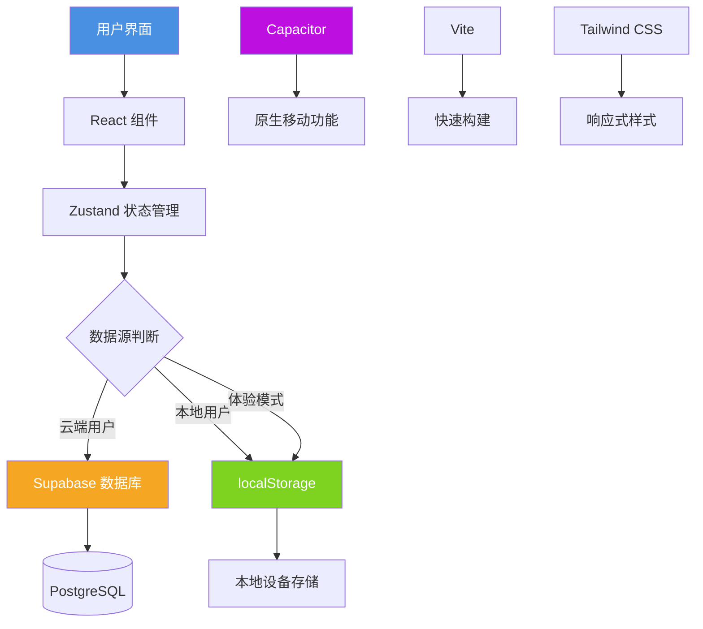

# 项目概述

<cite>
**本文档引用文件**  
- [README.md](file://README.md)
- [main.tsx](file://src/main.tsx)
- [App.tsx](file://src/App.tsx)
- [store/index.ts](file://src/store/index.ts)
- [lib/supabase.ts](file://src/lib/supabase.ts)
- [router/index.tsx](file://src/router/index.tsx)
- [pages/Auth.tsx](file://src/pages/Auth.tsx)
- [pages/Home.tsx](file://src/pages/Home.tsx)
- [pages/Record.tsx](file://src/pages/Record.tsx)
- [pages/History.tsx](file://src/pages/History.tsx)
</cite>

## 目录
1. [项目简介](#项目简介)
2. [核心定位与设计目标](#核心定位与设计目标)
3. [整体架构风格](#整体架构风格)
4. [技术愿景](#技术愿景)
5. [典型用户工作流](#典型用户工作流)
6. [系统边界与集成点](#系统边界与集成点)
7. [关键设计决策](#关键设计决策)
8. [架构示意图](#架构示意图)
9. [模块文档链接](#模块文档链接)

## 项目简介

funnyrecord 是一款基于 React 与 Capacitor 框架构建的心情记录与情绪管理应用。该项目旨在为用户提供一个轻量、直观且跨平台的情绪追踪工具，支持本地与云端双模式存储，适用于移动设备部署。通过简洁的界面设计和流畅的交互体验，用户可以轻松记录每日心情、查看历史趋势并进行数据分析。

项目采用现代前端技术栈，包括 Vite 作为构建工具、TypeScript 提供类型安全、Tailwind CSS 实现响应式样式，并通过 Zustand 进行状态管理。后端服务由 Supabase 提供，实现用户认证、数据持久化与实时同步功能。Capacitor 框架确保应用可在 iOS 和 Android 平台上原生运行。

**Section sources**
- [README.md](file://README.md#L1-L57)
- [main.tsx](file://src/main.tsx#L1-L11)
- [App.tsx](file://src/App.tsx#L1-L27)

## 核心定位与设计目标

funnyrecord 的核心定位是打造一款用户友好、隐私安全、功能完整的情绪追踪工具。其主要设计目标包括：

- **双模式存储支持**：用户可以选择使用 Supabase 云服务进行数据同步，或以“体验模式”运行，所有数据仅保存在本地设备中，保障隐私安全。
- **跨平台移动部署**：借助 Capacitor 框架，应用可无缝打包为原生 Android 和 iOS 应用，实现跨平台一致性体验。
- **情绪追踪体验优化**：提供快速心情记录、7天趋势图、分类标签、历史浏览等功能，帮助用户直观了解情绪变化。
- **零配置体验入口**：即使 Supabase 环境未配置，用户仍可通过点击“立即开始体验”按钮进入应用，享受完整功能。

该设计目标体现了对开发者友好性与用户可访问性的双重重视。

**Section sources**
- [App.tsx](file://src/App.tsx#L1-L27)
- [store/index.ts](file://src/store/index.ts#L1-L557)
- [pages/Auth.tsx](file://src/pages/Auth.tsx#L1-L416)

## 整体架构风格

funnyrecord 采用典型的分层架构设计，清晰划分为表现层、状态管理层与数据访问层，结合组件化开发模式，提升代码可维护性与可扩展性。

### 分层架构说明

- **表现层（UI Layer）**：由 React 组件构成，位于 `src/pages` 与 `src/components` 目录下，负责用户界面展示与交互逻辑。
- **状态管理层（State Layer）**：使用 Zustand 管理全局状态，集中处理用户认证、心情记录、标签等核心状态，避免组件间状态传递复杂性。
- **数据访问层（Data Layer）**：通过 `supabase.ts` 封装 Supabase 客户端，统一管理数据库操作与类型定义，支持条件性本地存储回退。

### 组件化设计

所有页面与功能模块均以独立组件形式组织，遵循单一职责原则。例如：
- `Auth.tsx`：处理登录/注册逻辑
- `Home.tsx`：首页聚合展示
- `Record.tsx`：详细记录界面
- `History.tsx`：历史记录查看

这种结构便于团队协作与单元测试。

**Section sources**
- [App.tsx](file://src/App.tsx#L1-L27)
- [store/index.ts](file://src/store/index.ts#L1-L557)
- [lib/supabase.ts](file://src/lib/supabase.ts#L1-L46)
- [router/index.tsx](file://src/router/index.tsx#L1-L44)

## 技术愿景

funnyrecord 的技术愿景聚焦于三个核心维度：轻量化、可扩展性与开发者友好性。

### 轻量化

项目摒弃了传统 Redux 等重型状态管理方案，选用轻量高效的 Zustand，减少运行时开销。同时使用 Vite + SWC 实现极速冷启动与热更新，提升开发效率。

### 可扩展性

通过模块化设计与清晰的接口定义（如 `MoodRecord`, `UserTag` 等 TypeScript 接口），系统易于扩展新功能，如添加情绪分析算法、导出功能或第三方服务集成。

### 开发者友好性

- 提供详细的错误日志输出（如注册失败时的超详细错误信息）
- 支持本地存储作为备用认证方案
- 内置体验模式，降低部署门槛
- 使用 ESLint + TypeScript 提升代码质量

这些特性使得项目不仅适合个人使用，也适合作为开源模板供其他开发者二次开发。

**Section sources**
- [store/index.ts](file://src/store/index.ts#L1-L557)
- [lib/supabase.ts](file://src/lib/supabase.ts#L1-L46)
- [pages/Auth.tsx](file://src/pages/Auth.tsx#L1-L416)

## 典型用户工作流

以下是典型用户的使用流程，涵盖从启动到查看统计的完整路径：

1. **启动应用**  
   用户打开应用后，首先进入 `Auth.tsx` 页面。若检测到本地用户或体验模式标记，则自动跳转至首页。

2. **认证登录**  
   - 新用户可选择注册账号（通过 Supabase）或直接点击“立即开始体验”进入应用。
   - 已登录用户自动恢复会话状态，无需重复输入凭证。

3. **记录心情**  
   在首页点击“详细记录”按钮进入 `Record.tsx`，选择心情类型、强度、标签并填写描述后保存。系统将数据写入 Supabase 或本地存储。

4. **查看统计**  
   用户可在 `Stats.tsx` 页面查看情绪趋势图表，或在 `History.tsx` 中以时间轴或日历视图浏览过往记录。

5. **个性化设置**  
   在 `Settings.tsx` 中管理个人资料、标签与隐私选项。

整个流程简洁直观，兼顾新手引导与高级功能探索。

**Section sources**
- [pages/Auth.tsx](file://src/pages/Auth.tsx#L1-L416)
- [pages/Home.tsx](file://src/pages/Home.tsx#L1-L371)
- [pages/Record.tsx](file://src/pages/Record.tsx#L1-L259)
- [pages/History.tsx](file://src/pages/History.tsx#L1-L217)

## 系统边界与集成点

funnyrecord 的系统边界清晰，主要依赖两个外部集成点：

### Supabase 集成

作为后端即服务（BaaS），Supabase 提供以下能力：
- 用户认证（`supabase.auth.signInWithPassword`）
- 数据库操作（心情记录、标签、用户资料的增删改查）
- 表结构定义位于 `supabase/migrations/` 目录下的 SQL 文件中

环境变量通过 `VITE_SUPABASE_URL` 与 `VITE_SUPABASE_ANON_KEY` 注入。

### Capacitor 设备 API 集成

虽然当前代码中尚未完全展开，但 Capacitor 的引入为未来集成原生功能预留了空间，例如：
- 本地通知提醒记录
- 设备传感器数据采集
- 文件系统访问用于数据导出

这些集成点体现了系统的可扩展潜力。

**Section sources**
- [lib/supabase.ts](file://src/lib/supabase.ts#L1-L46)
- [store/index.ts](file://src/store/index.ts#L1-L557)
- [supabase/migrations](file://supabase/migrations)

## 关键设计决策

项目中包含多个关键设计决策，直接影响用户体验与系统健壮性：

### 本地存储作为降级方案

当 Supabase 配置缺失或注册失败时，系统自动启用本地存储机制（`localStorage`），允许用户以“本地用户”身份继续使用应用。此设计显著提升了应用的可用性。

### 体验模式优先策略

在 `Auth.tsx` 中明确提示数据库问题，并优先推荐“体验模式”，避免用户因配置问题流失。该策略降低了新用户上手门槛。

### 状态管理集中化

使用 Zustand 将认证状态与心情数据分离为 `useAuthStore` 与 `useMoodStore`，既保持关注点分离，又避免过度拆分导致的复杂性。

### 类型驱动开发

通过 TypeScript 定义 `MoodRecord`, `UserTag`, `UserProfile` 等接口，确保前后端数据结构一致，减少运行时错误。

**Section sources**
- [store/index.ts](file://src/store/index.ts#L1-L557)
- [pages/Auth.tsx](file://src/pages/Auth.tsx#L1-L416)
- [lib/supabase.ts](file://src/lib/supabase.ts#L1-L46)

## 架构示意图

**Diagram sources**
- [App.tsx](file://src/App.tsx#L1-L27)
- [store/index.ts](file://src/store/index.ts#L1-L557)
- [lib/supabase.ts](file://src/lib/supabase.ts#L1-L46)

## 模块文档链接

以下为核心功能模块的详细文档链接建议：

- [认证模块文档](file://src/pages/Auth.tsx)：涵盖登录、注册、体验模式实现
- [首页模块文档](file://src/pages/Home.tsx)：介绍快速记录、趋势图与概览功能
- [记录模块文档](file://src/pages/Record.tsx)：说明心情选择、强度调节与标签系统
- [历史模块文档](file://src/pages/History.tsx)：描述时间轴与日历视图实现
- [状态管理文档](file://src/store/index.ts)：解析 Zustand store 结构与数据流
- [Supabase 集成文档](file://src/lib/supabase.ts)：定义数据模型与客户端配置

这些文档将为开发者提供深入理解系统运作机制的基础。

**Section sources**
- [pages/Auth.tsx](file://src/pages/Auth.tsx#L1-L416)
- [pages/Home.tsx](file://src/pages/Home.tsx#L1-L371)
- [pages/Record.tsx](file://src/pages/Record.tsx#L1-L259)
- [pages/History.tsx](file://src/pages/History.tsx#L1-L217)
- [store/index.ts](file://src/store/index.ts#L1-L557)
- [lib/supabase.ts](file://src/lib/supabase.ts#L1-L46)