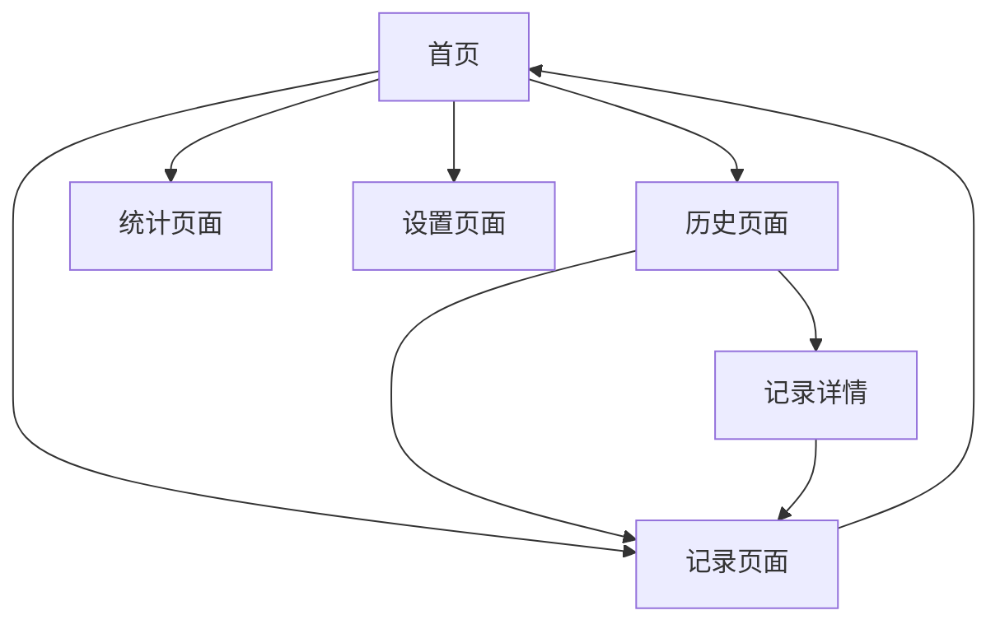

# 心情日记 H5 应用产品需求文档

## 1. Product Overview
一款面向移动端的心情日记H5应用，采用现代化扁平设计风格，让用户轻松记录和管理日常心情状态。
应用专注于简洁有趣的用户体验，帮助用户养成记录心情的习惯，并通过可视化数据洞察自己的情绪变化规律。
目标是成为年轻用户群体中最受欢迎的轻量级心情管理工具。

## 2. Core Features

### 2.1 Feature Module
我们的心情日记应用包含以下核心页面：
1. **首页**：心情快速记录、今日心情展示、心情趋势预览
2. **记录页面**：详细心情记录、表情选择、标签添加、文字描述
3. **历史页面**：心情历史列表、日历视图、搜索筛选
4. **统计页面**：心情数据可视化、周月年统计、心情分析报告
5. **设置页面**：个人信息、提醒设置、数据导出

### 2.2 Page Details

| Page Name | Module Name | Feature description |
|-----------|-------------|---------------------|
| 首页 | 快速记录区 | 点击表情图标快速记录当前心情，支持5种基础情绪状态 |
| 首页 | 今日概览 | 显示今日已记录的心情次数和主要情绪状态 |
| 首页 | 趋势预览 | 展示最近7天的心情变化曲线图 |
| 记录页面 | 表情选择器 | 提供丰富的表情符号选择，支持自定义表情强度 |
| 记录页面 | 标签系统 | 预设常用标签（工作、生活、运动等），支持自定义标签 |
| 记录页面 | 文字记录 | 可选的文字描述功能，支持语音转文字 |
| 历史页面 | 时间轴视图 | 按时间顺序展示历史心情记录，支持无限滚动 |
| 历史页面 | 日历视图 | 月历形式展示每日心情状态，点击查看详情 |
| 历史页面 | 搜索筛选 | 按日期、标签、心情类型筛选历史记录 |
| 统计页面 | 数据图表 | 心情分布饼图、趋势折线图、标签词云图 |
| 统计页面 | 周期报告 | 生成周报、月报，分析心情变化规律 |
| 设置页面 | 提醒功能 | 设置每日心情记录提醒时间 |
| 设置页面 | 数据管理 | 数据备份、导出、清理功能 |

## 3. Core Process

用户主要操作流程：
1. 用户进入首页，可以快速点击表情图标记录当前心情
2. 如需详细记录，点击"详细记录"进入记录页面，选择具体表情、添加标签和文字描述
3. 用户可以在历史页面查看过往的心情记录，支持日历和时间轴两种视图
4. 在统计页面查看心情数据分析，了解自己的情绪变化规律
5. 通过设置页面管理个人偏好和数据

## 4. User Interface Design

### 4.1 Design Style
- **主色调**：温暖橙色 (#FF6B35) 作为主色，浅灰色 (#F5F5F5) 作为背景色
- **辅助色**：柔和蓝色 (#4A90E2) 用于链接和按钮，绿色 (#7ED321) 用于积极状态
- **按钮风格**：圆角矩形按钮，阴影效果，支持按压反馈动画
- **字体**：系统默认字体，标题18px，正文14px，注释12px
- **布局风格**：卡片式设计，充足的留白，底部导航栏
- **图标风格**：线性图标配合填充图标，统一的圆角风格，支持动画效果

### 4.2 Page Design Overview

| Page Name | Module Name | UI Elements |
|-----------|-------------|-------------|
| 首页 | 快速记录区 | 5个大号表情按钮，圆形设计，点击有缩放动画效果 |
| 首页 | 今日概览 | 卡片式布局，渐变背景，显示数字统计和小图标 |
| 首页 | 趋势预览 | 简化的折线图，使用主色调，平滑曲线动画 |
| 记录页面 | 表情选择器 | 网格布局的表情面板，支持滑动选择和强度调节 |
| 记录页面 | 标签系统 | 胶囊形状的标签按钮，选中状态有颜色变化 |
| 历史页面 | 时间轴视图 | 垂直时间轴，左侧时间右侧内容，卡片阴影效果 |
| 历史页面 | 日历视图 | 月历网格，每日显示代表性表情，当日高亮 |
| 统计页面 | 数据图表 | 彩色图表，平滑动画，支持交互点击 |
| 设置页面 | 设置项 | 列表式布局，右箭头指示，开关按钮 |

### 4.3 Responsiveness
应用采用移动端优先设计，完全适配手机屏幕尺寸，支持触摸手势操作，包括滑动、点击、长按等交互方式。界面元素针对手指操作进行优化，按钮大小不小于44px，确保良好的触摸体验。