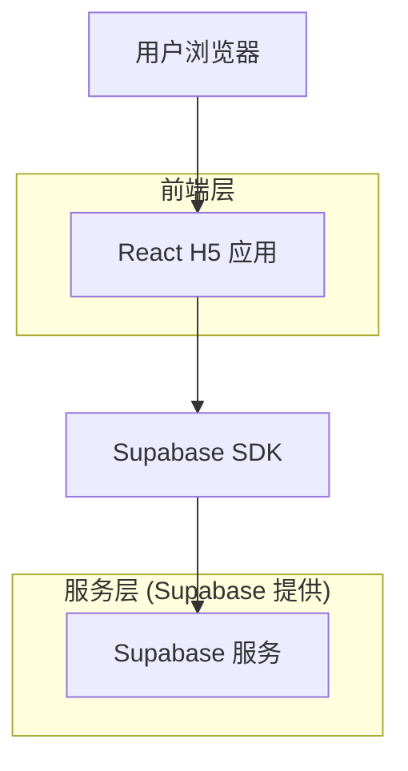
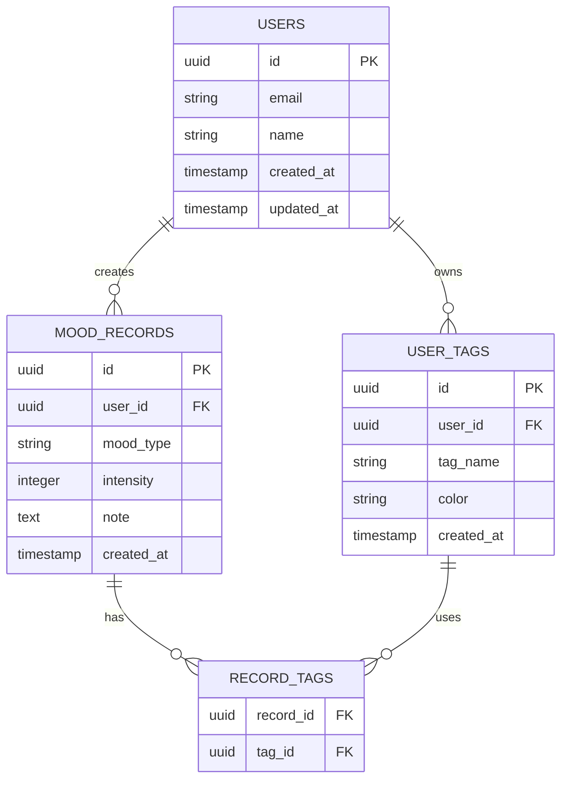

# 心情日记 H5 应用技术架构文档

## 1. Architecture design



## 2. Technology Description

* Frontend: React\@18 + TypeScript + Tailwind CSS\@3 + Vite

* Backend: Supabase (认证、数据库、实时订阅)

* 状态管理: Zustand

* 图表库: Chart.js

* 图标库: Lucide React

* 移动端适配: PWA 支持

## 3. Route definitions

| Route     | Purpose        |
| --------- | -------------- |
| /         | 首页，显示快速记录和今日概览 |
| /record   | 记录页面，详细心情记录功能  |
| /history  | 历史页面，查看过往心情记录  |
| /stats    | 统计页面，心情数据分析和图表 |
| /settings | 设置页面，个人偏好和数据管理 |

## 4. API definitions

### 4.1 Core API

基于 Supabase 的数据操作，通过 Supabase SDK 实现：

**心情记录相关**

```typescript
// 创建心情记录
supabase.from('mood_records').insert({
  user_id: string,
  mood_type: string,
  intensity: number,
  tags: string[],
  note: string,
  created_at: timestamp
})

// 获取心情记录
supabase.from('mood_records')
  .select('*')
  .eq('user_id', userId)
  .order('created_at', { ascending: false })
```

**用户认证**

```typescript
// 用户注册/登录
supabase.auth.signUp({ email, password })
supabase.auth.signInWithPassword({ email, password })

// 获取当前用户
supabase.auth.getUser()
```

## 5. Data model

### 5.1 Data model definition



### 5.2 Data Definition Language

**用户表 (users)**

```sql
-- Supabase 自动创建 auth.users 表，我们创建扩展表
CREATE TABLE user_profiles (
  id UUID PRIMARY KEY REFERENCES auth.users(id) ON DELETE CASCADE,
  name VARCHAR(100),
  avatar_url TEXT,
  timezone VARCHAR(50) DEFAULT 'Asia/Shanghai',
  created_at TIMESTAMP WITH TIME ZONE DEFAULT NOW(),
  updated_at TIMESTAMP WITH TIME ZONE DEFAULT NOW()
);

-- 启用 RLS
ALTER TABLE user_profiles ENABLE ROW LEVEL SECURITY;

-- 创建策略
CREATE POLICY "用户只能查看自己的资料" ON user_profiles
  FOR SELECT USING (auth.uid() = id);

CREATE POLICY "用户只能更新自己的资料" ON user_profiles
  FOR UPDATE USING (auth.uid() = id);
```

**心情记录表 (mood\_records)**

```sql
CREATE TABLE mood_records (
  id UUID PRIMARY KEY DEFAULT gen_random_uuid(),
  user_id UUID REFERENCES auth.users(id) ON DELETE CASCADE NOT NULL,
  mood_type VARCHAR(20) NOT NULL CHECK (mood_type IN ('happy', 'sad', 'angry', 'anxious', 'calm', 'excited', 'tired', 'confused')),
  intensity INTEGER NOT NULL CHECK (intensity >= 1 AND intensity <= 5),
  note TEXT,
  created_at TIMESTAMP WITH TIME ZONE DEFAULT NOW(),
  updated_at TIMESTAMP WITH TIME ZONE DEFAULT NOW()
);

-- 创建索引
CREATE INDEX idx_mood_records_user_id ON mood_records(user_id);
CREATE INDEX idx_mood_records_created_at ON mood_records(created_at DESC);
CREATE INDEX idx_mood_records_mood_type ON mood_records(mood_type);

-- 启用 RLS
ALTER TABLE mood_records ENABLE ROW LEVEL SECURITY;

-- 创建策略
CREATE POLICY "用户只能查看自己的心情记录" ON mood_records
  FOR SELECT USING (auth.uid() = user_id);

CREATE POLICY "用户只能创建自己的心情记录" ON mood_records
  FOR INSERT WITH CHECK (auth.uid() = user_id);

CREATE POLICY "用户只能更新自己的心情记录" ON mood_records
  FOR UPDATE USING (auth.uid() = user_id);

CREATE POLICY "用户只能删除自己的心情记录" ON mood_records
  FOR DELETE USING (auth.uid() = user_id);
```

**用户标签表 (user\_tags)**

```sql
CREATE TABLE user_tags (
  id UUID PRIMARY KEY DEFAULT gen_random_uuid(),
  user_id UUID REFERENCES auth.users(id) ON DELETE CASCADE NOT NULL,
  tag_name VARCHAR(50) NOT NULL,
  color VARCHAR(7) DEFAULT '#FF6B35',
  created_at TIMESTAMP WITH TIME ZONE DEFAULT NOW(),
  UNIQUE(user_id, tag_name)
);

-- 创建索引
CREATE INDEX idx_user_tags_user_id ON user_tags(user_id);

-- 启用 RLS
ALTER TABLE user_tags ENABLE ROW LEVEL SECURITY;

-- 创建策略
CREATE POLICY "用户只能管理自己的标签" ON user_tags
  FOR ALL USING (auth.uid() = user_id);
```

**记录标签关联表 (record\_tags)**

```sql
CREATE TABLE record_tags (
  record_id UUID REFERENCES mood_records(id) ON DELETE CASCADE,
  tag_id UUID REFERENCES user_tags(id) ON DELETE CASCADE,
  PRIMARY KEY (record_id, tag_id)
);

-- 启用 RLS
ALTER TABLE record_tags ENABLE ROW LEVEL SECURITY;

-- 创建策略
CREATE POLICY "用户只能管理自己记录的标签" ON record_tags
  FOR ALL USING (
    EXISTS (
      SELECT 1 FROM mood_records 
      WHERE mood_records.id = record_tags.record_id 
      AND mood_records.user_id = auth.uid()
    )
  );
```

**初始化数据**

```sql
-- 插入默认标签（在用户注册时通过触发器自动创建）
CREATE OR REPLACE FUNCTION create_default_tags()
RETURNS TRIGGER AS $$
BEGIN
  INSERT INTO user_tags (user_id, tag_name, color) VALUES
    (NEW.id, '工作', '#FF6B35'),
    (NEW.id, '生活', '#4A90E2'),
    (NEW.id, '运动', '#7ED321'),
    (NEW.id, '学习', '#9013FE'),
    (NEW.id, '社交', '#FF9500');
  RETURN NEW;
END;
$$ LANGUAGE plpgsql;

CREATE TRIGGER create_user_default_tags
  AFTER INSERT ON user_profiles
  FOR EACH ROW
  EXECUTE FUNCTION create_default_tags();
```

